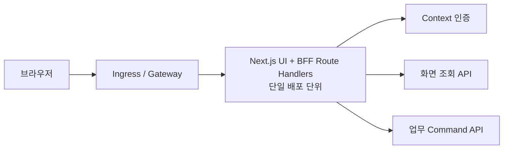

# 웹 BFF 애플리케이션 모듈

## 기본 정보

- BFF ID: `BFF.A.XX`
- 대상 프론트엔드:
- 런타임:
- 배포 단위:
- 주요 사용자:
- 설계 범위:
- 제외 범위:

## 결정

- 이 모듈은 프론트엔드와 같은 배포 단위에 포함한다.
- 독립 바운디드 컨텍스트나 도메인 서비스로 계산하지 않는다.
- 브라우저에 맞춘 화면 DTO, 웹 세션 경계, CSRF 검증, 내부 요청 컨텍스트 변환과 제한된 호출 조정을 담당한다.
- DB, Aggregate, 도메인 정책, 가격·재고·결제 같은 업무 권위는 소유하지 않는다.

## 연관 문서

- 목표:
- 요구사항:
- 사이트맵:
- UI:
- 유스케이스:
- 바운디드 컨텍스트:
- 서비스 설계:
- 처리 시퀀스:

## 배포 구성



- BFF는 상태 비저장으로 실행한다.
- 장기 세션, 업무 상태와 멱등성 원장은 담당 서비스가 소유한다.
- Pod 고정이나 sticky session에 의존하지 않는다.
- liveness는 프로세스 생존만, readiness는 로컬 초기화와 필수 설정만 확인한다. downstream 장애를 Pod 재시작 신호로 사용하지 않는다.

## 모듈 구조

```text
app/
  api/web/
    <route>/route.ts
src/server/bff/
  auth/
  contracts/
  modules/
  shared/
```

| 영역 | 책임 |
| --- | --- |
| `app/api/web/**/route.ts` | HTTP 입력, 인증 등급 적용, DTO 반환 |
| `src/server/bff/auth` | 세션 확인, CSRF, 내부 요청 컨텍스트 |
| `src/server/bff/contracts` | 화면 DTO와 Problem Details |
| `src/server/bff/modules` | 페이지 단위 조회 조합과 Command 전달 |
| `src/server/bff/shared` | deadline, typed client, trace, 오류 매핑 |

## 책임 경계

### 담당한다

- 브라우저가 한 번에 사용할 화면 DTO를 반환한다.
- 공개, 선택적 개인화, 로그인 필수, 강한 인증 필요 경로를 구분한다.
- HttpOnly 세션 cookie와 CSRF token을 웹 경계에서 처리한다.
- 검증된 세션을 짧은 TTL의 수신자별 내부 요청 컨텍스트로 변환한다.
- 독립적인 조회를 deadline 안에서 병렬 호출하고 허용된 부분 실패만 명시적으로 표현한다.
- downstream의 업무 오류를 안정적인 웹 오류 계약으로 매핑한다.
- `traceparent`, `tracestate`, 요청 ID와 `Idempotency-Key`를 보존한다.

### 담당하지 않는다

- DB, Repository, Aggregate, Domain Event 또는 outbox를 소유하지 않는다.
- 가격, 할인, 쿠폰 적용 가능 여부, 포인트 사용 가능액, 재고 배정과 결제 성공을 계산하거나 확정하지 않는다.
- 서비스 간 장기 작업의 상태나 보상 처리를 보관하지 않는다.
- 업무 서비스의 소유권·권한 검사를 대신하지 않는다.
- 알 수 없는 오류를 성공 응답이나 빈 값으로 바꾸지 않는다.

## 접근 등급

| 등급 | 세션 | 부분 실패 | 캐시 |
| --- | --- | --- | --- |
| `PUBLIC` | 불필요 | 선택적 개인화만 생략 가능 | 공개 DTO만 공유 캐시 가능 |
| `OPTIONAL_SESSION` | 있으면 검증 | 개인화 섹션만 생략 가능 | 공개·개인화 응답 분리 |
| `AUTHENTICATED` | 필수 | 비권위 요약만 허용 | 기본 `no-store` |
| `STRONG_AUTH` | 세션, 권한, 최근 재인증 | 허용하지 않음 | `no-store` |

## Route Handler

| Method | Route Handler | 접근 등급 | 화면 DTO | downstream | 실패 원칙 |
| --- | --- | --- | --- | --- | --- |
| `GET` |  |  |  |  |  |
| `POST` |  |  |  |  |  |

## Downstream 계약

| 별칭 | 담당 Context/API | 호출 목적 | 권위 | deadline | retry |
| --- | --- | --- | --- | --- | --- |
|  |  |  |  |  |  |

## 화면 DTO

```json
{
  "data": {},
  "meta": {
    "traceId": "string",
    "generatedAt": "datetime",
    "partial": false,
    "unavailableSections": []
  }
}
```

- 화면 DTO는 Domain Entity나 persistence schema를 그대로 노출하지 않는다.
- 부분 실패 섹션은 `available`, `stale`, `unavailable`과 `asOf`를 명시한다.
- 조회 실패를 `0`, 빈 배열 또는 성공 상태로 위장하지 않는다.
- 오류 응답은 성공 envelope가 아니라 Problem Details를 사용한다.

## 세션, CSRF와 내부 요청 컨텍스트

- 웹 장기 인증 정보는 `HttpOnly`, `Secure`, 적절한 `SameSite` cookie로만 전달한다.
- unsafe method는 세션에 묶인 CSRF token을 검증한다.
- 브라우저가 보낸 `X-User-*`, 내부 token과 권한 헤더는 제거한다.
- 내부 요청 컨텍스트에는 `user_id`, `session_id`, 최소 권한, 권한 버전, `aud`, `iat`, `exp`, `jti`만 허용한다.
- 이메일, 휴대폰, 표시명, 주소와 token 원문은 내부 헤더, 로그, metric label과 trace attribute에 넣지 않는다.
- 업무 서비스는 내부 컨텍스트를 입력으로 받더라도 리소스 소유권과 현재 업무 정책을 다시 확인한다.

## Deadline과 timeout

| 호출 등급 | 전체 deadline | 개별 downstream | 부분 실패 |
| --- | --- | --- | --- |
| 공개 조회 |  |  |  |
| 로그인 조회 |  |  |  |
| 권위 조회 |  |  |  |
| Command |  |  |  |

- Route Handler가 전체 deadline을 만들고 모든 downstream 호출은 남은 시간을 넘지 않는다.
- timeout은 `AbortSignal` 등 취소 가능한 방식으로 전달한다.
- 필수 의존성 timeout은 `504`, 가용하지 않은 의존성은 `503`으로 구분한다.

## retry와 멱등성

- 자동 retry는 안전한 조회에만 제한하고 전체 deadline 안에서 수행한다.
- Command는 기본적으로 자동 retry하지 않는다.
- 멱등 Command는 최초와 같은 `Idempotency-Key`와 요청 digest를 그대로 전달한다.
- BFF는 멱등성 원장을 소유하지 않으며 downstream의 canonical 결과를 따른다.
- 결과가 불확실한 Command를 성공으로 만들지 않고 상태 조회 또는 같은 key 재요청 경로를 제공한다.

## 부분 실패

| 화면/섹션 | 필수 여부 | 허용 처리 | 금지 처리 |
| --- | --- | --- | --- |
|  |  |  |  |

- 부분 실패는 서로 독립적인 읽기 전용 섹션에만 허용한다.
- 인증, 권한, 가격, 재고, 쿠폰 적용, 포인트 사용, 결제와 Command 결과에는 부분 성공을 적용하지 않는다.
- stale 데이터를 제공할 때는 `asOf`와 stale 이유를 함께 반환한다.

## 오류 계약

```json
{
  "type": "about:blank",
  "title": "요청을 처리할 수 없습니다.",
  "status": 503,
  "code": "WEB_DEPENDENCY_UNAVAILABLE",
  "traceId": "string",
  "retryable": true
}
```

| HTTP | 의미 | BFF 처리 |
| --- | --- | --- |
| `400`, `422` | 입력 오류 | 필드 오류를 안전하게 전달 |
| `401` | 세션 없음·만료 | 로그인 intent와 복귀 위치 생성 |
| `403` | 권한 없음 | 메뉴 숨김과 별개로 서버에서 거부 |
| `409` | 상태 충돌 | 업무 오류 code 보존 |
| `429` | 호출 제한 | `Retry-After` 보존 |
| `502` | 잘못된 downstream 응답 | 계약 위반 기록 |
| `503` | 의존성 사용 불가 | retry 가능 여부 명시 |
| `504` | deadline 초과 | 불확실한 Command 결과를 성공 처리하지 않음 |

## 캐시

- 공개 기본 DTO와 사용자별 섹션의 cache key와 응답을 분리한다.
- 인증, 체크아웃, 주문, 결제, 권한과 개인정보 응답은 `Cache-Control: no-store`를 기본값으로 사용한다.
- BFF 캐시는 업무 원장을 대신하지 않는다.
- stale 응답은 허용 섹션과 최대 기간을 문서화한다.

## 관측성

- root span 이름은 low-cardinality route template을 사용한다.
- downstream 호출마다 client span을 만들고 W3C trace context를 전달한다.
- metric: route별 요청 수·latency·오류율, downstream latency·오류율, 부분 응답 수, retry 수.
- log: `traceId`, route template, HTTP status, 안정적인 오류 code와 downstream 별칭만 구조화한다.
- token, cookie, CSRF 값, 개인정보, 요청·응답 본문과 고유 ID를 metric label에 넣지 않는다.

## 검증

- DTO schema와 Problem Details 계약 테스트
- 공개·선택적 세션·로그인 필수·강한 인증 경계 테스트
- CSRF, 외부 내부-header 제거, redirect allowlist 테스트
- timeout, 취소, 부분 실패와 stale 표시 테스트
- 같은 `Idempotency-Key` 재요청과 결과 불확실 상태 테스트
- trace context 전파와 민감 정보 비기록 테스트
- downstream consumer-driven contract 테스트

## 독립 서비스 분리 조건

| 조건 | 관찰 근거 | 결정 |
| --- | --- | --- |
| 프론트엔드별 배포 주기와 소유 팀이 다름 |  |  |
| 트래픽, SLO와 autoscaling 정책이 충돌함 |  |  |
| 판매자·운영자 보안 경계를 별도 격리해야 함 |  |  |
| 단일 장애 영향 범위가 허용 수준을 넘음 |  |  |
| 독립 카나리·롤백이 반복해서 필요함 |  |  |

- 폴더 크기나 downstream 개수만으로 분리하지 않는다.
- 분리할 때는 바운디드 컨텍스트별 BFF가 아니라 프론트엔드 경험과 보안 경계를 기준으로 한다.

## 열린 질문

-

## 확인 필요

-
