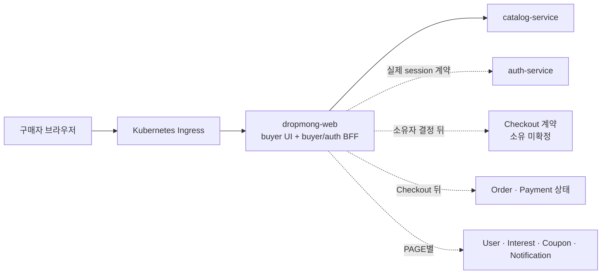

# 구매자 웹 애플리케이션 연동 원장

## 문서 역할

이 폴더는 [구매자 사이트맵](../../10-sitemap/buyer-mobile-web/README.md)의 PAGE와 `dropmong-web`, 실제 MSA API, 로컬 설정과 배포 상태를 연결하는 원장이다. 요구사항·PAGE·UI의 목표를 현재 mock 수준으로 낮추지 않고 다음 상태를 분리한다.

- 서비스 API가 구현됐는가
- 웹 호출 코드가 있는가
- 현재 프론트가 실제 서비스를 호출하는가
- 로컬·CI가 실제 서비스를 사용하도록 설정됐는가
- DropMong GitOps와 Ingress가 연결됐는가
- mock 또는 fixture를 사용하는가

## 확인 기준

| 원천 | ref | 확인 결과 |
| --- | --- | --- |
| `service` checkout | 2026-07-16 HEAD `1bb90b3` | buyer route, BFF 함수·Route Handler, 서비스 API와 테스트 |
| `service/config/services.yml` | 같은 checkout | 9개 image 목록. 배포 완료 증거는 아님 |
| `archive` | 2026-07-16 HEAD `7d2e7a5` | PAGE·UI와 목표 서비스 설계 |
| `gitops` | 2026-07-16 HEAD `8e14539` + 기존 Auth values 작업 트리 변경 | 서비스별 선언·Ingress 경로, DropMong 동일성과 Auth 변경 전후 확인 |

TicketMong GitOps checkout에는 ticketing/MediKong 표기 선언과 DropMong label의 User·Coupon private-dev 선언이 함께 있다. User route는 현재 API 경로를 포함하지만 Coupon의 `/coupons` route는 현재 canonical `/api/v1/**` 경로와 일치하지 않는다. Auth·Payment·Notification의 동명 선언은 현재 DropMong checkout과의 동일성이 미확인이다. 라이브 클러스터는 확인하지 않았으므로 저장소 선언과 실제 배포를 구분한다.

## 현재 결론

| 범위 | 현재 상태 | 판정 |
| --- | --- | --- |
| 홈·상품 상세 | Catalog 호출 코드와 Route Handler가 있음 | 코드 지원 |
| 로컬 Catalog | `.env.local`은 `DEV_MOCK_MODE=true`, Catalog URL은 주석 | 로컬 미연결 |
| CI·Docker smoke | mock mode만 실행, Catalog URL 없음 | 실연동 미검증 |
| Auth | `auth-service` context API 구현, 웹은 개발 cookie 사용 | API 구현·프론트 미연결 |
| Checkout·주문 완료 | snapshot, confirm, 주문 결과와 배송 표시가 fixture | 서비스 미연결 |
| Order·Payment | 서비스 API는 존재하지만 웹 client와 환경 변수가 없음 | API 존재·프론트 미연결 |
| Coupon·Interest·User·Notification | buyer API 일부 구현 | PAGE route·프론트 미연결 |
| 배송·포인트·결제수단 | canonical 소유 서비스·계약을 확인하지 못함 | 소유 미확정 |
| Web·Catalog·Order·Interest 배포 | 확인한 GitOps에서 해당 서비스 선언을 찾지 못함 | 배포·Ingress 미연결 |
| User 배포 | DropMong private-dev와 `/api/v1/users`, `/api/v1/users/me` route 선언 있음 | 선언 있음·실제 동기화 미확인 |
| Coupon 배포 | DropMong private-dev와 `/coupons` route 선언 있음 | canonical `/api/v1/**` Ingress 미연결·실제 동기화 미확인 |
| Auth·Payment·Notification 배포 | ticketing/MediKong 표기의 동명 선언만 확인. Auth HEAD `/auth`는 기존 작업 트리 변경에서 비활성 | canonical Auth 경로와 현재 DropMong code identity 미확인 |

## 현재 구현 화면

2026-07-16 기준 실제 buyer page route는 네 개다.

| PAGE | 실제 route | 서버 함수 | 현재 데이터 |
| --- | --- | --- | --- |
| [PAGE.A.01](../../10-sitemap/buyer-mobile-web/PAGE_A_01_homepage.md) | `/` | `getHomePage` | Catalog 설정 시 실제, 기본 로컬은 mock |
| [PAGE.A.02](../../10-sitemap/buyer-mobile-web/PAGE_A_02_product_detail.md) | `/products/[productId]` | `getProductDetailPage` | Catalog 설정 시 실제, 개인화 미연결 |
| [PAGE.A.11](../../10-sitemap/buyer-mobile-web/PAGE_A_11_payment.md) | `/checkout` | `getCheckoutSnapshot`, `confirmCheckout` | fixture |
| [PAGE.A.14](../../10-sitemap/buyer-mobile-web/PAGE_A_14_order_complete.md) | `/orders/complete` | `getOrderResult` | fixture |

나머지 buyer PAGE는 사이트맵과 UI 목표에는 존재하지만 현재 `dropmong-web` route와 handler가 없다. 전체 목록은 [페이지별 API 매트릭스](api-integration/PAGE_API_MATRIX.md)에서 관리한다.

## 목표 경계

이 구성도는 목표다. User·Coupon의 일부 선언이 있어도 `dropmong-web`과 모든 downstream이 연결됐거나 라이브 환경에 동기화됐다는 뜻은 아니다.

buyer BFF는 웹 session·CSRF, 화면 DTO와 단일 업무 계약 전달을 담당한다. Catalog, Coupon, Point, Inventory, Order와 Payment를 차례로 호출해 Checkout 성공을 만들지 않는다. 상세 경계는 [BFF.A.01](../BFF_A_01_web_bff_module.md)을 따른다.

## 문서

| 문서 | 역할 |
| --- | --- |
| [API 연동 인덱스](api-integration/README.md) | 근거 원천, 상태 정의, 갱신 규칙과 연동 순서 |
| [서비스 API 인벤토리](api-integration/SERVICE_API_INVENTORY.md) | 서비스별 endpoint, 코드 지원, 로컬·배포·프론트 상태 |
| [페이지별 API 매트릭스](api-integration/PAGE_API_MATRIX.md) | 모든 buyer PAGE와 실제 route·함수·fixture·목표 소유 서비스 |

## 다음 연동 순서

1. **Catalog**: `.env.local`과 별도 검증 환경에 `CATALOG_INTERNAL_BASE_URL`을 설정하고 홈·상품 상세를 mock 없이 검증한다.
2. **Auth**: `GET /api/v1/auth/context`의 browser session 계약을 정합화하고 개발 cookie를 실제 Auth 연결로 교체한다.
3. **Checkout 계약**: snapshot·confirm 소유자, 총액·재고·쿠폰·포인트 책임과 결과 불확실 상태를 확정한다.
4. **Order·Payment 상태**: Checkout 결과에서 canonical 주문·결제 상태를 조회하고 `dev-order.*` fixture를 제거한다.
5. **부가 Query**: User, Interest, Coupon과 Notification을 PAGE별로 연결하고 독립적인 부분 실패 기준을 검증한다.

Catalog 첫 작업의 구체 범위는 [API 연동 인덱스의 시작 조건](api-integration/README.md#catalog-첫-연동-시작-조건)을 따른다.

## 소유 미확정

- Checkout snapshot·confirm과 총액·재고·혜택 조정
- 장바구니 원장
- 배송 조회와 배송·주문 관리 계약
- 포인트 원장
- 구매자 결제수단 조회
- 주문과 결제 결과를 하나의 사용자 상태로 보여 주는 조회 계약

이 항목은 API 이름, 성공 응답과 임시 소유 서비스를 문서에서 만들지 않는다.

## 갱신 규칙

- PAGE 목적과 UI 상태는 원천 문서에서 관리하고 이 폴더에는 연동 상태만 기록한다.
- API 코드, 웹 client, 로컬 설정, CI, GitOps 중 하나가 바뀌면 관련 상태 열만 근거와 함께 갱신한다.
- mock이 남아 있어도 실제 API 연결 열을 `연결됨`으로 바꾸지 않는다.
- 서비스 API가 있어도 actor 권한, Ingress와 프론트가 준비되지 않으면 사용 가능으로 판정하지 않는다.
- Checkout 소유 서비스는 근거 문서가 확정될 때까지 `소유 미확정`으로 둔다.

## 연관 문서

- [프론트엔드 애플리케이션 구조](../WEB_A_01_frontend_architecture.md)
- [buyer 웹 BFF](../BFF_A_01_web_bff_module.md)
- [상태와 데이터 전략](../WEB_A_02_state_data_strategy.md)
- [배포·관측성·테스트](../WEB_A_03_deployment_observability_test.md)
- [구매자 UI](../../20-ui/buyer-mobile-web/README.md)
- [구매자 Use Case](../../30-uc/UC_A_01_buyer_purchase_delivery.md)
