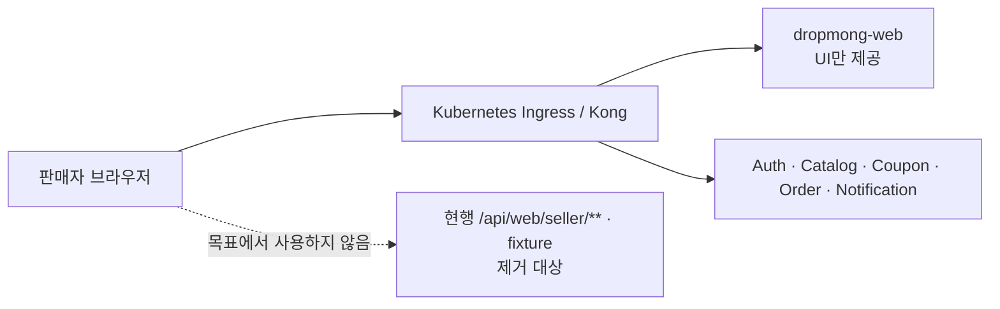

# 현행 판매자 BFF 코드 기록

## 결정

`BFF.A.200`은 목표 아키텍처에서 사용하지 않는다. 이 문서는 현재 `dropmong-web`에 병합된 Seller BFF와 fixture를 설계 원장으로 승격하지 않고, 제거·전환 범위를 추적하기 위한 현행 코드 기록이다.

목표 구조는 [판매자 서비스 MSA 구성도](../../50-service-design/A_200_seller/README.md#실제-msa-서비스-구성도)를 따른다.

## 현재 코드 인벤토리

| 현재 위치·설정 | 역할 | 목표 처리 |
| --- | --- | --- |
| `app/api/web/seller/[...path]/route.ts` | seller context·onboarding·Command Route Handler | 소유 서비스 API 전환 뒤 제거 |
| `src/server/bff/seller/**` | actor, context, page fixture, Command 전달 | 제거. 도메인 규칙을 프런트엔드로 옮기지 않음 |
| `GET /api/web/seller/context` | 개발 seller context | membership 소유 서비스 계약으로 대체 |
| `POST /api/web/seller/onboarding` | 개발 session fixture 전환 | onboarding owner 결정 전 운영 제공 금지 |
| `POST /api/web/seller/{commandPath}` | 범용 Command path | 실제 소유 서비스의 resource operation으로 대체 |
| `GET /web/seller/pages/{kind}` | page DTO 조회 placeholder | 제거. 집계가 필요하면 실제 조회 모델 소유 서비스가 API 제공 |
| `POST /web/seller/commands/{commandPath}` | downstream placeholder | 제거 |
| `SELLER_CONTEXT_INTERNAL_BASE_URL` | 미연결 seller context upstream | 목표 설정으로 사용하지 않음 |
| `SELLER_MANAGEMENT_INTERNAL_BASE_URL` | 미연결 management upstream | 목표 설정으로 사용하지 않음 |
| `DEV_MOCK_MODE=true` seller fixture | 개발 화면 데이터 | 실제 API가 준비된 PAGE부터 제거 |

## 현행 코드 식별자

이 표는 코드 제거와 테스트 이관을 위한 대조표다. page kind와 command path는 `API.A.200-*`가 아니다.

| PAGE | page kind | command path |
| --- | --- | --- |
| `PAGE.A.200` | `dashboard` | 없음 |
| `PAGE.A.201` | `drops` | 없음 |
| `PAGE.A.202` | `products` | `products/save` |
| `PAGE.A.203` | `drop-editor` | `drop-drafts/save`, `reviews/submit` |
| `PAGE.A.204` | `review` | `reviews/submit` |
| `PAGE.A.205` | `orders` | `order-exports/create` |
| `PAGE.A.206` | `coupons` | `coupons/save` |
| `PAGE.A.207` | `analytics` | 없음 |
| `PAGE.A.208` | `settlements` | 없음 |
| `PAGE.A.209` | `store` | `account/save`, `store-profile/save`, `onboarding` |
| `PAGE.A.210` | `members` | `members/invite`, `roles/permissions/save` |
| `PAGE.A.211` | `issues` | `issues/create` |

## 제거 조건

Seller BFF를 다른 프록시 이름으로 바꾸지 않는다. PAGE별로 다음 조건을 충족한 뒤 현재 경로 의존을 제거한다.

1. operation의 실제 소유 서비스가 정해지고 해당 서비스 OpenAPI에 Ingress-facing path가 존재한다.
2. Ingress가 외부 사용자·seller header를 제거하고 검증된 인증 context만 전달한다.
3. 수신 서비스가 현재 membership, permission version과 resource ownership을 재검증한다.
4. `403`, 동일 `404`, `409`, typed `503`, `ETag`, `Idempotency-Key`와 강한 재인증 계약이 consumer test로 검증된다.
5. 여러 서비스의 집계가 필요한 PAGE는 조회 모델 소유 서비스가 준비되거나 해당 section을 명시적으로 제외한다.
6. 실제 API 연결 E2E가 통과하고 `DEV_MOCK_MODE` seller fixture를 운영 fallback으로 사용하지 않는다.

## 금지 사항

- Ingress에 seller membership, 업무 권한과 KPI 계산을 구현하지 않는다.
- `dropmong-web`의 Server Component나 Route Handler가 Order·Payment·Catalog·Coupon을 fan-out해 집계하지 않는다.
- buyer API를 seller API로 포장하지 않는다.
- 현행 `commandPath`를 downstream canonical path로 전달하지 않는다.
- 소유 서비스가 없는 기능에 임시 성공 응답이나 새 내부 base URL을 추가하지 않는다.

## 연관 문서

- [판매자 웹 애플리케이션 설계](README.md)
- [판매자 웹 포털](WEB_A_200_seller_portal.md)
- [판매자 서비스 상세 설계](../../50-service-design/A_200_seller/README.md)
- [서비스 API 인벤토리](api-integration/SERVICE_API_INVENTORY.md)
- [페이지별 API 매트릭스](api-integration/PAGE_API_MATRIX.md)
