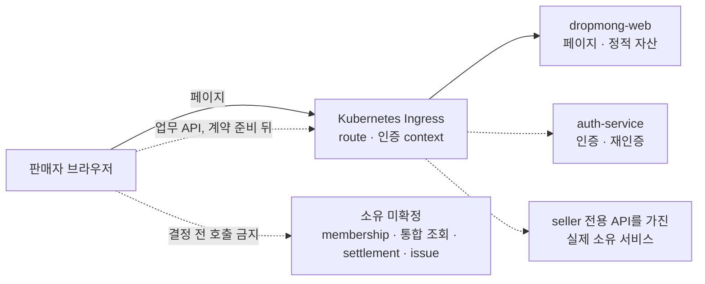

# 판매자 웹 애플리케이션 설계

## 문서 역할

이 폴더는 `REQ.A.03`, `PAGE.A.200~211`, `UI.A.200~211`을 현재 DropMong 웹 코드와 목표 MSA 경계에 연결한다. 페이지 목적과 업무 규칙을 다시 정의하지 않고 route, seller layout, 브라우저 상태, Ingress API 경계와 검증 기준을 정한다.

## 결론

1. 판매자 포털은 현재 `dropmong-web`의 Next.js App Router 안에 둔다. 별도 seller 웹 배포는 만들지 않는다.
2. 목표 구조에는 Seller BFF가 없다. `dropmong-web`은 판매자 페이지와 정적 자산만 제공하고, 브라우저의 업무 API 요청은 Kubernetes Ingress를 통해 실제 소유 서비스로 전달한다.
3. 현재 `/api/web/seller/**`, `src/server/bff/seller/**`, 두 `SELLER_*_INTERNAL_BASE_URL`과 `DEV_MOCK_MODE=true` fixture는 현행 제거 대상이다.
4. seller Server Component도 여러 서비스를 조합해 BFF 역할을 하지 않는다.
5. buyer API를 seller API로 재사용하지 않고, Auth와 User에 seller membership·role·permission 원장을 두지 않는다.
6. API 구현, seller 사용 가능, Ingress 공개, 프론트 연결을 각각 판정한다.

## 확인 기준

| 원천 | 기준 | 확인 결과 |
| --- | --- | --- |
| `service` checkout | 2026-07-16 HEAD `1bb90b3` | seller PAGE·BFF·fixture, 9개 service 코드·API |
| `archive` | 2026-07-16 HEAD `7d2e7a5` | seller 목표 소유권·논리 operation |
| `gitops` | 2026-07-16 HEAD `8e14539` + 기존 Auth values 작업 트리 변경 | User·Coupon의 DropMong 표기 선언, ticketing/MediKong 표기의 동명 서비스, 미선언 서비스와 Auth 변경 전후 확인 |

`service/config/services.yml`은 image build·게시 원장이지 배포 완료 증거가 아니다. GitOps의 User·Coupon 선언도 seller 전용 API 공개나 실제 동기화를 자동으로 증명하지 않는다. 라이브 클러스터는 이번 확인 범위에 포함하지 않는다.

## 읽기 순서

1. [REQ.A.03](../../00-requirements/REQ_A_03_seller.md), [PAGE.A.200~211](../../10-sitemap/PAGE_A_200_seller_portal/README.md), [UI.A.200~211](../../20-ui/UI_A_200_seller_portal/README.md)을 확인한다.
2. [판매자 서비스 설계](../../50-service-design/A_200_seller/README.md)에서 현재 서비스 inventory와 목표 소유권을 확인한다.
3. [WEB.A.200](WEB_A_200_seller_portal.md)에서 route, 화면 상태, 반응형과 접근성 기준을 확인한다.
4. [API 연동 인벤토리](api-integration/README.md)에서 API 구현·seller 사용·Ingress·프론트 상태를 확인한다.
5. [현행 Seller BFF 코드 기록](BFF_A_200_seller_portal_profile.md)은 제거 대상과 전환 조건을 확인할 때만 사용한다.

## 문서

| ID | 문서 | 역할 | 목표 상태 |
| --- | --- | --- | --- |
| `WEB.A.200` | [판매자 웹 포털](WEB_A_200_seller_portal.md) | 12개 PAGE route, seller shell, 상태·데이터, 반응형·접근성 | 적용 |
| `BFF.A.200` | [현행 Seller BFF 코드 기록](BFF_A_200_seller_portal_profile.md) | 현재 Route Handler, fixture, placeholder와 제거 조건 | 목표에서 사용하지 않음 |
| 코드·계약 대조 | [API 연동 인벤토리](api-integration/README.md) | 실제 서비스 API와 PAGE별 네 가지 연동 상태 | 적용 |

## 현재와 목표

### 현재 코드

| 현재 코드 | 현재 동작 | 목표 처리 |
| --- | --- | --- |
| `PAGE.A.200~211` route | `SellerWorkspacePage`가 `readSellerPage` 호출 | route와 UI 유지 |
| `GET/POST /api/web/seller/**` | 개발 seller context와 범용 Command Route Handler | 실제 API 전환 뒤 제거 |
| `src/server/bff/seller/**` | page kind, permission, placeholder client | 실제 API 전환 뒤 제거 |
| `getSellerPageFixture` | PAGE별 개발 데이터 | PAGE별 실제 계약 뒤 제거 |
| fixture Command result | 완료 모양의 개발 응답 | 실제 resource operation으로 교체 |
| `SELLER_CONTEXT_INTERNAL_BASE_URL` | 설정 검사만 있고 실제 client 호출 없음 | 사용하지 않음 |
| `SELLER_MANAGEMENT_INTERNAL_BASE_URL` | 가상 page·command downstream | 사용하지 않음 |

### 목표 경계

이 구성은 목표다. User·Coupon의 일부 GitOps route는 seller 전용 계약을 포함하지 않으므로 어떤 판매자 PAGE도 현재 배포 연결로 표시하지 않는다.

Payment는 브라우저 직접 호출 대상이 아니다. seller 귀속 결제 사실이 필요하면 `payment-service`가 versioned Event를 제공하고, 결정된 조회 모델 소유 서비스가 투영한다.

## PAGE별 현재 상태

| PAGE | 실제 route | 목표 소유 서비스 | API 구현 | seller 사용 | Ingress | 프론트 |
| --- | --- | --- | --- | --- | --- | --- |
| `PAGE.A.200` | `/seller` | 미확정 통합 조회 | 없음 | 불가 | 미연결 | fixture |
| `PAGE.A.201~204` | `/seller/drops/**`, `/seller/products` | `catalog-service` 후보 | buyer 공개 조회만 존재 | 불가 | 미연결 | fixture |
| `PAGE.A.205` | `/seller/orders` | `order-service` 후보 | buyer 생성·단건 조회만 존재 | 불가 | 미연결 | fixture |
| `PAGE.A.206` | `/seller/coupons` | `coupon-service` | internal 캠페인 API 일부 존재 | 공개·scope 부족 | 미연결 | fixture |
| `PAGE.A.207` | `/seller/analytics` | 미확정 통합 조회 | 단편 원천 API만 존재 | 불가 | 미연결 | fixture |
| `PAGE.A.208` | `/seller/settlements` | 소유 미확정 | settlement API 없음 | 불가 | 미연결 | fixture |
| `PAGE.A.209~210` | `/seller/settings/**` | 소유 미확정 | 일반 Auth 재인증은 일부 구현, seller purpose·resume variant 없음 | membership·설정·seller 재인증 불가 | 미연결 | fixture |
| `PAGE.A.211` | `/seller/issues` | 소유 미확정 | Seller Issue API 없음 | 불가 | 미연결 | fixture |

상세 판정은 [페이지별 API 매트릭스](api-integration/PAGE_API_MATRIX.md)를 단일 원장으로 사용한다.

## 브라우저 호출 원칙

- URL과 method는 각 소유 서비스의 Ingress-facing OpenAPI를 따른다. 현행 `page kind`, `commandPath`와 `/api/web/seller/**`를 canonical ID로 사용하지 않는다.
- `dropmong-web`은 seller page DTO 합성 API를 제공하지 않는다.
- Server Component도 Catalog·Order·Payment·Coupon을 fan-out해 통합 상태, KPI, 정산액이나 권한을 만들지 않는다.
- 한 화면에 독립적인 section이 있다면 각 section은 소유 서비스의 독립 계약과 오류 상태를 사용한다. 원천 값을 합쳐 새 업무 상태를 만들지 않는다.
- 브라우저가 보낸 seller ID, role, permission과 사용자 context header를 신뢰하지 않는다. Ingress가 외부 값을 제거하고, 수신 서비스가 membership과 리소스 소유권을 다시 확인한다.
- mutation은 확정된 CSRF 보호, `Origin`, `Idempotency-Key`, `If-Match`와 목적 한정 재인증을 적용한다.
- 다른 seller 리소스와 미존재 리소스는 동일 `404`, 일반 권한 부족은 `403`, version·멱등·상태 충돌은 `409`, 필수 원천 장애는 typed `503`으로 구분한다.

## 화면 구현 원칙

- Server Component를 page shell과 최초 렌더의 기본값으로 둔다.
- 필터, 선택, 폼, 모달, 차트와 제한된 polling만 작은 Client Component로 둔다.
- seller ID, 개인정보와 입력 본문은 URL, telemetry와 browser storage에 넣지 않는다.
- 로딩, 데이터 없음, 필터 결과 없음, `403`, 동일 `404`, `409`, stale, partial과 typed `503`을 서로 다른 상태로 표시한다.
- 데스크톱 업무 밀도를 우선하되 `360`, `390`, `768`, `1024`, `1440` 너비에서 같은 URL과 핵심 단일 항목 작업을 제공한다.
- 표, 폼, 모달과 차트는 WCAG 2.2 AA, 키보드 조작과 보조 기술 사용을 검증한다.

## 구현 순서

1. DropMong GitOps에 서비스별 Deployment·Ingress와 인증 context, 외부 header 제거, CORS·CSRF 정책을 정의한다.
2. seller membership·permission 원장의 실제 소유 서비스를 결정한다. 이 결정 전에는 보호 seller API를 공개하지 않는다.
3. Catalog, Order, Coupon과 Notification의 seller operation을 각 소유 OpenAPI와 테스트에 추가한다.
4. dashboard·analytics·settlement·issue의 소유 서비스 또는 제공 제외 범위를 결정한다.
5. API 구현, seller scope, Ingress와 consumer test가 모두 준비된 PAGE부터 fixture와 `/api/web/seller/**` 의존을 제거한다.

## 완료 기준

- `PAGE.A.200~211`의 API 구현, seller 사용, Ingress, 프론트 상태를 [페이지별 API 매트릭스](api-integration/PAGE_API_MATRIX.md)에서 확인할 수 있다.
- 구성도와 목표 문서 어디에서도 `seller-service`나 Seller BFF를 목표 배포 단위로 사용하지 않는다.
- 브라우저 → Ingress → 실제 소유 서비스 경계가 명확하고 Payment 직접 조회와 웹 fan-out 집계를 금지한다.
- seller membership, 통합 조회와 외부 운영 계약이 소유 미확정 상태로 남으며 Auth나 User에 업무 원장을 넣지 않는다.
- 서비스 계약이 없는 PAGE는 fixture를 운영 성공처럼 표시하지 않는다.
- buyer route의 build, readiness와 핵심 E2E가 seller 변경 뒤에도 통과한다.

## 연관 태그

🏷️ 요구사항 참조: [REQ.A.03](../../00-requirements/REQ_A_03_seller.md), [REQ.A.08](../../00-requirements/REQ_A_08_web_application.md) | 페이지 참조: [PAGE.A.200~211](../../10-sitemap/PAGE_A_200_seller_portal/README.md) | UI 참조: [UI.A.200~211](../../20-ui/UI_A_200_seller_portal/README.md) | UC 참조: [UC.A.02](../../30-uc/UC_A_02_seller_manage_drop.md) | 서비스 참조: [SD.A.200](../../50-service-design/A_200_seller/README.md) | 공통 웹 참조: [WEB.A.01](../WEB_A_01_frontend_architecture.md), [BFF.A.01](../BFF_A_01_web_bff_module.md)
