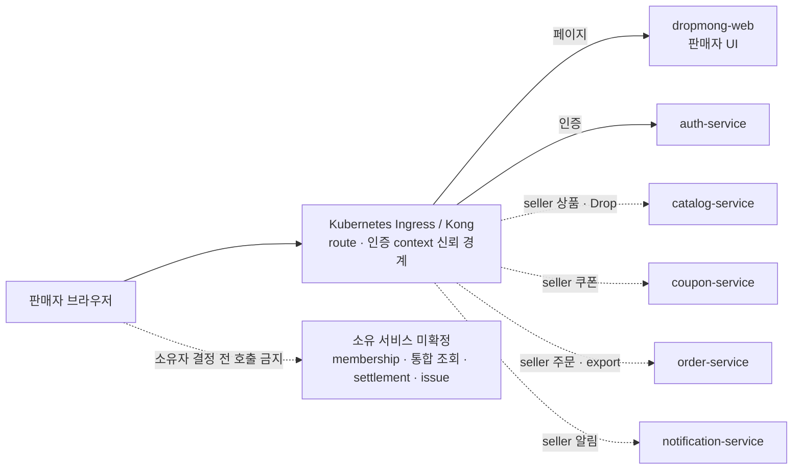

# 판매자 웹 애플리케이션 설계

## 문서 역할

이 폴더는 `REQ.A.03`, `PAGE.A.200~211`, `UI.A.200~211`을 현재 DropMong 웹 애플리케이션과 실제 MSA에 연결한다. 페이지 목적과 업무 규칙을 다시 정의하지 않고 route, seller layout, 브라우저 상태, Ingress API 경계와 검증 기준을 정한다.

## 결론

1. 판매자 포털은 현재 `dropmong-web`의 Next.js App Router 안에 둔다. 별도 seller 웹 배포는 만들지 않는다.
2. 목표 구조에는 Seller BFF가 없다. `dropmong-web`은 판매자 UI만 제공하고, 브라우저의 업무 API 요청은 Kubernetes Ingress를 통해 실제 소유 서비스로 전달된다.
3. 현재 `/api/web/seller/**`, `src/server/bff/seller/**`, `DEV_MOCK_MODE=true` fixture와 두 `SELLER_*_INTERNAL_BASE_URL`은 현행 코드다. 목표 계약으로 확장하지 않고 소유 서비스 API가 준비된 뒤 제거한다.
4. 브라우저가 보낸 seller ID, role, permission과 사용자 context header를 신뢰하지 않는다. Ingress가 외부 값을 제거하고 인증 context를 전달한 뒤 수신 서비스가 membership과 리소스 소유권을 다시 확인한다.
5. 브라우저, Ingress와 `dropmong-web`은 Order·Payment·Catalog·Coupon을 fan-out해 대시보드·분석·정산 값을 계산하지 않는다.
6. 통합 조회 모델이나 seller membership의 소유 서비스가 미정인 화면은 성공 모양의 fixture로 운영 전환하지 않는다.

## 읽기 순서

1. [REQ.A.03](../../00-requirements/REQ_A_03_seller.md), [REQ.A.08](../../00-requirements/REQ_A_08_web_application.md), [PAGE.A.200~211](../../10-sitemap/PAGE_A_200_seller_portal/README.md), [UI.A.200~211](../../20-ui/UI_A_200_seller_portal/README.md)을 확인한다.
2. [BC.A.200](../../40-event-storming-bounded-context/BC_A_200_seller.md)과 [판매자 서비스 설계](../../50-service-design/A_200_seller/README.md)에서 원본 상태와 실제 MSA 배치를 확인한다.
3. [WEB.A.200](WEB_A_200_seller_portal.md)에서 route, 컴포넌트, 상태, 반응형과 검증 기준을 확인한다.
4. [API 연동 인벤토리](api-integration/README.md)에서 실제 서비스 API, Ingress 연결 후보와 미구현 계약을 확인한다.
5. [현행 Seller BFF 코드 기록](BFF_A_200_seller_portal_profile.md)은 제거 대상 코드와 이행 조건을 확인할 때만 사용한다.

## 문서

| ID | 문서 | 역할 | 목표 상태 |
| --- | --- | --- | --- |
| `WEB.A.200` | [판매자 웹 포털](WEB_A_200_seller_portal.md) | 12개 PAGE route, seller shell, 상태·데이터, Ingress 호출, 반응형·접근성·검증 | 적용 |
| `BFF.A.200` | [현행 Seller BFF 코드 기록](BFF_A_200_seller_portal_profile.md) | 현재 Route Handler, page kind, command path, fixture와 제거 조건 | 목표에서 사용하지 않음 |
| 코드·계약 대조 | [API 연동 인벤토리](api-integration/README.md) | 실제 서비스 API, 목표 소유 서비스, PAGE별 구현 가능 상태 | 적용 |

## 실제 배포 경계

Payment는 브라우저 직접 호출 대상이 아니다. seller 귀속 결제 사실이 필요하면 `payment-service`가 versioned Event를 제공하고, 결정된 조회 모델 소유 서비스가 이를 투영한다.

## 현재 구현 기준

2026-07-13 `service` 메인 `2070c20` 기준 `dropmong-web`에는 `PAGE.A.200~211` route, Seller BFF와 fixture가 구현되어 있다.

| 현재 코드 | 현재 동작 | 목표 처리 |
| --- | --- | --- |
| `GET/POST /api/web/seller/**` | seller context·Command Route Handler | 소유 서비스 API 전환 뒤 제거 |
| `GET /web/seller/pages/{kind}` | `DEV_MOCK_MODE=true`에서 page fixture | 제거. 페이지는 필요한 소유 서비스 API를 호출 |
| `POST /web/seller/commands/{commandPath}` | 개발 완료 결과 fixture | 제거. 실제 resource operation으로 교체 |
| `SELLER_CONTEXT_INTERNAL_BASE_URL` | 미연결 placeholder | 목표 설정으로 사용하지 않음 |
| `SELLER_MANAGEMENT_INTERNAL_BASE_URL` | 미연결 placeholder | 목표 설정으로 사용하지 않음 |

운영 모드에서 미구현 계약을 fixture, buyer API 재사용 또는 빈 성공 응답으로 대체하지 않는다.

## PAGE별 실제 서비스 상태

| PAGE | 주요 책임 | 목표 소유 서비스 | 상태 |
| --- | --- | --- | --- |
| `PAGE.A.200` | dashboard | 미확정 통합 조회 모델 | 제공 불가 |
| `PAGE.A.201~204` | Drop·상품·제안·검수 | `catalog-service` 후보 | seller 계약 미구현 |
| `PAGE.A.205` | 주문·출고 자료 | `order-service` 후보 | seller 조회·export 미구현 |
| `PAGE.A.206` | 쿠폰·제휴 | `coupon-service` | 일부 구현, seller 공개·목록·제휴 계약 대기 |
| `PAGE.A.207` | 분석 | 미확정 통합 조회 모델 | 제공 불가 |
| `PAGE.A.208` | 정산 | 소유 서비스 미확정 | 제공 불가 |
| `PAGE.A.209~210` | account·store·team·role | 소유 서비스 미확정 | 제공 불가. Auth에 배정하지 않음 |
| `PAGE.A.211` | seller issue | 소유 서비스 미확정 | 제공 불가 |

## 브라우저 호출 원칙

- URL과 method는 각 소유 서비스의 Ingress-facing OpenAPI를 따른다. 현행 `page kind`, `commandPath`와 `/api/web/seller/**`를 canonical ID로 사용하지 않는다.
- `dropmong-web`은 page DTO 합성 API를 제공하지 않는다. 한 화면에 여러 독립 section이 있으면 각각의 소유 서비스 결과를 독립적으로 표시할 수 있지만, 서로 다른 원천 값을 합쳐 새 업무 상태나 지표를 만들지 않는다.
- 민감하지 않은 Query에도 현재 membership과 seller ownership 재검증이 필요하다. membership 원장 장애를 stale 권한으로 통과시키지 않는다.
- mutation은 CSRF 또는 Ingress가 확정한 동등 보호, `Origin`, `Idempotency-Key`, `If-Match`와 목적 한정 재인증을 적용한다.
- 다른 seller 리소스와 미존재 리소스는 동일한 `404`, 일반 권한 부족은 `403`, version·멱등·상태 충돌은 `409`, 필수 원천 장애는 typed `503`으로 구분한다.
- 부분 응답과 stale snapshot은 소유 서비스가 `asOf`, 원천 watermark와 허용된 작업을 함께 제공할 때만 표시한다.

## 화면 구현 원칙

- Server Component를 page shell과 최초 렌더의 기본값으로 두되, 서버에서 여러 업무 서비스를 조합해 BFF처럼 동작하게 만들지 않는다.
- 필터, 선택, 폼, 모달, 차트와 제한된 polling만 작은 Client Component로 둔다.
- seller ID, 개인정보와 입력 본문은 URL, telemetry와 browser storage에 넣지 않는다.
- 로딩, 데이터 없음, 필터 결과 없음, `403`, 동일 `404`, `409`, stale, partial, typed `503`을 서로 다른 상태로 표시한다.
- 데스크톱 업무 밀도를 우선하되 `360`, `390`, `768`, `1024`, `1440` 너비에서 같은 URL과 핵심 단일 항목 작업을 제공한다.
- 표, 폼, 모달과 차트는 WCAG 2.2 AA, 키보드 조작과 보조 기술 사용을 검증한다.

## 구현 순서

1. Ingress의 인증 context 전달, 외부 header 제거, CORS·CSRF 정책을 서비스 공통 계약으로 확정한다.
2. seller membership·permission 원장의 실제 소유 서비스를 결정한다. 이 결정 전에는 보호 seller API를 공개하지 않는다.
3. `catalog-service`, `order-service`, `coupon-service`, `notification-service`의 seller operation을 각 소유 OpenAPI에 추가한다.
4. 통합 dashboard·analytics·settlement·issue의 소유 서비스 또는 제공 제외 범위를 결정한다.
5. 실제 API 계약과 consumer test가 통과한 PAGE부터 fixture와 `/api/web/seller/**` 의존을 제거한다.

## 완료 기준

- `PAGE.A.200~211`이 [페이지별 API 매트릭스](api-integration/PAGE_API_MATRIX.md)에서 목표 소유 서비스와 구현 상태에 연결된다.
- 구성도와 문서 어디에서도 `seller-service`나 Seller BFF를 목표 배포 단위로 사용하지 않는다.
- 브라우저 → Ingress → 실제 MSA 서비스 경계가 명확하고 Payment 직접 조회와 웹 fan-out 집계를 금지한다.
- seller membership, 통합 조회와 외부 운영 계약이 미확정 상태로 구분되며 Auth나 Ingress에 업무 원장을 넣지 않는다.
- 주문 자료와 민감 변경은 강한 재인증, 현재 권한, version, 멱등과 감사를 모두 확인한다.
- 서비스 계약이 없는 PAGE는 fixture를 운영 성공처럼 표시하지 않는다.
- buyer route의 build, readiness와 핵심 E2E가 seller 변경 뒤에도 통과한다.

## 연관 태그

🏷️ 요구사항 참조: [REQ.A.03](../../00-requirements/REQ_A_03_seller.md), [REQ.A.08](../../00-requirements/REQ_A_08_web_application.md) | 페이지 참조: [PAGE.A.200~211](../../10-sitemap/PAGE_A_200_seller_portal/README.md) | UI 참조: [UI.A.200~211](../../20-ui/UI_A_200_seller_portal/README.md) | UC 참조: [UC.A.02](../../30-uc/UC_A_02_seller_manage_drop.md) | BC 참조: [BC.A.200](../../40-event-storming-bounded-context/BC_A_200_seller.md) | 서비스 참조: [SD.A.200](../../50-service-design/A_200_seller/README.md) | 공통 웹 참조: [WEB.A.01](../WEB_A_01_frontend_architecture.md), [WEB.A.02](../WEB_A_02_state_data_strategy.md), [WEB.A.03](../WEB_A_03_deployment_observability_test.md)
