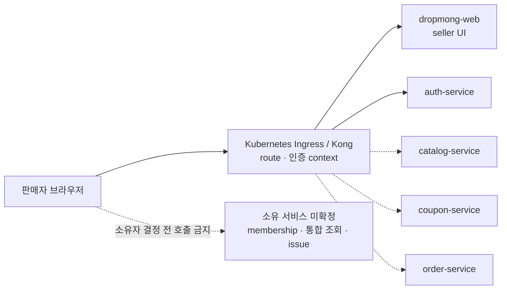

# 판매자 웹 포털

## 기본 정보

- Web Application ID: `WEB.A.200`
- 적용 route: `/seller`, `/seller/**`
- 적용 액터: 판매자 대표 관리자, 판매자 상품 담당자, 판매자 출고 담당자, 판매자 성과 조회자
- 연결 Page: [PAGE.A.200~211](../../10-sitemap/PAGE_A_200_seller_portal/README.md)
- 연결 UI: [UI.A.200~211](../../20-ui/UI_A_200_seller_portal/README.md)
- 기준 프레임워크: 현재 `dropmong-web`의 Next.js App Router, React, TypeScript, CSS custom property와 CSS Module
- 공통 구조: [WEB.A.01](../WEB_A_01_frontend_architecture.md)
- 공통 상태: [WEB.A.02](../WEB_A_02_state_data_strategy.md)
- API 경계: 판매자 브라우저 → Kubernetes Ingress → 실제 소유 서비스. [현행 BFF 코드 기록](BFF_A_200_seller_portal_profile.md)은 제거 범위 확인에만 사용
- 공통 배포·관측·테스트: [WEB.A.03](../WEB_A_03_deployment_observability_test.md)

## 설계 목표

- 판매자가 처리 기한이 있는 작업을 먼저 발견하고 자기 판매자 계정 안에서 안전하게 완료하게 한다.
- 구매자용 화면과 같은 코드베이스를 사용해도 판매자 route, layout, bundle, 권한, 오류가 구매자 영역과 섞이지 않게 한다.
- `PAGE.A.200~211`의 데스크톱 업무 밀도를 유지하면서 작은 화면에서도 상태 확인과 단일 항목 작업을 완료하게 한다.
- 서버 권위 상태, URL 상태, 장시간 폼 초안과 일시적인 UI 상태를 한 저장소에 중복하지 않는다.
- 생성 시안에만 있는 기능을 구현 계약으로 간주하지 않고 `REQ`, `UC`, `BC`에 근거한 작업만 활성화한다.
- 목표 구조에서 Seller BFF를 사용하지 않고, `dropmong-web`이 여러 업무 서비스를 조합하는 API 계층이 되지 않게 한다.

## 기준 결정

1. seller route는 현재 `dropmong-web`의 `app/(seller)/seller/**`에 둔다.
2. seller layout이 로그인 gate, 현재 판매자 표시와 권한 기반 내비게이션을 소유하고 부모 route group의 오류 경계가 layout 실패를 받는다. 업무 API의 권한 검사를 대신하지 않는다.
3. 현재 판매자 컨텍스트는 세션과 membership에서 서버가 정한다. `sellerId`를 route, query, form hidden field의 권위 값으로 받지 않는다.
4. 목록의 검색·필터·정렬·페이지·상세 패널은 URL로 복원한다. 폼 입력, 체크박스 선택, 모달과 펼침 상태는 가까운 Client Component가 소유한다.
5. 장시간 작성하는 상품·드롭 초안은 명시적 서버 임시 저장을 사용한다. 브라우저 storage는 초안 원장으로 사용하지 않는다.
6. Server Component가 최초 HTML과 조회를 만들고 Client Component는 입력·선택·modal·차트 상호작용·필요한 polling에만 사용한다.
7. Zustand는 도입하지 않는다. TanStack Query도 현재 dependency에 없으므로 다운로드 생성 같은 실제 비동기 상태 polling이 구현될 때 해당 query에만 도입 여부를 결정한다.
8. seller context, 팀 권한, 주문 자료 생성·다운로드와 모든 Command는 fail closed다. 진행 중 드롭, 마스킹 주문 목록과 기존 출고 자료 메타데이터는 원천 Read Model이 허용한 경우에만 `asOf`와 `stale=true`를 가진 읽기 전용 degraded snapshot을 사용한다.

## 원천 문서 우선순위

| 충돌 대상 | 우선 원천 | 적용 기준 |
| --- | --- | --- |
| 기능 허용·금지 | [REQ.A.03](../../00-requirements/REQ_A_03_seller.md), [BC.A.200](../../40-event-storming-bounded-context/BC_A_200_seller.md) | UI 이미지에만 있는 Command는 활성화하지 않는다. |
| URL과 페이지 이동 | [PAGE.A.200~211](../../10-sitemap/PAGE_A_200_seller_portal/README.md) | 새 사용자 목적이 아니면 새 PAGE를 만들지 않는다. |
| 정보 우선순위와 시각 근거 | [UI.A.200~211](../../20-ui/UI_A_200_seller_portal/README.md) | 이미지 문구보다 UI 문서의 필드·상태 정의를 우선한다. |
| 사용자 작업 | [UC.A.02](../../30-uc/UC_A_02_seller_manage_drop.md) | E2E 완료 단위를 정한다. |
| 세션·웹 품질 | [REQ.A.08](../../00-requirements/REQ_A_08_web_application.md), 공통 `WEB` 문서 | seller 상세 규칙이 공통 보안·성능 기준을 약화하지 않는다. |

## Route와 PAGE/UI 연결

permission key는 웹 구현용 제안 별칭이다. canonical permission이 정해지면 표시 문구를 유지한 채 key만 서비스 계약에 맞춘다.

| URL | App Router 파일 | PAGE | UI | 제안 permission | 상세·보조 상태 |
| --- | --- | --- | --- | --- | --- |
| `/seller` | `app/(seller)/seller/page.tsx` | `PAGE.A.200` | [UI.A.200](../../20-ui/UI_A_200_seller_portal/UI_A_200_seller_dashboard.md) | `seller.dashboard.read` | 우선 작업의 검증된 `href`로 관련 화면 이동 |
| `/seller/drops` | `app/(seller)/seller/drops/page.tsx` | `PAGE.A.201` | [UI.A.201](../../20-ui/UI_A_200_seller_portal/UI_A_201_drop_management.md) | `seller.drop.read` | 상태 축, 기간, 정렬, 페이지를 query로 유지 |
| `/seller/products` | `app/(seller)/seller/products/page.tsx` | `PAGE.A.202` | [UI.A.202](../../20-ui/UI_A_200_seller_portal/UI_A_202_product_management.md) | `seller.product.read` | `productId`와 `panel=detail` 또는 `panel=edit` 우측 패널 |
| `/seller/drops/new` | `app/(seller)/seller/drops/new/page.tsx` | `PAGE.A.203` | [UI.A.203](../../20-ui/UI_A_200_seller_portal/UI_A_203_drop_create_edit.md) | `seller.drop.write` | 새 초안 생성 뒤 식별 가능한 edit route로 교체 |
| `/seller/drops/{dropId}/edit` | `app/(seller)/seller/drops/[dropId]/edit/page.tsx` | `PAGE.A.203` | [UI.A.203](../../20-ui/UI_A_200_seller_portal/UI_A_203_drop_create_edit.md) | `seller.drop.write` | `step`은 `product`, `terms`, `inventory`, `review` 중 하나 |
| `/seller/drops/{dropId}/review` | `app/(seller)/seller/drops/[dropId]/review/page.tsx` | `PAGE.A.204` | [UI.A.204](../../20-ui/UI_A_200_seller_portal/UI_A_204_review_change_request.md) | `seller.drop.review.read` | 반려 보완·변경 요청 상태를 같은 route에서 표시 |
| `/seller/orders` | `app/(seller)/seller/orders/page.tsx` | `PAGE.A.205` | [UI.A.205](../../20-ui/UI_A_200_seller_portal/UI_A_205_order_fulfillment.md) | `seller.order.read` | `?orderId=...`, `?exportId=...` 우측 패널 |
| `/seller/coupons` | `app/(seller)/seller/coupons/page.tsx` | `PAGE.A.206` | [UI.A.206](../../20-ui/UI_A_200_seller_portal/UI_A_206_coupon_promotion.md) | `seller.coupon.read` | `?couponId=...` 또는 `?proposalId=...` |
| `/seller/analytics` | `app/(seller)/seller/analytics/page.tsx` | `PAGE.A.207` | [UI.A.207](../../20-ui/UI_A_200_seller_portal/UI_A_207_sales_analytics.md) | `seller.analytics.read` | 분석 차원을 query로 유지 |
| `/seller/settlements` | `app/(seller)/seller/settlements/page.tsx` | `PAGE.A.208` | [UI.A.208](../../20-ui/UI_A_200_seller_portal/UI_A_208_settlement.md) | `seller.settlement.read` | `?settlementId=...` 우측 패널, 관련 주문 link |
| `/seller/settings/store` | `app/(seller)/seller/settings/store/page.tsx` | `PAGE.A.209` | [UI.A.209](../../20-ui/UI_A_200_seller_portal/UI_A_209_store_settings.md) | `seller.account.read`와 `seller.store.read` 모두, 또는 최초 등록의 `seller.onboarding.start` | 기존 설정은 두 읽기 권한을 모두 요구하고 편집은 section별 permission으로 제한 |
| `/seller/settings/members` | `app/(seller)/seller/settings/members/page.tsx` | `PAGE.A.210` | [UI.A.210](../../20-ui/UI_A_200_seller_portal/UI_A_210_team_permissions.md) | `seller.member.read` | `?memberId=...` 상세 패널, 편집은 별도 permission |
| `/seller/issues` | `app/(seller)/seller/issues/page.tsx` | `PAGE.A.211` | [UI.A.211](../../20-ui/UI_A_200_seller_portal/UI_A_211_operational_issues.md) | `seller.issue.read` | `?issueId=...`, 관련 주문·드롭·정산 link |

### 딥링크 계약

- 업무 서비스가 행동 대상을 반환할 때는 `targetPageId`만 주지 않고 허용된 route descriptor를 제공하며, 웹은 route allowlist로 내부 `href`를 만든다.
- 예: 검수 반려 작업은 `/seller/drops/{dropId}/review`, 정산 보류는 `/seller/settlements?settlementId={id}`를 사용한다.
- `href`에는 표시 가능한 리소스 식별자와 비민감 필터만 넣는다. `sellerId`, 구매자명·연락처, export token은 넣지 않는다.
- 우측 패널을 닫으면 같은 목록의 검색·필터·페이지가 유지된다. 새로고침과 브라우저 뒤로가기도 같은 상태를 복원한다.
- 패널이 독립 작업과 고유한 이동 관계를 갖게 되면 구현에서 임의 path를 만들지 않고 PAGE 문서를 먼저 추가한다.

## App Router 구조

현재 구매자 구현의 루트 `app/` 구조를 유지한다.

```text
services/dropmong-web/
├── app/
│   ├── layout.tsx
│   ├── (buyer)/
│   ├── (seller)/
│   │   ├── error.tsx
│   │   ├── loading.tsx
│   │   └── seller/
│   │       ├── layout.tsx
│   │       ├── page.tsx
│   │       ├── loading.tsx
│   │       ├── error.tsx
│   │       ├── not-found.tsx
│   │       ├── drops/
│   │       │   ├── page.tsx
│   │       │   ├── new/page.tsx
│   │       │   └── [dropId]/
│   │       │       ├── edit/page.tsx
│   │       │       └── review/page.tsx
│   │       ├── products/page.tsx
│   │       ├── orders/page.tsx
│   │       ├── coupons/page.tsx
│   │       ├── analytics/page.tsx
│   │       ├── settlements/page.tsx
│   │       ├── issues/page.tsx
│   │       └── settings/
│   │           ├── store/page.tsx
│   │           └── members/page.tsx
└── src/
    ├── components/
    │   ├── shared/
    │   └── seller/
    ├── features/seller/
    │   ├── dashboard/
    │   ├── catalog/
    │   ├── proposal/
    │   ├── fulfillment/
    │   ├── promotion/
    │   ├── analytics/
    │   └── settings/
    └── features/seller/api/
        ├── auth-client.ts
        ├── catalog-client.ts
        ├── coupon-client.ts
        └── order-client.ts
```

현재 `app/api/web/seller/**`와 `src/server/bff/seller/**`는 이 목표 구조에 포함하지 않는다. 실제 서비스 operation이 준비된 PAGE부터 의존을 제거한다.

### 폴더 책임

| 위치 | 책임 | 소유하지 않는 것 |
| --- | --- | --- |
| `app/(seller)/error.tsx` | 하위 segment인 `seller/layout.tsx`의 session·context 실패까지 받는 최소 seller 오류 경계 | seller context가 필요한 셸·메뉴 |
| `app/(seller)/seller/layout.tsx` | seller metadata, session·context 조회, root skip link가 가리키는 `main`, 셸, 현재 사용자 표시 | API 리소스 소유권의 최종 판정 |
| `app/(seller)/seller/error.tsx` | seller layout 아래 page·section 오류와 `reset` 처리 | 부모 seller layout 자체의 오류 처리 |
| `app/(seller)/seller/**/page.tsx` | searchParams 파싱, 서버 조회 시작, 섹션 조합 | 장시간 client fetch waterfall, 업무 규칙 |
| route의 `_components` | 해당 route에서만 쓰는 표현 | 다른 seller route의 재사용 API |
| `src/components/seller` | seller shell, 표, 필터, 상태·접근성 primitive | 구매자 업무 의미, 도메인 원장 |
| `src/features/seller/*` | 여러 seller route에서 재사용하는 사용자 행동과 조합 | 서비스 Entity와 Repository |
| `src/features/seller/api/*-client.ts` | 같은 origin의 Ingress-facing 서비스 계약을 호출하는 얇은 typed client | 인증 우회, page DTO 조합, 업무 규칙과 집계 |

- seller module은 buyer route에서 import하지 않는다. 반대 방향도 같다.
- 공용 `index.ts` barrel은 만들지 않고 필요한 파일을 직접 import한다.
- 공통 표현과 접근성 의미가 같은 `format`, base button, dialog primitive만 `shared`로 올린다.
- 현재 `PageProblem`은 홈 복귀가 구매자용으로 고정돼 있으므로 seller 오류 화면은 복귀 route를 주입할 수 있게 일반화하거나 seller variant를 둔다.
- root metadata가 구매자용 제목·설명을 갖고 있으므로 `app/(seller)/seller/layout.tsx`가 seller 전용 title template과 description을 명시적으로 덮어쓴다.

## 요청 경계



- 브라우저는 같은 origin의 Ingress route만 호출하고 내부 Kubernetes 서비스 주소나 internal token을 받지 않는다.
- Server Component가 API proxy나 집계 계층이 되지 않게 한다. SSR에 필요한 단일 서비스 조회도 동일한 Ingress-facing 계약과 권한을 사용한다.
- 브라우저와 `dropmong-web`은 여러 원천을 직접 분석하지 않는다. 통합 지표는 소유자가 결정된 조회 모델만 사용한다.

## Server Component와 Client Component

| 컴포넌트 | 유형 | 입력 | 사용자 행동 |
| --- | --- | --- | --- |
| `SellerLayout` | Server | session, seller context, navigation | 로그아웃·도움말 link만 제공, 권한 판정은 서버 결과 사용 |
| `SellerPageHeader` | Server | 제목, 설명, freshness, action descriptor | CTA는 permission과 action authority가 있을 때만 렌더링 |
| dashboard KPI·우선 작업·일정 | 독립 Server section | 소유 서비스의 Read Model section | 실제 통합 조회 모델이 준비된 경우에만 독립 `Suspense` 경계에 배치 |
| 목록과 pagination | Server | URL filter 결과 | 정렬 link, 페이지 link, 상세 panel link |
| `FilterBar` | Client leaf | 현재 URL filter | 입력을 URL로 반영, 초기화, 뒤로가기 복원 |
| `RowSelection` | Client leaf | 현재 페이지 행 ID와 허용 action | 현재 페이지 안의 일시 선택만 소유 |
| 상품·드롭 editor | Server shell + Client form | 서버 draft, version, action authority | 필드 입력, 임시 저장, 제출, dirty guard |
| `DetailDrawer`·확인 dialog | Client | 안전한 표시 DTO | focus trap, 닫은 뒤 trigger focus 복귀 |
| countdown·download status | Client leaf | `serverNow`, target time, status URL | 화면 숫자·상태만 갱신, 완료 판정은 서버 응답 사용 |
| 분석 chart | 지연 로드 Client | 이미 집계된 series | tooltip·범례·차원 전환, 표 대체 제공 |

- 같은 소유 서비스가 제공하는 독립 조회는 순차 `await`하지 않는다. 서로 다른 서비스의 결과를 page에서 병렬 호출해 통합 지표로 만들지는 않는다.
- seller context와 permission은 다른 section보다 먼저 확인하고 실패하면 전체 seller route를 거부한다.
- Client Component에는 화면 전체 DTO가 아니라 해당 상호작용의 ID, 표시값, version, action authority만 전달한다.
- 브라우저에서 전체 권한표를 계산해 `can*` 값을 만들지 않는다.

## Seller 셸

### 구조

| 영역 | 구현 기준 |
| --- | --- |
| skip link | root의 `본문으로 건너뛰기`를 유지하고 seller main의 고유 `id`로 연결한다. |
| 좌측 내비게이션 | 9개 공통 메뉴를 permission에 따라 표시한다. 현재 위치는 텍스트·아이콘·`aria-current=page`로 구분한다. |
| 상단 바 | 전역 검색은 실제 검색 계약이 생기기 전까지 제거한다. 알림, 도움말, 고정된 현재 판매자와 사용자 메뉴만 둔다. |
| 페이지 머리말 | 제목, 한 줄 설명, 기준 시각, 필터 요약, 하나의 주요 CTA를 둔다. |
| 본문 | 우선 작업, KPI, 표, 폼, 차트를 의미 있는 section과 heading으로 나눈다. |
| 우측 패널 | 목록의 상세·편집·감사 이력을 URL 상태로 열고 모바일에서는 전체 화면 dialog로 전환한다. |
| 전역 알림 | session 만료, permission 변경, 부분 장애처럼 전체 화면에 영향을 주는 상태만 사용한다. |

### 내비게이션 순서

1. 대시보드
2. 드롭 관리
3. 상품 관리
4. 주문·출고
5. 쿠폰·프로모션
6. 판매 분석
7. 정산 조회
8. 판매자·스토어 정보
9. 팀·권한

`운영 이슈`는 주문·출고와 관련 화면의 문맥형 진입을 기본으로 한다. 반복 사용량과 별도 업무 ownership이 확인되면 공통 메뉴 추가를 PAGE에서 먼저 결정한다.

### 판매자 컨텍스트

- MVP는 하나의 검증된 membership이 선택된 상태로 seller layout을 렌더링한다. 예외적으로 membership이 없고 onboarding 권한이 있으면 설정 화면 하나와 등록 action만 있는 제한 셸을 렌더링한다.
- 다중 membership 계약이 없으므로 seller 전환 dropdown, 최근 seller, 기본 seller를 만들지 않는다.
- 상단에는 `seller.displayName`, canonical `seller.type`, 검증·이용 상태와 현재 구성원 역할을 읽기 전용으로 표시한다.
- seller 상태가 검증 대기 또는 이용 제한이면 허용된 읽기 화면과 다음 행동을 서버의 action authority로 제한한다.
- dirty form이 있는 동안에는 seller 전환 기능을 나중에 추가하더라도 확인 없이 컨텍스트를 바꾸지 않는다.

### 레이어 기준

| 단계 | z-index | 대상 |
| --- | --- | --- |
| 기본 | `0` | 본문, 카드, 표 |
| sticky | `10` | 표 머리글, 페이지 내부 action bar |
| shell | `20` | 상단 바, 데스크톱 sidebar |
| overlay | `30` | 모바일 navigation drawer와 backdrop |
| dialog | `40` | 상세 drawer, 확인 dialog |
| feedback | `50` | toast, 전역 알림 |
| skip link | `100` | 키보드 focus 시 최상단에 표시 |

- stacking context를 임의로 추가하지 않고 transform·filter가 새 context를 만드는지 검토한다.
- sticky·overlay·하단 action은 현재 focus target과 오류 메시지를 가리지 않아야 한다.

## 시각 시스템

새 색상 체계를 만들지 않고 구현된 구매자 웹과 판매자 UI 원본의 DropMong 브랜드를 유지한다. 데이터 밀도가 높은 표·폼에서는 장식보다 판독성과 상태 구분을 우선한다.

| 역할 | 기준 token/값 | 사용 기준 |
| --- | --- | --- |
| 본문 | `--ink: #11142d` | 제목, 표의 핵심 값, 입력값 |
| 보조 텍스트 | `--muted: #686e86` | 설명과 기준 시각. 더 옅은 색을 본문 텍스트로 쓰지 않는다. |
| 경계 | `--line: #e6e5f5` | 표·카드·입력 구분 |
| 브랜드·주요 작업 | `--purple: #4822e7`, `--purple-bright: #6435ff` | 주요 CTA, 현재 메뉴, 핵심 series |
| 부드러운 표면 | `--lavender: #f4f1ff`, `--surface-soft: #fbfaff` | hover, 선택, section 배경 |
| 위험 | `--danger: #b4284d` | 삭제·거부·오류. 텍스트와 아이콘을 함께 사용 |
| 성공 | `--success: #11845b` | 완료·승인. 색상 외 문구 병기 |
| 주의 | `--seller-warning: #9a5a00` | 기한 임박·보류·지연. 밝은 배경과 고대비 텍스트 조합 |
| focus | `--focus: #4822e7` 3px outline, 2px offset | 흰 배경 대비 `7.90:1`. 기존 `#a996ff` 단독 outline은 사용하지 않는다. |

- 글꼴은 현재 `Nunito Sans`, `Noto Sans KR`, `Apple SD Gothic Neo`, `Malgun Gothic`, sans-serif 순서를 유지한다.
- 숫자 열은 tabular number를 사용하고 금액·수량·비율의 단위는 열 머리글이나 값에 명시한다.
- 아이콘은 현재 inline SVG 체계를 확장한다. emoji를 메뉴·상태·버튼 아이콘으로 쓰지 않는다.
- hover에서 크기나 행 높이를 바꾸지 않는다. 색, 경계, 그림자, 밑줄로 피드백한다.
- chart series는 브랜드 보라, 보조 보라, 코랄, 그린, 앰버를 쓰되 범례·선 종류·직접 label을 함께 제공한다.

### 분석 차트 선택

| 데이터 | 기본 표현 | 보조 표현 | 접근성 기준 |
| --- | --- | --- | --- |
| 기간별 매출·주문 | 꺾은선 차트 | 기간 합계와 원본 표 | series별 선 모양·직접 label, hover 없이 값 확인 가능 |
| 조회→알림→구매 시도→구매 성공 | 단계형 funnel | 단계·수치·전환율 표 | 각 단계명과 이전 단계 대비 비율을 문장으로 제공 |
| 상품·옵션 성과 | 내림차순 가로 막대 또는 데이터 표 | 상세 상품 표 | 막대 끝에 값·단위 표시, 정렬 기준 제공 |
| 쿠폰 사용 효과 | KPI와 비교 막대 | 사용·미사용 주문 비교 표 | 인과 효과가 검증되지 않으면 `상관 비교`로 표시 |
| 취소·환불 사유 | 내림차순 가로 막대 | 사유별 건수·금액 표 | 원형·도넛은 보조 시각화로만 사용 |

- 모든 차트는 같은 데이터의 표와 집계 정의·기준 시각을 제공한다.
- chart library는 첫 분석 화면에서 keyboard, screen reader, bundle size를 검증한 뒤 결정한다.

## 반응형 기준

| viewport | 셸 | 본문 grid | 표·차트·폼 |
| --- | --- | --- | --- |
| `1440px` 이상 | 약 248px 확장 sidebar, 72px 상단 바 | 최대 1600px, 12열, KPI 4~5열 | 차트·표 병렬, 우측 패널 최대 480px |
| `1024~1439px` | 약 80px 축소 sidebar | 8열, KPI 2열 | 차트와 표 세로 배치, tooltip으로 축소 메뉴명 제공 |
| `768~1023px` | 상단 바와 drawer 내비게이션 | 4열 | 표는 명시적 내부 가로 스크롤, 우측 패널 전체 폭, 필터 2열 |
| `360~767px` | 상단 바와 전체 화면 drawer | 1열 | KPI 1열, 핵심 열 카드/표 전환, chart 표 대체, form 1열, 하단 action 고정 |

### 화면군별 작은 화면 처리

| 화면군 | 작은 화면 기준 |
| --- | --- |
| 대시보드 | 우선 작업, 핵심 KPI, 진행 드롭, 최근 주문 순서로 배치하고 장식 chart는 접을 수 있다. |
| 목록 | 핵심 식별자·상태·기한·대표 action만 첫 화면에 두고 나머지는 상세 패널에서 제공한다. |
| 상품·드롭 폼 | stepper를 세로 진행 표시로 바꾸고 한 단계씩 입력한다. 단일 항목 저장·검수 제출을 viewport만으로 막지 않는다. |
| 주문·출고 | 주문 조회와 단일 export 상태 확인은 제공한다. 여러 행 일괄 작업은 데스크톱 안내를 표시한다. |
| 분석 | KPI와 핵심 funnel을 먼저 제공하고 모든 chart에 동일 데이터의 표를 제공한다. |
| 팀·권한 | 구성원 조회·초대 상태는 제공한다. 넓은 permission matrix 편집은 읽기 전용 요약과 데스크톱 안내를 제공한다. |

- 페이지 전체에 가로 스크롤을 만들지 않는다. 넓은 업무 표만 caption과 keyboard 접근이 있는 내부 scroll container를 허용한다.
- viewport 폭으로 권한을 판정하거나 API Command를 달리 허용하지 않는다.
- sticky header, sidebar, 하단 action이 본문이나 focus target을 가리지 않게 scroll padding을 둔다.

## 공통 컴포넌트

| 컴포넌트 | 책임 | 접근성·상태 기준 |
| --- | --- | --- |
| `SellerSidebar` | 메뉴, 현재 위치, 축소·drawer 모드 | `nav` landmark, `aria-current`, icon-only mode의 label |
| `SellerContextSummary` | 현재 판매자·역할·검증 상태 | 전환 control 없이 읽기 전용, 긴 이름은 접근 이름과 hover·focus tooltip으로 전체 제공 |
| `SellerPageHeader` | 제목, 설명, freshness, 주요 action | 페이지마다 `h1` 하나, 주요 CTA 하나 |
| `PriorityTaskList` | 반려·출고 지연·쿠폰 응답·정산 보류 | 심각도 문구, 기한, 검증된 내부 `href` |
| `MetricCard` | 값, 비교, 정의, 기준 시각 | 추정·확정 구분, 0과 unavailable 구분 |
| `SellerFilterBar` | 검색·상태·기간·정렬·초기화 | label, 적용 필터 chip, 결과 건수, URL 복원 |
| `SellerDataTable` | 정렬, 선택, 고정 핵심 열, pagination | caption, scope가 있는 header, 정렬 상태, 내부 scroll |
| `StatusBadge` | 상태 축 하나의 값 | 색상+문구+필요 시 아이콘, 축 이름을 보조 설명에 포함 |
| `FreshnessStamp` | `asOf`, 집계 완료, stale | 절대 시각과 상대 표현을 함께 제공 |
| `DetailDrawer` | 목록 상세, 이력, 보조 작업 | URL 상태, dialog label, focus trap·복귀 |
| `SellerStepper` | 상품·조건·재고·검수 단계 | 현재·완료·오류 단계를 텍스트로 제공 |
| `UnsavedChangesGuard` | dirty form 이탈 확인 | 저장·버리기·계속 편집을 명확히 구분 |
| `PermissionMatrix` | 역할별 permission 표시·편집 | checkbox 의미, 행·열 header, 작은 화면 읽기 요약 |
| `AsyncFileStatus` | 생성 중·준비·실패·만료 | polling 상태, 만료 시각, 재생성 action |
| `OperationalNotice` | 부분 장애, 이용 제한, 최신성 지연 | 영향 범위와 가능한 다음 행동을 함께 표시 |
| `SellerPageProblem` | seller route 오류 | trace ID, 재시도, `/seller` 복귀, 권한 오류와 장애 구분 |

## 상태 체계

여러 생명주기를 하나의 `status` enum으로 합치지 않는다.

| 대상 | 상태 축 | 값 예 | 권위 원천 |
| --- | --- | --- | --- |
| 세션 | `sessionStatus` | 인증됨, 만료, 갱신 실패, 비활성 | Context 인증 |
| 판매자 | `sellerStatus` | 정상, 검증 대기, 이용 제한, 탈퇴 | Context 판매자 관리 |
| 판매자 검증 | `verificationStatus` | 미제출, 검증 중, 승인, 반려 | Context 판매자 관리 |
| 구성원 | `memberStatus` | 초대 대기, 활성, 이용 중지 | Context 판매자 관리 |
| 상품 | `saleStatus`, `stockStatus` | 판매 가능·품절·중지, 정상·부족·품절 | Context 판매 제안·재고 원천 |
| 드롭 문서 | `draftStatus` | 신규, 임시 저장, 반려 보완 | Context 판매 제안 |
| 드롭 검수 | `reviewStatus` | 검수 중, 승인, 반려, 보류, 보완 제출 | 플랫폼 검수 결과 |
| 드롭 운영 | `salesStatus` | 예정, 진행 중, 종료 | Context 드롭 관리 |
| 구매 가능성 | `visibility`, `soldOut`, `orderable` | 노출 여부, 품절 여부, 주문 가능 여부 | Context 드롭·재고 관리 |
| 변경 요청 | `changeRequestStatus` | 작성 중, 검토 중, 승인, 반려 | Context 판매 제안·검수 |
| 출고 | `fulfillmentStatus` | 출고 대기, 출고 완료, 배송 중, 배송 완료, 지연 | 주문·출고 원천 |
| export | `exportStatus` | 생성 중, 준비 완료, 실패, 만료 | 판매자 운영 조회 |
| 쿠폰 | `campaignStatus`, `approvalStatus` | 예정·진행·종료·중지, 불필요·검토·승인·반려·보류 | Context 쿠폰 |
| 제휴 | `proposalResponseStatus` | 응답 대기, 수락, 거절, 만료 | Context 쿠폰 |
| 정산 | `settlementStatus`, `deductionStatus` | 예정·보류·확정·지급 완료, 차감 예정 | Context 정산 |
| 분석 | `aggregationStatus` | 실시간 추정, 집계 완료 | 판매자 운영 조회 |
| 운영 이슈 | `issueStatus` | 접수, 확인 대기, 처리 중, 해결 | 판매자 신고·플랫폼 처리 결과 |

## URL 상태

| route | query 후보 | 규칙 |
| --- | --- | --- |
| `/seller/drops` | `q`, `draftStatus`, `reviewStatus`, `salesStatus`, `from`, `to`, `sort`, `page` | 상태 축을 하나의 filter로 합치지 않는다. |
| `/seller/products` | `q`, `categoryId`, `saleStatus`, `sort`, `page`, `productId`, `panel` | 상세·편집 패널을 새로고침 뒤 복원한다. |
| `/seller/orders` | `q`, `fulfillmentStatus`, `from`, `to`, `dropId`, `page`, `orderId`, `exportId` | 구매자 원문·연락처를 query에 넣지 않는다. |
| `/seller/coupons` | `q`, `status`, `from`, `to`, `couponId`, `proposalId` | 쿠폰과 제휴 상세를 구분한다. |
| `/seller/analytics` | `from`, `to`, `productId`, `optionId`, `dropId`, `round`, `couponId`, `channel`, `couponUsage`, `orderOutcome` | 공유 가능한 분석 조건만 둔다. |
| `/seller/settlements` | `from`, `to`, `status`, `dropId`, `page`, `settlementId` | 금액·은행 정보는 query에 넣지 않는다. |
| `/seller/issues` | `q`, `type`, `status`, `dropId`, `page`, `issueId` | 관련 주문은 내부 식별자만 허용하고 권한을 다시 확인한다. |
| 설정·폼 | 필요한 리소스 ID와 `step`만 | 입력값, 사업자번호, 이메일, 연락처를 query에 넣지 않는다. |

- 기본값과 같은 filter는 URL에서 생략해 링크를 안정적으로 유지한다.
- 검색 입력의 매 keystroke를 history에 쌓지 않고 입력 완료 시 `replace`, 명시적 filter 적용과 상세 진입은 `push`를 사용한다.
- 잘못된 enum·날짜·페이지는 조용히 성공 기본값으로 바꾸지 않고 안전한 기본값과 수정 안내를 함께 제공한다.

## 상태와 데이터 소유권

| 상태 | 유형 | 소유 위치 | 생명주기 | persistence |
| --- | --- | --- | --- | --- |
| session, seller context, permission | 서버 권위 | Auth + 미확정 membership 원장 + 각 업무 서비스 | 요청마다 확인 | 브라우저 없음 |
| 목록·상세·분석·정산 데이터 | 서버 권위 | 각 업무 Context와 조회 모델 | source version·`asOf` 기준 | 브라우저 장기 저장 없음 |
| filter·sort·page·panel | URL | `searchParams` | route history | 없음 |
| 상품·드롭·스토어·초대 입력 | 폼 | 가까운 Client form + 서버 draft | 저장·제출·이탈까지 | server draft만 |
| 현재 step | URL 또는 폼 | route `step`과 form | 편집 route까지 | 없음 |
| 현재 페이지 선택 행 | 로컬 UI | table selection component | filter·page 변경 시 reset | 없음 |
| modal·drawer focus | 로컬 UI | 해당 component | component까지 | 없음 |
| chart display option | URL 또는 로컬 UI | 공유 필요 여부에 따라 결정 | route 또는 component | 없음 |
| 다운로드 진행 상태 | 서버 상태 snapshot | export 원장, 제한된 polling | terminal·만료까지 | query cache 후보 |

- session, permission, seller scope, 주문, 재고, 쿠폰, 정산을 Context나 전역 store에 복제하지 않는다.
- `localStorage`, `sessionStorage`, IndexedDB에 token, 초안, 주문 자료, 개인정보, permission을 저장하지 않는다.
- seller 전역 store는 현재 필요하지 않다. 실제로 먼 Client Component 사이의 비서버·비URL 임시 상태가 생기고 측정된 문제가 있을 때만 재검토한다.

## 페이지별 데이터와 갱신

| PAGE | 최초 조회 | Client 상태 | 갱신 기준 |
| --- | --- | --- | --- |
| `A.200` | context, 우선 작업, KPI, 진행 드롭, 최근 주문, 일정 | section 펼침, 기간 선택 | 명시적 새로고침, 진행 드롭만 제한 polling 후보 |
| `A.201` | URL 조건의 드롭 목록과 상태 축. degraded mode는 원천 계약이 허용한 진행 중 드롭 snapshot만 제공 | filter 입력, 행 action menu | stale이면 상태 조회만 허용하고 행 작업 중지, 정상 상태에서는 저장·제출 뒤 해당 드롭과 목록 갱신 |
| `A.202` | 상품 목록, 선택 상품 상세 | filter, editor, upload 진행 | 상품 저장 뒤 해당 행·미리보기 갱신 |
| `A.203` | draft와 재고 기준 시각 | 단계 입력, dirty, validation | 명시적 임시 저장, 제출 전 서버 재검증 |
| `A.204` | 검수·변경 요청 snapshot과 timeline | 사유 입력, 확인 dialog | 제출 뒤 현재 요청과 목록 갱신 |
| `A.205` | 마스킹 주문 목록과 export 정책. degraded mode는 원천이 이미 마스킹한 snapshot만 허용 | filter, selection, export form | stale이면 조회만 허용하고 export·행 작업을 중지, 정상 상태에서는 export status만 terminal까지 제한 확인 |
| `A.206` | 쿠폰·제휴 목록과 비용 | filter, 쿠폰 폼, 응답 dialog | Command 뒤 해당 쿠폰·제안·요약 갱신 |
| `A.207` | 집계 snapshot과 정의·기준 시각 | filter, chart 표현 | 최신 집계 확인은 명시적 refresh, 자동 반복 조회 금지 |
| `A.208` | 정산 snapshot과 상태·사유 | filter, 상세 panel | 원천 갱신 시각 표시, 사용자 mutation 없음 |
| `A.209` | seller account·store profile의 분리된 version과 구매자 미리보기 | account form, store form, upload, dirty | 각 Command 성공 범위만 갱신하고 합쳐진 부분 성공은 표시하지 않음 |
| `A.210` | 구성원·역할·permission·감사 이력 | invite, matrix edit, dialog | 변경 성공 뒤 context와 구성원 목록 재조회 |
| `A.211` | 이슈 목록·상세·처리 결과 | filter, 신고 form, attachment | 신고 뒤 목록·상세 갱신, 처리 결과는 명시적 refresh |

## 폼·초안·동시 수정

- 필드 label, 도움말, 단위, 오류를 각각 프로그램으로 연결한다. placeholder를 label로 사용하지 않는다.
- 상품·드롭·스토어 입력은 client validation으로 빠른 피드백을 주되 서버가 같은 입력, session, permission, seller scope를 다시 검증한다.
- `PAGE.A.209`가 두 폼을 한 화면에 배치해도 `SellerAccount`와 `StoreProfile`은 각 version과 저장 버튼을 가진다. 두 Aggregate를 하나의 PATCH로 묶거나 한쪽 실패를 전체 성공처럼 표시하지 않는다.
- 초안 최초 저장이 성공하면 `/seller/drops/{dropId}/edit?step=...`로 `replace`해 새로고침 가능한 식별 경로를 만든다.
- draft는 `version` 또는 ETag를 가진다. 오래된 version 저장은 `409`로 처리하고 최신 값 다시 읽기, 내 변경 비교, 취소 중 하나를 선택하게 한다.
- 검수 제출은 draft 저장과 다른 Command다. 제출 성공 전에는 검수 중 UI로 바꾸지 않는다.
- 승인 후 핵심 조건 편집은 일반 저장을 막고 변경 전후 값과 사유를 가진 변경 요청으로 전환한다.
- dirty form에서 메뉴 이동, 뒤로가기, seller context 변경, drawer 닫기를 시도하면 저장·버리기·계속 편집을 묻는다.
- 이미지·파일 upload는 진행률, 형식·크기 오류, 재시도와 제거 상태를 표시한다. upload URL·만료·검사는 API 계약 확정 전까지 확인 필요다.

## Mutation

`API.A.200-01~28`은 [SD.A.20040](../../50-service-design/A_200_seller/A_200_40-api/README.md)의 논리 operation 초안이다. 브라우저는 실제 소유 서비스 OpenAPI와 Ingress route가 확정된 operation만 호출한다.

| 사용자 행동 | PAGE | 목표 서비스·논리 API | 안전 조건 | 완료 뒤 갱신 |
| --- | --- | --- | --- | --- |
| 최초 판매자 등록 | `A.209` | 소유 서비스 미확정 | 로그인, 활성 membership 없음, CSRF, 멱등키 | 소유자 결정 전 제공하지 않음 |
| 상품 저장 | `A.202` | `catalog-service` 후보, `API.A.200-10` | permission, CSRF, version, 멱등키 | 상품 목록·상세·미리보기 |
| 드롭 초안 저장 | `A.203` | `catalog-service` 후보, `API.A.200-12` | permission, CSRF, version, 멱등키 | draft·드롭 목록 |
| 검수 제출·재제출 | `A.203~204` | `catalog-service` 후보, `API.A.200-13` | 서버 완전 검증, 멱등키, 제출 version 고정 | 검수 snapshot·드롭 목록 |
| 변경 요청 제출 | `A.204` | `catalog-service` 후보, `API.A.200-15` | 승인 상태, 허용 시각, before/after, 사유 | 검수·변경 요청 snapshot |
| 주문 자료 요청 | `A.205` | `order-service` 후보, `API.A.200-20` | `STRONG_AUTH`, 목적, 범위, 최소 필드, 검증된 감사 IP, 멱등키 | export status·감사 결과 |
| 판매자 쿠폰 저장 | `A.206` | `coupon-service`, `API.A.19-10~13` | seller 범위, 승인 gate, 비용 주체, 멱등키 | 쿠폰 목록·성과 요약 |
| 제휴 제안 응답 | `A.206` | `coupon-service` 검토 대상, API 미확정 | `STRONG_AUTH`, 대표 권한, 비용·범위 재확인, 멱등키 | 계약 전 제공하지 않음 |
| 판매자 계정 저장 | `A.209` | 소유 서비스 미확정, `API.A.200-03` | `STRONG_AUTH`, 대표 권한, 법적·연락 정보, CSRF, account version | 소유자 결정 전 제공하지 않음 |
| 스토어 프로필 저장 | `A.209` | 소유 서비스 미확정, `API.A.200-04` | 대표 권한, CSRF, store profile version | 소유자 결정 전 제공하지 않음 |
| 구성원 초대 | `A.210` | 소유 서비스 미확정, `API.A.200-06` | `STRONG_AUTH`, 대표 권한, 멱등키 | 소유자 결정 전 제공하지 않음 |
| 역할 변경·비활성화 | `A.210` | 소유 서비스 미확정, `API.A.200-07~08` | `STRONG_AUTH`, 대표 권한, 자기·마지막 관리자 보호, version | 소유자 결정 전 제공하지 않음 |
| 운영 이슈 신고 | `A.211` | 소유 서비스 미확정, `API.A.200-26` | seller scope, 사유 code, 증빙, 멱등키 | 소유자 결정 전 제공하지 않음 |

- 송장 등록, 출고 상태 변경, 상품 일괄 상태 변경, 정산·차감 결정과 페널티·보상은 이 표에 포함하지 않는다.
- Command는 버튼 비활성화만으로 중복을 막지 않는다. 브라우저가 만든 `Idempotency-Key`를 같은 사용자·session·route·payload digest에 묶어 전달한다.
- timeout 뒤 결과가 불확실하면 성공 toast를 보여주지 않고 operation 상태 조회 또는 같은 key 재요청을 제공한다.
- 낙관적 성공은 사용하지 않는다. 접수됨, 처리 중, 최종 완료를 분리한다.

### 민감 작업 재인증

주문 자료 생성·다운로드, 구성원 초대·역할·권한·비활성화, 비용을 확정하는 제휴 응답과 민감 판매자 계정 변경은 `STRONG_AUTH`다.

1. 최근 재인증이 없으면 업무 서비스는 Command를 실행하지 않고 `403`과 목적 한정 재인증 요구를 반환한다. 브라우저는 Ingress를 통해 Auth 재인증 화면으로 이동한다.
2. Auth 화면만 현재 비밀번호 또는 후속 강한 인증을 받고, proof를 현재 사용자·session·action purpose·짧은 만료·단일 소비에 묶는다. 성공으로 session credential과 CSRF가 회전되면 브라우저는 새 값을 사용한다.
3. Auth가 보존하는 암호화된 intent에는 allowlist action, seller 내부 return path, 원래 Command의 멱등키 또는 opaque reference와 최소 재개 문맥만 둔다. 폼 원문·개인정보는 넣지 않는다.
4. 복귀 뒤 화면은 action과 최신 permission·seller scope·resource version을 다시 확인하고 최종 확인을 받은 다음 같은 Command 멱등키로 명시적으로 재제출한다. 재인증 완료만으로 업무 Command를 자동 실행하지 않는다.
5. 화면을 연 뒤 권한·재인증이 만료되는 경합에서도 같은 typed 오류와 재개 절차를 사용한다. 거부 응답만으로 원래 멱등키가 소비됐다고 추정하지 않는다.

archive의 [API.A.300-17](../../50-service-design/A_300_auth/A_300_40-api/API_A_300_17_reauthenticate_email.md)과 [API.A.300-29](../../50-service-design/A_300_auth/A_300_40-api/API_A_300_29_resume_authenticated_action.md)에는 판매자 purpose·action-context가 설계돼 있다. 현재 Auth 서비스 bundle 구현은 뒤따라야 하며 문서 계약만으로 지원된 것으로 간주하지 않는다.

- 주문 export 재개 문맥은 `purpose`, `format`, 원래 멱등키와 `FILTER` 방식의 허용된 검색 조건 또는 `SELECTED` 방식의 개수 제한이 있는 opaque order reference만 포함한다. 구매자 표시값·연락처와 선택 행 원문은 포함하지 않는다.
- 민감 판매자 계정 입력은 Auth intent에 저장하지 않는다. 재인증이 제출 시점에 만료되면 같은 설정 화면으로 복귀한 뒤 값을 다시 확인하며, 입력 복원이 필요하면 Seller Management의 암호화된 server draft 계약을 먼저 추가한다.

## 로딩·빈 결과·오류·최신성

| 상태 | 구현 위치 | 화면 표시 | 다음 행동 |
| --- | --- | --- | --- |
| seller context 확인 | `app/(seller)/seller/layout.tsx`, 실패는 부모 `app/(seller)/error.tsx` | 전체 셸 skeleton 대신 짧은 인증 확인 상태 | 로그인·onboarding 또는 권한 안내 |
| 최초 route 로딩 | 가까운 `loading.tsx`/`Suspense` | 실제 카드·표 높이를 예약한 skeleton | 자동 완료, 오래 걸리면 설명 |
| 데이터 자체 없음 | section | 첫 상품·드롭·쿠폰을 만드는 목적형 empty state | permission이 있으면 주요 CTA |
| 필터 결과 없음 | 목록 | 적용 filter와 결과 0건, 데이터 없음과 구분 | filter 초기화 |
| 리소스 없음 | `not-found.tsx` 또는 panel | 존재 여부를 과도하게 노출하지 않는 404 | 안전한 목록 복귀 |
| permission 없음 | layout/page/section | 403, 필요한 권한과 관리자 문의 | seller 대시보드 복귀 |
| session 만료 | seller boundary | 입력 보존 가능 범위를 설명하고 공통 로그인 이동 | 검증된 내부 `returnTo` |
| 최근 재인증 필요 | action dialog·form | 민감 작업이 아직 실행되지 않았음과 재인증 이유 | 같은 출처 재인증 뒤 명시적 최종 확인 |
| 필드 오류 | form | 해당 필드와 단계 summary에 오류·수정 방법 | 입력 수정 |
| 동시 수정 | form | 현재 서버 version과 내 변경 충돌 | 새로 읽기·비교·취소 |
| stale snapshot | section | `asOf`, stale 사유, 허용된 작업 제한 | 재조회 |
| 부분 장애 | section + page banner | unavailable section과 영향, 성공 모양의 0 금지 | section 재시도 |
| export 생성 중 | panel | 단계, 요청 시각, 만료 예정, polling 상태 | terminal까지 기다리기·취소 가능 여부 표시 |
| export 실패·만료 | panel | 오류 code, 감사 기록 여부, 재요청 가능 시각 | 같은 범위 재생성 |

- seller context, permission, 주문 자료 생성·다운로드와 Command 결과에는 부분 성공을 적용하지 않는다.
- 제한 상태의 주문 목록은 원천이 이미 마스킹한 Read Model snapshot에만 `asOf`, `stale=true`, 읽기 전용 사유를 붙여 제공한다. stale 화면에서는 export 생성·다운로드와 모든 행 작업을 숨기지 않고 비활성화 사유와 함께 막는다.
- 이전 성공 데이터가 있어도 최신성을 보장하지 못하면 위험한 CTA를 비활성화하고 이유를 표시한다.
- 사용자 오류 화면에 공유 가능한 trace ID를 제공하되 seller ID, order ID, 입력값을 telemetry 식별자로 노출하지 않는다.

## 인증·권한·개인정보

- 보호 route 접근은 server-side session gate를 거치고 세션이 없으면 `/auth/signin`으로 이동한다. `returnTo`는 `/seller` allowlist 안의 경로만 서명해 보존한다.
- 현재 로그인은 공통 `PAGE.A.300`을 사용한다. 판매자 전용 로그인 화면은 만들지 않는다.
- layout에서 메뉴를 숨겨도 실제 업무 서비스가 permission과 리소스 소유권을 다시 확인한다.
- 브라우저가 `X-Seller-*`, `X-User-*`, role, permission, internal token을 보낼 수 없거나 보내더라도 제거한다.
- seller membership이 바뀌거나 구성원이 비활성화되면 다음 요청부터 fail closed로 거부한다. 오래된 client navigation과 cache를 신뢰하지 않는다.
- 일반 route permission이 없으면 `403`을 반환한다. route permission은 있지만 식별자가 없거나 다른 seller 소유이면 동일한 상태·code·공개 body를 반환하고 응답 시간 차이도 정한 허용 범위 안에 둔다.
- 주문 목록은 마스킹 값을 기본으로 사용한다. export는 출고 목적, 요청자, 검증된 client IP, 범위, 파일 ID, 요청 시각, 만료와 다운로드 결과를 감사한다.
- 감사 IP는 공개 `X-Forwarded-For`를 그대로 믿지 않고 신뢰 경계의 ingress가 외부 값을 제거·덮어쓴 뒤 전달한 정규화 값만 사용한다. 이 값은 JWT·브라우저 DTO·log·trace·metric에 넣지 않는다.
- token, cookie, CSRF, 사업자번호, 이메일, 전화, 주소, 주문 자료, 입력 본문을 log·trace·metric·브라우저 오류 payload에 넣지 않는다.
- unsafe method는 session-bound CSRF와 same-origin `Origin`을 검증한다.

## 현재 구현 전환 작업

- 공통 `/auth/signin`과 `/seller` allowlist 복귀를 정리하되 seller 전용 인증 원장을 만들지 않는다.
- Ingress의 인증 context 전달, 외부 header 제거, CORS·CSRF와 감사 IP 계약을 먼저 확정한다.
- seller membership 원장의 소유 서비스가 정해질 때까지 개발 fixture를 운영 인증으로 대체하지 않는다.
- Catalog, Order, Coupon의 실제 seller operation과 browser consumer contract가 준비된 PAGE부터 `/api/web/seller/**`와 `src/server/bff/seller/**` 의존을 제거한다.
- `SELLER_CONTEXT_INTERNAL_BASE_URL`과 `SELLER_MANAGEMENT_INTERNAL_BASE_URL`을 목표 운영 설정으로 사용하지 않는다.
- root metadata의 구매자용 제목·설명을 seller layout에서 덮어써 브라우저 title, 검색·공유 설명과 접근성 문맥이 구매자 화면으로 보이지 않게 한다.
- 기능이 켜졌더라도 소유 서비스가 없는 PAGE는 fixture나 빈 성공 응답으로 제공하지 않는다.

## 접근성

- WCAG 2.2 AA를 목표로 하며 텍스트 대비 4.5:1, 큰 텍스트와 비텍스트 UI 대비 3:1을 최소 기준으로 검증한다.
- `header`, `nav`, `main`, `aside` landmark와 heading 순서를 유지하고 페이지마다 `h1` 하나를 둔다.
- 모든 클릭 대상은 keyboard로 실행 가능하고 pointer·touch target은 최소 `44x44px`을 목표로 한다.
- icon-only 버튼에는 접근 가능한 이름을 제공하고 장식용 SVG는 `aria-hidden=true`로 둔다.
- 표는 caption, 행·열 header, 정렬 상태, 선택 수와 pagination 위치를 보조 기술에 제공한다.
- chart는 제목·요약·단위·기준 시각과 동일 데이터의 표를 제공한다. 색상과 위치만으로 series를 구분하지 않는다.
- dialog와 drawer는 focus trap, Escape 정책, initial focus와 trigger focus 복귀를 구현한다.
- 입력에는 실제 `label`, 목적에 맞는 `type`, `autocomplete`, `inputmode`를 적용한다. placeholder를 label로 쓰지 않는다.
- 오류는 field와 `aria-describedby`로 연결하고 `role=alert` 또는 적절한 `aria-live` 영역에서 알린다. 제출 시 오류 summary에서 첫 오류로 이동할 수 있게 한다.
- animation은 opacity·transform 중심으로 150~300ms 안에서 사용하고 `prefers-reduced-motion`에서 제거한다.

## 성능·번들

- seller layout과 feature를 buyer route에서 import하지 않아 구매자 초기 bundle에 포함하지 않는다.
- dashboard 소유 서비스가 독립 section 계약을 제공하는 경우에만 병렬 조회한다. 브라우저가 여러 서비스의 원천 API를 병렬 호출해 dashboard를 만들지 않는다.
- chart, rich editor, permission matrix처럼 무거운 Client Component는 해당 route에서만 지연 로드한다.
- 목록 최초 화면은 Server Component HTML을 우선하고 모든 데이터를 client fetch 뒤 표시하는 구조를 사용하지 않는다.
- 이미지에 명시적 크기·responsive source를 두고 목록 thumbnail은 원본 상세 이미지를 내려받지 않는다.
- seller 화면 추가 전후의 buyer build, LCP·INP·CLS와 seller route별 Web Vitals를 분리해 비교한다.
- 공통 목표는 p75 LCP `2.5s` 이하, INP `200ms` 이하, CLS `0.1` 이하다. 업무 표와 chart를 이유로 기준을 낮추지 않는다.
- chart·table·form library는 번들, 접근성, server rendering과 유지보수 문제를 작은 수직 기능에서 검증한 뒤 도입한다.

## 장애 영향과 앱 분리

초기에는 하나의 Deployment를 유지하므로 프로세스 전체 장애의 완전한 격리는 보장할 수 없다. 대신 다음 경계를 적용한다.

- seller route마다 `error.tsx`와 section error boundary를 두고 buyer 오류 UI와 상태를 공유하지 않는다.
- seller 기능을 끈 배포는 seller 설정을 요구하지 않는다. 기능을 켠 배포는 시작 전·카나리 단계에서 seller endpoint, audience, trust key와 Secret의 존재·형식을 검증하고 누락되면 서버 시작 단계에서 명확히 실패한다.
- `dropmong-web`의 `/readyz`는 UI의 필수 로컬 설정만 확인한다. seller 업무 서비스의 일시적인 장애를 웹 Pod 재시작 신호로 사용하지 않는다.
- seller 분석은 브라우저나 `dropmong-web`이 원천 DB·API를 fan-out하지 않고, 소유자가 결정된 seller Read Model을 사용한다. export는 `order-service` 후보의 비동기 계약을 사용한다.
- buyer 핵심 E2E를 seller 변경의 회귀 gate에 포함한다.

| 분리 신호 | 관찰 근거 | 결정 기준 |
| --- | --- | --- |
| 배포 주기 충돌 | seller 릴리스가 buyer 배포·검증을 반복해서 막음 | monorepo 안 별도 app 또는 이미지 검토 |
| 보안 경계 | 주문 export·권한 변경에 별도 network·secret·승인 필요 | Ingress route·NetworkPolicy·업무 서비스 격리 검토 |
| 트래픽·SLO 충돌 | 드롭 피크와 seller 분석·export 부하가 서로의 SLO를 위반 | Deployment·autoscaling 분리 검토 |
| 장애 영향 | seller dependency가 buyer 구매 경로 장애로 반복 전파 | runtime 분리 우선 |
| bundle·성능 | seller dependency가 buyer p75 Web Vitals를 지속 악화 | build target 분리 검토 |

폴더 수나 route 수만으로 분리하지 않는다. 분리 전 Ingress-facing 서비스 계약, session trust, 오류 code와 trace 전파를 먼저 고정한다.

## 검증 시나리오

공통 Playwright 기반과 브라우저 정책은 `WEB.A.03`을 사용하고 seller 전용 시나리오만 추가한다.

| 시나리오 | 핵심 검증 | 연결 원천 |
| --- | --- | --- |
| 공통 로그인과 복귀 | `/seller` 접근, 공통 로그인, 안전한 내부 복귀, HttpOnly session | `REQ.A.03.FR-001`, `REQ.A.08.FR-003~005` |
| 최초 판매자 등록 | membership 없는 사용자, 중복 없는 SellerAccount·대표 관리자 membership 생성, 검증 대기 상태, 설정 화면 복귀 | `FR-002`, `PAGE.A.209`, `UC.A.02-01` |
| 역할·직접 URL 거부 | 메뉴 숨김, permission 없는 route 403, 다른 seller ID의 동일 404, 비활성화 다음 요청 반영 | `FR-003`, `FR-020`, `NFR-001`, `NFR-014` |
| 드롭 준비·검수 | 상품, 초안, 단계 검증, 임시 저장, 검수 제출, 반려 보완 | `PAGE.A.202~204`, `UC.A.02-04~09` |
| 승인 후 변경 충돌 | 직접 저장 차단, before/after 요청, 오래된 version 409 | `FR-010~011`, `NFR-003`, `NFR-006` |
| 주문 조회 제한 상태 | 사전 마스킹 snapshot, `asOf`·stale 경고, export·행 작업 비활성화, 원본 PII 미사용 | `NFR-010`, `NFR-015` |
| 주문 자료 export | 강한 재인증, 동일 멱등키 재개, 명시적 최종 확인, IP·목적·범위·파일·시각 감사, 다른 seller 거부 | `FR-015~016`, `NFR-010~011` |
| 계정·스토어·권한 분리 | account와 store profile의 독립 version·실패, permission matrix 저장, system role·마지막 관리자 보호 | `FR-002~003`, `FR-020`, `PAGE.A.209~210` |
| 쿠폰·제휴 | seller 범위, 승인 gate, 비용 부담 재확인, 중복 응답 방지 | `FR-023~025`, `NFR-021~023` |
| 분석 stale·부분 장애 | 추정·확정·`asOf`, unavailable section, 0으로 위장 금지 | `FR-013~014`, `FR-022`, `NFR-013`, `NFR-016` |
| 정산·이슈 연결 | 상태 구분, 보류·차감 사유, 관련 주문·드롭 link, 신고 | `FR-017`, `FR-019`, `NFR-005`, `NFR-018` |
| 반응형·접근성 | 390·768·1024·1440, page 가로 scroll 없음, keyboard, axe | `REQ.A.08.NFR-001~003`, `NFR-012` |
| buyer 회귀 | buyer 구매 E2E와 build가 seller 변경 뒤 동일하게 통과 | `REQ.A.03.NFR-007` |
| 기능 설정과 readiness | seller 기능을 끈 상태의 buyer 정상 시작, 기능을 켠 상태의 필수 Secret 누락 시작 실패, 실행 중 downstream 장애의 seller 503·buyer 정상 | `REQ.A.08` 수용 기준 |

### 테스트 배치

- Vitest: URL parser, status formatter, permission-to-action mapping, DTO validation, 오류 변환, idempotency·version helper.
- Playwright: 실제 사용자 여정, session·CSRF, 직접 URL 거부, keyboard, focus 복귀, axe, viewport reflow.
- 계약 테스트: Ingress-facing 서비스 OpenAPI, Problem Details, browser consumer contract와 enum drift.
- 보안 테스트: 다른 seller ID의 동일 404, 오래된 membership·permission version, 외부 `returnTo`, header 주입, 재인증 purpose 바꿔치기, export token 재사용.
- 신뢰성 테스트: timeout, 취소, stale, 부분 장애, Command 응답 유실, 동일 멱등키 재요청, 기능별 필수 설정과 readiness.
- 관측 테스트: 브라우저 요청부터 Ingress와 업무 서비스 span 연결, PII 비기록, seller route template의 low-cardinality metric.

## 구현 단위

| 단위 | 구현 범위 | 반드시 함께 끝낼 검증 |
| --- | --- | --- |
| seller foundation | 공통 login 복귀, parent error boundary, seller layout·metadata, context·onboarding, navigation, dashboard | login·permission·404 정책·viewport·buyer 회귀 |
| product proposal | product, drop draft, review, change request | draft version·CSRF·idempotency·409·dirty guard |
| operations | orders, export, analytics, issues | masking·trusted IP audit·strong auth·degraded read·partial·timeout |
| commercial policy | coupons, partnership, settlements | seller scope·cost·approval·read-only settlement |
| seller management | account, store profile, members, permission matrix·history | separate version·strong auth·last owner guard·즉시 권한 반영 |

## 확인 필요

- Auth에 seller용 재인증 purpose, action-resume variant, intent 최소 payload와 proof 유효 시간을 추가하고 보안 검토한다.
- `WEB_RECENT_AUTH_REQUIRED` Problem Details extension, 회전된 CSRF 전달과 export 선택 범위의 최소 action-context schema를 확정한다.
- 현재 `dropmong-web`에 공통 `/auth/signin`, seller 개발 fixture, `/seller` 복귀 allowlist와 production 차단 조건을 구현한다.
- 실제 seller membership, permission key와 permission version 응답을 확정한다.
- SellerAccount와 StoreProfile의 canonical endpoint·version은 `API.A.200-02~04`로 확정됐다. 최초 onboarding 생성 전이는 `BC.A.200` Command에 없어 gap으로 유지한다.
- 상품·드롭 이미지 upload, rich text의 허용 형식과 저장 계약을 확정한다.
- 초안 저장 주기·만료와 서버 autosave 지원 여부를 확정한다.
- 드롭 오픈 임박 위험 작업의 기준 시각과 승인 요청 계약을 확정한다.
- order export 생성·polling·download의 endpoint, file token, 만료, 신뢰 ingress IP 계약·보존 기간과 감사 성공 시점을 확정한다.
- chart library와 form library는 첫 분석·드롭 editor 수직 기능에서 접근성·번들 비교 후 결정한다.
- 진행 드롭·마스킹 주문·기존 export metadata의 stale 허용 기간과 seller route별 Web Vitals 실제 기준값을 부하·RUM 측정 뒤 조정한다.
- seller 기능 enablement와 필수 endpoint·audience·trust·Secret schema, 시작 실패·readiness·카나리 기준을 확정한다.

## 연관 태그

🏷️ 요구사항 참조: [REQ.A.03](../../00-requirements/REQ_A_03_seller.md), [REQ.A.08](../../00-requirements/REQ_A_08_web_application.md) | 페이지 참조: [PAGE.A.200~211](../../10-sitemap/PAGE_A_200_seller_portal/README.md) | UI 참조: [UI.A.200~211](../../20-ui/UI_A_200_seller_portal/README.md) | UC 참조: [UC.A.02](../../30-uc/UC_A_02_seller_manage_drop.md) | BC 참조: [BC.A.200](../../40-event-storming-bounded-context/BC_A_200_seller.md) | 서비스 참조: [SD.A.200](../../50-service-design/A_200_seller/README.md) | 공통 웹 참조: [WEB.A.01](../WEB_A_01_frontend_architecture.md), [WEB.A.02](../WEB_A_02_state_data_strategy.md), [WEB.A.03](../WEB_A_03_deployment_observability_test.md)
