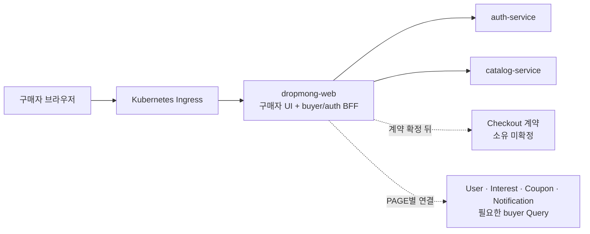
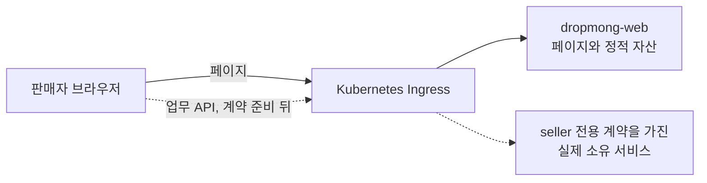

# DropMong buyer 웹 BFF 애플리케이션 모듈

## 문서 역할

`BFF.A.01`은 구매자 화면과 Auth 브라우저 경계를 위한 목표 설계다. 현재 `dropmong-web` 구현 기록과 목표 계약을 구분하며, 판매자 업무 API 설계는 [판매자 웹 애플리케이션 설계](A_03_seller/README.md)를 따른다.

- 런타임: Next.js server runtime
- 배포 단위: 구매자 UI와 Route Handler를 포함한 `dropmong-web` Deployment
- 목표 사용자: 구매자와 인증 전 사용자
- 담당: 구매자 화면 DTO, 웹 session·CSRF, Auth 연결, 단일 업무 API 전달, 안전한 오류 변환
- 제외: DB, 업무 원장, 가격·재고·쿠폰·포인트·주문·결제 판단, seller membership·role·permission
- buyer 연동 원장: [구매자 웹 애플리케이션](A_01_buyer/README.md)
- 공통 프론트 구조: [WEB.A.01](WEB_A_01_frontend_architecture.md)

## 기준 결정

1. buyer BFF는 독립 마이크로서비스가 아니라 `dropmong-web` 안의 서버 모듈이다.
2. BFF는 화면에 필요한 모양과 웹 보안 경계를 담당하지만 서비스 원장과 업무 불변조건을 가져오지 않는다.
3. Checkout은 가격·재고·혜택·주문·결제를 BFF가 순차 호출하지 않는다. 소유자가 확정된 canonical Checkout 계약 하나를 호출한다.
4. seller 업무 API에는 이 BFF를 사용하지 않는다. 현행 Seller BFF는 전환 대상 코드다.
5. 플랫폼 운영자 API는 전용 PAGE·권한·업무 계약이 정해지기 전까지 이 문서 범위에 포함하지 않는다.

## 상태 구분

| 상태 | 의미 |
| --- | --- |
| 현재 구현 | 현재 `service` checkout의 코드와 테스트에 존재 |
| 코드 지원 | 설정을 주입하면 호출할 코드가 있지만 기본 실행·배포에는 연결되지 않음 |
| 프론트 미연결 | downstream API는 구현됐지만 `dropmong-web`이 호출하지 않음 |
| 배포 미연결 | DropMong GitOps Deployment, 환경 변수 또는 Ingress route를 확인하지 못함 |
| 목표 계약 | 구현·설정·배포가 아직 완료되지 않은 설계 |
| 소유 미확정 | 책임을 맡을 서비스와 canonical 계약을 결정하지 않음 |

## 현재 구현 스냅샷

확인 기준은 2026-07-16 `service` checkout HEAD `1bb90b3`이다.

| 영역 | 현재 코드 | 현재 실행 상태 | 목표와의 차이 |
| --- | --- | --- | --- |
| Catalog | `src/server/bff/catalog.ts` | URL이 없으면 mock, 있으면 `GET /drops`, `GET /drops/{dropId}` | 로컬·CI·GitOps 실연동 필요 |
| Auth | `src/server/bff/auth.ts`, `/api/web/auth/context` | 개발용 서명 cookie를 직접 해석 | browser credential 계약 또는 별도 교환 경계 확정 뒤 실제 Auth 연결 필요 |
| Checkout | `src/server/bff/checkout.ts` | snapshot·confirm fixture | 소유 서비스와 canonical 계약 미확정 |
| Order result | `src/server/bff/checkout.ts`, `/api/web/orders/[orderId]` | `dev-order.*` fixture와 polling | Order·Payment 상태 계약 미연결 |
| Seller | `/api/web/seller/**`, `src/server/bff/seller/**` | fixture 또는 placeholder downstream | 목표에서 제거 |

`.env.local`, CI, Playwright와 Docker smoke는 `DEV_MOCK_MODE=true`이고 `CATALOG_INTERNAL_BASE_URL`을 설정하지 않는다. 확인한 GitOps에는 `dropmong-web`과 `catalog-service` 선언이 없다. User·Coupon 일부 선언과 ticketing/MediKong 표기의 동명 서비스 선언은 이 웹 실행 환경의 실제 연동 근거가 아니므로 현재 자동 검증은 mock 회귀로만 판정한다.

## 목표 배치



이 그림은 목표다. 현재 `dropmong-web` Deployment, Catalog 연결과 buyer BFF용 Ingress route가 구성됐다는 뜻이 아니다.

판매자는 다른 경계를 사용한다.



`dropmong-web`의 seller Server Component, Route Handler와 브라우저가 여러 서비스를 fan-out해 통합 상태나 지표를 만들지 않는다.

## 현재 Route Handler

| Method | Route Handler | 서버 함수 | 현재 상태 |
| --- | --- | --- | --- |
| `GET` | `/api/web/home` | `getHomePage` | Catalog 코드 지원, 기본 설정은 mock |
| `GET` | `/api/web/products/[productId]` | `getProductDetailPage` | Catalog 코드 지원, 개인화 미연결 |
| `GET` | `/api/web/auth/context` | `getRequestActor` | 개발 cookie, Auth 미연결 |
| `GET` | `/api/web/checkouts/[checkoutId]` | `getCheckoutSnapshot` | fixture |
| `POST` | `/api/web/checkouts/[checkoutId]/confirm` | `confirmCheckout` | fixture, CSRF·Origin·멱등키 검사 |
| `GET` | `/api/web/orders/[orderId]` | `getOrderResult` | fixture |

Server Component는 같은 프로세스의 서버 함수를 직접 호출하고, 브라우저 mutation과 polling만 동일 출처 Route Handler를 사용한다. 이 구현 선택이 서버 함수에 업무 원장을 둘 근거가 되지는 않는다.

## 목표 모듈 경계

```text
app/api/web/
  auth/
    context/route.ts
  home/route.ts
  products/[productId]/route.ts
  checkouts/[checkoutId]/route.ts
  checkouts/[checkoutId]/confirm/route.ts
  orders/[orderId]/route.ts
src/server/bff/
  auth/
  buyer/
    discovery/
    checkout/
    order-status/
  contracts/
  shared/
```

| 위치 | 책임 | 금지 사항 |
| --- | --- | --- |
| `app/api/web/**/route.ts` | 입력 parsing, 웹 보안 검사, 서버 모듈 호출, HTTP 응답 | 업무 상태 저장, 여러 Command 직접 조정 |
| `src/server/bff/auth` | Auth session context 연결, CSRF, 로그인 복귀 위치 | 사용자·seller 권한 원장 |
| `src/server/bff/buyer` | buyer PAGE DTO와 단일 Query·Command 전달 | 서비스 DB 조회, seller API 어댑터 |
| `src/server/bff/contracts` | 화면 DTO와 Problem Details | persistence row·Provider 응답 노출 |
| `src/server/bff/shared` | typed client, deadline, trace, 오류 매핑 | 성공 모양의 fallback |

현행 `src/server/bff/seller/**`와 `/api/web/seller/**`는 이 목표 모듈에 포함하지 않는다.

## 책임 경계

### 담당한다

| 책임 | 기준 |
| --- | --- |
| 화면 DTO | 서비스 응답을 buyer PAGE에 필요한 모양으로 변환하되 권위 값을 추론하지 않음 |
| 웹 session | browser credential 계약 또는 별도 교환 경계가 확정된 실제 Auth context를 사용하고 브라우저에 access·refresh token을 노출하지 않음 |
| CSRF·Origin | unsafe method를 downstream 호출 전에 검증 |
| 호출 전달 | `traceparent`, 요청 ID, locale, `Idempotency-Key`를 보존 |
| 오류 변환 | typed downstream 오류를 안전한 `WEB_*` Problem Details로 변환 |
| 부분 실패 | 읽기 전용 비권위 섹션만 `unavailable` 또는 허용된 `stale`로 표시 |

### 담당하지 않는다

| 금지 책임 | 소유자 또는 상태 |
| --- | --- |
| 사용자 계정·Session | `auth-service`, `user-service`의 각 canonical 계약 |
| 상품·Drop | `catalog-service` |
| 관심·랭킹 | `interest-service` |
| 쿠폰 원장 | `coupon-service` |
| 주문 원장 | `order-service` |
| 결제 원장 | `payment-service` |
| Checkout 총액·재고·혜택 확정 | 소유 서비스 미확정 |
| 배송·포인트·결제수단 | 소유 서비스·계약 미확정 |
| seller membership·role·permission | 소유 서비스 미확정, Auth에 배정하지 않음 |

## Downstream 상태

| 대상 | 현재 API | 웹 연결 | 목표 사용 |
| --- | --- | --- | --- |
| Catalog | `GET /drops`, `GET /drops/{dropId}` | 코드 지원, 기본 설정·배포 미연결 | 홈·상품 상세 필수 조회 |
| Auth | `GET /api/v1/auth/context` 등 | mobile credential API 구현, browser 계약·프론트 미연결 | browser credential 경계 정합화 뒤 실제 session context와 로그인 |
| Checkout | canonical API 없음 | fixture | snapshot·confirm 단일 계약, 소유자 결정 필요 |
| Order | `POST /orders`, `GET /orders/{orderId}` | 프론트 미연결 | Checkout 뒤 주문 상태 조회 계약 정합화 |
| Payment | mock 승인·실패, 단건 조회 | 프론트 미연결 | Checkout 뒤 결제 상태 조회 계약 정합화 |
| User | 본인 프로필 API | 프론트 미연결 | 마이 프로필 Query |
| Interest | 관심·예정·인기 랭킹 API | 프론트 미연결 | 찜·랭킹 Query |
| Coupon | 보유 쿠폰 조회 API | 프론트 미연결 | 쿠폰 지갑과 Checkout 입력 |
| Notification | 구매자 알림 목록 API | 프론트 미연결 | 구매자 알림 Query |

API가 있다는 사실만으로 buyer PAGE에서 사용할 수 있거나 Ingress에 공개됐다고 판정하지 않는다. PAGE별 상세 상태는 [구매자 서비스 API 인벤토리](A_01_buyer/api-integration/SERVICE_API_INVENTORY.md)에서 관리한다.

## Auth와 내부 요청 문맥

### 현재 구현

1. `/api/web/auth/development-session`이 개발용 서명 cookie를 발급한다.
2. `getServerActor`와 `getRequestActor`가 cookie를 직접 해석한다.
3. `DEV_MOCK_MODE=false`에서는 `WEB_AUTH_CONTRACT_UNAVAILABLE`로 실패한다.

### 목표

1. 현재 context API가 mobile credential만 허용하므로 browser credential 계약을 정합화하거나 별도 교환 경계를 먼저 확정한다.
2. 그 경계를 통해 `auth-service`가 opaque web session을 검증하고 반환한 최소 식별자와 session 문맥만 수신 서비스의 신뢰 모델에 맞춰 전달한다.
3. 이메일, 휴대폰, 이름과 주소를 인증 header나 claim에 넣지 않는다.
4. seller membership·role·permission을 Auth 응답에서 임의로 만들지 않는다.

30초 TTL internal context JWT는 현재 구현이 아니다. issuer, audience, key 소유자, 회전과 수신 서비스 검증 방식이 확정될 때만 선택할 수 있는 목표 후보다. Auth token exchange를 사용할지 BFF가 별도 서명할지도 미확정이다.

## Checkout 원칙

- snapshot과 confirm의 소유 서비스를 이 문서에서 임의로 정하지 않는다.
- BFF가 Catalog, Coupon, Point, Inventory, Order, Payment를 차례로 호출해 총액이나 성공 상태를 만들지 않는다.
- confirm은 canonical Checkout Command 하나를 전달하고, canonical 결과와 상태 조회 위치를 보존한다.
- timeout·응답 유실을 새 주문이나 결제 성공으로 바꾸지 않는다.
- 현재 fixture의 배송지, `MOCK_CARD`, 쿠폰·포인트 문구와 `dev-order.*`는 목표 계약이 아니다.

## 오류·deadline·retry

- 필수 조회 실패는 성공 모양의 빈 배열, `0`, `false`로 바꾸지 않는다.
- Catalog 연결 오류는 mock으로 전환하지 않는다.
- Auth, Checkout, 주문·결제 상태와 권위 데이터는 fail closed로 처리한다.
- 공개 개인화처럼 독립적인 비권위 섹션만 명시적인 부분 실패를 허용한다.
- Command는 자동 retry하지 않고 `Idempotency-Key`와 canonical 상태 조회를 사용한다.
- 내부 hostname, stack trace, SQL과 Provider 원문은 Problem Details에 노출하지 않는다.

## 검증 기준

### 현재 mock 회귀

- CI, Playwright, Docker smoke가 `DEV_MOCK_MODE=true`인 사실을 명시한다.
- Checkout·Order fixture와 개발 session이 mock-off에서 성공하지 않는지 확인한다.
- seller fixture 테스트를 seller 실서비스 연동 증거로 사용하지 않는다.

### 실제 연동

1. Catalog: `CATALOG_INTERNAL_BASE_URL`을 설정하고 mock 없이 홈·상품 상세와 upstream 오류를 검증한다.
2. Auth: browser credential 계약 또는 별도 교환 경계를 확정한 뒤 실제 session을 context API에 연결하고 만료·익명·오류를 검증한다.
3. Checkout: 소유자와 계약을 확정한 뒤 snapshot·confirm·멱등·결과 불확실 상태를 검증한다.
4. Order/Payment: canonical 주문·결제 상태와 사용자 소유권을 검증한다.
5. 부가 Query: User, Interest, Coupon, Notification을 PAGE 단위로 연결하고 부분 실패 조건을 검증한다.

## 분리 판단

buyer BFF를 별도 Deployment로 분리할지는 실제 트래픽, SLO, 보안 경계, 배포 주기와 장애 영향 자료가 반복해서 확인될 때 검토한다. Route 수나 폴더 크기만으로 분리하지 않는다.

seller는 이 분리 판단의 후보가 아니다. seller 목표는 처음부터 Seller BFF가 아니라 브라우저 → Ingress → 실제 소유 서비스다. seller 웹 배포 자체를 나눌지는 UI 배포·보안 요구로 별도 결정한다.

## 열린 결정

- Checkout snapshot·confirm의 소유 서비스와 canonical API
- 주문·결제 결과를 하나의 사용자 상태로 조회하는 계약
- 배송, 포인트와 결제수단 원장의 소유 서비스
- Auth 검증 결과를 downstream에 전달할 trust model
- 실제 연동을 검증할 DropMong GitOps 환경과 Ingress route
- 공개 홈·상품 캐시의 TTL과 Drop 오픈 직전 revalidation 기준
