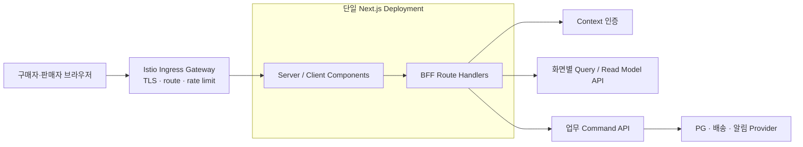

# DropMong 웹 BFF 애플리케이션 모듈

## 기본 정보

- BFF ID: `BFF.A.01`
- 대상 프론트엔드: 구매자 웹, 판매자 웹 포털, 플랫폼 운영자 웹
- 런타임: Next.js server runtime
- 배포 단위: UI와 Route Handler를 포함한 단일 Next.js Deployment
- 주요 사용자: 구매자, 판매자 대표 관리자, 판매자 상품·출고 담당자, 판매자 성과 조회자
- 설계 범위: 화면 DTO, 웹 세션·CSRF 경계, 내부 요청 컨텍스트 변환, 화면 단위 조회 조합, Command 전달, 오류·deadline·trace 표준
- 제외 범위: DB, 도메인 모델, 업무 트랜잭션, 가격·재고·쿠폰·포인트·결제 권위, 플랫폼 운영 도구와 관측성 저장소
- 기준 템플릿: [BFF 애플리케이션 모듈 템플릿](.template/BFF_A_XX_bff_module.md)

## 결정

`BFF.A.01`은 독립 마이크로서비스가 아니다. 구매자·판매자 UI와 같은 Next.js 프로세스, 컨테이너, Pod, Deployment에서 실행하는 서버 애플리케이션 모듈이다. DDD 바운디드 컨텍스트나 `GOAL.md`의 3~5개 도메인 서비스 수에 포함하지 않는다.

이 모듈은 브라우저에 필요한 응답 모양과 웹 보안 경계를 담당한다. 업무 서비스가 가진 원장과 불변조건을 가져오지 않으며, 화면 한 장에 필요한 값이 많다는 이유로 BFF가 가격·재고·결제 판단을 다시 구현하지 않는다.

## 결정 근거

- 홈은 공개 드롭 데이터와 로그인 사용자의 장바구니·알림 상태를 함께 보여 주므로 공개 기본 응답과 선택적 개인화를 분리해야 한다.
- 마이 화면은 프로필, 주문·배송, 쿠폰, 포인트·등급, 관심, 알림 요약을 화면 단위로 조합해야 한다.
- 체크아웃은 배송지, 상품, 결제수단, 쿠폰, 포인트와 최종 금액을 보여 주지만 금액 확정과 재검증은 Checkout 업무 서비스가 수행해야 한다.
- 판매자 포털은 `seller.id`, 구성원 역할·권한, 작업 알림, 드롭·주문·출고·분석·정산 조회를 같은 화면 문맥으로 제공해야 한다.
- 인증 설계는 웹 BFF가 세션 cookie, 가입 입력의 Context별 전달과 로그인 뒤 복귀 intent를 처리하는 클라이언트 경계라고 이미 전제한다.
- 단일 Next.js 배포로 시작하면 별도 BFF의 CI/CD, HPA, secret, SLO와 장애 지점을 추가하지 않으면서도 Route Handler 단위 trace와 timeout을 검증할 수 있다.

## 연관 문서

- 프로젝트 목표: [클라우드 네이티브 실습 통합 과제](../../GOAL.md)
- 한정 상품 요구사항: [REQ.A.01](../00-requirements/REQ_A_01_limited_drop_commerce.md)
- 판매자 요구사항: [REQ.A.03](../00-requirements/REQ_A_03_seller.md)
- 플랫폼 운영자 요구사항: [REQ.A.04](../00-requirements/REQ_A_04_platform_operator_admin.md)
- 인증 요구사항: [REQ.A.05](../00-requirements/REQ_A_05_auth_member.md)
- 클러스터 요구사항: [REQ.A.06](../00-requirements/REQ_A_06_kubernetes_cluster_architecture.md)
- 웹 애플리케이션 요구사항: [REQ.A.08](../00-requirements/REQ_A_08_web_application.md)
- 사이트맵: [DropMong 사이트맵](../10-sitemap/README.md)
- UI 인덱스: [DropMong UI](../20-ui/README.md)
- 마이 UI: [UI.A.10](../20-ui/buyer-mobile-web/UI_A_10_my.md)
- 체크아웃 UI: [UI.A.11](../20-ui/buyer-mobile-web/UI_A_11_payment.md)
- 판매자 포털 UI: [UI.A.200~211](../20-ui/UI_A_200_seller_portal/README.md)
- 드롭 커머스 BC와 마이 조회 Hotspot: [BC.A.01](../40-event-storming-bounded-context/BC_A_01_limited_drop_commerce.md)
- 인증 도메인 모델: [SD.A.30010](../50-service-design/A_300_auth/A_300_10-domain-model/SD_A_30010_auth_domain_model.md)
- 인증 서비스: [SD.A.30030](../50-service-design/A_300_auth/A_300_30-service/README.md)
- 인증 API: [SD.A.30040](../50-service-design/A_300_auth/A_300_40-api/README.md)
- 가입 처리 시퀀스: [SCN.A.300-01](../80-sequence/A_300_auth/SCN_A_300_01_email_registration.md)
- 웹 애플리케이션 인덱스: [60-web-application](README.md)
- 프론트엔드 구조: [WEB.A.01](WEB_A_01_frontend_architecture.md)
- 상태와 데이터 전략: [WEB.A.02](WEB_A_02_state_data_strategy.md)
- 배포·관측성·테스트: [WEB.A.03](WEB_A_03_deployment_observability_test.md)

## 배포 구성



- 브라우저의 외부 요청은 Ingress를 거쳐 Next.js로 들어온다. Ingress는 TLS, route, rate limit과 외부 헤더 제거를 맡고 화면 DTO를 조합하지 않는다.
- Next.js Route Handler가 웹 세션과 CSRF를 확인하고 내부 서비스 호출에 필요한 짧은 TTL의 signed request context를 만든다.
- BFF는 상태 비저장이다. 장기 Session, refresh family, checkout snapshot, 주문, 재고, 결제와 멱등성 원장은 담당 서비스에 둔다.
- Pod 고정과 sticky session을 사용하지 않으며 수평 확장을 전제로 한다.
- liveness는 프로세스 생존만 확인한다. readiness는 환경 변수, signing key 로딩과 Route Handler 초기화만 확인하며 downstream 장애 때문에 Pod를 재시작하지 않는다.

## 구현 모듈 구조

```text
app/
  api/web/
    auth/
      context/route.ts
      registrations/route.ts
      sign-in/route.ts
    home/route.ts
    products/[productId]/route.ts
    my/route.ts
    checkouts/[checkoutId]/route.ts
    checkouts/[checkoutId]/confirm/route.ts
    orders/route.ts
    orders/[orderId]/tracking/route.ts
    seller/context/route.ts
    seller/dashboard/route.ts
    seller/orders/route.ts
    operator/
      # PAGE·UI·API 계약 확정 뒤 Route Handler 추가
src/server/bff/
  auth/
    session-context.ts
    csrf.ts
    internal-context.ts
  contracts/
    buyer.ts
    seller.ts
    problem-details.ts
  modules/
    auth/
    discovery/
    my/
    checkout/
    order/
    seller/
  shared/
    downstream-client.ts
    deadline.ts
    idempotency.ts
    telemetry.ts
```

| 영역 | 책임 |
| --- | --- |
| `app/api/web/**/route.ts` | 입력 parsing, 접근 등급 적용, application module 호출, HTTP 응답 |
| `src/server/bff/auth` | cookie 세션 확인, CSRF, redirect intent, 내부 요청 컨텍스트 |
| `src/server/bff/contracts` | 화면 DTO, partial metadata, Problem Details |
| `src/server/bff/modules` | 페이지 단위 조회 조합과 Command 전달 |
| `src/server/bff/shared` | typed downstream client, deadline, trace, 오류 매핑, 멱등 header 보존 |

Route Handler는 얇게 유지한다. 호출 순서와 실패 분류는 `src/server/bff/modules`에 두되, 해당 모듈도 도메인 정책과 영속 상태를 갖지 않는다.

## 책임 경계

### 담당한다

| 책임 | 처리 기준 |
| --- | --- |
| 화면 DTO | UI가 한 번에 사용할 필드명, 섹션 상태, action 가능 여부 설명을 제공한다. action 권위 값은 담당 서비스 응답을 그대로 반영한다. |
| 웹 세션 | opaque cookie를 Auth로 검증하고 브라우저에 access·refresh token을 노출하지 않는다. |
| CSRF | unsafe method에서 Session-bound CSRF token을 검증한다. |
| 내부 컨텍스트 | 검증된 `user_id`, `session_id`, 권한 버전을 수신자별 짧은 TTL context로 변환한다. |
| 호출 조정 | 서로 독립적인 조회만 전체 deadline 안에서 병렬 호출한다. |
| 오류 변환 | typed downstream 오류를 웹 Problem Details와 안정적인 `WEB_*` code로 변환한다. |
| 부분 실패 | 읽기 전용 비권위 섹션에만 `partial`, `unavailable`, `stale`을 명시한다. |
| 전달 문맥 | `traceparent`, `tracestate`, 요청 ID, locale과 `Idempotency-Key`를 보존한다. |

### 담당하지 않는다

| 금지 책임 | 소유자 |
| --- | --- |
| DB, Repository, migration, outbox | 각 바운디드 컨텍스트 |
| 사용자 계정, Session, role·permission 원장 | Context 사용자·인증 |
| 상품·드롭·재고 상태와 구매 가능 판정 | 상품·드롭·재고 Context |
| 가격, 배송비, 쿠폰, 포인트와 최종 결제 금액 | Checkout 및 각 원장 Context |
| 주문 생성, 재고 배정, 결제 승인과 보상 | Order·Inventory·Payment 애플리케이션 서비스 |
| 판매자 소유권, 승인 후 변경 제한, 정산 확정 | Seller·Review·Settlement 업무 서비스 |
| 장기 작업, saga 상태, 재처리 queue | 해당 application service와 worker |
| 운영 metric·log·trace 저장 및 인프라 제어 | LGTM, GitOps와 플랫폼 운영 도구 |

특히 체크아웃 Route Handler는 Coupon, Point, Inventory, Payment를 직접 호출해 최종 금액을 만들지 않는다. `CheckoutReadModel`과 confirm Command를 소유한 업무 API 하나를 호출하고 그 결과를 화면 DTO로 바꾼다.

## 접근 등급

| 등급 | 적용 예 | 세션 실패 | 부분 실패 | cache |
| --- | --- | --- | --- | --- |
| `PUBLIC` | 공개 홈 기본 데이터 | 인증 호출 없음 | 공개 조회 자체는 실패 처리 | 공유 캐시 가능 |
| `OPTIONAL_SESSION` | 홈·상품의 장바구니·알림 상태 | 공개 데이터는 유지하고 개인화 섹션 생략 | 개인화 섹션만 허용 | 공개 DTO와 개인화 DTO 분리 |
| `AUTHENTICATED` | 마이, 주문, 배송, 쿠폰 | `401`과 서명된 복귀 intent | 비권위 요약만 허용 | `no-store` |
| `STRONG_AUTH` | 판매자 권한 변경, 주문 자료 다운로드 | `401` 또는 최근 인증 요구 | 허용하지 않음 | `no-store` |

## Route Handler

| Method | Route Handler | 접근 등급 | 화면 DTO | Downstream | 실패 원칙 |
| --- | --- | --- | --- | --- | --- |
| `GET` | `/api/web/home` | `OPTIONAL_SESSION` | `HomePageDto` | `drop-query`, 선택적 `auth`·`cart-query`·`notification-query` | 공개 드롭은 필수, 개인 배지만 생략 가능 |
| `GET` | `/api/web/products/[productId]` | `OPTIONAL_SESSION` | `ProductDetailPageDto` | `product-query`, 선택적 `interest-query`·`cart-query`·`notification-query` | 상품·드롭·구매 가능 상태는 필수, 개인화만 생략 가능 |
| `GET` | `/api/web/auth/context` | `OPTIONAL_SESSION` | `WebAuthContextDto` | `auth` | 비회원은 명시적 anonymous, Auth 장애는 `503` |
| `POST` | `/api/web/auth/registrations` | `PUBLIC` + CSRF 시작 token | `RegistrationProgressDto` | `user-command`, `agreement-command`, `auth` | 모두 멱등 Command, 중간 결과를 가입 완료로 반환하지 않음 |
| `POST` | `/api/web/auth/sign-in` | `PUBLIC` + CSRF 시작 token | `SignInResultDto` | `auth` | cookie 속성을 보존하고 실패 원인을 안전하게 축약 |
| `GET` | `/api/web/my` | `AUTHENTICATED` | `MyPageDto` | `user-query`, `order-query`, `coupon-query`, `point-query`, `notification-query` | 프로필 필수, 요약 섹션은 unavailable 또는 stale 허용 |
| `GET` | `/api/web/checkouts/[checkoutId]` | `AUTHENTICATED` | `CheckoutPageDto` | `checkout` | 가격·재고·혜택이 모두 권위 데이터이므로 fail closed |
| `POST` | `/api/web/checkouts/[checkoutId]/confirm` | `AUTHENTICATED` + CSRF | `CheckoutConfirmResultDto` | `checkout` | 자동 retry 금지, 같은 key 상태 조회 지원 |
| `GET` | `/api/web/orders` | `AUTHENTICATED` | `OrderHistoryPageDto` | `order-query` | 주문 소유권 필수, 썸네일만 선택적 대체 가능 |
| `GET` | `/api/web/orders/[orderId]/tracking` | `AUTHENTICATED` | `DeliveryTrackingPageDto` | `delivery-query` | 주문 소유권과 배송 상태는 필수, 외부 택배 링크만 제한 가능 |
| `GET` | `/api/web/seller/context` | `STRONG_AUTH` | `SellerWebContextDto` | `auth`, `seller-query` | 판매자 membership과 권한 검증 실패 시 fail closed |
| `GET` | `/api/web/seller/dashboard` | `AUTHENTICATED` | `SellerDashboardDto` | `seller-dashboard-query` | 확정·추정·stale 기준 시각을 표시하고 가짜 0을 금지 |
| `GET` | `/api/web/seller/orders` | `STRONG_AUTH` | `SellerOrderPageDto` | `seller-order-query` | `seller.id` 범위와 개인정보 마스킹은 필수 |
| 예약 | `/api/web/operator/*` | `STRONG_AUTH` | PAGE·UI 확정 뒤 정의 | `operator-query`, `operator-command` 예정 | Canonical PAGE·UI·API가 생기기 전에는 구현하지 않음 |

플랫폼 운영자 route group도 같은 Next.js 배포 단위에 포함한다. 다만 현재 PAGE와 UI가 없으므로 코드 위치만 예약하고 임의의 메뉴나 범용 Command endpoint를 만들지 않는다. Grafana, Argo CD, trace UI는 BFF로 감싸지 않는다. 사용자 이벤트 타임라인, 재처리, 차단처럼 DropMong 업무 기능은 전용 Ops Query·Command API를 먼저 정의한 뒤 강한 인증, 최근 재인증, 승인 참조와 감사 기록을 적용한다.

## Downstream

| 별칭 | 담당 Context/API | 호출 목적 | 권위 | 초기 timeout | 자동 retry |
| --- | --- | --- | --- | --- | --- |
| `auth` | Context 인증 API | 세션, CSRF context, 권한 버전, 로그인·가입 | 인증 원장 | 700 ms | GET 1회, Command 없음 |
| `drop-query` | 드롭 탐색 Read Model | 홈 추천, 예정 드롭, 랭킹 | 공개 조회 모델 | 600 ms | GET 1회 |
| `product-query` | 상품·드롭 상세 Read Model | 상품, 옵션, 드롭 상태, 구매 가능 사유 | 상품·드롭 조회 권위 | 700 ms | GET 1회 |
| `cart-query` | 장바구니 Query | 배지와 개인 장바구니 상태 | 장바구니 조회 권위 | 300 ms | GET 1회 |
| `interest-query` | 관심 Query | 찜 상태 | 관심 조회 권위 | 300 ms | GET 1회 |
| `notification-query` | 알림 Query | 신청 상태와 읽지 않은 수 | 알림 조회 권위 | 300 ms | GET 1회 |
| `user-query` | 사용자 프로필 Query | 프로필 카드와 계정 표시 상태 | 사용자 표시 정보 권위 | 500 ms | GET 1회 |
| `coupon-query` | Context 쿠폰 Query | 보유·사용 가능 쿠폰 요약 | 쿠폰 원장 투영 | 500 ms | GET 1회 |
| `point-query` | 포인트·등급 Query | 잔액, 등급, 다음 등급 기준 | 포인트·등급 원장 투영 | 500 ms | GET 1회 |
| `order-query` | 주문·배송 Read Model | 주문 수, 최근 주문, 주문 내역 | 주문 조회 권위 | 700 ms | GET 1회 |
| `delivery-query` | 배송 Read Model | 운송장, 상태, 타임라인 | 배송 조회 권위 | 900 ms | GET 1회 |
| `checkout` | Checkout Application API | checkout snapshot 조회와 confirm | 금액·재고·혜택·결제 준비 권위 | 조회 1,500 ms, Command 5,000 ms | 없음 |
| `user-command` | Context 사용자 Command API | 가입 프로필 초안 | 사용자 계정·프로필 | 1,000 ms | 없음 |
| `agreement-command` | 동의 Command API | 필수 동의 receipt | 동의 원장 | 1,000 ms | 없음 |
| `seller-query` | Seller Context Query | 판매자 membership과 화면 문맥 | 판매자 범위 권위 | 700 ms | GET 1회 |
| `seller-dashboard-query` | Seller Read Model | KPI, 작업, 드롭, 최근 주문, 일정 | 집계 조회 모델 | 1,200 ms | GET 1회 |
| `seller-order-query` | Seller Fulfillment Query | 판매자 주문과 출고 상태 | 주문·출고 조회 권위 | 1,200 ms | GET 1회 |
| `operator-query` | Operator Read Model 예정 | CS, 검수, 드롭 현황, 인시던트와 최신성 조회 | 운영 조회 모델 | 계약 확정 뒤 결정 | GET만 검토 |
| `operator-command` | Operator Application API 예정 | 승인된 위험 작업, 재처리·보정 요청 등록 | 각 업무 Command 권위 | 계약 확정 뒤 결정 | 없음 |

초기 timeout은 local·private-dev·aws-dev의 실제 p95를 확인한 뒤 조정한다. Route Handler의 남은 deadline이 표의 값보다 짧으면 남은 시간을 사용한다.

## 화면 DTO 계약

성공 응답은 화면 데이터와 조합 메타데이터를 분리한다.

```json
{
  "data": {
    "page": {}
  },
  "meta": {
    "traceId": "7c4d...",
    "generatedAt": "2026-07-10T12:00:00Z",
    "partial": true,
    "unavailableSections": ["notificationSummary"]
  }
}
```

부분 실패 또는 stale 허용 섹션은 상태를 값과 함께 제공한다.

```json
{
  "orderSummary": {
    "status": "stale",
    "asOf": "2026-07-10T11:59:30Z",
    "value": {
      "totalOrderCount": 12
    }
  },
  "notificationSummary": {
    "status": "unavailable",
    "asOf": null,
    "value": null
  }
}
```

- Domain Entity, persistence row와 외부 Provider 응답을 그대로 노출하지 않는다.
- `actions.canPay`, `actions.canCancelOrder`, `member.permissions[]` 같은 권위 값은 BFF가 추론하지 않고 담당 API가 계산한 결과를 사용한다.
- 조회 실패를 `0`, 빈 배열, `false` 또는 성공 상태로 바꾸지 않는다.
- 금액은 integer minor unit 또는 프로젝트 공통 Money schema를 사용하고 부동소수점으로 다시 계산하지 않는다.
- 날짜와 기준 시각은 timezone이 포함된 ISO 8601로 반환한다.
- 오류 응답은 성공 envelope가 아니라 Problem Details를 사용한다.

## 세션과 CSRF

### 웹 세션

1. 브라우저는 같은 origin의 Next.js Route Handler에 opaque session cookie를 보낸다.
2. BFF는 Auth의 context API로 cookie를 검증한다. Gateway는 cookie를 업무 context로 해석하지 않는다.
3. Auth가 반환한 `user_id`, `session_id`, role·permission version과 Session-bound CSRF 값을 요청 문맥에 둔다.
4. 로그인·회원가입 성공 시 Auth가 발급한 `Set-Cookie`의 `HttpOnly`, `Secure`, `SameSite`, `Path`와 만료 속성을 축소하거나 바꾸지 않고 브라우저에 전달한다.
5. BFF는 별도 Session DB나 memory session을 만들지 않는다.

브라우저 응답 본문과 local/session storage에는 access token, refresh token, session credential을 넣지 않는다. 인증·체크아웃·주문·판매자 응답은 `Cache-Control: no-store`를 적용한다.

### CSRF

- `POST`, `PUT`, `PATCH`, `DELETE`는 Session-bound CSRF token과 same-origin `Origin`을 함께 검증한다.
- 로그인·가입 시작처럼 비회원 Command는 짧은 TTL의 pre-auth CSRF cookie/header pair를 사용한다.
- CSRF 실패는 `403 WEB_CSRF_INVALID`로 반환하고 downstream을 호출하지 않는다.
- CSRF 값, cookie 원문과 인증 입력은 log, trace, metric에 남기지 않는다.

### 내부 요청 컨텍스트

MVP에서는 BFF가 Auth의 검증 결과를 받아 수신 서비스별 `aud`를 가진 30초 TTL의 internal context JWT로 변환한다. BFF issuer와 signing key는 외부 token issuer와 분리하고 Kubernetes Secret 또는 외부 secret으로 주입·회전한다.

| Claim | 포함 기준 |
| --- | --- |
| `iss` | DropMong web BFF 내부 issuer |
| `aud` | 호출 대상 서비스 하나 |
| `sub` | `user_id` |
| `sid` | `session_id` |
| `roles` | 수신 서비스에 필요한 최소 role |
| `permissions` 또는 `permission_version` | 수신 서비스에 필요한 최소 권한 문맥 |
| `iat`, `exp`, `jti` | 30초 TTL과 replay 조사 |

- 이메일, 휴대폰, 이름, 주소, seller 표시명과 Identity 원문은 claim에 넣지 않는다.
- 브라우저가 보낸 `Authorization`, `X-User-*`, `X-Seller-*`, internal context header는 제거한다.
- `seller.id`는 브라우저 body나 query를 그대로 믿지 않는다. 검증된 사용자 membership과 선택된 판매자 문맥을 Seller Context에서 확인한 뒤 내부 컨텍스트에 별도 scope로 묶는다.
- downstream은 서명, issuer, audience, expiry를 검증하고 리소스 소유권과 현재 권한을 다시 확인한다.
- 권한 변경, 주문 자료 다운로드, 결제 같은 고위험 API는 현재 permission version과 최근 재인증을 fail closed로 확인한다.

## 호출 조정 규칙

- 조회 병렬화는 서로 독립적이고 부분 실패 정책이 정해진 호출에만 사용한다.
- 홈의 공개 드롭 조회가 끝나기 전에 선택적 개인화 실패를 기다리며 전체 응답을 늦추지 않는다.
- 마이는 프로필을 필수 축으로 삼고 주문·쿠폰·포인트·알림 요약을 제한된 병렬 조회로 조합한다.
- 판매자 대시보드는 BFF가 Order, Payment, Inventory 원장을 직접 fan-out 조회하지 않고 `seller-dashboard-query`의 집계 Read Model을 사용한다.
- 체크아웃 confirm은 `checkout` Command 하나만 호출한다. BFF가 재고 예약, 쿠폰 예약, 포인트 예약과 결제를 순서대로 호출하지 않는다.
- 가입의 프로필 초안, 동의 receipt, Auth Registration 호출은 기존 시퀀스를 따른다. 각 단계는 멱등 API여야 하며 BFF는 장기 상태나 보상 작업을 저장하지 않는다.
- 가입 조정이 모바일과 운영자 채널에서도 재사용되거나 장기 보상 작업을 요구하면 BFF가 아니라 별도 Onboarding Application Service로 이동한다.

## Deadline과 timeout

| 호출 등급 | Route 전체 deadline | 개별 downstream 상한 | timeout 처리 |
| --- | --- | --- | --- |
| `PUBLIC_READ` | 1,200 ms | 700 ms | 공개 필수 데이터 실패 시 `503` |
| `OPTIONAL_PERSONALIZATION` | 1,500 ms | 300 ms | 개인화 섹션만 unavailable |
| `PRIVATE_COMPOSITE_READ` | 2,000 ms | 1,200 ms | 허용 섹션만 unavailable 또는 stale |
| `AUTHORITATIVE_READ` | 2,500 ms | 1,500 ms | fail closed |
| `COMMAND` | 3,000 ms | 2,500 ms | 자동 retry 없이 typed 오류 |
| `PAYMENT_CONFIRM` | 6,000 ms | 5,000 ms | 결과 불확실 상태와 상태 조회 안내 |

- Route Handler가 전체 deadline을 만들고 `AbortSignal`을 모든 downstream client에 전달한다.
- 각 client는 남은 시간과 자신의 상한 중 짧은 값을 사용한다.
- 호출이 취소되면 response body 소비와 후속 호출도 중단한다.
- 필수 의존성 timeout은 `504 WEB_DOWNSTREAM_TIMEOUT`, 연결 불가·circuit open은 `503 WEB_DEPENDENCY_UNAVAILABLE`로 구분한다.
- Next.js 자체 timeout, Ingress timeout과 service mesh timeout은 바깥 계층이 더 길도록 맞춰 BFF가 먼저 안정적인 오류를 반환하게 한다.

## retry

| 요청 | 자동 retry | 조건 |
| --- | --- | --- |
| 공개·개인 조회 `GET` | 최대 1회 | 연결 실패 또는 retryable `503`, 남은 deadline 충분, 짧은 jitter |
| `429` | 기본 없음 | `Retry-After`를 브라우저에 전달 |
| 로그인·가입·쿠폰·주문 Command | 없음 | 사용자가 같은 key로 명시적 재요청 |
| checkout confirm·결제 | 없음 | 같은 key 상태 조회 또는 명시적 재요청 |
| 파일 생성·다운로드 | 없음 | 작업 상태와 재요청 가능 시각 사용 |

- `400`, `401`, `403`, `404`, `409`, `422`는 retry하지 않는다.
- service mesh와 BFF가 같은 호출을 중복 retry하지 않도록 route별 책임을 하나로 둔다.
- retry 횟수는 span event와 metric에 남기되 요청 ID나 사용자 ID를 label로 사용하지 않는다.

## 멱등성

- 브라우저가 상태 변경 요청마다 `Idempotency-Key`를 생성한다.
- BFF는 key 형식과 길이를 확인하고 같은 사용자·Session, route template, 요청 digest에 묶어 downstream에 전달한다.
- 여러 downstream Command가 필요한 가입에서는 최초 key와 단계 이름으로 안정적인 하위 key를 결정적으로 만든다. 원 key와 하위 key는 로그에 남기지 않는다.
- BFF는 멱등성 DB와 canonical 결과를 소유하지 않는다. 각 Command 서비스의 IdempotencyRecord가 최종 기준이다.
- 같은 key와 다른 payload는 `409 WEB_IDEMPOTENCY_CONFLICT`로 반환한다.
- downstream이 `202 Accepted`, `Location`, `Retry-After`를 반환하면 보존한다. 처리 중 상태를 `200` 성공으로 바꾸지 않는다.
- checkout confirm의 응답이 유실되면 같은 key로 상태 조회 또는 재요청하고 새 주문·결제 실행을 만들지 않는다.

## 부분 실패

| 화면/섹션 | 필수 여부 | 허용 처리 | 금지 처리 |
| --- | --- | --- | --- |
| 홈 공개 드롭 | 필수 | stale 공개 Read Model은 기준 시각 표시 후 허용 가능 | 빈 목록을 정상 최신 결과로 반환 |
| 홈 장바구니·알림 배지 | 선택 | `unavailable`로 생략 | `0`이나 미신청으로 위장 |
| 상품 상세 상품·드롭·구매 가능 상태 | 필수 | 없음 | 개인화 실패 때문에 권위 상태를 추론 |
| 상품 상세 찜·알림 상태 | 선택 | `unavailable` | `false`로 위장 |
| 마이 프로필 | 필수 | 없음 | 익명 프로필 생성 |
| 마이 주문·쿠폰·포인트·알림 요약 | 선택 | `unavailable` 또는 허용 기간의 `stale` | 가짜 `0`, 빈 배열 |
| 체크아웃 금액·배송지·재고·쿠폰·포인트 | 필수 | 없음 | stale 금액, 클라이언트 재계산 |
| 주문·배송 상태 | 필수 | 없음 | 이전 상태를 최신으로 표시 |
| 판매자 대시보드 분석 | 선택 | `asOf`와 `isRealtimeEstimate`를 가진 stale 집계 | 추정치를 확정 지표로 표시 |
| 판매자 권한·주문·다운로드 | 필수 | 없음 | 권한 오류를 메뉴 숨김만으로 처리 |

- 부분 실패는 읽기 전용 섹션에만 적용한다.
- 인증, 권한, 소유권, 가격, 재고, 쿠폰 적용, 포인트 사용, 결제, 주문 Command는 fail closed다.
- 부분 응답은 HTTP `200`을 사용할 수 있지만 `meta.partial=true`와 실패 섹션을 반드시 포함한다.
- 필수 데이터가 없으면 전체 요청을 실패시키며 성공 모양의 기본값을 만들지 않는다.

## 오류 계약

```json
{
  "type": "https://dropmong.example/problems/dependency-unavailable",
  "title": "일시적으로 요청을 처리할 수 없습니다.",
  "status": 503,
  "code": "WEB_DEPENDENCY_UNAVAILABLE",
  "traceId": "7c4d...",
  "retryable": true
}
```

| HTTP | BFF code 예 | 처리 |
| --- | --- | --- |
| `400` | `WEB_REQUEST_INVALID` | JSON, query, path parsing 실패 |
| `401` | `WEB_LOGIN_REQUIRED`, `WEB_SESSION_EXPIRED` | 서명된 redirect intent와 로그인 위치 제공 |
| `403` | `WEB_CSRF_INVALID`, `WEB_PERMISSION_DENIED` | downstream 호출 전 또는 권한 응답에 따라 거부 |
| `404` | `WEB_RESOURCE_NOT_FOUND` | 리소스 존재 정보 추가 노출 금지 |
| `409` | `WEB_STATE_CONFLICT`, `WEB_IDEMPOTENCY_CONFLICT` | 안전한 업무 code와 현재 상태 제공 |
| `422` | `WEB_VALIDATION_FAILED` | 필드 오류만 안전하게 전달 |
| `429` | `WEB_RATE_LIMITED` | `Retry-After` 보존 |
| `502` | `WEB_DOWNSTREAM_CONTRACT_INVALID` | schema 위반, 비정상 응답 기록 |
| `503` | `WEB_DEPENDENCY_UNAVAILABLE` | circuit open, 연결 실패, 필수 서비스 장애 |
| `504` | `WEB_DOWNSTREAM_TIMEOUT` | deadline 초과와 결과 불확실 여부 제공 |
| `500` | `WEB_INTERNAL_ERROR` | 알려지지 않은 오류, 상세 숨김과 즉시 trace 기록 |

- typed downstream 오류만 명시적으로 매핑한다. 포괄적인 catch로 업무 오류를 성공, `404` 또는 빈 응답으로 바꾸지 않는다.
- 클라이언트에는 내부 hostname, stack trace, SQL, Provider 응답과 서비스 토폴로지를 노출하지 않는다.
- domain code가 사용자의 다음 행동에 필요하면 안정적인 allowlist만 전달한다.
- Command timeout에는 `operationId` 또는 상태 조회 URL이 있을 때만 반환하고 임의 ID를 만들지 않는다.

## 캐시

| 응답 | 정책 |
| --- | --- |
| 공개 홈·상품 기본 DTO | CDN/Next revalidation 후보, 짧은 TTL과 stale 기준 명시 |
| 선택적 개인화 | 공개 캐시와 분리, 사용자 공유 캐시 금지 |
| 인증 context | `Cache-Control: no-store` |
| 마이·쿠폰·주문·배송 | `Cache-Control: private, no-store` |
| 체크아웃·결제 | `Cache-Control: no-store` |
| 판매자 context·주문·권한 | `Cache-Control: no-store` |
| 판매자 분석 | BFF 공유 캐시보다 집계 Read Model의 `asOf`를 사용 |

- cookie 유무에 따라 같은 cache key에 공개·개인 응답을 섞지 않는다.
- public DTO의 ETag와 revalidation은 가능하지만 재고·구매 가능 상태의 업무 권위를 대신하지 않는다.
- BFF 메모리 캐시는 Pod별로 달라질 수 있으므로 세션, 멱등성, 권한과 Command 상태를 넣지 않는다.

## 관측성

### trace

- root span: `web.bff <METHOD> <route-template>`
- child span: `downstream.<alias> <operation>`
- W3C `traceparent`와 `tracestate`를 모든 내부 호출에 전달한다.
- BFF 조정 시간과 각 downstream 대기 시간을 분리해 기록한다.
- 부분 실패, retry, circuit open과 idempotency replay는 span event로 남긴다.
- cookie, token, CSRF, 이메일, 휴대폰, 주소, 상품명, `user_id`, `seller.id`를 span attribute에 넣지 않는다.

### metric

| Metric | 주요 label |
| --- | --- |
| `web_bff_requests_total` | route template, method, status class |
| `web_bff_request_duration_seconds` | route template, method |
| `web_bff_downstream_requests_total` | downstream alias, operation, result |
| `web_bff_downstream_duration_seconds` | downstream alias, operation |
| `web_bff_partial_responses_total` | route template, section |
| `web_bff_retries_total` | downstream alias, reason |
| `web_bff_idempotency_results_total` | route template, result |

고유 ID, URL 원문, 오류 메시지 원문을 metric label로 사용하지 않는다.

### log

- 구조화 필드: timestamp, level, `traceId`, route template, method, status, duration, error code, downstream alias.
- request·response body, cookie, token, CSRF, 인증번호, 비밀번호, 개인정보를 기록하지 않는다.
- 사용자 문의용 `traceId`는 Problem Details와 화면 오류 상태에 제공한다.

## SLI와 초기 운영 기준

| Route 등급 | SLI | 초기 기준 |
| --- | --- | --- |
| 공개 조회 | 성공률, p95 latency, partial 비율 | 홈·상품별 분리 |
| 로그인 조회 | 성공률, p95 latency, Auth 오류율 | `401`은 서비스 오류에서 제외 |
| private 조합 조회 | 성공률, p95 latency, unavailable section 비율 | 마이·판매자 분리 |
| checkout 조회 | 성공률, p95 latency, stale 응답 수 | stale는 항상 0 |
| Command | 성공률, timeout, idempotency replay | 업무 거절과 시스템 오류 분리 |

- BFF SLO는 downstream SLO를 합산한 숫자가 아니라 사용자 Route 결과를 기준으로 정의한다.
- 공개 기본 화면 성공과 선택적 개인화 실패를 별도 SLI로 측정한다.
- readiness가 downstream 장애와 연동돼 cascading restart를 만들지 않는지 장애 주입으로 확인한다.

## 보안 기준

- Ingress와 BFF에서 외부 `X-User-*`, `X-Seller-*`와 internal token header를 제거한다.
- 모든 downstream URL은 설정 allowlist로 제한하고 사용자 입력 URL을 server-side fetch 대상으로 사용하지 않는다.
- redirect target은 내부 route allowlist와 서명된 AuthenticationIntent로만 복구한다.
- server action이나 Route Handler에서 cookie·token 원문을 client component props로 전달하지 않는다.
- 판매자 주문 자료는 마스킹된 조회를 기본으로 하고 다운로드는 목적, 요청자, 범위와 만료를 담당 서비스가 감사 기록으로 남긴다.
- internal context signing key는 외부 세션·JWT key와 분리해 회전한다.
- 의존성 오류 응답을 그대로 노출하지 않고 allowlist된 code와 안전한 field error만 전달한다.

## 검증 항목

### 계약

- 각 Route Handler의 request, success DTO와 Problem Details schema를 검증한다.
- downstream OpenAPI 또는 consumer-driven contract 변경이 화면 DTO를 조용히 깨뜨리지 않는지 확인한다.
- 금액, 날짜, enum과 action 권한 매핑에 snapshot만 의존하지 않고 필드 단위 테스트를 둔다.

### 인증과 권한

- anonymous 홈, 선택적 개인화, 로그인 필수, 강한 인증 Route를 각각 검증한다.
- Session 만료 시 원래 내부 경로만 복귀 intent에 남고 외부 URL은 거부되는지 확인한다.
- unsafe method의 CSRF 누락·불일치·다른 Session token을 거부한다.
- 브라우저가 주입한 내부 header가 downstream에 전달되지 않는지 확인한다.
- 다른 `seller.id`, 다른 주문 소유자와 오래된 permission version을 fail closed로 거부한다.

### 신뢰성

- optional 개인화 timeout에서 공개 홈이 `partial`로 응답하는지 확인한다.
- checkout, 주문, 권한 timeout에서 stale 또는 성공 응답이 나오지 않는지 확인한다.
- 같은 `Idempotency-Key` 재요청이 새 주문·결제를 만들지 않는지 E2E로 확인한다.
- 결제 응답 유실 후 상태 조회로 canonical 결과를 확인한다.
- service mesh retry와 BFF retry가 중복 적용되지 않는지 확인한다.

### 관측성

- 브라우저 요청부터 BFF와 두 개 이상의 downstream span이 같은 trace에 연결되는지 확인한다.
- `traceId`로 metric, log와 trace를 상관 조회할 수 있는지 확인한다.
- token, cookie, 인증번호, 주소와 이메일이 log·trace·metric에 남지 않는지 자동 검사한다.
- 부분 응답, timeout, circuit open과 idempotency replay metric이 구분되는지 확인한다.

## 독립 서비스 분리 조건

초기에는 하나의 Next.js Deployment를 유지한다. 다음 조건이 실제 운영 근거로 반복될 때 독립 BFF 또는 프론트엔드별 배포를 검토한다.

| 조건 | 관찰 근거 | 분리 후보 |
| --- | --- | --- |
| 구매자와 판매자의 배포 주기·소유 팀이 분리됨 | 한쪽 릴리스가 다른 쪽 검증·배포를 계속 막음 | `buyer-web`, `seller-portal` |
| 트래픽과 SLO가 충돌함 | 드롭 피크 autoscaling이 판매자 작업을 압박하거나 반대 상황 발생 | 구매자 BFF와 판매자 BFF |
| 보안 경계가 다름 | 판매자 주문 다운로드·권한 변경을 별도 network·secret·승인 경계에 둬야 함 | seller portal BFF |
| 장애 영향 범위가 큼 | 구매자 개인화 장애가 판매자 포털까지 반복 전파됨 | 경험별 BFF |
| 독립 카나리·롤백이 필요함 | 화면 계약 변경을 다른 클라이언트와 같은 배포로 검증하기 어려움 | 프론트엔드별 배포 |
| 모바일 조정이 달라짐 | 모바일 DTO·token·네트워크 정책이 웹과 지속적으로 분기됨 | mobile BFF 후보 |

- 폴더 크기, Route 수, downstream 개수만으로 분리하지 않는다.
- 바운디드 컨텍스트마다 BFF를 만들지 않는다.
- 분리 전 Route 계약, 내부 context trust model, trace 전파와 오류 code를 먼저 고정한다.
- 플랫폼 운영 화면은 판매자 BFF에 섞지 않는다. 업무 운영 API와 강한 인증 요구가 확정된 뒤 별도 판단한다.
- 플랫폼 운영 route group이 같은 배포를 사용하더라도 모듈, 권한, 오류 영향과 테스트 묶음은 판매자 영역과 분리한다.

## KT 클라우드 네이티브 프로젝트 검증 장면

한 번의 사용자 요청이 여러 서비스와 연결되는 지점을 BFF에서 관측하되 화면 범위를 넓히기보다 다음 장면을 우선한다.

1. 비회원이 홈과 상품 상세를 조회하고 선택적 Auth 장애에서도 공개 데이터가 제공된다.
2. 로그인 뒤 원래 상품 또는 체크아웃 위치로 돌아오고 Session·CSRF가 적용된다.
3. 체크아웃 confirm의 같은 key 재요청이 중복 주문·결제를 만들지 않는다.
4. 알림 서비스 timeout에서 홈은 부분 응답하지만 checkout은 fail closed로 처리된다.
5. 판매자 대시보드는 집계 기준 시각을 표시하고 구매자 쓰기 경로와 분리된 Read Model을 조회한다.
6. Grafana에서 Route latency·partial 비율·downstream 오류를 보고 trace에서 BFF와 내부 span을 확인한다.

## 열린 질문

- Next.js internal context JWT signing key를 BFF가 직접 소유할지 Auth의 token exchange endpoint로 위임할지 확정한다.
- 구매자 웹과 판매자 포털을 같은 Next.js route tree로 구현할지 monorepo 안의 별도 app으로 시작할지 확정한다.
- 홈 공개 DTO의 CDN/ISR TTL과 드롭 오픈 임박 시 revalidation 정책을 확정한다.
- 마이와 판매자 대시보드에서 stale로 허용할 섹션별 최대 기간을 확정한다.
- checkout confirm timeout 뒤 사용할 주문·결제 상태 조회 API 계약을 확정한다.
- user-command와 agreement-command의 실제 API ID가 정해지면 가입 Route 표의 예정 별칭을 canonical 링크로 교체한다.
- 플랫폼 운영자 PAGE·UI와 Ops Query·Command API가 정해지면 예약 Route를 구체 계약으로 교체한다.

## 확인 필요

- Next.js runtime에서 OpenTelemetry 자동 계측과 수동 downstream span의 중복 여부
- Istio timeout·retry와 BFF client policy의 route별 단일 책임
- internal context key rotation 시 이전 key 검증 유예와 secret 배포 순서
- local·private-dev·aws-dev의 p95를 기준으로 한 초기 deadline 조정
- 판매자 주문 다운로드의 비동기 파일 생성, 만료 URL과 감사 이벤트 계약
