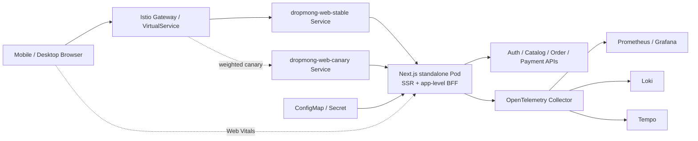

# 웹 애플리케이션 배포·관측성·테스트 설계

## 기본 정보

- Web Application ID: `WEB.A.03`
- 프로젝트: DropMong
- 기준 요구사항: [REQ.A.08 반응형 웹 애플리케이션](../00-requirements/REQ_A_08_web_application.md)
- 기준 클러스터 요구사항: [REQ.A.06 쿠버네티스 클러스터 아키텍처](../00-requirements/REQ_A_06_kubernetes_cluster_architecture.md)
- 대상 런타임: Next.js standalone Node.js server와 같은 프로세스의 애플리케이션 수준 BFF
- 배포 프로필: `local`, `private-dev`, `aws-dev`
- 설계 범위: Docker image, Kubernetes workload와 network, 설정·비밀 값, health probe, HPA, OpenTelemetry, 구조화 로그, Web Vitals, SLO, 카나리·롤백, Playwright, 시연 점검
- 제외 범위: 페이지별 업무 기능, 도메인 서비스 배포, PWA·네이티브 앱, BFF 전용 업무 DB, 실제 클라우드 계정과 secret 값

## 설계 원칙

1. Next.js 화면과 애플리케이션 수준 BFF는 하나의 image와 Pod로 배포한다.
2. 같은 image digest를 모든 환경에서 사용하고 환경 차이는 ConfigMap과 Secret으로 주입한다.
3. browser-facing route와 내부 서비스 호출은 `request_id`, `trace_id`, app version으로 연결한다.
4. probe는 프로세스의 생존과 요청 수신 가능 여부를 판단하며 모든 하위 서비스 장애를 Pod 장애로 확대하지 않는다.
5. 배포 판정은 Pod 기동 성공뿐 아니라 HTTP 오류율, 지연, Web Vitals와 synthetic test를 함께 사용한다.
6. 즉시 중단은 Rollout controller가 수행하고, GitOps desired state는 안정 image로 되돌려 복구 상태를 고정한다.

## 배포 아키텍처

### 요청 경계

- `/`, 정적 자산과 페이지 route는 Next.js가 제공한다.
- `/api/web/*`는 browser 전용 BFF route다. 서버 세션을 확인하고 내부 서비스의 DNS 주소를 사용한다.
- `/health/*`는 Kubernetes probe와 배포 검증에만 사용하며 인증 cookie나 하위 서비스 데이터를 반환하지 않는다.
- Istio Gateway는 TLS 종료, host/path routing, 카나리 가중치와 외부 rate limit을 담당한다.
- BFF는 화면용 조합과 세션 변환을 담당하고, Istio나 도메인 서비스의 권한과 업무 규칙을 복제하지 않는다.

## Next.js standalone image

### 빌드 기준

- `next.config`의 `output: "standalone"`을 사용한다.
- multi-stage Docker build를 `dependencies -> build -> runtime` 단계로 나눈다.
- runtime image에는 `.next/standalone`, `.next/static`, `public`과 필요한 production artifact만 복사한다.
- build 단계는 lockfile 고정 설치, lint, type check, unit test와 production build를 통과해야 한다.
- image tag는 사람이 읽는 버전과 immutable `git sha`를 함께 기록하고 배포 manifest는 digest 또는 sha tag를 사용한다.
- `NEXT_PUBLIC_*`에는 공개 가능한 값만 넣는다. 내부 서비스 주소, session key, token과 OTLP 인증 header는 build argument로 전달하지 않는다.

### Runtime 기준

| 항목 | 기준 |
| --- | --- |
| 프로세스 | `node server.js`, `NODE_ENV=production`, port `3000` |
| 사용자 | 고정된 비특권 UID/GID, `runAsNonRoot: true` |
| 파일 시스템 | `readOnlyRootFilesystem: true`, 필요한 `/tmp`만 `emptyDir`로 제공 |
| Linux 권한 | `allowPrivilegeEscalation: false`, capabilities 전체 drop, `seccompProfile: RuntimeDefault` |
| 종료 | `SIGTERM` 수신 후 신규 요청을 중단하고 진행 요청을 마친 뒤 종료 |
| 정적 자산 | content hash 기반 immutable cache, HTML과 인증 응답은 private/no-store 정책 적용 |
| source map | 브라우저 공개 금지, 오류 분석 저장소에 필요한 artifact만 별도 업로드 |

## Kubernetes 리소스

### 리소스 목록

| 리소스 | 이름 예시 | 책임 |
| --- | --- | --- |
| Deployment | `dropmong-web` | local/private-dev의 기본 workload, rolling update와 Pod template 소유 |
| Rollout | `dropmong-web` | aws-dev 카나리 overlay에서 Deployment를 대신하고 같은 Pod template 사용 |
| Service | `dropmong-web`, `dropmong-web-stable`, `dropmong-web-canary` | ClusterIP `3000` 제공, 일반/카나리 프로필별 선택 |
| Gateway/VirtualService | `dropmong-web` | public host, TLS, `/` routing, stable/canary 가중치 소유 |
| ConfigMap | `dropmong-web-config` | 환경명, origin, 내부 base URL, 기능·telemetry 설정 |
| Secret | `dropmong-web-secret` | session·CSRF key, 내부 호출 자격 증명, OTLP 인증 값 |
| ServiceAccount | `dropmong-web` | 최소 Kubernetes 권한과 workload identity 연결 |
| HPA | `dropmong-web` | CPU와 active request 기준 replica 조정 |
| PodDisruptionBudget | `dropmong-web` | 다중 replica 환경에서 최소 가용 Pod 보호 |
| ServiceMonitor/OTel 설정 | `dropmong-web` | server metric 수집과 OTLP export 연결 |

### Deployment 기준

- 일반 Deployment는 `maxUnavailable: 0`, `maxSurge: 1`로 시작한다.
- `minReadySeconds`와 readiness probe를 통과한 Pod만 가용 replica로 계산한다.
- `terminationGracePeriodSeconds`는 초기 `30s`로 두고 가장 긴 정상 BFF timeout보다 길게 유지한다.
- `preStop` 또는 애플리케이션 drain으로 endpoint 제거 뒤 진행 요청을 마친다.
- `topologySpreadConstraints`로 가용 영역 또는 node에 replica를 분산하고, 단일 replica인 local에서는 완화한다.
- Pod template에는 `app.kubernetes.io/name`, `app.kubernetes.io/version`, environment, rollout revision label을 넣는다.

### Service와 Gateway 기준

- Service는 session affinity에 의존하지 않는다. 세션 진실은 Auth/server session 계층에 있고 Pod memory에만 저장하지 않는다.
- 외부 host는 Gateway에만 선언하고 내부 서비스 주소는 browser bundle에 노출하지 않는다.
- `/api/web/*`와 page route는 같은 origin을 사용해 cookie와 CSRF 경계를 단순하게 유지한다.
- Gateway timeout은 BFF와 하위 서비스 timeout보다 길게 두되 무제한 대기를 허용하지 않는다.
- 카나리 프로필은 stable/canary Service를 분리하고 VirtualService 가중치는 Rollout controller만 변경한다.

## ConfigMap과 Secret

### ConfigMap 계약

| Key | 용도 | 예시/기준 |
| --- | --- | --- |
| `APP_ENV` | 환경 식별 | `local`, `private-dev`, `aws-dev` |
| `APP_ORIGIN` | cookie·Origin·redirect allowlist 기준 | 환경별 HTTPS origin |
| `AUTH_INTERNAL_BASE_URL` | Auth 내부 API | Kubernetes service DNS |
| `CATALOG_INTERNAL_BASE_URL` | Catalog 내부 API | Kubernetes service DNS |
| `ORDER_INTERNAL_BASE_URL` | Order 내부 API | Kubernetes service DNS |
| `PAYMENT_INTERNAL_BASE_URL` | Payment 내부 API | Kubernetes service DNS |
| `OTEL_EXPORTER_OTLP_ENDPOINT` | OTel Collector endpoint | namespace 내부 주소 |
| `OTEL_RESOURCE_ATTRIBUTES` | environment, version 보강 | Pod fieldRef와 결합 |
| `WEB_VITALS_SAMPLE_RATE` | browser metric 표본 비율 | `0.0`~`1.0`, 환경별 설정 |
| `FEATURE_*` | UI 노출과 안전한 단계 적용 | 기본값과 소유자 명시 |

### Secret 계약

| Key | 용도 | 취급 기준 |
| --- | --- | --- |
| `SESSION_COOKIE_SECRET` | 서버 cookie 무결성·암호화 | 최소 길이 검증, 주기적 rotation |
| `CSRF_SECRET` | unsafe method token 검증 | session version과 함께 rotation |
| `BFF_INTERNAL_CREDENTIAL` | 허용된 내부 context 생성 또는 교환 | 짧은 수명 또는 workload identity 우선 |
| `OTEL_EXPORTER_OTLP_HEADERS` | 외부 collector 인증이 필요한 환경 | 로그 출력 금지 |

- 필수 설정과 Secret이 없거나 형식이 잘못되면 애플리케이션은 명확한 오류와 함께 시작 실패한다.
- Secret 원문은 startup log, health response, error page와 telemetry attribute에 포함하지 않는다.
- Secret 변경 시 checksum annotation 또는 secret reloader로 새 Pod를 만들고 구·신 key를 함께 허용하는 rotation 기간을 둔다.
- `NEXT_PUBLIC_*`와 ConfigMap을 혼동하지 않도록 browser 공개 여부를 key별로 검토한다.

## Health와 lifecycle

| Endpoint | 대상 probe | 성공 기준 | 하위 서비스 호출 |
| --- | --- | --- | --- |
| `/health/startup` | startupProbe | 설정 parsing, session crypto, telemetry 초기화 완료 | 없음 |
| `/health/live` | livenessProbe | event loop와 HTTP server가 응답 가능 | 없음 |
| `/health/ready` | readinessProbe | 신규 요청 수락 상태, drain 아님, 필수 local 초기화 완료 | 없음 |

- startupProbe 초기값은 `periodSeconds: 2`, `failureThreshold: 30`으로 최대 60초 기동 시간을 허용한다.
- readinessProbe 초기값은 `periodSeconds: 5`, `failureThreshold: 3`으로 두고 실패한 Pod를 Service endpoint에서 제거한다.
- livenessProbe 초기값은 `periodSeconds: 10`, `failureThreshold: 3`으로 두며 일시적인 하위 서비스 장애로 재시작하지 않는다.
- Auth나 Catalog 장애는 readiness 실패가 아니라 BFF dependency 지표와 제한 응답으로 드러낸다.
- 종료 중에는 readiness를 먼저 실패시키고, 진행 요청 종료 뒤 프로세스를 끝낸다.

## Resource와 HPA

### 초기 resource profile

| 항목 | requests | limits | 비고 |
| --- | --- | --- | --- |
| CPU | `100m` | `1000m` | SSR·BFF 부하 테스트 뒤 조정 |
| Memory | `256Mi` | `512Mi` | heap, standalone artifact, telemetry 포함 측정 |
| ephemeral storage | `128Mi` | `512Mi` | `/tmp`와 runtime cache 상한 |

### 환경별 replica와 HPA

| 환경 | 기본 replica | HPA | 초기 기준 |
| --- | ---: | --- | --- |
| `local` | 1 | 사용하지 않음 | 개발자 자원 절약, 단일 Pod 검증 |
| `private-dev` | 1 | min 1 / max 3 | CPU 70%, memory 75% |
| `aws-dev` | 2 | min 2 / max 10 | CPU 60%, memory 70%, active requests metric 추가 |

- CPU는 기본 scaling signal로 사용하고 `http.server.active_requests` 또는 동시 SSR 요청 지표가 안정되면 custom metric을 함께 사용한다.
- p95 latency는 HPA의 직접 신호보다 canary와 alert 판정에 사용한다. 지연만으로 급격히 scale해 하위 서비스를 압박하지 않는다.
- scale-up은 빠르게, scale-down은 안정화 기간을 두고 수행하며 Pod startup 시간보다 짧은 진동을 피한다.
- replica당 RPS, event-loop lag, heap 사용률과 OOM 여부를 부하 테스트로 확인한 뒤 값 변경 근거를 기록한다.

## OpenTelemetry와 구조화 로그

### Server telemetry

- Next.js instrumentation 초기화에서 OTel Node SDK를 애플리케이션 module보다 먼저 시작한다.
- resource에는 `service.name=dropmong-web`, `service.version`, `deployment.environment`, `k8s.namespace.name`, `k8s.pod.name`을 넣는다.
- W3C `traceparent`와 `tracestate`를 수신하고 BFF의 모든 하위 HTTP 호출에 전달한다.
- SSR route, BFF handler, session 검증, 하위 fetch를 span으로 구분하되 URL의 실제 ID 대신 route template을 사용한다.
- timeout, 취소, 하위 오류 code와 retry 횟수를 span에 기록하고 cookie, token, 이메일, 휴대폰, 주소, request body는 제외한다.
- 정상 요청은 parent-based sampling을 적용하고 오류·카나리 요청의 상세 보존은 Collector의 tail sampling 정책으로 높인다.

### 구조화 로그 계약

| 필드 | 설명 |
| --- | --- |
| `timestamp`, `level`, `message` | 기본 로그 정보 |
| `service`, `version`, `environment`, `pod` | 실행 artifact와 위치 |
| `request_id`, `trace_id`, `span_id` | 요청·trace 상관관계 |
| `route`, `method`, `status`, `duration_ms` | 실제 ID를 제거한 HTTP 결과 |
| `session_present`, `actor_type` | 세션 존재와 역할 범주, 사용자 식별값 제외 |
| `downstream_service`, `downstream_status` | 하위 호출 결과 |
| `error_code`, `retryable` | 정규화된 실패 의미 |

- 한 요청의 access log는 완료 시 한 번 기록하고 중간 진단 로그는 같은 request/trace id를 사용한다.
- 오류 객체의 stack은 server log에만 제한적으로 남기고 browser 응답에는 요청 식별자와 공개 오류 code만 제공한다.
- 로그 수집 실패가 사용자 요청을 실패시키지 않도록 stdout JSON 출력과 agent 수집을 기본으로 한다.

## Web Vitals와 client telemetry

- Next.js의 Web Vitals hook에서 LCP, INP, CLS, FCP, TTFB를 수집한다.
- browser는 같은 origin의 `/api/web/telemetry/vitals`에 metric name, value, rating, navigation type, route template, app version, viewport class를 전송한다.
- 모바일과 데스크톱을 분리하고 p75를 산출한다. 실제 URL, query, 사용자 ID와 DOM text는 보내지 않는다.
- 중복 전송 방지를 위해 metric id를 사용하고 page hide 시 `sendBeacon` 또는 동등한 비차단 전송을 사용한다.
- `WEB_VITALS_SAMPLE_RATE`를 환경별로 적용하며 synthetic test에는 별도 label을 넣어 실제 사용자 표본과 분리한다.
- client error는 공개 오류 code, route template, version, request id만 수집하고 form 값과 server stack을 포함하지 않는다.

## SLI와 SLO

초기 목표는 부하 테스트와 실제 dev 측정으로 보정한다. 카나리 판정에서는 절대 기준과 안정 버전 대비 악화를 함께 본다.

| SLO | SLI | 초기 목표 | 측정 창 |
| --- | --- | --- | --- |
| 웹 가용성 | 전체 유효 요청 중 `5xx`가 아닌 응답 비율 | `99.9%` 이상 | rolling 30d, demo는 10분 창 병행 |
| BFF 오류율 | `/api/web/*` 전체 중 `5xx` 비율 | `1%` 미만 | 5분·30분 |
| BFF 응답 지연 | `/api/web/*` server duration p95 | `800ms` 이하 | 5분·30분 |
| BFF 자체 지연 | 전체 span에서 하위 대기 시간을 뺀 app processing p95 | `150ms` 이하 | 30분 |
| 모바일 LCP | 실제 사용자 모바일 LCP p75 | `2.5s` 이하 | 24h·7d |
| 데스크톱 LCP | 실제 사용자 데스크톱 LCP p75 | `2.5s` 이하 | 24h·7d |
| INP | 모바일·데스크톱 INP p75 | `200ms` 이하 | 24h·7d |
| CLS | 모바일·데스크톱 CLS p75 | `0.1` 이하 | 24h·7d |

### 대시보드와 알림

| 감시 대상 | 대시보드 | 경고 조건 예시 |
| --- | --- | --- |
| HTTP | RPS, 4xx/5xx, p50/p95/p99, route별 결과 | 5분 `5xx > 1%` |
| BFF dependency | 서비스별 호출량, 지연, timeout, circuit 상태 | timeout 또는 `5xx`가 안정 구간 대비 2배 |
| Node.js | CPU, memory, heap, event-loop lag, active requests | heap 85%, event-loop lag 지속 |
| Kubernetes | ready replica, restart, OOM, HPA replica, saturation | ready replica 0, 반복 restart |
| Web Vitals | viewport별 LCP/INP/CLS p75와 app version | good 기준 위반이 두 집계 창 지속 |
| Rollout | stable/canary version, traffic weight, analysis result | analysis 실패 또는 진행 정지 |

## Canary와 rollback

### 배포 단계

1. CI가 동일한 standalone image를 build·검증하고 immutable sha를 registry에 push한다.
2. GitOps 변경으로 aws-dev Rollout의 image sha를 갱신한다.
3. 새 Pod가 startup/readiness와 standalone smoke test를 통과한다.
4. Istio 가중치를 `10% -> 50% -> 100%`로 높이고 각 단계에서 최소 두 개의 metric 집계 창을 관찰한다.
5. HTTP 오류율, p95, restart, synthetic Playwright 결과를 분석한 뒤 다음 단계로 진행한다.
6. 100% 전환 뒤 안정 관찰 시간을 통과하면 stable revision으로 승격한다.

### 자동 중단 기준

- canary `5xx`가 2개 연속 5분 창에서 `1%`를 넘거나 stable 대비 2배 이상이다.
- canary `/api/web/*` p95가 `1s`를 넘거나 stable 대비 20% 이상 나빠진다.
- readiness 실패, OOM 또는 restart가 반복된다.
- 공개 탐색, 로그인 게이트, 보호 페이지 확인 synthetic test 중 하나가 실패한다.
- session cookie나 정적 자산이 stable/canary 사이에서 호환되지 않는다.

### 롤백 절차

1. Rollout을 abort해 stable Service의 traffic을 즉시 100%로 되돌린다.
2. 오류율, ready replica와 synthetic test가 안정 기준으로 회복했는지 확인한다.
3. GitOps 저장소의 image sha를 직전 안정 version으로 되돌려 desired state를 고정한다.
4. 실패 version, analysis 결과, trace/log link, 영향 시간과 복구 시간을 배포 기록에 남긴다.
5. 원인이 API 호환성이나 설정이면 재배포 전에 계약·Config validation test를 추가한다.

## Playwright 테스트

### Browser와 viewport matrix

| Project | Browser | Viewport/device | 목적 |
| --- | --- | --- | --- |
| `mobile-chromium` | Chromium | `390x844`, touch | Android 계열 핵심 사용자 시나리오 |
| `mobile-webkit` | WebKit | `390x844`, touch | iOS Safari 계열 session·layout |
| `tablet-chromium` | Chromium | `768x1024` | breakpoint와 업무 표 제한 상태 |
| `desktop-chromium` | Chromium | `1440x900` | 구매자·판매자·운영자 desktop 경로 |
| `desktop-firefox` | Firefox | `1440x900` | browser 호환성 회귀 |

### 필수 테스트 묶음

| 묶음 | 검증 내용 |
| --- | --- |
| 공개 접근 | 비회원 공개 route `200`, 보호 API를 호출하지 않는 기본 렌더링 |
| 로그인 게이트 | 보호 route 이동, 안전한 내부 return target 보존, 외부 redirect 거부 |
| 서버 세션 | HttpOnly/Secure/SameSite cookie, browser storage에 token 없음, logout 뒤 재사용 거부 |
| 역할 접근 | 구매자·판매자·운영자 route 허용/거부, 숨긴 메뉴와 직접 URL 접근 결과 일치 |
| BFF 계약 | request id와 공개 오류 code, timeout, `401/403/409/429/503` 정규화, trace header 전파 |
| 반응형 | 네 viewport에서 겹침·잘림·페이지 가로 스크롤 없음, 넓은 표의 내부 스크롤 |
| 접근성 | keyboard 순서, focus, landmark, label, contrast, 오류 안내, 자동 axe 검사 |
| 부분 장애 | 선택적 개인화·하위 서비스 실패가 공개 페이지 전체 실패로 확대되지 않음 |
| 배포 smoke | version endpoint/label, health, 정적 자산, BFF 최소 한 건 |
| 카나리 synthetic | stable/canary 양쪽에서 공개 접근, 로그인 게이트, 보호 페이지 상태 확인 |

### 실행 단계

1. Pull Request에서 lint, type check, unit/component test, production build와 mock API 기반 Playwright를 실행한다.
2. image build 뒤 standalone container를 실행해 health, 정적 자산과 BFF smoke test를 수행한다.
3. private-dev 배포 뒤 실제 Gateway를 통해 browser matrix와 접근성 test를 실행한다.
4. aws-dev canary 단계마다 짧은 synthetic 묶음을 실행하고 결과를 Rollout analysis에 전달한다.
5. 실패 시 Playwright trace, screenshot, video와 server request id를 보관하되 HAR과 artifact의 cookie·개인 정보를 제거한다.

## KT 클라우드 네이티브 시연 점검표

### 사전 준비

- [ ] Git sha, image digest, Helm/GitOps revision과 현재 stable version을 기록했다.
- [ ] `local`, `private-dev`, `aws-dev` 중 시연 환경의 Gateway host와 TLS가 정상이다.
- [ ] 공개 사용자, 구매자, 판매자/운영자 test session과 시연용 데이터가 준비됐다.
- [ ] Grafana에서 웹·BFF·Pod·Web Vitals·Rollout 대시보드를 한 번에 열 수 있다.
- [ ] Loki와 Tempo에서 같은 request/trace id를 조회할 수 있다.
- [ ] stable과 의도적 오류 canary image, 자동 중단 기준, 수동 abort 권한을 확인했다.
- [ ] Playwright synthetic와 부하 발생 도구가 시연 환경을 가리킨다.

### 시연 순서

- [ ] 모바일과 데스크톱 viewport에서 같은 공개 페이지와 핵심 작업이 반응형으로 동작한다.
- [ ] 비회원 공개 접근, 보호 route 로그인 이동, 로그인 후 내부 위치 복귀를 보여준다.
- [ ] browser storage에 token이 없고 HttpOnly server session으로 BFF를 호출함을 확인한다.
- [ ] BFF 요청 하나의 request id를 화면 오류 정보, JSON log, OTel trace와 하위 서비스 span에서 연결한다.
- [ ] 정상 traffic에서 RPS, p95, 오류율, replica와 모바일/데스크톱 Web Vitals를 확인한다.
- [ ] 새 image를 10% canary로 배포하고 stable/canary version과 Istio traffic 비율을 확인한다.
- [ ] 의도적 `5xx` 또는 지연을 발생시켜 Rollout analysis 실패와 traffic의 stable 복귀를 확인한다.
- [ ] GitOps desired state를 안정 sha로 되돌리고 ready replica, synthetic test와 SLO 지표 회복을 확인한다.
- [ ] 배포 전후 version, 실패 지표, trace/log, 롤백 시간과 교훈을 시연 기록에 남긴다.

### 완료 증거

- [ ] Next.js standalone image가 non-root·read-only 기준으로 실행된다.
- [ ] Deployment/Service/Gateway, ConfigMap/Secret, health probe와 HPA manifest가 환경별로 render된다.
- [ ] OpenTelemetry trace, 구조화 로그, server metric과 Web Vitals가 version·environment 기준으로 조회된다.
- [ ] Playwright mobile/desktop 핵심 묶음과 접근성 검사가 통과한다.
- [ ] 카나리 10%·50%·100% 또는 의도적 실패 후 rollback 중 하나를 재현 가능한 절차로 시연했다.
- [ ] 오류 주입부터 alert/analysis, rollback, 정상 확인까지의 증거가 하나의 케이스 스터디로 남는다.

## 연관 태그

🏷️ 요구사항 참조: [REQ.A.08](../00-requirements/REQ_A_08_web_application.md), [REQ.A.05](../00-requirements/REQ_A_05_auth_member.md), [REQ.A.06](../00-requirements/REQ_A_06_kubernetes_cluster_architecture.md) | 페이지 참조: [사이트맵 인덱스](../10-sitemap/README.md) | UI 참조: [UI 인덱스](../20-ui/README.md) | 서비스 참조: [서비스 상세 설계](../50-service-design/README.md), [SD.A.30030](../50-service-design/A_300_auth/A_300_30-service/README.md) | API 참조: [SD.A.30040](../50-service-design/A_300_auth/A_300_40-api/README.md)

## 열린 질문

- 실제 web workload는 하나의 chart에서 Deployment와 Rollout을 profile별로 선택할지, Rollout으로 통일할지 결정한다.
- HPA의 replica당 active request 목표와 event-loop lag를 custom metric으로 사용할 최소 표본을 확정한다.
- OTel Collector의 head/tail sampling 비율과 로그·trace 보관 기간을 환경별로 어떻게 둘 것인가?
- Web Vitals endpoint를 자체 수집할지 별도 RUM backend로 보낼지 결정한다.
- 카나리 분석에서 실제 사용자 traffic과 synthetic traffic의 최소 건수를 어떻게 보장할 것인가?

## 확인 필요

- 실제 Next.js/Node.js 버전의 standalone artifact와 health route 동작
- Helm chart의 workload kind, stable/canary Service와 Istio VirtualService template
- Secret 공급 방식과 session key rotation 절차
- OTel metric·log·trace exporter endpoint와 인증 방식
- Playwright CI image, browser cache와 artifact 보관 정책
- k6 또는 동등한 도구로 측정한 replica당 RPS, memory, event-loop lag와 autoscaling 반응 시간

## 참고 자료

- [Next.js standalone output](https://nextjs.org/docs/app/api-reference/config/next-config-js/output)
- [Kubernetes liveness, readiness, startup probe](https://kubernetes.io/docs/concepts/workloads/pods/probes/)
- [Kubernetes Horizontal Pod Autoscaling](https://kubernetes.io/docs/concepts/workloads/autoscaling/horizontal-pod-autoscale/)
