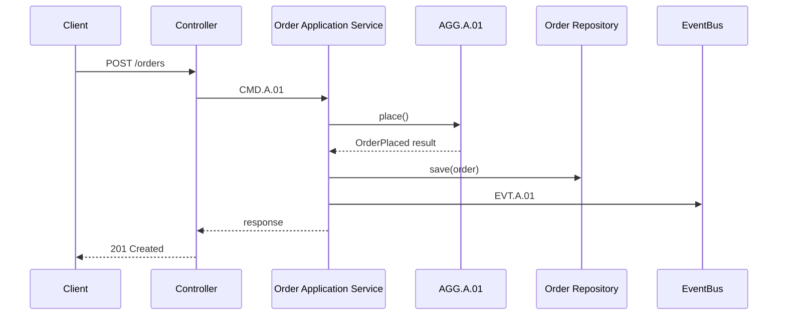

# 주문 생성 API와 시퀀스

## 기본 정보

- API ID: `API.A.01`
- Method: `POST`
- Path: `/orders`
- API 유형: Command
- 인증: 로그인 필요
- 권한: 본인 장바구니만 주문 가능
- 멱등성: `Idempotency-Key` 헤더 기준

## 연관 태그

🏷️ 플로우 참조: FLOW.A.01 | 서비스 참조: [SVC.A.01](../../60-service/.examples/SVC_A_01_order_service.md) | 영속성 참조: [PST.A.01](../../55-persistence/.examples/PST_A_01_order_persistence.md) | UC 참조: [UC.A.01](../../30-uc/.examples/UC_A_01_place_order.md) | 시나리오 참조: [SCN.A.01](../../80-scenario/.examples/SCN_A_01_place_order.md) | UI 참조: [UI.A.01](../../20-ui/.examples/UI_A_01_order_checkout_wireframe.md) | 도메인 참조: [AGG.A.01](../../50-domain-model/.examples/AGG_A_01_order.md) | BC 참조: [BC.A.01](../../40-event-storming-bounded-context/.examples/BC_A_01_order.md)

## 요청

```json
{
  "cartId": "7d4a8f2c-5e14-46be-9b9b-987f5d69e001",
  "shippingAddressId": "b08f06f5-2b4f-4c16-8a29-66d682d28a11",
  "couponId": "c1f2d3e4-1111-2222-3333-444455556666",
  "expectedTotalAmount": 42000
}
```

## 응답

```json
{
  "orderId": "0fd7ec65-bb7e-4c58-a92a-9b7b8a31e001",
  "orderNumber": "ORD-20260706-0001",
  "status": "PAYMENT_PENDING",
  "totalAmount": 42000
}
```

## 오류

| Error ID | HTTP Status | 조건 | 사용자 메시지 |
| --- | --- | --- | --- |
| `ERR.A.01` | 409 | 주문 상품 품절 | 품절된 상품이 있어 주문할 수 없습니다. |
| `ERR.A.02` | 409 | 서버 계산 금액과 기대 금액 불일치 | 상품 금액이 변경되었습니다. 다시 확인해주세요. |
| `ERR.A.03` | 409 | 쿠폰 만료 | 사용할 수 없는 쿠폰입니다. |

## API 시퀀스



## 도메인 매핑

- Command: `CMD.A.01`
- Aggregate: [AGG.A.01](../../50-domain-model/.examples/AGG_A_01_order.md)
- Event: `EVT.A.01`
- Read Model: `RM.A.01`
