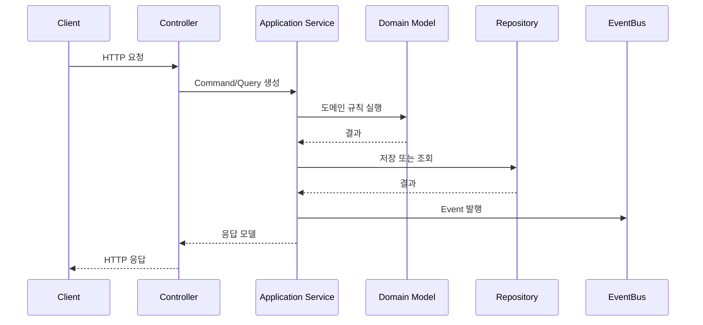

# API 엔드포인트와 시퀀스 이름

## 기본 정보

- API ID: `API.A.XX`
- Method:
- Path:
- API 유형: Command | Query
- 인증:
- 권한:
- 멱등성:

## 연관 태그

🏷️ 플로우 참조: FLOW.A.XX | 서비스 참조: [SVC.A.XX](../60-service/SVC_A_XX_name.md) | 영속성 참조: [PST.A.XX](../55-persistence/PST_A_XX_name.md) | UC 참조: [UC.A.XX](../30-uc/UC_A_XX_name.md) | 시나리오 참조: [SCN.A.XX](../80-scenario/SCN_A_XX_name.md) | UI 참조: [UI.A.XX](../20-ui/UI_A_XX_name.md) | 도메인 참조: [AGG.A.XX](../50-domain-model/AGG_A_XX_name.md) | BC 참조: [BC.A.XX](../40-event-storming-bounded-context/BC_A_XX_name.md)

## 요청

```json
{
  "example": "value"
}
```

## 응답

```json
{
  "example": "value"
}
```

## 오류

| Error ID | HTTP Status | 조건 | 사용자 메시지 |
| --- | --- | --- | --- |
| `ERR.A.XX` | 400 |  |  |

## API 시퀀스



## 도메인 매핑

- Command:
- Query:
- Aggregate:
- Entity:
- Event:
- Read Model:

## 검증 규칙

-

## 관측성

- 로그:
- 메트릭:
- 트레이스:

## 확인 필요

-
