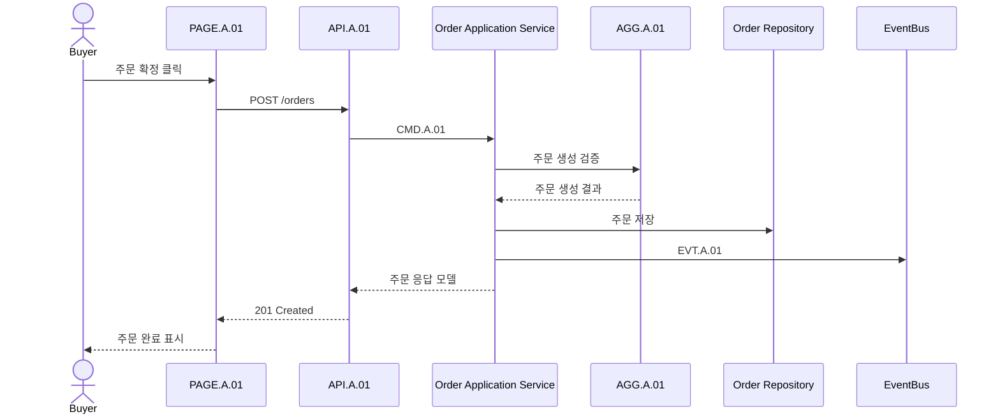

# 주문 생성 시나리오

## 기본 정보

- Scenario ID: `SCN.A.01`
- 시작 지점: [PAGE.A.01](../../10-sitemap/.examples/PAGE_A_01_order_checkout.md)
- 트리거: 구매자가 주문 확정 버튼을 누른다.
- 성공 기준: 주문이 생성되고 `EVT.A.01`가 발행된다.

## 연관 태그

🏷️ 플로우 참조: FLOW.A.01 | UC 참조: [UC.A.01](../../30-uc/.examples/UC_A_01_place_order.md) | 영속성 참조: [PST.A.01](../../55-persistence/.examples/PST_A_01_order_persistence.md) | 서비스 참조: [SVC.A.01](../../60-service/.examples/SVC_A_01_order_service.md) | API 참조: [API.A.01](../../70-api/.examples/API_A_01_place_order.md) | UI 참조: [UI.A.01](../../20-ui/.examples/UI_A_01_order_checkout_wireframe.md) | 페이지 참조: [PAGE.A.01](../../10-sitemap/.examples/PAGE_A_01_order_checkout.md) | 도메인 참조: [AGG.A.01](../../50-domain-model/.examples/AGG_A_01_order.md)

## 처리 과정

## 데이터 이동

- 입력: 장바구니 ID, 배송지 ID, 쿠폰 ID, idempotency key.
- 출력: 주문 ID, 주문 번호, 최종 금액, 주문 상태.
- 저장: 주문, 주문 라인, 가격 스냅샷.
- 발행 Event: `EVT.A.01`

## 예외 흐름

- 상품 품절이면 주문을 생성하지 않고 `ERR.A.01`을 반환한다.
- 가격이 변경되었으면 최신 금액을 내려주고 재확인을 요구한다.
