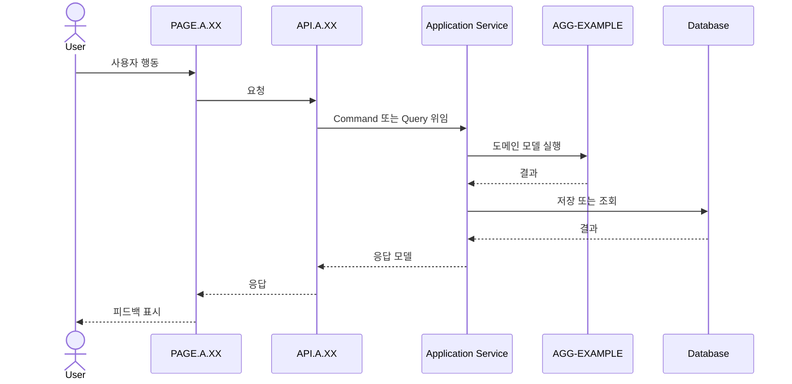

# 처리 시퀀스 이름

## 기본 정보

- Scenario ID: `SCN.A.XX`
- 시작 지점:
- 트리거:
- 성공 기준:
- 실패 기준:

## 연관 문서

🏷️ 플로우 참조: FLOW.A.XX | UC 참조: [UC.A.XX](../../30-uc/UC_A_XX_name.md) | 영속성 참조: [PST.A.XX](../../50-service-design/A_XX_name/A_XX_20-persistence/README.md) | 서비스 참조: [SVC.A.XX](../../50-service-design/A_XX_name/A_XX_30-service/README.md) | API 참조: [API.A.XX](../../50-service-design/A_XX_name/A_XX_40-api/README.md) | UI 참조: [UI.A.XX](../../20-ui/UI_A_XX_name.md) | 페이지 참조: [PAGE.A.XX](../../10-sitemap/PAGE_A_XX_name.md) | 도메인 참조: [AGG.A.XX](../../50-service-design/A_XX_name/A_XX_10-domain-model/README.md)

## 처리 과정

## 단계 설명

| 단계 | 주체 | 설명 | 관련 식별자 |
| --- | --- | --- | --- |
| 1 | User |  |  |
| 2 | Page |  |  |
| 3 | API |  |  |

## 데이터 이동

- 입력:
- 출력:
- 저장:
- 발행 Event:

## 예외 처리

-

## 확인 필요

-
