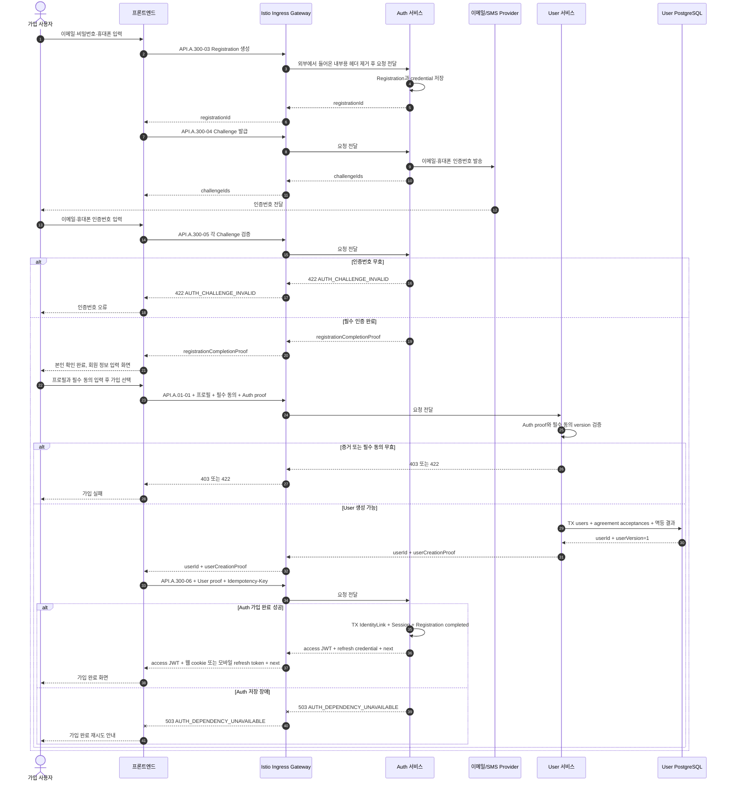

# 회원가입과 자동 로그인 시퀀스

## 기본 정보

- Scenario ID: `SCN.A.01-01`
- 시작 지점: 비회원이 인증 화면에서 이메일·비밀번호·휴대폰을 입력한다.
- 성공 기준: 프론트엔드가 Auth 검증, User 생성과 Auth 가입 완료를 차례로 호출하고 access JWT와 채널별 refresh credential을 받는다.
- 실패 기준: 한 단계라도 실패하면 Session credential을 반환하지 않는다. 같은 `registrationId`와 멱등 키로 실패한 단계부터 재시도한다.

## 연관 문서

- [통합 User 모델](../../50-service-design/A_01_user/A_01_10-domain-model/README.md)
- [User 멱등성과 실패 처리](../../50-service-design/A_01_user/A_01_20-persistence/reliability-and-events.md)
- [가입과 계정 Handler](../../50-service-design/A_01_user/A_01_30-service/registration-account-handlers.md)
- [API.A.01-01 User 생성](../../50-service-design/A_01_user/A_01_40-api/API_A_01_01_create_user.md)
- [Auth 도메인 모델](../../50-service-design/A_300_auth/A_300_10-domain-model/SD_A_30010_auth_domain_model.md)
- [Auth 서비스 설계](../../50-service-design/A_300_auth/A_300_30-service/README.md)
- [Auth API 공통 설계](../../50-service-design/A_300_auth/A_300_40-api/README.md)
- [JWT/JWKS/Istio 인증 처리 기준](../../50-service-design/A_300_auth/jwt-jwks-istio.md)

## 처리 시퀀스

## 단계 설명

| 단계 | 책임 | 계약 | 저장 경계 |
| --- | --- | --- | --- |
| 외부 요청 경계 | Ingress | TLS 종료, 라우팅, 요청 빈도 제한, 외부에서 들어온 내부용 헤더 제거 | 업무 데이터 저장 안 함 |
| 가입 자격 검증 | 프론트엔드, Auth | `API.A.300-03~05` | Auth가 credential과 검증 상태 저장 |
| 검증 완료 | 프론트엔드, Auth | `registrationCompletionProof` | User 생성에만 사용할 수 있는 단기 서명 proof 발급 |
| User 생성 | 프론트엔드, User | `API.A.01-01`, `CMD.A.01-17` | User, 필수 동의와 멱등 결과를 한 트랜잭션에 저장 |
| Auth 완료 | 프론트엔드, Auth | `API.A.300-06`, `userCreationProof` | IdentityLink·Session·Registration을 한 트랜잭션에 저장 |
| 응답 | Auth, 프론트엔드 | access JWT와 채널별 refresh credential | Auth 완료 뒤에만 전달 |

## Proof와 데이터 이동

| 구분 | 데이터 |
| --- | --- |
| 가입 시작 입력 | 이메일, 비밀번호, 휴대폰 |
| 검증 입력 | 이메일·휴대폰 인증번호 |
| Auth proof | registration ID, 검증 완료, audience, 발급·만료 시각, nonce, 서명 |
| User 생성 입력 | registration ID, Auth proof, 프로필, 필수 동의 code/version |
| User 저장 | User, agreement acceptance, `user_version=1`, 멱등 결과 |
| User proof | registration ID, user ID, user version, audience, 발급·만료 시각, nonce, 서명 |
| Auth 완료 입력 | user ID, User proof, registration ID, `Idempotency-Key` |
| 성공 응답 | access JWT, 웹 refresh cookie 또는 모바일 refresh token, 다음 화면 |

proof에는 이메일·휴대폰·비밀번호·인증번호·프로필·동의 원문을 넣지 않는다. 프론트엔드는 proof를 해석하거나 수정하지 않고 대상 서비스에 전달한다.

## 불변조건

- 프론트엔드는 Istio Ingress Gateway를 통해 Auth와 User의 공개 API를 직접 호출한다.
- Ingress는 가입 단계를 조정하거나 여러 서비스 응답을 합치지 않는다.
- Auth와 User는 서로 호출하지 않고 audience가 제한된 단기 proof로 결과를 전달한다.
- Auth는 `user_id`를 생성하지 않고 User가 발급한 값을 참조한다.
- 하나의 `registrationId`에는 하나의 `userId`만 연결된다.
- User는 Auth proof가 유효하고 필수 동의가 모두 있을 때만 생성한다.
- Auth는 User proof의 registration ID와 user ID가 요청과 일치할 때만 IdentityLink와 Session을 생성한다.
- Auth 가입 완료 전에는 access JWT와 refresh credential을 프론트엔드에 전달하지 않는다.
- 별도 가입 조정 Aggregate, Process Manager, Broker, 가입용 Inbox와 Outbox, 보상 Worker를 사용하지 않는다.
- 이메일·휴대폰·credential은 User 요청, User DB와 proof에 포함하지 않는다.

## 예외 처리

| 조건 | 처리 |
| --- | --- |
| 인증번호 오류 | User를 호출하지 않고 Auth 오류를 반환한다. |
| Auth proof 무효·만료 | User를 만들지 않고 `USER_REGISTRATION_PROOF_INVALID`를 반환한다. |
| 필수 동의 누락·version 불일치 | User를 만들지 않고 `USER_REQUIRED_AGREEMENT_INVALID`를 반환한다. |
| User 저장 실패 | User 트랜잭션을 롤백하고 같은 registration ID로 재시도한다. |
| User 응답 유실 | 같은 registration ID로 User 생성 요청을 다시 보내면 같은 user ID와 새 User proof를 반환한다. |
| Auth 완료 실패 | Session credential을 반환하지 않는다. 같은 `registrationId`와 `Idempotency-Key`로 Auth 완료를 재시도한다. |
| 같은 registration ID의 다른 프로필 | `USER_REGISTRATION_CONFLICT`로 거부한다. |
| User proof 무효·불일치 | IdentityLink와 Session을 만들지 않고 `AUTH_USER_CREATION_PROOF_INVALID`로 거부한다. |

## 검증 항목

- 두 Challenge가 모두 완료되기 전에는 `registrationCompletionProof`를 발급하지 않는다.
- User 생성 실패 시 `API.A.300-06`을 호출하지 않는다.
- 중복 가입 완료 요청에서 User, IdentityLink와 논리 Session이 각각 하나만 존재한다.
- Auth 완료 실패 시 프론트엔드가 access JWT와 refresh credential을 받지 않는다.
- 재시도에서 같은 user ID와 논리 Session을 반환한다.
- User DB와 로그에 이메일, 휴대폰, credential과 인증번호가 없는지 확인한다.
- User 생성과 Auth 완료 경로에 Broker, Inbox와 보상 Worker가 없는지 확인한다.
- 프론트엔드의 Auth·User 호출이 모두 Ingress를 거치는지 확인한다.
