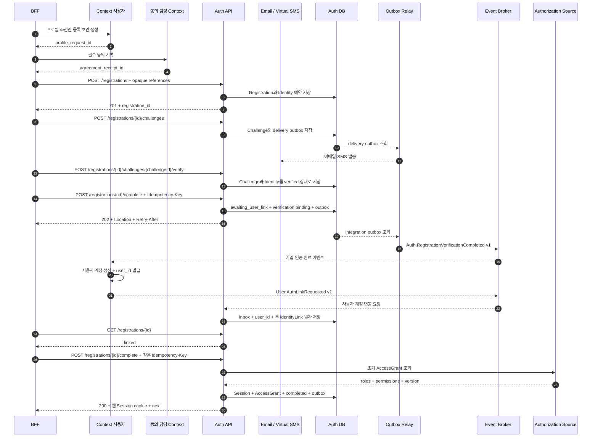

# 이메일 회원가입과 자동 로그인 시퀀스

## 기본 정보

- Scenario ID: `SCN.A.300-01`
- 시작 지점: `PAGE.A.301` 이메일 회원가입
- 트리거: 비회원이 프로필, 필수 동의, 이메일, 비밀번호와 휴대폰 번호를 입력하고 가입을 시작한다.
- 성공 기준: Context 사용자가 `user_id`를 생성하고 Auth가 두 IdentityLink를 연결한 뒤, 클라이언트의 완료 재요청에서 Session을 발급한다.
- 실패 기준: 식별자 검증 실패, 필수 소유 확인 미완료, 사용자 생성 거부, 계정 연동 기한 만료 또는 Session 전달 기한 만료.

## 연관 문서

- [REQ.A.05](../../00-requirements/REQ_A_05_auth_member.md)
- [UC.A.300](../../30-uc/UC_A_300_auth_member.md)
- [PAGE.A.300](../../10-sitemap/PAGE_A_300_auth_member/PAGE_A_300_auth_member.md)
- [UI.A.300](../../20-ui/UI_A_300_auth_member/UI_A_300_auth_member.md)
- [서비스 설계](../../50-service-design/A_300_auth/A_300_30-service/README.md)
- [API 공통 계약](../../50-service-design/A_300_auth/A_300_40-api/README.md)
- [API.A.300-03 이메일 회원가입 시작](../../50-service-design/A_300_auth/A_300_40-api/API_A_300_03_start_email_registration.md)
- [API.A.300-04 가입 Challenge 발급](../../50-service-design/A_300_auth/A_300_40-api/API_A_300_04_issue_registration_challenge.md)
- [API.A.300-05 가입 Challenge 검증](../../50-service-design/A_300_auth/A_300_40-api/API_A_300_05_verify_registration_challenge.md)
- [API.A.300-06 회원가입 완료](../../50-service-design/A_300_auth/A_300_40-api/API_A_300_06_complete_registration.md)
- [API.A.300-28 회원가입 상태 조회](../../50-service-design/A_300_auth/A_300_40-api/API_A_300_28_get_registration_status.md)

## 처리 과정

## 단계 설명

| 단계 | 책임 주체 | 핵심 규칙 | 관련 식별자 |
| --- | --- | --- | --- |
| 등록 준비 | Context 사용자, 동의 담당 Context | Auth에는 프로필·동의 원문 대신 opaque reference만 전달한다. | `profile_request_id`, `agreement_receipt_id` |
| 소유 확인 | Auth | 이메일과 휴대폰 Challenge를 각각 검증한다. | `API.A.300-04`, `API.A.300-05` |
| 완료 수락 | Auth | 최초 완료 요청은 Event를 저장하고 `202`를 반환한다. | `API.A.300-06`, `Auth.RegistrationVerificationCompleted` |
| 사용자 생성 | Context 사용자 | 사용자 계정과 `user_id`를 생성한 뒤 Auth에 연동을 요청한다. | `User.AuthLinkRequested` |
| Identity 연결 | Auth | binding과 멱등 키를 검증하고 두 Link를 같은 트랜잭션에서 활성화한다. | `IdentityLink`, `InboxEvent` |
| Session 발급 | 클라이언트, Auth | `linked` 확인 뒤 최초와 같은 key로 완료 요청을 재개한다. | `API.A.300-28`, `API.A.300-06` |

## 데이터 이동

- 입력: `profile_request_id`, `agreement_receipt_id`, 이메일, 비밀번호, 휴대폰 번호, AuthenticationIntent, Idempotency-Key.
- 출력: Registration 상태, `user_id`, Session 요약, 채널별 Session credential, 복귀 Intent.
- 저장: Registration, Identity, Challenge, verification binding, IdentityLink, Inbox/OutboxEvent, Session, AccessGrant.
- 발행 Event: `Auth.RegistrationVerificationCompleted`, `User.AuthLinkRequested`, 가입 완료·Session 발급 감사 Event.

## 불변 조건

- Auth는 `user_id`를 생성하거나 동기 발급 요청하지 않는다.
- Context 사용자의 연동 요청을 적용하기 전에는 IdentityLink와 Session을 만들지 않는다.
- 상태 조회와 비동기 Event consumer는 cookie, access token, refresh token을 발급하지 않는다.
- 최초 `202` 이후 완료 재요청은 같은 `Idempotency-Key`를 사용한다.

## 예외 처리

- Context 사용자가 업무 규칙으로 사용자 생성을 거부하면 binding이 확인된 `User.AuthLinkRejected`를 발행하고, Auth는 Link 없이 Registration을 `AUTH_USER_LINK_REJECTED`로 닫는다.
- 같은 `link_request_id`에 다른 `user_id`·binding·payload가 오거나, 같은 Registration에 다른 `link_request_id`가 오면 `AUTH_IDEMPOTENCY_CONFLICT`로 거부한다.
- 발행자가 잘못됐거나 causation·binding·Registration version이 일치하지 않는 Event는 Inbox를 `rejected`로 기록하고 보안 감사만 남긴다. 이 Event로 Registration 상태를 바꾸지 않는다.
- 연동 기한이 끝나면 `AUTH_USER_LINK_TIMEOUT`, 자동 로그인 전달 기한이 끝나면 `AUTH_SESSION_DELIVERY_EXPIRED`를 반환한다.
- Authorization Source 장애 시 `issuing_session`을 유지하고 같은 key 재요청에서 Session 발급 단계부터 재개한다.

## 검증 항목

- 중복 Event와 동일 `link_request_id`는 같은 연결 결과를 반환한다.
- 다른 완료 key는 두 번째 가입 완료 작업이나 Session을 만들지 않는다.
- 완료 응답 유실 후 같은 key로 요청해도 논리 Session은 하나만 존재한다.
