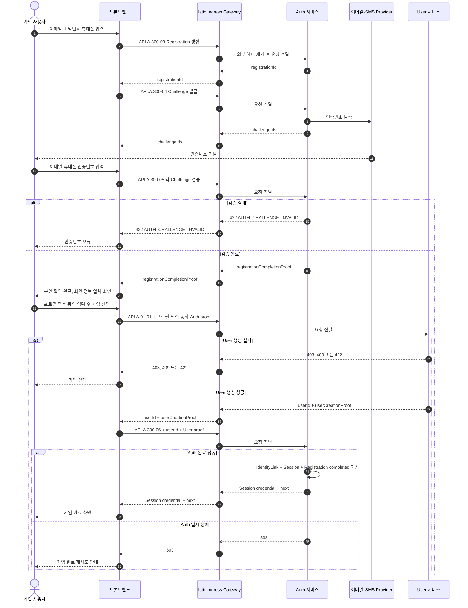

# 이메일 회원가입과 자동 로그인 시퀀스

## 기본 정보

- Scenario ID: `SCN.A.300-01`
- 시작 지점: 사용자가 프론트엔드에 가입 정보를 입력한다.
- 성공 기준: 프론트엔드가 Auth 검증, User 생성과 Auth 완료를 차례로 호출하고 Session을 받는다.
- 실패 기준: 검증·User 생성·Auth 완료 중 하나라도 실패하면 Session을 전달하지 않는다.

## 연관 문서

- [REQ.A.05](../../00-requirements/REQ_A_05_auth_member.md)
- [UC.A.300](../../30-uc/UC_A_300_auth_member.md)
- [Auth 서비스 설계](../../50-service-design/A_300_auth/README.md)
- [Auth API 공통 계약](../../50-service-design/A_300_auth/A_300_40-api/README.md)
- [API.A.300-03 회원가입 시작](../../50-service-design/A_300_auth/A_300_40-api/API_A_300_03_start_email_registration.md)
- [API.A.300-04 Challenge 발급](../../50-service-design/A_300_auth/A_300_40-api/API_A_300_04_issue_registration_challenge.md)
- [API.A.300-05 Challenge 검증](../../50-service-design/A_300_auth/A_300_40-api/API_A_300_05_verify_registration_challenge.md)
- [API.A.300-06 회원가입 완료](../../50-service-design/A_300_auth/A_300_40-api/API_A_300_06_complete_registration.md)
- [SCN.A.01-01 회원가입](../../50-service-design/A_01_user/A_01_50-sequence/SCN_A_01_01_user_provisioning_auth_link.md)

## 처리 시퀀스

## 단계 설명

| 단계 | 책임 | 핵심 규칙 | 식별자 |
| --- | --- | --- | --- |
| 외부 요청 경계 | Ingress | TLS 종료, 라우팅, 요청 빈도 제한, 외부에서 들어온 내부용 헤더 제거 | 요청 ID |
| 가입 시작 | 프론트엔드, Auth | Auth 정보만 Registration에 저장 | `registrationId` |
| 가입 자격 검증 | 프론트엔드, Auth | 인증번호 검증 뒤 User 생성 전용 proof 발급 | `challengeId` |
| User 생성 | 프론트엔드, User | Auth proof와 필수 동의로 동기 생성 | `registrationId`, `userId` |
| Auth 완료 | 프론트엔드, Auth | User 증거 검증 후 IdentityLink와 Session을 한 트랜잭션에 저장 | `userCreationProof` |

## 데이터 이동

| 구분 | 데이터 |
| --- | --- |
| Auth 입력 | 이메일, 비밀번호, 휴대폰, 인증번호 |
| Auth proof | registration ID, 검증 완료, 발급·만료 시각, 서명 |
| User 입력 | 프로필, 필수 동의, Auth proof |
| Auth 완료 입력 | user ID, User 생성 증거, 같은 멱등 키 |
| 성공 응답 | 채널별 Session credential과 다음 화면 |

## 불변조건

- Auth는 `user_id`를 생성하지 않는다.
- User는 이메일·휴대폰·credential을 저장하지 않는다.
- 프론트엔드는 Istio Ingress Gateway를 통해 Auth와 User의 공개 API를 직접 호출한다.
- Ingress는 가입 단계를 조정하거나 서비스 응답을 합치지 않는다.
- Auth와 User는 서로 호출하지 않는다.
- API.A.300-06은 User 생성 뒤 한 번 호출되고 IdentityLink와 Session을 한 트랜잭션에 저장한다.
- Event Broker, 가입 polling과 별도 link 상태를 사용하지 않는다.
- 같은 registration과 멱등 키는 같은 User와 논리 Session을 가리킨다.

## 예외 처리

| 조건 | 처리 |
| --- | --- |
| Challenge 무효 | User를 호출하지 않고 검증 오류 반환 |
| User 생성 실패 | Auth 완료와 Session 생성을 수행하지 않음 |
| User 응답 유실 | 같은 registration 재시도로 같은 User 결과 복구 |
| Auth 완료 실패 | Session을 전달하지 않고 같은 요청 재시도 |
| User proof 무효 | `AUTH_USER_CREATION_PROOF_INVALID`로 거부 |

## 검증 항목

- 두 Challenge 완료 전 proof가 발급되지 않는다.
- User 생성 실패에서 API.A.300-06이 호출되지 않는다.
- 가입 완료 재시도에서 IdentityLink와 Session이 중복되지 않는다.
- Auth 완료 응답 전 Session cookie가 프론트엔드에 전달되지 않는다.
- 가입 성공 경로에 Event, polling과 link timeout이 없는지 확인한다.
- 프론트엔드의 Auth·User 호출이 모두 Ingress를 거치는지 확인한다.
