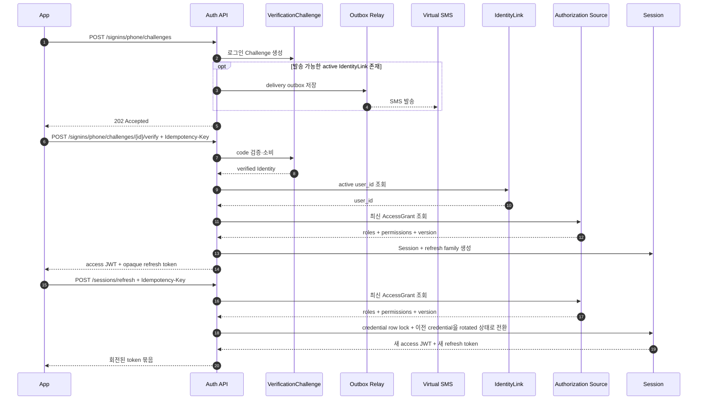

# 휴대폰 로그인과 refresh token 회전 시퀀스

## 기본 정보

- Scenario ID: `SCN.A.300-02`
- 시작 지점: `PAGE.A.303` 휴대폰 번호 로그인
- 트리거: 모바일 사용자가 계정에 연결된 휴대폰 번호로 로그인을 시작한다.
- 성공 기준: SMS 소유 확인 뒤 연결된 `user_id`의 Session을 발급하고 refresh 요청마다 credential을 회전한다.
- 실패 기준: Challenge 실패·만료, active IdentityLink 부재, 사용자 제한 또는 refresh token 재사용 탐지.

## 연관 문서

- [UC.A.300](../../30-uc/UC_A_300_auth_member.md)
- [PAGE.A.300](../../10-sitemap/PAGE_A_300_auth_member/PAGE_A_300_auth_member.md)
- [UI.A.300](../../20-ui/UI_A_300_auth_member/UI_A_300_auth_member.md)
- [서비스 설계](../../50-service-design/A_300_auth/A_300_30-service/README.md)
- [API 공통 계약](../../50-service-design/A_300_auth/A_300_40-api/README.md)
- [API.A.300-08 휴대폰 로그인 Challenge 발급](../../50-service-design/A_300_auth/A_300_40-api/API_A_300_08_issue_phone_signin_challenge.md)
- [API.A.300-09 휴대폰 로그인 검증](../../50-service-design/A_300_auth/A_300_40-api/API_A_300_09_verify_phone_signin.md)
- [API.A.300-14 모바일 Session 갱신](../../50-service-design/A_300_auth/A_300_40-api/API_A_300_14_refresh_session.md)

## 처리 과정

## 단계 설명

| 단계 | 책임 주체 | 핵심 규칙 | 관련 API |
| --- | --- | --- | --- |
| Challenge 시작 | Auth | IdentityLink 존재 여부와 관계없이 같은 `202` 응답을 사용한다. | `API.A.300-08` |
| 소유 확인 | Auth | code 검증 성공 뒤에만 Link의 `user_id`를 확인하고 로그인 결과를 결정한다. | `API.A.300-09` |
| Session 발급 | Auth | Link의 `user_id`와 UserAuthState를 확인하고 모바일 credential을 발급한다. | `API.A.300-09` |
| refresh token 회전 | Auth | credential row lock을 획득한 요청만 refresh token을 교체하고 이전 token을 `rotated` 상태로 전환한다. | `API.A.300-14` |

## 데이터 이동

- 입력: 휴대폰 번호, SMS code, AuthenticationIntent, Idempotency-Key, opaque refresh token.
- 출력: Session 요약, access JWT, 회전된 opaque refresh token.
- 저장: VerificationChallenge, Identity 조회 결과, Session, SessionCredential, refresh family, IdempotencyRecord.
- 폐기: 검증된 Challenge, 이전 refresh credential, 재사용이 탐지된 refresh family.

## 불변 조건

- Challenge 시작 응답으로 계정 또는 IdentityLink 존재 여부를 노출하지 않는다.
- 실제 SMS 발송 여부에 따른 조기 반환으로 가입·미가입 번호의 응답 시간이 외부에서 구분되지 않게 한다.
- access JWT와 내부 사용자 헤더에는 이메일과 휴대폰 번호를 넣지 않는다.
- 같은 key의 검증 재시도는 Challenge 실패 횟수를 다시 늘리지 않는다.
- 같은 `Idempotency-Key`로 refresh를 재시도한 경우에만 짧은 복구 TTL 동안 이전 성공 응답을 재생한다.
- 동시에 들어온 refresh 요청은 credential row lock으로 직렬화하며 최초 한 요청만 회전에 성공한다.
- 같은 refresh token을 다른 `Idempotency-Key`로 다시 보내면 재시도가 아니라 재사용 탐지로 처리한다.

## 예외 처리

- SMS 검증 뒤 `active` 상태 Link가 없으면 `AUTH_PHONE_IDENTITY_NOT_LINKED`를 반환한다.
- `rotated` 상태 token을 다른 key로 다시 사용하면 refresh family 전체를 폐기하고 `AUTH_SESSION_REVOKED`를 반환한다.
- 암호화 응답 복구 TTL이 끝나면 `AUTH_REFRESH_RETRY_EXPIRED`를 반환하고 다시 로그인을 요구한다.
- UserAuthState가 제한 상태이면 새 Session과 refresh를 발급하지 않는다.

## 검증 항목

- 미가입 번호와 가입 번호의 Challenge 시작 응답 형식과 HTTP 상태 코드가 같다.
- 가입·미가입 번호의 응답 시간 분포가 보안 정책의 허용 범위 안에서 유사한지 검증한다.
- 성공 응답 유실 재시도에서 새로운 논리 Session을 만들지 않는다.
- 이전 refresh token 재사용 시 해당 family의 모든 credential이 폐기된다.
- 동시에 요청한 refresh 중 하나만 새 credential을 만들며, 같은 key 재시도는 그 결과를 재생한다.
