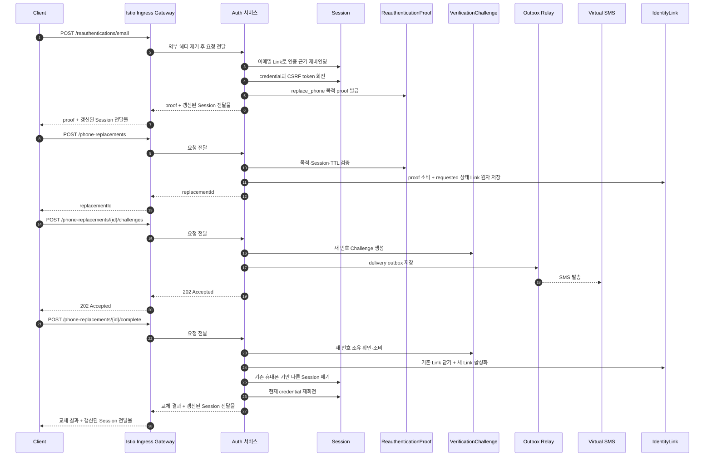

# 휴대폰 번호 교체 시퀀스

## 기본 정보

- Scenario ID: `SCN.A.300-03`
- 시작 지점: 로그인 사용자의 인증 수단 관리 화면.
- 트리거: 사용자가 현재 비밀번호로 이메일 재인증을 마치고 새 휴대폰 번호로 교체를 요청한다.
- 성공 기준: 기존 휴대폰 Link를 닫고 새 번호를 같은 `user_id`에 연결하며 Session 보안 처리를 완료한다.
- 실패 기준: 재인증 실패·만료, 새 번호 소유 확인 실패, 다른 사용자와의 `active` 상태 Link 충돌.

## 연관 문서

- [REQ.A.05](../../00-requirements/REQ_A_05_auth_member.md)
- [UC.A.300](../../30-uc/UC_A_300_auth_member.md)
- [서비스 설계](../../50-service-design/A_300_auth/A_300_30-service/README.md)
- [API 공통 계약](../../50-service-design/A_300_auth/A_300_40-api/README.md)
- [API.A.300-17 이메일 재인증](../../50-service-design/A_300_auth/A_300_40-api/API_A_300_17_reauthenticate_email.md)
- [API.A.300-21 휴대폰 번호 교체 시작](../../50-service-design/A_300_auth/A_300_40-api/API_A_300_21_start_phone_replacement.md)
- [API.A.300-22 휴대폰 번호 교체 Challenge 발급](../../50-service-design/A_300_auth/A_300_40-api/API_A_300_22_issue_phone_replacement_challenge.md)
- [API.A.300-23 휴대폰 번호 교체 완료](../../50-service-design/A_300_auth/A_300_40-api/API_A_300_23_complete_phone_replacement.md)

## 처리 과정

## 단계 설명

| 단계 | 책임 주체 | 핵심 규칙 | 관련 API |
| --- | --- | --- | --- |
| 외부 요청 경계 | Ingress | TLS 종료, 라우팅, 요청 빈도 제한, 외부에서 들어온 내부용 헤더 제거 | 공통 |
| 이메일 재인증 | Auth | proof를 `user_id`, Session, 목적과 만료 시각에 바인딩한다. | `API.A.300-17` |
| 교체 시작 | Auth | proof 소비와 `link_status=requested`인 IdentityLink 생성을 한 트랜잭션에서 처리한다. `replacementId`는 이 Link의 ID다. | `API.A.300-21` |
| 새 번호 확인 | Auth | `requested` 상태 Link에 고정된 번호로 Challenge를 발급한다. | `API.A.300-22` |
| Link 교체 | Auth | Challenge 소비, 기존 Link 종료, 새 Link 활성화를 한 트랜잭션에서 처리한다. | `API.A.300-23` |

## 데이터 이동

- 입력: 현재 비밀번호, `replace_phone` 목적, 새 휴대폰 번호, SMS code, Idempotency-Key.
- 출력: ReauthenticationProof, replacementId, Challenge metadata, 교체 결과, 갱신된 Session 전달물.
- 저장: `requested` 상태 IdentityLink, VerificationChallenge, Link 종료·활성화 이력, SessionCredential, 감사 Event.
- 폐기: ReauthenticationProof, 검증된 Challenge, 기존 휴대폰 기반 Session, 이전 SessionCredential.

## 불변 조건

- 휴대폰 번호 교체에는 `active` 상태 이메일 Link를 이용한 재인증이 필요하다.
- 새 번호가 다른 `user_id`에 `active` 상태로 연결되어 있으면 Link를 이전하거나 계정을 병합하지 않는다.
- 현재 Session은 이메일 인증 근거로 유지하고, 기존 휴대폰 기반의 다른 Session만 폐기한다.
- 기존 Link 종료와 새 Link 활성화 사이에 `active` 상태 Link의 공백이나 중복이 생기지 않아야 한다.
- Ingress는 재인증 proof를 검증하거나 교체 단계를 조정하지 않는다.

## 예외 처리

- proof의 목적·Session·만료가 일치하지 않으면 `AUTH_REAUTHENTICATION_PROOF_INVALID`를 반환한다.
- 새 번호가 다른 사용자에게 연결되어 있으면 `AUTH_IDENTITY_LINK_CONFLICT`를 반환한다.
- Challenge가 실패하거나 만료되면 Link 상태를 `requested`로 유지하거나 정책에 따라 만료시키며 기존 Link는 변경하지 않는다.
- 최종 트랜잭션이 실패하면 기존 Link와 Session 상태를 그대로 유지한다.
- 교체 시작 트랜잭션이 실패하면 proof를 소비하거나 `requested` 상태 Link를 남기지 않는다.

## 검증 항목

- Link 교체 트랜잭션 실패 시 기존 번호로 계속 로그인할 수 있다.
- 교체 시작 저장에 실패하면 같은 proof로 안전하게 다시 요청할 수 있다.
- 완료 응답 유실 후 같은 key로 재시도해도 Link 종료·활성화 이력이 중복되지 않는다.
- 기존 휴대폰 기반 Session은 폐기되고 현재 이메일 재인증 Session은 유지된다.
