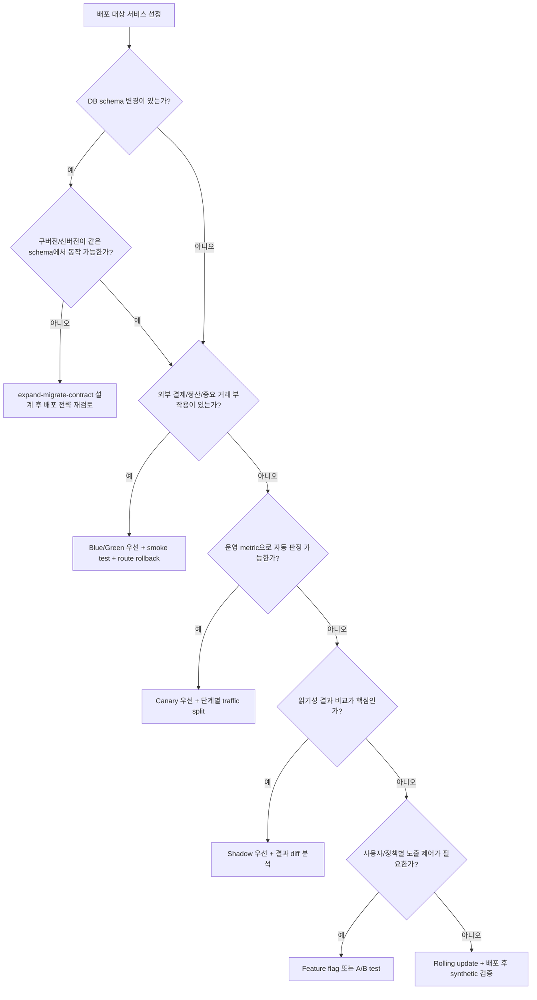

# 클라우드 네이티브 배포 전략 검증 계획

## 목적

이 문서는 특정 서비스의 최종 배포 전략을 지금 결정하기 위한 결과 보고서가 아니다. 나중에 서비스별 실험을 수행할 때 같은 기준으로 비교할 수 있도록, 배포 패턴, 선택 기준, 관측 지표, 장애 주입, DB 마이그레이션 정책, 결과 분석 양식을 미리 정의하는 실험 계획서다.

기준 도구는 다음과 같이 둔다.

| 영역 | 기준 도구 | 문서에서 다루는 역할 |
| --- | --- | --- |
| 트래픽 제어 | Istio | VirtualService, DestinationRule, traffic split, mirroring, timeout, retry, fault injection |
| 관측성 | LGTM stack | Loki 로그, Grafana 대시보드, Tempo trace, Mimir 또는 Prometheus metric |
| 장애 주입 | Chaos Mesh | Pod 장애, 네트워크 지연/손실, 리소스 압박, 정기/워크플로 기반 실험 |
| 배포 운영 | Argo CD + Helm 전제 | 환경별 values, 변경 이력, 롤백 지점, GitOps 동기화 |

## 실험 산출물

| 산출물 | 위치 | 작성 시점 |
| --- | --- | --- |
| 서비스 특성 기록 | [templates/service-profile-template.md](templates/service-profile-template.md) | 실험 대상 서비스 선정 시 |
| 배포 실험 계획 | [templates/deployment-experiment-plan-template.md](templates/deployment-experiment-plan-template.md) | 배포 전략별 실험 전 |
| 관측 지표 설계 | [templates/observability-metrics-template.md](templates/observability-metrics-template.md) | 대시보드/알림 준비 전 |
| 카오스 시나리오 | [templates/chaos-scenario-template.md](templates/chaos-scenario-template.md) | 장애 주입 전 |
| DB 마이그레이션 정책 | [templates/db-migration-strategy-template.md](templates/db-migration-strategy-template.md) | 스키마 변경 포함 실험 전 |
| 결과 분석 보고서 | [templates/result-analysis-report-template.md](templates/result-analysis-report-template.md) | 실험 종료 후 |
| 전략 결정 기록 | [templates/deployment-decision-record-template.md](templates/deployment-decision-record-template.md) | 서비스별 전략 확정 시 |

## 배포 패턴 비교

| 패턴 | 핵심 방식 | 우선 적용 조건 | 주의할 조건 | 주로 볼 지표 |
| --- | --- | --- | --- | --- |
| Rolling update | Pod를 일정 비율로 교체한다. | 무상태 API, 빠른 복구 가능, DB 변경 없음 | 구버전/신버전 동시 실행이 불가능하면 위험하다. | rollout duration, unavailable replica, p99, 5xx |
| Canary | 일부 트래픽만 신버전으로 보낸 뒤 점진 확대한다. | 신버전 위험을 작게 노출하고 metric으로 판단 가능 | 요청 수가 적으면 통계가 흔들린다. | canary error rate, p99 delta, saturation, business error |
| Blue/Green | 구버전과 신버전을 별도 환경으로 두고 라우팅을 전환한다. | 외부 결제/정산/중요 거래, 빠른 전체 롤백 필요 | 두 환경 비용과 DB 공유 정책이 부담이다. | switch time, rollback time, smoke test pass rate |
| Shadow | 운영 트래픽 사본을 신버전에 보내고 응답은 버린다. | 추천/검색/랭킹, 읽기성 검증, 결과 비교 필요 | 쓰기 요청은 부작용 제거 장치가 필요하다. | response diff, latency overhead, shadow error |
| Feature flag | 배포와 기능 노출을 분리한다. | UI/정책/권한별 노출, 빠른 기능 차단 필요 | flag 조합과 만료 관리가 필요하다. | flag exposure, conversion, error by cohort |
| A/B test | 사용자 집단별로 다른 경험을 제공한다. | UX, 추천, 가격/정책 실험 | 운영 안정성 검증보다 제품 가설 검증에 가깝다. | conversion, retention, order success, cohort p99 |

## 서비스 특성 분류 기준

서비스별 배포 전략은 배포 도구보다 서비스 성질이 먼저 결정한다.

| 분류 항목 | 질문 | 전략 판단 |
| --- | --- | --- |
| 상태 보유 | 요청 처리 중 서버 내부 상태나 세션에 의존하는가? | 상태가 강하면 rolling/canary 전에 session drain, sticky policy, graceful shutdown을 검증한다. |
| DB 보유 | 서비스 소유 DB나 migration이 있는가? | 스키마 변경이 있으면 expand-migrate-contract 절차를 먼저 검토한다. |
| 정합성 민감도 | 중복 결제, 재고 이중 차감, 쿠폰 중복 발급이 치명적인가? | 정합성 민감 서비스는 blue/green, feature flag, 강한 smoke test를 우선한다. |
| 외부 연동 | 결제사, 알림, 배송, 인증 provider와 연결되는가? | 외부 부작용이 있으면 shadow를 제한하고 blue/green 또는 flag kill switch를 둔다. |
| 하위호환성 | 구버전 caller와 신버전 callee가 동시에 동작 가능한가? | 호환성이 없으면 canary보다 versioned API, contract test, blue/green이 먼저다. |
| 관측 가능성 | 성공/실패를 metric, log, trace로 판단 가능한가? | 자동 승격은 metric 품질이 확보된 뒤에만 허용한다. |
| 트래픽 규모 | 표본이 충분한가? | 트래픽이 적으면 canary 판단이 늦어지고 synthetic/smoke test 비중이 커진다. |
| 롤백 가능성 | 코드, 라우팅, DB, flag를 되돌릴 수 있는가? | DB contract가 끝난 변경은 단순 rollback으로 복구되지 않는다. |

## 의사결정 기준

### 빠른 판단표

| 서비스 유형 | 1순위 후보 | 보조 장치 | 피해야 할 방식 |
| --- | --- | --- | --- |
| 무상태 조회 API | Rolling 또는 Canary | p99/5xx 알림, synthetic read check | DB 변경 없는 경우 과한 blue/green |
| 주문/결제 API | Blue/Green | idempotency, smoke payment, kill switch | 쓰기 부작용 있는 shadow |
| 쿠폰/재고 서비스 | Canary 또는 Blue/Green | DB 호환성, 중복 발급 방지, 재처리 정책 | contract 없는 rolling |
| 인증/세션 서비스 | Blue/Green 또는 Canary | session drain, token compatibility, login synthetic | 세션 정책 미검증 rolling |
| 검색/추천/랭킹 | Shadow 후 Canary | result diff, latency budget | 즉시 100% 전환 |
| UI 정책/노출 | Feature flag 또는 A/B | cohort metric, flag rollback | 배포만으로 기능 제어 |

## Istio 실험 설계

Istio 실험은 `VirtualService`와 `DestinationRule`을 중심으로 설계한다. 공식 문서 기준으로 Istio는 request routing, traffic shifting, mirroring, fault injection을 제공한다.

| 실험 | Istio 기능 | 검증 내용 |
| --- | --- | --- |
| Canary | weight 기반 route | `v1 95% / v2 5%`에서 시작해 metric 통과 시 확대 |
| Blue/Green | active service route 전환 | green smoke test 후 route를 green으로 전환, 실패 시 blue로 복귀 |
| Shadow | traffic mirroring | 운영 응답은 v1이 처리하고 v2는 결과 비교만 수행 |
| A/B | header/cookie/user 조건 route | cohort별 응답, 전환율, 오류율 비교 |
| Resilience | timeout/retry/fault injection | downstream 지연 또는 abort 시 사용자 영향과 복구 확인 |

기본 단계는 다음과 같다.

1. `DestinationRule`에 stable/candidate subset을 정의한다.
2. `VirtualService`에 기본 라우팅과 timeout을 명시한다.
3. 실험 시작 전 대시보드와 알림을 준비한다.
4. traffic split 또는 mirror 비율을 적용한다.
5. metric window 단위로 오류율, p99, saturation, 업무 지표를 확인한다.
6. 통과하면 다음 단계로 확대하고, 실패하면 route를 이전 상태로 되돌린다.

## LGTM 관측 지표

LGTM은 도구 이름을 나열하는 것이 아니라 실험 판정에 필요한 신호를 연결하는 기준이다.

| 신호 | 도구 | 필수 확인 항목 |
| --- | --- | --- |
| Metric | Mimir 또는 Prometheus | request rate, error rate, p50/p95/p99, CPU, memory, restart, queue lag |
| Log | Loki | deployment version, route, status, error_code, trace_id, request_id |
| Trace | Tempo | upstream/downstream latency, external dependency span, DB span, retry span |
| Dashboard | Grafana | stable/candidate 비교, rollout 단계, chaos 실험 시간대 annotation |

### 공통 SLI 후보

| 지표 | 계산 기준 | 실험 판정 용도 |
| --- | --- | --- |
| Availability | `2xx + 3xx / total request` | 후보 버전이 사용자 요청을 정상 처리하는지 판단 |
| Error rate | `5xx / total request`, domain failure count | rollback 조건 |
| Latency | p95, p99, p99.9 | canary 확대 또는 중단 판단 |
| Saturation | CPU, memory, connection pool, queue lag | 성능 한계와 autoscaling 필요성 판단 |
| Rollout duration | 배포 시작부터 ready 상태까지 | 전략별 배포 시간 비교 |
| Rollback duration | rollback 명령부터 안정 상태까지 | 운영 복구 가능성 비교 |
| Business result | 주문 성공률, 결제 실패율, 쿠폰 발급 성공률 | 기술 지표가 정상이어도 업무 결과가 나쁜지 확인 |

## Chaos Mesh 실험 설계

Chaos Mesh 실험은 배포 전략 자체를 깨뜨리기 위한 것이 아니라, 배포 중 또는 배포 직후 장애가 생겼을 때 전략이 얼마나 잘 버티는지 확인하기 위한 장치다.

| 시나리오 | Chaos Mesh 리소스 | 예상 확인 항목 |
| --- | --- | --- |
| 후보 Pod 일부 종료 | PodChaos | canary 비율 유지, readiness 제외, 자동 복구 |
| stable-candidate 간 지연 | NetworkChaos | p99 상승, timeout/retry 동작, 사용자 오류율 |
| 외부 연동 지연 | NetworkChaos 또는 Istio fault injection | 결제/알림 timeout, fallback, circuit breaker |
| 후보 Pod CPU 압박 | StressChaos | HPA 반응, p99, throttling |
| 정기 장애 주입 | Schedule 또는 Workflow | 실험 반복성, 운영 알림, 결과 비교 |

카오스 실험은 반드시 다음 가드를 가진다.

- namespace, label selector, duration으로 영향 범위를 제한한다.
- 실험 전 rollback 명령과 담당자를 적는다.
- 실험 시간대를 Grafana annotation으로 남긴다.
- production 유사 환경이라도 결제/정산/외부 발송은 sandbox 또는 차단 장치를 둔다.
- 실험 종료 후 실제 상태가 원복됐는지 별도 확인한다.

## DB 마이그레이션 전략

DB 변경이 있는 배포는 애플리케이션 rollout보다 schema compatibility가 먼저다. 기본 원칙은 expand-migrate-contract다.

| 단계 | 목적 | 배포 전략 영향 |
| --- | --- | --- |
| Expand | 새 column/table/index를 추가하고 기존 코드는 그대로 동작하게 한다. | rolling/canary 가능성을 만든다. |
| Dual write 또는 backfill | 새 구조에 데이터를 채운다. | 데이터 불일치 metric과 재처리 계획이 필요하다. |
| Read switch | 신버전이 새 구조를 읽도록 전환한다. | canary 또는 feature flag로 단계 전환한다. |
| Contract | 더 이상 쓰지 않는 column/table/path를 제거한다. | 롤백 가능성이 낮아지므로 별도 배포로 분리한다. |

금지 기준은 다음과 같다.

- 배포와 동시에 기존 column을 삭제하지 않는다.
- 구버전이 읽는 필드를 같은 배포에서 rename하지 않는다.
- irreversible migration과 100% traffic switch를 같은 변경으로 묶지 않는다.
- rollback 문서 없이 destructive migration을 실행하지 않는다.

## 실험 운영 순서

1. 대상 서비스의 특성을 기록한다.
2. 후보 배포 전략을 2개 이상 고른다.
3. 각 전략의 성공 기준과 rollback 기준을 숫자로 적는다.
4. Istio 라우팅 정책과 GitOps 변경 지점을 정리한다.
5. LGTM 대시보드와 alert query를 준비한다.
6. DB 변경이 있으면 migration 단계를 분리한다.
7. Chaos Mesh 시나리오를 1개 이상 붙인다.
8. 실험 결과를 같은 표에 기록한다.
9. 서비스별 최종 전략과 예외 조건을 결정한다.

## 결과 분석 기준

결과 분석은 "어떤 전략이 멋진가"가 아니라 "이 서비스의 위험을 가장 단순하게 줄인 전략이 무엇인가"를 답해야 한다.

| 판단 질문 | 기록 방식 |
| --- | --- |
| 배포가 얼마나 빨랐는가? | rollout duration, ready까지 걸린 시간 |
| 실패를 얼마나 빨리 발견했는가? | first alert time, synthetic failure time |
| 롤백이 실제로 가능했는가? | rollback duration, rollback 후 error 회복 |
| DB 변경이 롤백을 제한했는가? | migration 단계, contract 여부, data repair 필요성 |
| 사용자 영향이 있었는가? | 5xx, p99, 업무 실패율, CS 영향 |
| 운영자가 이해하기 쉬웠는가? | dashboard, log/trace correlation, runbook 난이도 |

## 베스트 프랙티스

- 배포 전략은 서비스별로 결정하고, 전사 공통 기본값은 fallback으로만 둔다.
- canary 자동 승격은 metric 품질이 준비된 뒤에만 사용한다.
- blue/green은 단순하지만 비용과 DB 공유 문제가 있으므로 중요 거래 서비스에 우선 배정한다.
- shadow는 읽기성 비교에 강하지만 쓰기 부작용이 있는 API에는 별도 차단 장치가 필요하다.
- DB contract 단계는 운영 안정화 이후 별도 배포로 수행한다.
- p99와 업무 지표를 함께 봐야 한다. HTTP 200이어도 결제 실패율이 올라가면 실패한 배포다.
- Chaos Mesh 실험은 항상 영향 범위, 종료 조건, 관측 위치, 복구 담당자를 먼저 적는다.
- 로그 label은 낮은 cardinality를 유지하고, 상세 식별자는 structured field 또는 trace로 연결한다.

## 참고 자료

- [Istio Traffic Management](https://istio.io/latest/docs/concepts/traffic-management/)
- [Istio Traffic Shifting](https://istio.io/latest/docs/tasks/traffic-management/traffic-shifting/)
- [Istio Request Routing](https://istio.io/latest/docs/tasks/traffic-management/request-routing/)
- [Istio Mirroring](https://istio.io/latest/docs/tasks/traffic-management/mirroring/)
- [Istio Fault Injection](https://istio.io/latest/docs/tasks/traffic-management/fault-injection/)
- [Istio Traffic Management Best Practices](https://istio.io/latest/docs/ops/best-practices/traffic-management/)
- [Kubernetes Deployments](https://kubernetes.io/docs/concepts/workloads/controllers/deployment/)
- [Argo Rollouts Concepts](https://argo-rollouts.readthedocs.io/en/stable/concepts/)
- [Argo Rollouts Canary](https://argo-rollouts.readthedocs.io/en/stable/features/canary/)
- [Grafana Loki documentation](https://grafana.com/docs/loki/latest/)
- [Grafana Loki label best practices](https://grafana.com/docs/loki/latest/get-started/labels/bp-labels/)
- [Grafana Tempo documentation](https://grafana.com/docs/tempo/latest/)
- [Prometheus recording rules](https://prometheus.io/docs/prometheus/latest/configuration/recording_rules/)
- [OpenTelemetry Kubernetes components](https://opentelemetry.io/docs/platforms/kubernetes/collector/components/)
- [Chaos Mesh Basic Features](https://chaos-mesh.org/docs/basic-features/)
- [Chaos Mesh Run a Chaos Experiment](https://chaos-mesh.org/docs/run-a-chaos-experiment/)
- [Chaos Mesh NetworkChaos](https://chaos-mesh.org/docs/simulate-network-chaos-on-kubernetes/)
- [Chaos Mesh PodChaos](https://chaos-mesh.org/docs/simulate-pod-chaos-on-kubernetes/)
- [Chaos Mesh Schedule](https://chaos-mesh.org/docs/define-scheduling-rules/)
- [Chaos Mesh Workflow](https://chaos-mesh.org/docs/create-chaos-mesh-workflow/)
- [Prisma Data Guide: expand and contract pattern](https://www.prisma.io/dataguide/types/relational/expand-and-contract-pattern)
- [PlanetScale: backward compatible database changes](https://planetscale.com/blog/backward-compatible-databases-changes)
