# 인증과 사용자 시나리오

## 1. 목적

인증 계정과 사용자 계정을 분리한 상태에서 사용자가 여러 인증 수단으로 같은 사용자 계정에 접근할 수 있는 사용자 시나리오를 정의한다.

이 문서는 구현 세부사항보다 사용자 관점의 요구사항과 흐름을 먼저 확정한다.

## 검토 질문

1. 이메일 사용자 가입 시 사용자는 어떤 정보를 입력해야 하나요? ([FR-013](#fr-013-이메일-가입-최소-입력-정보))
2. 이메일/비밀번호 가입에서 이메일 소유 검증은 MVP에 포함하나요? ([FR-014](#fr-014-이메일-소유-검증-목킹))
3. OAuth/OIDC 최초 로그인 시 동일 이메일 계정이 있으면 사용자에게 어떤 선택지를 보여주나요? ([FR-001](#fr-001-oauth-동일-이메일-계정-처리))
4. OAuth/OIDC 제공자가 이메일을 제공하지 않거나 `email_verified`를 제공하지 않으면 가입을 허용하나요?
5. 비밀번호 찾기와 재설정은 MVP에서 제외해도 되나요? ([FR-004](#fr-004-비밀번호-찾기-제외))
6. 로그아웃은 현재 세션만 종료해도 되나요? ([FR-005](#fr-005-로그아웃-범위))
7. 비로그인 사용자가 접근 가능한 기능은 각 피처가 정하도록 둘까요? ([FR-006](#fr-006-비로그인-공개-기능-범위))
8. 사용자 탈퇴 또는 계정 비활성화는 MVP에 포함하나요? ([FR-010](#fr-010-사용자-탈퇴와-계정-비활성화-제외))
9. 인증 수단 연결 해제는 MVP에 포함하나요? ([FR-011](#fr-011-인증-수단-연결-해제-제외))
10. 약관, 개인정보, 마케팅, 알림 동의는 가입 시점에 받을까요, 구매 또는 알림 설정 시점에 받을까요? ([FR-012](#fr-012-가입-시-동의-정보-제외))

## 2. 사용자 흐름

### 2.1 전제

- 인증은 사용자가 누구인지 증명하는 과정이다.
- 사용자 계정은 DropMong 서비스 안에서 구매, 주문, 알림 상태를 가진다.
- 하나의 사용자는 이메일 로그인, OAuth 간편 로그인 등 여러 인증 계정과 연결될 수 있다.
- 외부 인증 제공자는 신원 확인 수단으로만 사용하고, 서비스 내부 사용자 식별자는 DropMong이 소유한다.
- 인증 결과로부터 role 기반 인가에 사용할 RBAC 정보를 만든다.
- 인가는 인증 결과, 사용자 상태, role, 리소스 소유권을 함께 사용해 판단한다.
- RBAC만으로 표현하기 어려운 예외 권한은 ACL override로 보완할 수 있어야 한다.
- 웹과 모바일의 인증 유지 방식은 다를 수 있지만, 인가 판단은 공통 Principal 모델로 통일한다.
- 인증된 요청과 인증되지 않은 요청은 모두 Principal, Resource, ACL 컨텍스트로 표현할 수 있어야 한다.
- 실사용자에게 게스트 로그인을 제공하지 않는다.
- 로그인하지 않은 사용자는 익명 권한으로 접근 가능한 공개 기능만 사용할 수 있다.
- 개발 빌드에서는 인증 서비스가 테스트용 토큰 기반 계정 발급 API를 제공할 수 있다.

### 2.2 인증 수단

- [x] 이메일/비밀번호 로그인: 로컬 개발과 기본 로그인 수단으로 사용한다.
- [x] OAuth 간편 로그인: Google, Kakao, Apple, Microsoft 같은 외부 인증 제공자를 사용한다.
- [x] OIDC 로그인: OAuth 기반 로그인에서 표준 신원 claim을 검증한다.
- [x] 테스트 계정 토큰 발급: 내부 개발과 QA에서만 사용하는 인증 수단이다.
- [ ] 익명 접근 권한: 로그인하지 않은 사용자가 공개 기능을 사용할 수 있는 인가 정책이다.
- [ ] Passkey/WebAuthn: 비밀번호 없이 기기 생체인증, PIN, 보안키를 사용한다.
- [ ] Magic Link: 이메일 로그인 링크로 인증한다.
- [ ] OTP: SMS, 이메일, TOTP 앱 기반 일회용 코드를 사용한다.
- [ ] MFA/2FA: 비밀번호, OTP, Passkey 등을 조합해 추가 인증을 요구한다.
- [ ] SAML SSO: 기업 또는 운영자 계정용 SSO 연동에 사용한다.
- [ ] Device Login: TV, 콘솔, 키오스크처럼 입력이 불편한 기기에서 코드 기반으로 인증한다.

### 2.3 액터

| 액터 | 설명 |
| --- | --- |
| 고객 | 상품을 탐색하고 구매하는 사용자 |
| 판매자 | 상품과 드롭을 준비하고 판매 상태를 확인하는 사용자 |
| 운영자 | 서비스 운영, 장애 대응, 계정/권한 관리를 수행하는 사용자 |

### 2.4 유스케이스

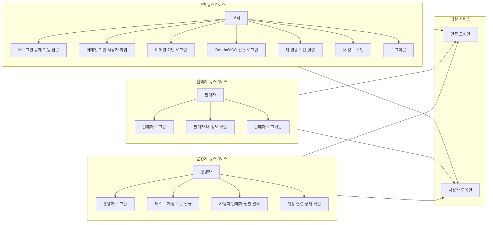

### 2.5 RBAC 요구사항 매트릭스

| 기능 | anonymous | customer | seller | operator |
| --- | --- | --- | --- | --- |
| 공개 상품/드롭 조회 | 가능 | 가능 | 가능 | 가능 |
| 이메일/비밀번호 로그인 | 불가 | 가능 | 가능 | 가능 |
| OAuth/OIDC 로그인 | 불가 | 가능 | 가능 | 가능 |
| 내 정보 조회 | 불가 | 본인만 가능 | 본인만 가능 | 가능 |
| 인증 수단 연결 | 불가 | 본인만 가능 | 본인만 가능 | 가능 |
| 비밀번호 재설정 | 불가 | 불가 | 불가 | 불가 |
| 주문 생성 | 불가 | 가능 | 정책 결정 필요 | 불가 |
| 판매 상품/드롭 관리 | 불가 | 불가 | 가능 | 가능 |
| 계정 연결 상태 확인 | 불가 | 본인만 가능 | 본인만 가능 | 가능 |
| 사용자/판매자 권한 관리 | 불가 | 불가 | 불가 | 가능 |
| 계정 비활성화 | 불가 | 불가 | 불가 | 불가 |
| 테스트 계정 토큰 발급 | 불가 | 불가 | 불가 | 가능 |

기본 인가 판단은 role을 우선 사용한다. 단, 특정 사용자, 특정 리소스, 특정 기능에 대한 예외 허용 또는 예외 차단이 필요하면 ACL override를 적용할 수 있어야 한다.

ACL override 예시:

- 특정 판매자에게 특정 드롭 관리 권한만 허용
- 특정 운영자에게 계정 조회는 허용하지만 권한 변경은 차단
- 특정 사용자에게 테스트 또는 베타 기능 접근 허용
- 비정상 계정 또는 제재 계정의 일부 기능 차단
- QA 계정에 운영 환경과 분리된 테스트 권한 부여

### 2.6 인가 판단 순서

```text
authentication result
-> principal normalization
-> user status check
-> RBAC role policy
-> ownership check
-> ACL override allow/deny
-> authorization decision
```

ACL override는 role 정책을 보완하기 위한 예외 규칙이다. 모든 권한을 ACL로만 관리하지 않는다.

### 2.7 기능적 요구사항

#### FR-001 OAuth 동일 이메일 계정 처리

OAuth 또는 OIDC 최초 로그인 시 제공자에서 받은 이메일과 같은 이메일을 가진 기존 인증 계정 또는 사용자 계정이 있으면 자동 연결하지 않는다.

사용자에게 기존 계정에 인증 수단을 연동할지, 새 계정을 만들지 선택할 수 있게 한다. 기존 계정 연동을 선택한 경우에는 기존 계정에 대한 추가 인증을 요구한다.

#### FR-002 OAuth/OIDC 고유 식별자 기준

서로 다른 OAuth/OIDC 제공자가 같은 이메일을 반환하면 같은 사용자 후보로 볼 수 있다. 단, 이메일은 보조 식별자일 뿐이며 인증 계정의 고유 식별자로 사용하지 않는다.

OAuth/OIDC 인증 계정은 제공자와 제공자가 발급한 원본 subject 조합으로 식별한다.

```text
auth_provider + provider_subject
```

계정 연결 후 로그인 식별도 이메일이 아니라 제공자와 원본 subject 조합을 기준으로 한다.

#### FR-003 인증 수단 연결 개수 제한

한 사용자 계정에 연결 가능한 인증 수단 수는 별도로 제한하지 않는다.

지원하는 인증 수단과 제공자 수가 정해져 있으므로 실제 연결 가능 수는 시스템이 지원하는 인증 수단 범위 안에서 자연스럽게 제한된다.

#### FR-004 비밀번호 찾기 제외

MVP에서는 이메일 인증을 이용한 비밀번호 찾기 또는 비밀번호 재설정 기능을 제공하지 않는다.

비밀번호 찾기는 이메일 발송, 재설정 토큰 만료, 토큰 재사용 방지, 계정 열거 방지, 감사 로그가 필요하므로 이후 범위에서 별도로 설계한다.

#### FR-005 로그아웃 범위

기본 로그아웃은 현재 세션만 종료한다.

모든 기기 세션 종료는 MVP 필수 기능으로 포함하지 않는다. 이후 보안 기능으로 별도 설계할 수 있다.

#### FR-006 비로그인 공개 기능 범위

비로그인 사용자가 접근 가능한 공개 기능 범위는 인증/사용자 시나리오에서 고정 목록으로 확정하지 않는다.

공개 접근 여부는 각 피처가 route 또는 action 단위로 정의한다. 인증/사용자 서비스는 인증 정보가 없는 요청을 anonymous Principal로 표현하고, 각 피처의 인가 정책이 public 접근 가능 여부를 판단할 수 있게 한다.

#### FR-007 내부 서비스 Principal 전달

ingress 또는 gateway/BFF는 외부 인증 정보를 검증한 뒤 내부 서비스가 사용할 수 있는 Principal payload를 생성한다.

내부 서비스는 원본 JWT를 직접 디코딩하지 않고, 검증 완료된 Principal payload를 기준으로 인가 판단을 수행한다.

#### FR-008 ACL Override 평가 규칙

ACL override는 allow와 deny를 모두 지원한다.

기본 정책은 deny by default로 둔다. RBAC 또는 ACL allow가 있어야 허용 후보가 되며, 적용 가능한 ACL deny가 하나라도 있으면 최종 거부한다.

allow와 deny가 동시에 매칭되면 deny가 우선한다. 넓은 권한을 부여한 뒤 특정 기능이나 리소스를 명시적으로 차단하는 운영 방식을 지원한다.

#### FR-009 공통 Principal 정규화

웹 세션과 모바일 토큰은 ingress 또는 gateway/BFF에서 검증한 뒤 공통 Principal payload로 정규화한다.

내부 서비스는 클라이언트별 인증 유지 방식에 의존하지 않고, 정규화된 Principal을 기준으로 인가 판단을 수행한다.

#### FR-010 사용자 탈퇴와 계정 비활성화 제외

MVP에서는 사용자 탈퇴와 계정 비활성화 기능을 제공하지 않는다.

MVP 범위는 인증 계정 생성, 사용자 계정 생성, 로그인, 인증 수단 연결에 집중한다.

#### FR-011 인증 수단 연결 해제 제외

MVP에서는 사용자가 연결된 인증 수단을 해제하는 기능을 제공하지 않는다.

인증 수단 연결 해제는 마지막 인증 수단 보호, 재인증, audit log가 필요하므로 이후 범위에서 별도로 설계한다.

#### FR-012 가입 시 동의 정보 제외

MVP에서는 가입 시점에 약관, 개인정보, 마케팅, 알림 동의 정보를 받지 않는다.

동의 정보는 구매, 알림 설정, 마케팅 기능이 구체화되는 시점에 별도 요구사항으로 다룬다.

#### FR-013 이메일 가입 최소 입력 정보

MVP의 이메일 사용자 가입은 최소 입력 정보만 받는다.

필수 입력 정보:

- 이메일
- 비밀번호
- 실명

#### FR-014 이메일 소유 검증 목킹

MVP에서는 이메일 소유 검증 단계가 있다고 가정하되, 실제 이메일 발송과 인증 링크 처리는 상세 설계하지 않는다.

개발과 테스트에서는 이메일 검증을 목킹할 수 있어야 한다.

### 2.8 비기능적 요구사항

#### NFR-001 사용자 생성의 최종적 일관성

이메일 사용자 가입은 인증 서비스가 인증 계정과 내부 사용자 ID를 먼저 생성하는 방식으로 처리한다. 사용자 서비스는 해당 사용자 ID로 최초 접근이 발생했을 때 사용자 정보가 없으면 기본 사용자 정보를 생성한다.

이 방식은 인증 계정 생성과 사용자 프로필 생성을 하나의 분산 트랜잭션으로 묶지 않는다. 사용자 서비스는 "없어서 만들었다" 방식으로 사용자 정보를 지연 생성할 수 있어야 한다.

#### NFR-002 인증과 사용자 서비스의 독립 배포

인증 서비스와 사용자 서비스는 서로 다른 배포 단위로 동작할 수 있어야 한다. 인증 서비스의 사용자 ID 발급이 성공했더라도 사용자 서비스의 프로필 생성은 지연될 수 있다.

#### NFR-003 사용자 지연 생성의 멱등성

같은 사용자 ID로 사용자 정보 생성 요청이 반복되어도 사용자 정보는 하나만 생성되어야 한다. 중복 요청은 기존 사용자 정보를 반환해야 한다.

#### NFR-004 테스트 계정 토큰 발급 제약

테스트 계정 토큰 발급은 개발 빌드에서만 인증 서비스 API로 제공한다.

별도 생성 도구는 제공하지 않는다. 호출자가 전달한 고유한 토큰 문자열을 기반으로 테스트 계정을 발급할 수 있어야 한다.

#### NFR-005 내부 서비스의 인증 토큰 포맷 독립성

내부 서비스는 JWT claim 구조나 토큰 포맷 변경에 직접 의존하지 않아야 한다.

JWT 또는 세션 검증 방식이 변경되더라도 ingress 또는 gateway/BFF의 Principal 변환 계층만 변경해서 내부 서비스를 무중단 배포할 수 있어야 한다.

#### NFR-006 고위험 서비스의 인증 계약 버전 전환

고위험 서비스는 인증 시크릿, JWT 서명 키, Principal payload 구조가 변경될 때 새 인증 계약 버전으로 전환할 수 있어야 한다.

예를 들어 신규 JWT 인증 시크릿으로 변경되는 경우 ingress 또는 gateway/BFF는 새 버전의 Principal payload를 만들고, 고위험 서비스는 해당 버전을 지원하는 v2 배포로 전환할 수 있어야 한다.

기존 토큰은 만료 또는 재로그인을 통해 새 토큰으로 교체되도록 유도한다.

## 3. 정상 시나리오

### 3.1 이메일 가입 후 로그인

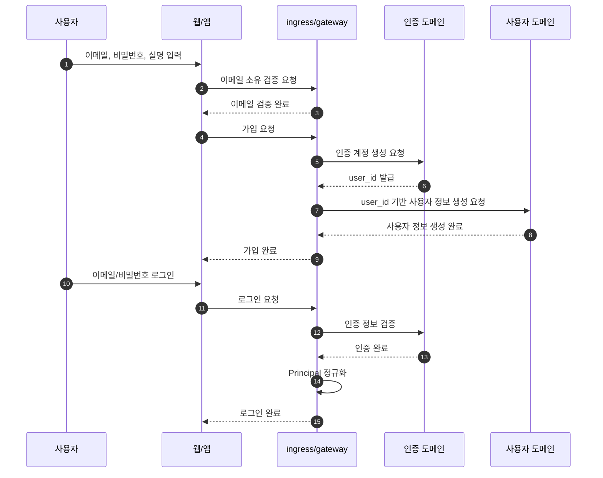

### 3.2 OAuth 최초 로그인 후 사용자 생성

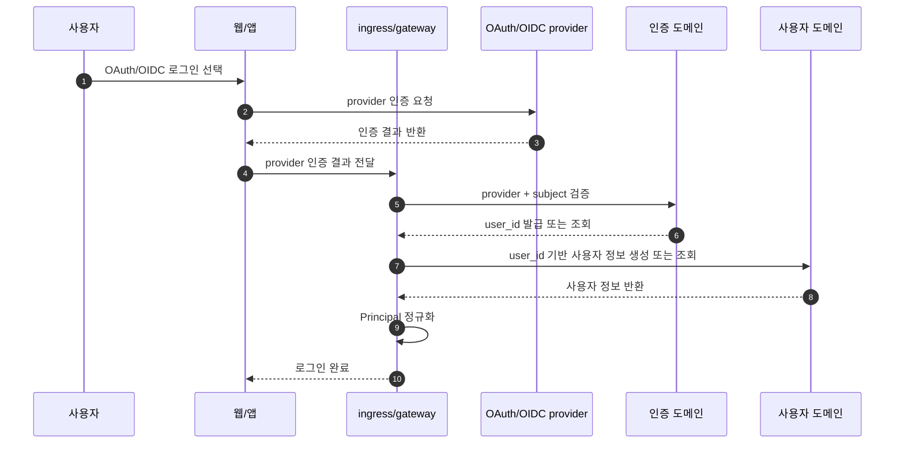

### 3.3 비로그인 공개 기능 접근

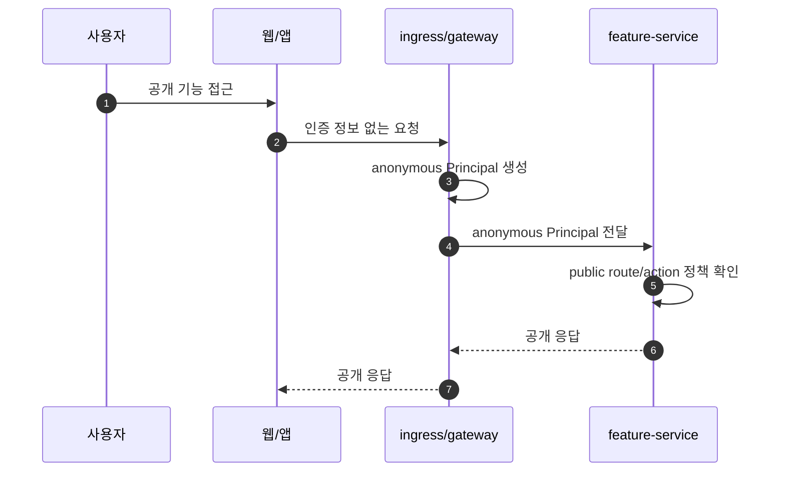

### 3.4 기존 사용자의 인증 수단 추가 연결

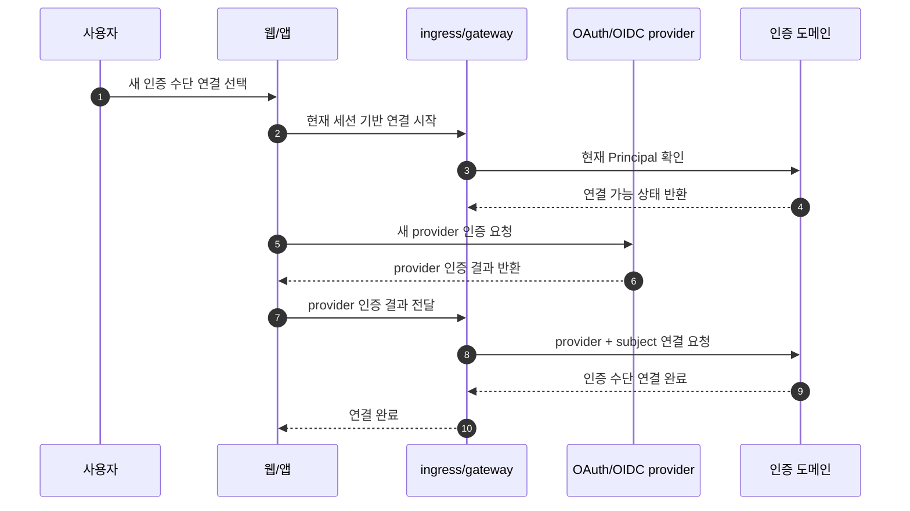

### 3.5 여러 인증 수단으로 같은 사용자 계정 접속

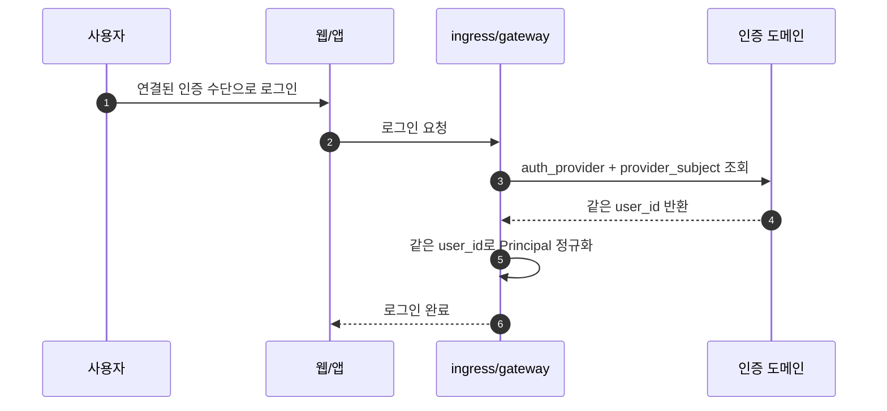

### 3.6 세션 유지와 토큰 갱신

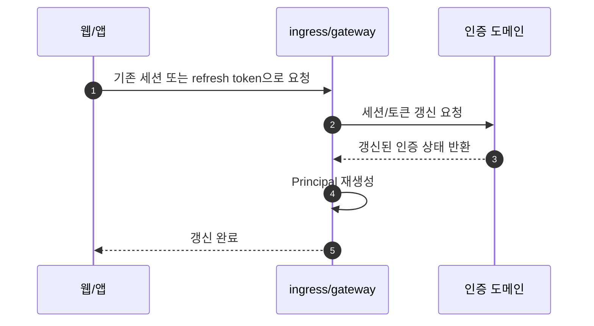

### 3.7 내 정보 확인

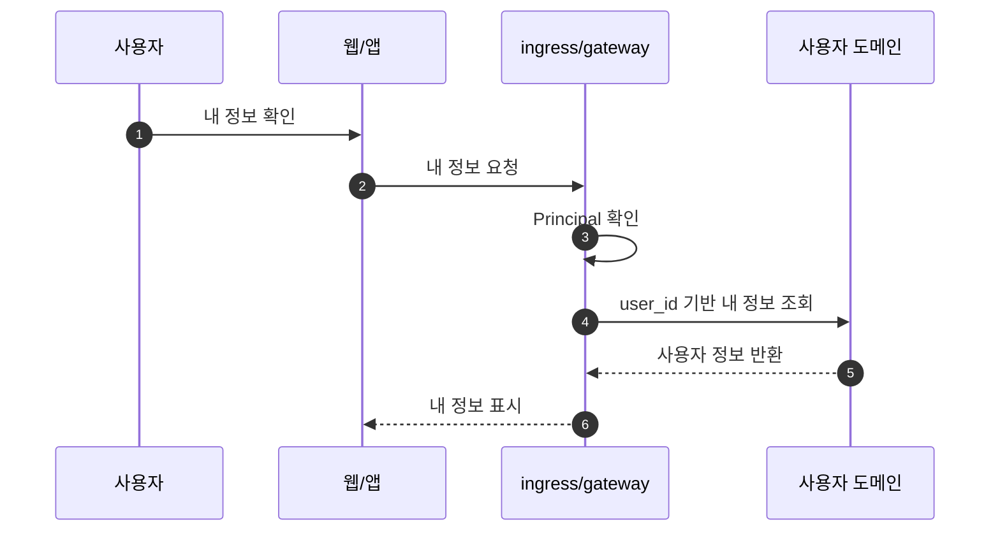

## 4. 예외 시나리오

### 4.1 이메일 또는 비밀번호 불일치

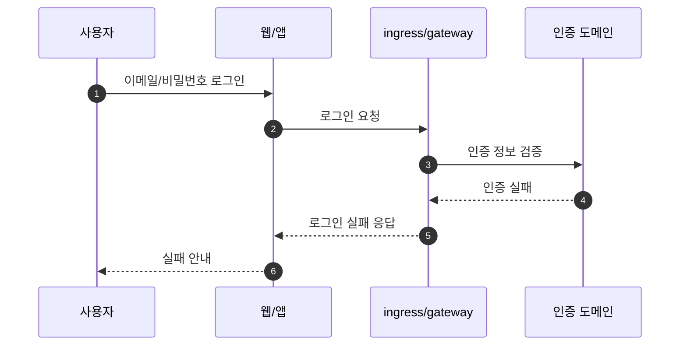

### 4.2 이미 연결된 인증 수단

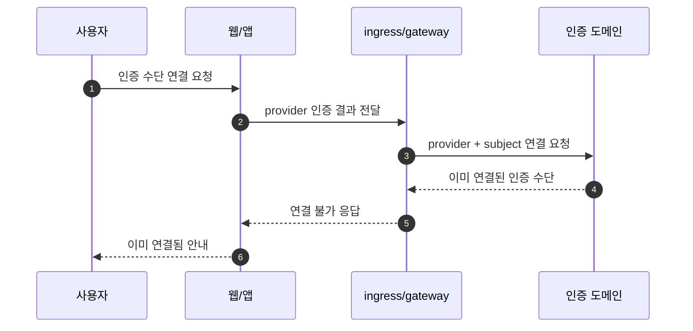

### 4.3 다른 사용자에 연결된 인증 수단

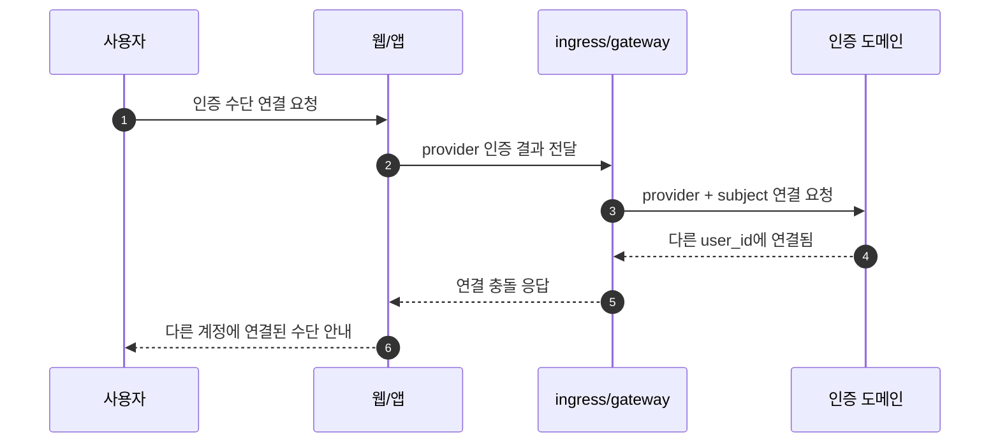

### 4.4 OAuth 제공자 응답 불일치

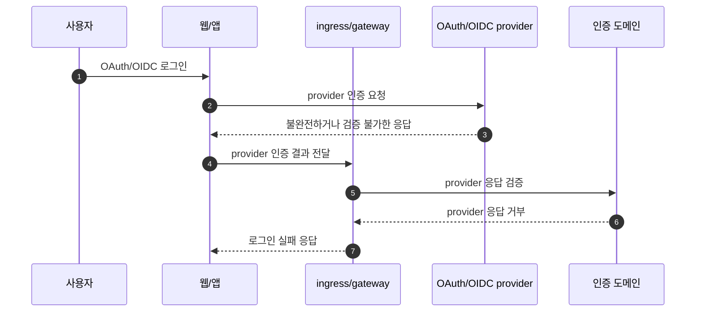

### 4.5 인증 계정은 존재하지만 사용자 생성이 지연된 상태

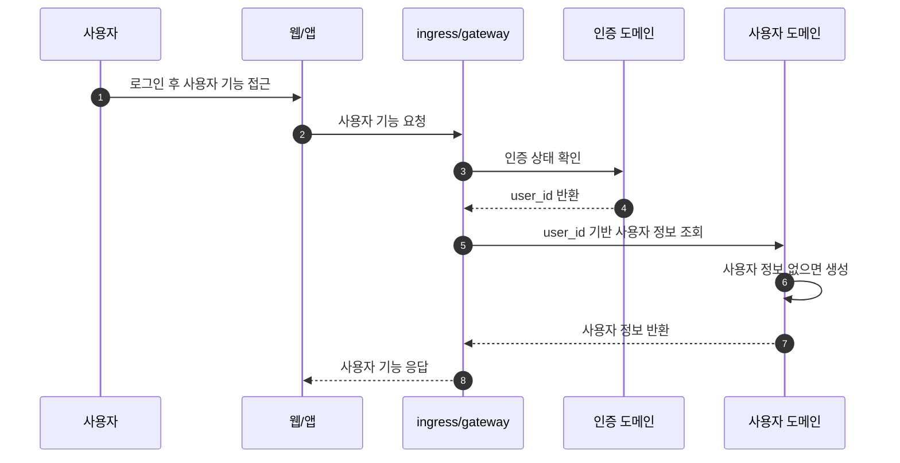

### 4.6 비로그인 사용자가 보호 기능에 접근한 상태

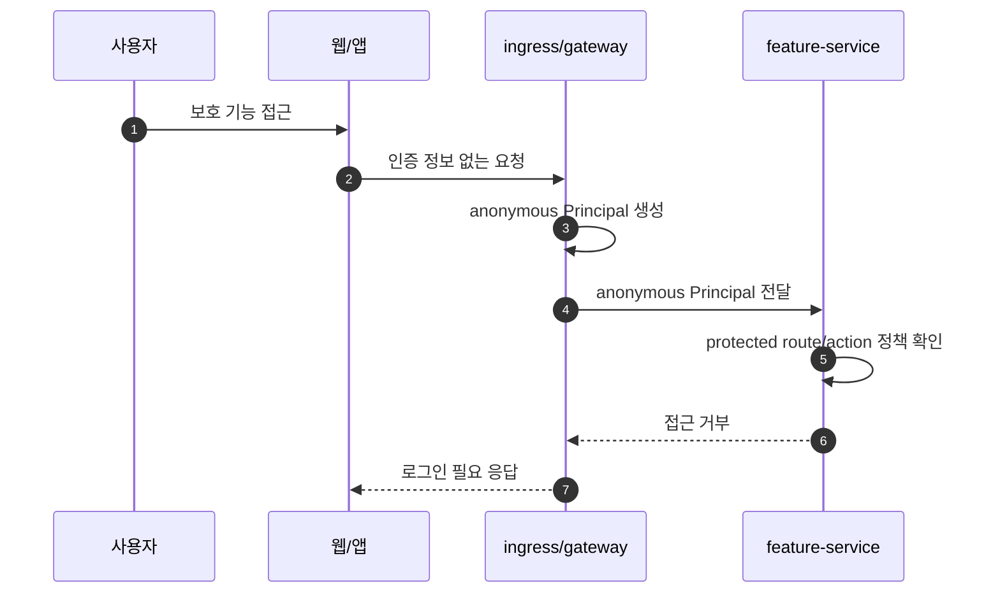

## 5. 완료 기준

- 인증 계정과 사용자 계정의 차이가 사용자 시나리오에서 드러난다.
- 하나의 사용자이 여러 인증 수단으로 로그인하는 흐름이 정의된다.
- 비로그인 사용자가 접근 가능한 공개 기능과 보호 기능의 경계가 정의된다.
- 테스트 계정 토큰 발급이 실사용자 인증 수단과 분리된다.
- 계정 연결, 중복 연결, 충돌 상황의 사용자 처리가 정의된다.
- 이후 컨텍스트 바운더리와 API 설계에서 참조할 수 있는 정상/예외 시나리오가 정리된다.
