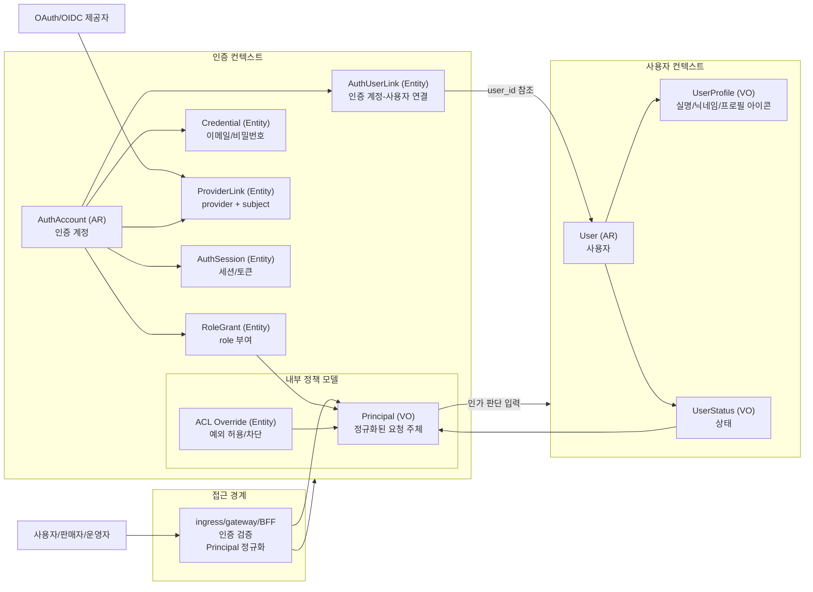
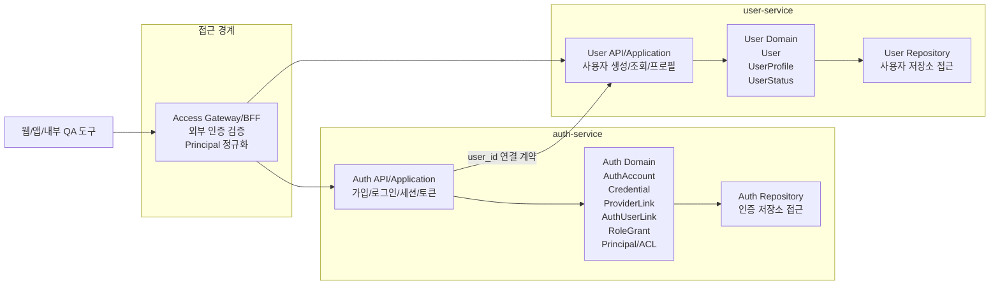

# 인증과 사용자 컨텍스트 바운더리

## 1. 목적

## 검토 질문

1. 인증 도메인과 사용자 도메인의 경계는 어디까지 분리하나요? → [인증-사용자 경계 규칙](#61-인증-사용자-경계-규칙)
2. 사용자는 어떤 상태를 가질 수 있나요? → [사용자 상태 경계](#62-사용자-상태-경계)
3. 사용자 상태, 판매자 상태, 제재 상태는 사용자 도메인이 소유하나요? → [상태와 정책 소유권](#63-상태와-정책-소유권)
4. 비활성 또는 제재 사용자 정책은 사용자 도메인에서 이후 범위로 다룰까요? → [MVP 상태 정책 범위](#64-mvp-상태-정책-범위)
5. auth-service 내부 정책 모델은 role, Principal, ACL override 중 어디까지 책임지나요? → [auth-service 내부 정책 범위](#65-auth-service-내부-정책-범위)
6. 인증 도메인은 user_id 생성과 인증 계정-사용자 연결까지만 책임지고, 사용자 정보 생성은 사용자 도메인이 책임지는 구조로 확정하나요? → [사용자 생성 책임 분리](#66-사용자-생성-책임-분리)
7. OAuth/OIDC provider subject와 이메일 기반 계정 발견은 인증 도메인 책임으로 둘까요? → [OAuth/OIDC 식별 경계](#67-oauthoidc-식별-경계)
8. 사용자 도메인은 인증 수단의 상세 정보를 알지 않고 user_id만 참조하도록 제한할까요? → [인증 상세 은닉 규칙](#68-인증-상세-은닉-규칙)
9. ingress/gateway의 Principal 정규화 책임은 별도 경계로 문서화할까요? → [접근 경계와 Principal 정규화](#69-접근-경계와-principal-정규화)

정책 서비스는 별도로 만들지 않는다. auth-service가 Principal, role, ACL override를 소유하고, 각 도메인 서비스는 자기 리소스의 소유권과 도메인 상태를 기준으로 최종 인가에 필요한 판단을 수행한다.

## 2. 바운디드 컨텍스트

### 2.1 경계 요약

| 컨텍스트 | 핵심 책임 | 소유하지 않는 것 |
| --- | --- | --- |
| 인증 컨텍스트 | 인증 계정, credential, provider link, auth-user link, session/token, role grant, Principal, ACL override, `user_id` 연결 | 사용자 프로필, 도메인 리소스 소유권 |
| 사용자 컨텍스트 | 사용자, 최소 프로필, 사용자 상태, `user_id` 기반 사용자 정보 생성 | 비밀번호, OAuth provider subject, 세션/토큰 |
| 접근 경계 | 외부 인증 검증, Principal 정규화, 내부 요청 전달 | 도메인 상태의 원천 데이터 |

## 3. 도메인 모델

### 3.1 인증 컨텍스트

| 모델 | 유형 | 설명 | 주요 식별자 |
| --- | --- | --- | --- |
| `AuthAccount` | Aggregate Root | 인증 계정의 일관성 경계다. 이메일/비밀번호, OAuth/OIDC provider link, 세션, role 부여를 통제한다. | `auth_account_id` |
| `Credential` | Entity | 이메일/비밀번호 기반 인증 정보를 표현한다. | `credential_id` |
| `ProviderLink` | Entity | OAuth/OIDC 제공자와 원본 subject 조합을 표현한다. | `provider_link_id`, `auth_provider + provider_subject` |
| `AuthUserLink` | Entity | 인증 계정과 사용자 계정의 연결을 표현한다. 인증 정보와 사용자 연결 정보를 테이블 관점에서도 분리한다. | `auth_user_link_id`, `auth_account_id`, `user_id` |
| `AuthSession` | Entity | 현재 세션 또는 토큰 갱신 상태를 표현한다. | `session_id` |
| `RoleGrant` | Entity | 사용자에게 부여된 role을 표현한다. | `role_grant_id` |

### 3.2 사용자 컨텍스트

| 모델 | 유형 | 설명 | 주요 식별자 |
| --- | --- | --- | --- |
| `User` | Aggregate Root | DropMong 내부 사용자 계정의 일관성 경계다. | `user_id` |
| `UserProfile` | Value Object | 사용자 프로필이다. 실명, 닉네임, 프로필 아이콘을 포함한다. | 없음 |
| `UserStatus` | Value Object | 사용자 상태를 표현한다. MVP에서는 상태 정책을 최소화하고, 탈퇴/비활성화는 제외한다. | 없음 |

### 3.3 인증 컨텍스트 내부 정책 모델

| 모델 | 유형 | 설명 | 주요 식별자 |
| --- | --- | --- | --- |
| `Principal` | Value Object | ingress/gateway/BFF가 인증 결과를 정규화한 요청 주체다. | 없음 |
| `ACL Override` | Entity | RBAC로 표현하기 어려운 예외 허용/차단 규칙이다. | `acl_override_id` |

## 4. 애그리게이트

### 4.1 AuthAccount

`AuthAccount`는 인증 컨텍스트의 Aggregate Root다.

포함 모델:

- `Credential`
- `ProviderLink`
- `AuthUserLink`
- `AuthSession`
- `RoleGrant`

보장해야 하는 규칙:

- 하나의 `AuthAccount`는 `AuthUserLink`를 통해 하나의 `user_id`에 연결된다.
- 인증 정보와 사용자 계정 연결 정보는 분리해서 저장한다.
- 이메일 credential은 인증 컨텍스트 안에서 중복되지 않아야 한다.
- `auth_provider + provider_subject` 조합은 전역에서 중복되지 않아야 한다.
- 같은 인증 수단을 같은 계정에 중복 연결하지 않는다.
- 다른 사용자 계정에 이미 연결된 provider subject는 자동으로 연결하지 않는다.
- role 부여 정보는 Principal 생성의 입력으로 사용된다.

### 4.2 User

`User`는 사용자 컨텍스트의 Aggregate Root다.

포함 모델:

- `UserProfile`
- `UserStatus`

보장해야 하는 규칙:

- `user_id`는 사용자 컨텍스트의 기본 식별자다.
- 같은 `user_id`로 사용자 생성 요청이 반복되어도 하나의 `User`만 존재해야 한다.
- 사용자 정보가 없으면 최초 접근 시 생성할 수 있다.
- MVP에서는 사용자 탈퇴와 계정 비활성화를 사용자 기능으로 제공하지 않는다.

### 4.3 ACL Override

`ACL Override`는 인증 컨텍스트 내부 정책 모델의 Entity다. 별도 서비스로 분리하지 않고 `auth-service` 내부에서 처리한다.

보장해야 하는 규칙:

- `allow`와 `deny`를 모두 표현할 수 있어야 한다.
- 같은 Principal, Resource, Action에 allow와 deny가 동시에 적용되면 deny가 우선한다.
- 기본 정책은 deny by default다.

## 5. 서비스 책임

초기 구현은 MSA를 전제로 하며, 컨텍스트 경계를 기준으로 물리 서비스를 분리한다.

각 서비스는 자기 컨텍스트의 모델과 저장소를 소유한다. 다른 서비스의 내부 모델이나 저장소에 직접 접근하지 않는다.

### 5.1 경계 관리 원칙

- 컨텍스트는 자기 Aggregate와 저장소만 직접 변경한다.
- 다른 컨텍스트의 DB 테이블을 직접 읽거나 쓰지 않는다.
- 인증 컨텍스트와 사용자 컨텍스트 사이의 참조는 `user_id` 하나로 제한한다.
- `auth_account_id`는 인증 컨텍스트 내부 식별자로 둔다.
- 인증 컨텍스트는 인증 수단과 인증 계정 연결을 책임진다.
- 사용자 컨텍스트는 사용자 정보와 사용자 상태를 책임진다.
- 접근 경계는 외부 인증 검증과 Principal 정규화를 책임진다.
- `auth-service`와 `user-service`는 별도 서비스로 분리한다.
- ACL override와 Principal 정책 평가는 `auth-service` 내부 책임으로 둔다.

### 5.2 서비스 경계

이 다이어그램의 서비스는 물리 배포 단위다. 인증 정책과 ACL override는 `auth-service` 내부 책임으로 둔다.

서비스 경계 기준:

| 서비스 | 책임 | 상태 |
| --- | --- | --- |
| Access Gateway/BFF | 외부 인증 검증, Principal 정규화, 내부 요청 전달 | 확정 |
| `auth-service` | 이메일 가입, 로그인, OAuth/OIDC 연결, 세션/토큰, 인증 계정-사용자 연결, Principal/ACL 정책 | 확정 |
| `user-service` | `user_id` 기반 사용자 생성, 사용자 조회, 프로필 관리 | 확정 |

한 서비스는 다른 서비스의 Repository나 내부 Entity를 직접 사용하지 않는다. 필요한 경우 공개 API, 이벤트, 식별자를 통해 협력한다.

## 6. 경계 규칙

### 6.1 인증-사용자 경계 규칙

인증 컨텍스트와 사용자 컨텍스트가 공유하는 식별자는 `user_id` 하나로 제한한다.

인증 컨텍스트는 인증 수단, 인증 계정, 인증 계정과 `user_id`의 연결, 세션/토큰, role, Principal, ACL override를 책임진다.

사용자 컨텍스트는 `user_id`를 기준으로 사용자 정보를 생성하고 관리한다. 사용자 컨텍스트는 비밀번호, OAuth/OIDC provider subject, 세션/토큰, 인증 수단 연결 정보를 알지 않는다.

`auth_account_id`는 인증 컨텍스트 내부 식별자이며 사용자 컨텍스트로 전달하지 않는다.

### 6.2 사용자 상태 경계

MVP의 사용자 상태는 최소 상태만 둔다. 기본 상태는 `active`로 보고, 사용자 탈퇴와 계정 비활성화는 MVP 사용자 기능으로 제공하지 않는다.

`UserStatus`는 사용자 컨텍스트의 Value Object로 둔다. 다만 MVP에서는 상태 전이를 적극적으로 설계하지 않고, 사용자 생성과 조회에 필요한 최소 표현만 유지한다.

### 6.3 상태와 정책 소유권

사용자 기본 상태는 사용자 컨텍스트가 소유한다.

판매자 상태는 판매자 도메인이 생길 때 해당 도메인이 소유한다. 사용자 컨텍스트가 판매자 상태까지 직접 소유하지 않는다.

권한 차단이나 예외 허용처럼 인가 결과에 직접 영향을 주는 제재 정책은 `auth-service` 내부 정책 모델의 ACL override로 표현한다.

### 6.4 MVP 상태 정책 범위

비활성, 탈퇴, 제재 상태의 운영 기능은 MVP에서 제외한다.

다만 이후 확장을 위해 사용자 컨텍스트에는 `UserStatus`를 두고, auth-service 내부 정책 모델에는 ACL override를 둔다. 실제 상태 전이 API와 운영자 제재 기능은 이후 API 설계 범위에서 다룬다.

### 6.5 auth-service 내부 정책 범위

auth-service는 role, Principal, ACL override를 소유한다.

auth-service는 인증 결과와 role grant, ACL override를 이용해 인가 판단에 필요한 Principal과 정책 정보를 만든다. 도메인 리소스의 소유권 판단은 해당 리소스를 소유한 서비스가 수행한다.

### 6.6 사용자 생성 책임 분리

인증 컨텍스트는 `user_id` 발급, 인증 계정 생성, 인증 계정과 `user_id` 연결을 책임진다.

사용자 컨텍스트는 `user_id`를 받은 뒤 사용자 정보가 없으면 생성한다. 같은 `user_id`로 반복 요청이 들어와도 하나의 사용자만 존재해야 한다.

### 6.7 OAuth/OIDC 식별 경계

OAuth/OIDC 제공자의 원본 식별자는 인증 컨텍스트가 소유한다.

인증 계정의 고유 식별 기준은 `auth_provider + provider_subject`다. 이메일은 같은 사용자일 가능성을 찾기 위한 보조 정보로만 사용하고, 자동 연결의 근거로 사용하지 않는다.

### 6.8 인증 상세 은닉 규칙

사용자 컨텍스트는 인증 수단의 상세 정보를 알지 않는다.

사용자 컨텍스트가 참조할 수 있는 값은 `user_id`뿐이다. 비밀번호, OAuth/OIDC provider subject, provider email, 세션/토큰, 인증 수단 연결 상태는 인증 컨텍스트 내부 모델로 둔다.

### 6.9 접근 경계와 Principal 정규화

ingress/gateway/BFF는 외부 인증 정보를 검증하고 내부 서비스가 사용할 Principal payload로 정규화한다.

내부 서비스는 원본 JWT를 직접 디코딩하지 않는다. 인증 방식이나 토큰 구조가 바뀌어도 내부 서비스는 정규화된 Principal 계약을 기준으로 동작한다.
