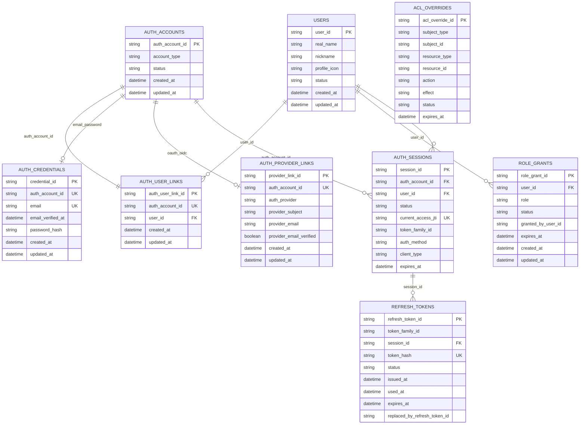

# 인증과 사용자 스키마 설계

## 목적

웹, 모바일, 내부 QA 도구가 같은 JWT 기반 인증 구조를 사용하고, 인증/인가가 필요한 API의 내부 인가 판단도 같은 구조로 수행할 수 있도록 공통 스키마를 정의한다.

이 문서는 API 계약보다 내부 모델과 저장 구조를 먼저 다룬다.

## 엔티티 관계 다이어그램



## 도메인 타입 구분

| 타입 | DDD 구분 | 소유 컨텍스트 | 설명 |
| --- | --- | --- | --- |
| `User` | Aggregate Root | user-service | DropMong 사용자 프로필과 사용자 상태의 일관성 경계다. |
| `AuthAccount` | Aggregate Root | auth-service | 인증 수단별 계정의 일관성 경계다. |
| `AuthCredential` | Entity | auth-service | 이메일/비밀번호 인증 수단이다. `AuthAccount`에 속한다. |
| `AuthProviderLink` | Entity | auth-service | OAuth/OIDC 인증 수단이다. `AuthAccount`에 속한다. |
| `AuthUserLink` | Entity | auth-service | 인증 계정과 `user_id`의 연결이다. |
| `RoleGrant` | Entity | auth-service | `user_id` 기준 role 부여 상태다. |
| `ACLOverride` | Entity | auth-service | RBAC를 보완하는 예외 허용/차단 정책이다. |
| `AuthSession` | Entity | auth-service | 인증 세션 상태다. |
| `RefreshToken` | Entity | auth-service | refresh token rotation 상태다. |
| `AuthContext` | Value Object | service runtime | 요청 단위로 만들어지는 내부 인가 판단 값이다. 저장하지 않는다. |
| `Resource` | Policy Input Value Object | domain service -> auth-service | 도메인 서비스가 권한 확인 시 전달하는 리소스 설명 값이다. |

## 검토 질문

1. 내부 서비스로 전달할 `X-User-*` 헤더의 필수 필드는 무엇인가요?
2. 서비스 내부 Principal/AuthContext는 어떤 필드로 구성하나요?
3. user_id는 어떤 형식으로 발급하나요?
4. `auth_provider + provider_subject`에 대한 unique constraint를 어떻게 둘까요?
5. 이메일은 인증 계정의 보조 식별자로만 저장하고, 로그인 매칭에는 사용하지 않는 것으로 확정하나요?
6. ACL override의 subject/resource/action/effect 스키마를 어떤 형태로 둘까요?
7. ACL override 충돌 시 명시적 deny 우선 규칙을 스키마와 평가 모델에 어떻게 표현하나요?
8. 웹/모바일 공통 세션과 refresh token 저장 구조는 어떻게 구성하나요?
9. 사용자 식별 헤더 계약 버전을 저장하거나 전달해야 하나요?
10. 고위험 서비스용 인증 계약 v2 전환을 위해 어떤 version 필드가 필요한가요?

## 공통 인가 모델

웹과 모바일은 같은 access token과 refresh token 구조를 사용한다. access token은 JWT이고, refresh token은 opaque token이며, auth-service는 refresh token 원문을 저장하지 않고 hash만 저장한다. 인증/인가가 필요한 도메인 API는 클라이언트 종류에 의존하지 않고 공통 모델을 사용한다.

인가 판단이 필요한 API는 서비스 내부 `Principal` 또는 `AuthContext`, 도메인 서비스가 전달한 `Resource`, RBAC policy, ACL override를 함께 사용한다. 인증 방식이 달라도 내부 서비스는 Istio IngressGateway가 생성한 `X-User-*` 헤더만 신뢰하고, 필요한 API에서만 이 헤더를 애플리케이션 레벨 객체로 변환해 사용한다.

## 사용자 식별 헤더 스키마

`X-User-*`는 Istio IngressGateway가 JWT를 검증한 뒤 내부 서비스로 전달하는 wire contract다.

필수 헤더:

| Header | Source claim | 필수 | 설명 |
| --- | --- | --- | --- |
| `X-User-Id` | `sub` | Yes | 내부 사용자 식별자 |
| `X-User-Role` | `role` | Yes | `CUSTOMER`, `PROVIDER`, `ADMIN` 중 하나 |
| `X-Token-Id` | `jti` | Yes | access token 식별자 |

선택 헤더:

| Header | Source claim | 설명 |
| --- | --- | --- |
| `X-Auth-Issuer` | `iss` | 발급자 추적용. 기본값은 `auth-service`다. |
| `X-Auth-Method` | gateway 내부 값 | 현재는 `jwt`를 기본으로 둔다. |

인증/인가가 필요한 API는 Istio IngressGateway가 JWT 검증 후 만든 `X-User-*` 헤더만 신뢰한다.

이메일은 개인정보이므로 `X-User-*` 헤더로 전달하지 않는다. 로그인 이메일과 provider email은 auth-service 내부 저장소에서 인증 수단 식별, 중복 후보 탐색, 감사 기록에 필요한 범위로만 사용한다.

## 서비스 내부 Principal/AuthContext 스키마

`Principal` 또는 `AuthContext`는 헤더가 아니라 서비스 애플리케이션 내부 Value Object다. 모든 요청에서 만들 필요는 없고, 사용자 식별이나 인가 판단이 필요한 API에서만 생성한다.

```go
type PrincipalType string

const (
	PrincipalAnonymous PrincipalType = "anonymous"
	PrincipalUser      PrincipalType = "user"
	PrincipalService   PrincipalType = "service"
)

// Value Object: 요청 단위로 생성되는 내부 인가 판단 값이다.
type AuthContext struct {
	// Type은 핸들러와 정책 평가에서 사용하는 정규화된 요청 주체 종류다.
	Type PrincipalType `json:"type"`

	// UserID는 X-User-Id에서 온 DropMong 내부 사용자 식별자다.
	UserID string `json:"userId,omitempty"`

	// Roles는 CUSTOMER, PROVIDER, ADMIN 같은 정규화된 RBAC role 목록이다.
	Roles []string `json:"roles,omitempty"`

	// AuthMethods는 jwt, mfa처럼 요청 주체가 인증된 방식을 나타낸다.
	AuthMethods []string `json:"authMethods,omitempty"`

	// AuthLevel은 고위험 API에서 사용할 수 있는 대략적인 인증 강도다.
	AuthLevel string `json:"authLevel,omitempty"`

	// TokenID는 X-Token-Id에서 온 access token jti다.
	TokenID string `json:"tokenId,omitempty"`

	// ClientType은 web, ios, android, api 같은 호출 표면을 나타낸다.
	ClientType string `json:"clientType,omitempty"`

	// DeviceID는 안정적인 기기 바인딩이 있는 클라이언트에서만 사용하는 선택 값이다.
	DeviceID string `json:"deviceId,omitempty"`
}
```

변환 규칙:

- `X-User-Id` -> `user_id`
- `X-User-Role` -> `roles[0]`
- `X-Token-Id` -> `token_id`
- `X-Auth-Method` 없으면 `jwt`
- `client_type` 없으면 `api`

## Resource 스키마

`Resource`는 auth-service가 모든 도메인 리소스를 저장한다는 뜻이 아니다. 도메인 서비스가 권한 판단을 요청할 때 전달하는 최소 리소스 설명 객체다.

```go
// Policy Input Value Object: 도메인 서비스가 권한 확인 시 전달하는 리소스 설명 값이다.
type Resource struct {
	// Type은 drop, order, coupon_policy 같은 도메인 리소스 종류다.
	Type string `json:"type"`

	// ID는 특정 리소스 인스턴스 식별자다. 목록 조회나 생성 액션에서는 비어 있을 수 있다.
	ID string `json:"id,omitempty"`

	// OwnerUserID는 소유권 판단이 필요한 경우 도메인 서비스가 전달하는 사용자 ID다.
	OwnerUserID string `json:"ownerUserId,omitempty"`

	// Visibility는 public, private, internal 같은 도메인 소유 공개 범위 힌트다.
	Visibility string `json:"visibility,omitempty"`

	// Status는 도메인 리소스 상태다. user-service의 UserStatus가 아니다.
	Status string `json:"status,omitempty"`
}
```

도메인 리소스의 원천 데이터와 소유권 판정은 해당 도메인 서비스가 책임진다. auth-service는 전달받은 `Resource`와 role/ACL 정책을 조합해 예외 허용 또는 차단 여부를 판단한다.

## ACL Override 스키마

ACL override는 RBAC 정책을 보완하는 auth-service 내부 정책 엔티티다. 일반 권한은 role로 표현하고, 예외 허용 또는 차단이 필요한 경우에만 ACL override를 사용한다.

```go
type ACLSubjectType string

const (
	ACLSubjectUser    ACLSubjectType = "user"
	ACLSubjectRole    ACLSubjectType = "role"
	ACLSubjectService ACLSubjectType = "service"
)

type ACLEffect string

const (
	ACLEffectAllow ACLEffect = "allow"
	ACLEffectDeny  ACLEffect = "deny"
)

type ACLStatus string

const (
	ACLStatusActive   ACLStatus = "active"
	ACLStatusDisabled ACLStatus = "disabled"
)

// Entity: RBAC 정책을 보완하는 예외 허용/차단 정책이다.
type ACLOverride struct {
	// ID는 ACL override 엔티티의 식별자다.
	ID string `json:"aclOverrideId"`

	// SubjectType은 정책 대상 종류다. user, role, service 중 하나다.
	SubjectType ACLSubjectType `json:"subjectType"`

	// SubjectID는 정책 대상 식별자다. user_id, role 이름, service 이름이 들어간다.
	SubjectID string `json:"subjectId"`

	// ResourceType은 정책이 적용되는 도메인 리소스 종류다.
	ResourceType string `json:"resourceType"`

	// ResourceID는 특정 리소스 인스턴스 식별자다. 비어 있으면 resource_type 전체에 적용한다.
	ResourceID string `json:"resourceId,omitempty"`

	// Action은 read, write, manage 같은 권한 검증 액션이다.
	Action string `json:"action"`

	// Effect는 예외 허용 또는 차단을 표현한다. deny가 allow보다 우선한다.
	Effect ACLEffect `json:"effect"`

	// Reason은 운영자가 남기는 정책 변경 사유다.
	Reason string `json:"reason"`

	// Status는 정책 활성 여부다.
	Status ACLStatus `json:"status"`

	// ExpiresAt은 정책 만료 시각이다. nil이면 명시적으로 해제할 때까지 유지한다.
	ExpiresAt *time.Time `json:"expiresAt,omitempty"`

	// CreatedByUserID는 정책을 만든 운영자 user_id다.
	CreatedByUserID string `json:"createdByUserId"`

	// CreatedAt은 정책 생성 시각이다.
	CreatedAt time.Time `json:"createdAt"`

	// UpdatedAt은 정책 수정 시각이다.
	UpdatedAt time.Time `json:"updatedAt"`
}
```

제약:

- `subject_type`, `subject_id`, `resource_type`, `resource_id`, `action`, `effect` 조합은 중복 저장하지 않는다.
- `resource_id`가 비어 있으면 해당 `resource_type` 전체에 대한 정책으로 본다.
- `expires_at`이 지나면 정책 평가 대상에서 제외한다.
- 같은 subject/resource/action에 allow와 deny가 동시에 적용되면 deny가 우선한다.
- ACL override 변경은 audit log와 정책 캐시 무효화를 함께 수행해야 한다.

## 인증 계정 연결 스키마

인증 정보와 사용자 계정 연결 정보는 테이블 관점에서 분리한다.

```go
type AuthAccountType string

const (
	AuthAccountEmailPassword AuthAccountType = "email_password"
	AuthAccountOAuthOIDC     AuthAccountType = "oauth_oidc"
	AuthAccountDevToken      AuthAccountType = "dev_token"
)

type AuthAccountStatus string

const (
	AuthAccountActive   AuthAccountStatus = "active"
	AuthAccountDisabled AuthAccountStatus = "disabled"
)

// Aggregate Root: 인증 수단별 계정의 일관성 경계다.
type AuthAccount struct {
	// ID는 인증 수단별 계정 식별자다.
	ID string `json:"authAccountId"`

	// Type은 이메일/비밀번호, OAuth/OIDC, 개발 토큰 같은 인증 계정 종류다.
	Type AuthAccountType `json:"accountType"`

	// Status는 인증 계정의 활성 여부다.
	Status AuthAccountStatus `json:"status"`

	// CreatedAt은 인증 계정 생성 시각이다.
	CreatedAt time.Time `json:"createdAt"`

	// UpdatedAt은 인증 계정 수정 시각이다.
	UpdatedAt time.Time `json:"updatedAt"`
}

// Entity: 이메일/비밀번호 인증 수단이다. AuthAccount에 속한다.
type AuthCredential struct {
	// ID는 이메일/비밀번호 credential 식별자다.
	ID string `json:"credentialId"`

	// AuthAccountID는 이 credential이 속한 AuthAccount 식별자다.
	AuthAccountID string `json:"authAccountId"`

	// Email은 로그인에 사용하는 정규화된 이메일이다. 내부 서비스 헤더에는 노출하지 않는다.
	Email string `json:"email"`

	// EmailVerifiedAt은 이메일 소유 검증이 완료된 시각이다.
	EmailVerifiedAt *time.Time `json:"emailVerifiedAt,omitempty"`

	// PasswordHash는 비밀번호 원문이 아니라 안전하게 해시한 값이다.
	PasswordHash string `json:"passwordHash"`

	// CreatedAt은 credential 생성 시각이다.
	CreatedAt time.Time `json:"createdAt"`

	// UpdatedAt은 credential 수정 시각이다.
	UpdatedAt time.Time `json:"updatedAt"`
}

// Entity: OAuth/OIDC 인증 수단이다. AuthAccount에 속한다.
type AuthProviderLink struct {
	// ID는 OAuth/OIDC provider link 식별자다.
	ID string `json:"providerLinkId"`

	// AuthAccountID는 이 provider link가 속한 AuthAccount 식별자다.
	AuthAccountID string `json:"authAccountId"`

	// Provider는 google, kakao, apple 같은 외부 인증 제공자 이름이다.
	Provider string `json:"authProvider"`

	// ProviderSubject는 provider가 발급한 원본 subject다.
	ProviderSubject string `json:"providerSubject"`

	// ProviderEmail은 provider가 제공한 이메일이다. 사용자 프로필 원천이 아니다.
	ProviderEmail string `json:"providerEmail,omitempty"`

	// ProviderEmailVerified는 provider가 이메일 검증 여부를 제공한 경우의 값이다.
	ProviderEmailVerified bool `json:"providerEmailVerified"`

	// CreatedAt은 provider link 생성 시각이다.
	CreatedAt time.Time `json:"createdAt"`

	// UpdatedAt은 provider link 수정 시각이다.
	UpdatedAt time.Time `json:"updatedAt"`
}

// Entity: 인증 계정과 user_id의 연결이다.
type AuthUserLink struct {
	// ID는 인증 계정과 사용자 연결 식별자다.
	ID string `json:"authUserLinkId"`

	// AuthAccountID는 user_id에 연결되는 인증 수단별 계정 식별자다.
	AuthAccountID string `json:"authAccountId"`

	// UserID는 DropMong 내부 사용자 식별자다.
	UserID string `json:"userId"`

	// CreatedAt은 연결 생성 시각이다.
	CreatedAt time.Time `json:"createdAt"`

	// UpdatedAt은 연결 수정 시각이다.
	UpdatedAt time.Time `json:"updatedAt"`
}

type RoleGrantStatus string

const (
	RoleGrantActive   RoleGrantStatus = "active"
	RoleGrantDisabled RoleGrantStatus = "disabled"
)

// Entity: user_id 기준 role 부여 상태다.
type RoleGrant struct {
	// ID는 role grant 식별자다.
	ID string `json:"roleGrantId"`

	// UserID는 role을 부여받는 DropMong 내부 사용자 식별자다.
	UserID string `json:"userId"`

	// Role은 CUSTOMER, PROVIDER, ADMIN 같은 정규화된 role이다.
	Role string `json:"role"`

	// Status는 role grant 활성 여부다.
	Status RoleGrantStatus `json:"status"`

	// GrantedByUserID는 role을 부여한 운영자 user_id다.
	GrantedByUserID string `json:"grantedByUserId,omitempty"`

	// ExpiresAt은 role grant 만료 시각이다. nil이면 명시적으로 회수할 때까지 유지한다.
	ExpiresAt *time.Time `json:"expiresAt,omitempty"`

	// CreatedAt은 role grant 생성 시각이다.
	CreatedAt time.Time `json:"createdAt"`

	// UpdatedAt은 role grant 수정 시각이다.
	UpdatedAt time.Time `json:"updatedAt"`
}

// Aggregate Root: user-service가 소유하는 사용자 프로필과 상태의 일관성 경계다.
type User struct {
	// ID는 DropMong 내부 사용자 식별자다.
	ID string `json:"userId"`

	// RealName은 user-service가 소유하는 실명 프로필 값이다.
	RealName string `json:"realName"`

	// Nickname은 user-service가 소유하는 표시 이름이다.
	Nickname string `json:"nickname"`

	// ProfileIcon은 user-service가 소유하는 프로필 아이콘 식별자다.
	ProfileIcon string `json:"profileIcon"`

	// Status는 user-service가 소유하는 사용자 상태다.
	Status string `json:"status"`

	// CreatedAt은 사용자 생성 시각이다.
	CreatedAt time.Time `json:"createdAt"`

	// UpdatedAt은 사용자 수정 시각이다.
	UpdatedAt time.Time `json:"updatedAt"`
}
```

분리 기준:

- `auth_accounts`는 인증 수단별 계정이다. 이메일/비밀번호, Google, Kakao, Apple 같은 인증 수단은 각각 별도의 `AuthAccount`가 된다.
- `auth_credentials`와 `auth_provider_links`는 인증 수단과 외부 provider 식별자를 저장한다.
- `auth_user_links`는 인증 계정이 어떤 사용자 계정에 귀속되는지 저장한다. `auth_account_id`는 unique이고, `user_id`는 unique가 아니다.
- 하나의 `user_id`에는 여러 `auth_account_id`가 연결될 수 있다.
- `role_grants`는 인증 수단이 아니라 `user_id` 기준으로 role을 부여한다.
- `users`는 사용자 도메인의 최소 사용자 정보를 저장한다.
- 로그인 매칭은 이메일이 아니라 `auth_provider + provider_subject` 또는 credential 식별 기준을 사용한다.
- 사용자 기능은 인증 수단 상세를 직접 참조하지 않고 `user_id`를 기준으로 동작한다.

최소 제약:

| 대상 | 제약 |
| --- | --- |
| `auth_accounts.account_type` | `email_password`, `oauth_oidc`, `dev_token` 중 하나 |
| `auth_accounts.status` | `active`, `disabled` 중 하나 |
| `auth_credentials.auth_account_id` | unique |
| `auth_credentials.email` | normalized email 기준 unique |
| `auth_provider_links.auth_account_id` | unique |
| `auth_provider_links.auth_provider + provider_subject` | unique |
| `auth_user_links.auth_account_id` | unique |
| `auth_user_links.user_id` | index. unique 아님 |
| `role_grants.user_id + role` | active role 중복 방지 |

## 세션과 토큰 스키마

access token은 짧은 수명의 JWT이고, refresh token은 서버 상태를 가진 opaque token이다. auth-service는 refresh token 원문을 저장하지 않고 hash만 저장한다.

```go
type AuthSessionStatus string

const (
	AuthSessionActive  AuthSessionStatus = "active"
	AuthSessionRevoked AuthSessionStatus = "revoked"
	AuthSessionExpired AuthSessionStatus = "expired"
)

type ClientType string

const (
	ClientWeb     ClientType = "web"
	ClientIOS     ClientType = "ios"
	ClientAndroid ClientType = "android"
	ClientAPI     ClientType = "api"
)

// Entity: auth-service가 소유하는 인증 세션 상태다.
type AuthSession struct {
	// ID는 인증 세션 식별자다.
	ID string `json:"sessionId"`

	// AuthAccountID는 이 세션을 만든 인증 수단별 계정 식별자다.
	AuthAccountID string `json:"authAccountId"`

	// UserID는 이 세션이 귀속되는 DropMong 내부 사용자 식별자다.
	UserID string `json:"userId"`

	// Status는 세션의 현재 상태다.
	Status AuthSessionStatus `json:"status"`

	// CurrentAccessJTI는 현재 access token의 jti다.
	CurrentAccessJTI string `json:"currentAccessJti"`

	// TokenFamilyID는 refresh token rotation 계열 식별자다.
	TokenFamilyID string `json:"tokenFamilyId"`

	// AuthMethod는 jwt, oauth_oidc, dev_token 같은 인증 방식이다.
	AuthMethod string `json:"authMethod"`

	// ClientType은 web, ios, android, api 같은 호출 표면이다.
	ClientType ClientType `json:"clientType"`

	// CreatedAt은 세션 생성 시각이다.
	CreatedAt time.Time `json:"createdAt"`

	// LastSeenAt은 세션을 마지막으로 사용한 시각이다.
	LastSeenAt *time.Time `json:"lastSeenAt,omitempty"`

	// ExpiresAt은 세션 만료 시각이다.
	ExpiresAt time.Time `json:"expiresAt"`

	// RevokedAt은 세션 폐기 시각이다.
	RevokedAt *time.Time `json:"revokedAt,omitempty"`
}

type RefreshTokenStatus string

const (
	RefreshTokenActive  RefreshTokenStatus = "active"
	RefreshTokenUsed    RefreshTokenStatus = "used"
	RefreshTokenRevoked RefreshTokenStatus = "revoked"
	RefreshTokenExpired RefreshTokenStatus = "expired"
)

// Entity: refresh token rotation 상태다.
type RefreshToken struct {
	// ID는 refresh token 레코드 식별자다.
	ID string `json:"refreshTokenId"`

	// TokenFamilyID는 refresh token rotation 계열 식별자다.
	TokenFamilyID string `json:"tokenFamilyId"`

	// SessionID는 이 refresh token이 속한 세션 식별자다.
	SessionID string `json:"sessionId"`

	// TokenHash는 refresh token 원문이 아니라 해시한 값이다.
	TokenHash string `json:"tokenHash"`

	// Status는 refresh token의 현재 상태다.
	Status RefreshTokenStatus `json:"status"`

	// IssuedAt은 refresh token 발급 시각이다.
	IssuedAt time.Time `json:"issuedAt"`

	// UsedAt은 refresh token이 갱신에 사용된 시각이다.
	UsedAt *time.Time `json:"usedAt,omitempty"`

	// ExpiresAt은 refresh token 만료 시각이다.
	ExpiresAt time.Time `json:"expiresAt"`

	// RevokedAt은 refresh token 폐기 시각이다.
	RevokedAt *time.Time `json:"revokedAt,omitempty"`

	// ReplacedByRefreshTokenID는 rotation 후 새 refresh token 식별자다.
	ReplacedByRefreshTokenID string `json:"replacedByRefreshTokenId,omitempty"`
}
```

제약:

- `auth_sessions.current_access_jti`는 활성 세션 안에서 중복되지 않아야 한다.
- `refresh_tokens.token_hash`는 unique다.
- refresh token 갱신 시 기존 token은 `used`가 되고 새 token hash가 같은 `token_family_id`로 생성된다.
- `used` 또는 `revoked` refresh token이 다시 사용되면 같은 `token_family_id`의 활성 token과 session을 폐기한다.
- 로그아웃은 현재 session과 활성 refresh token을 폐기한다.
- access token에는 `iss`, `sub`, `role`, `iat`, `exp`, `jti`처럼 검증과 인가에 필요한 최소 claim만 담는다. 이메일 같은 개인정보 claim은 넣지 않는다.

## 저장소 전환 기준
