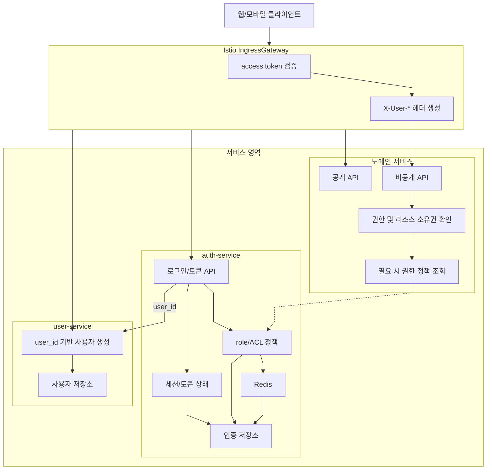
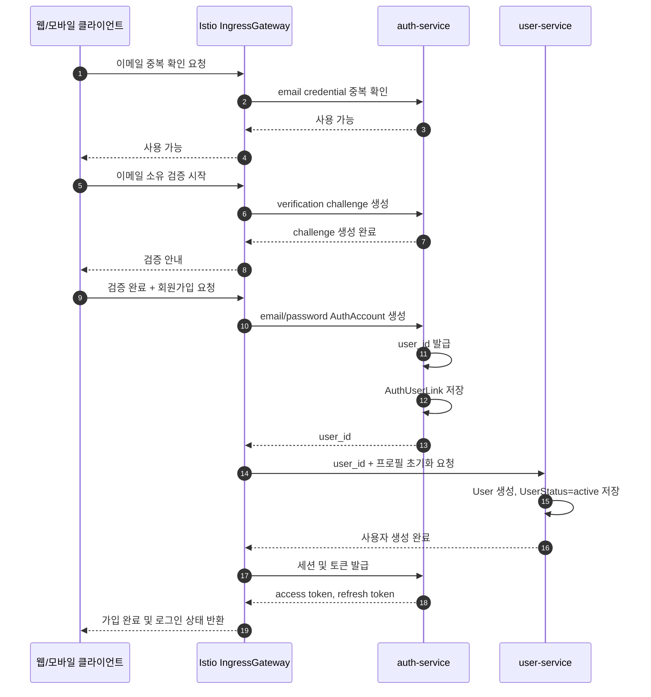
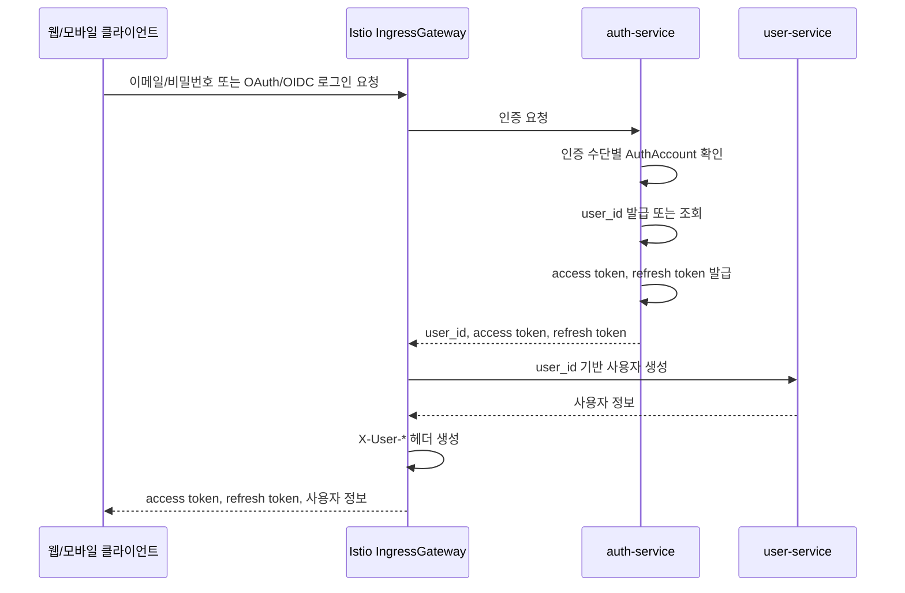
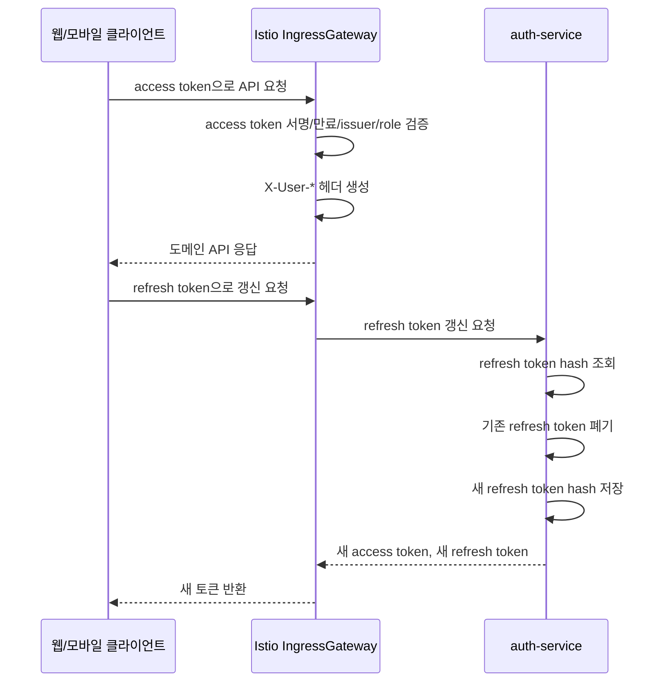
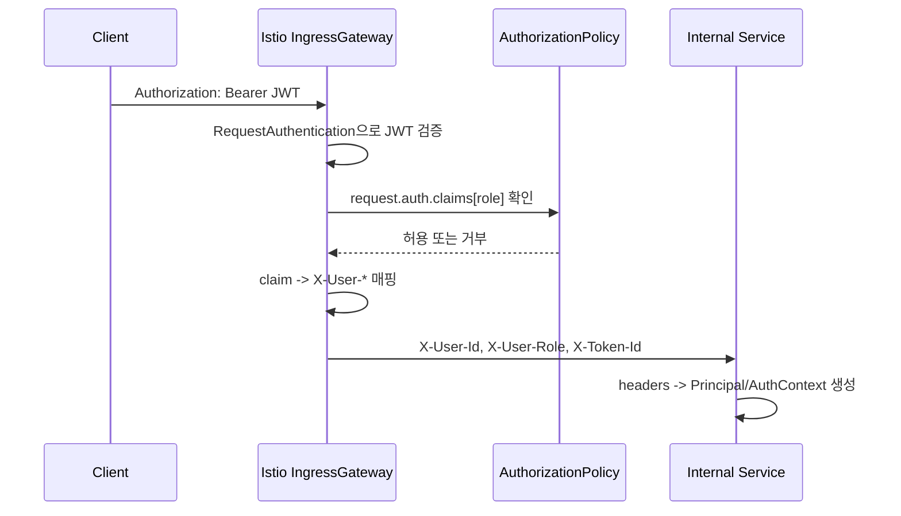
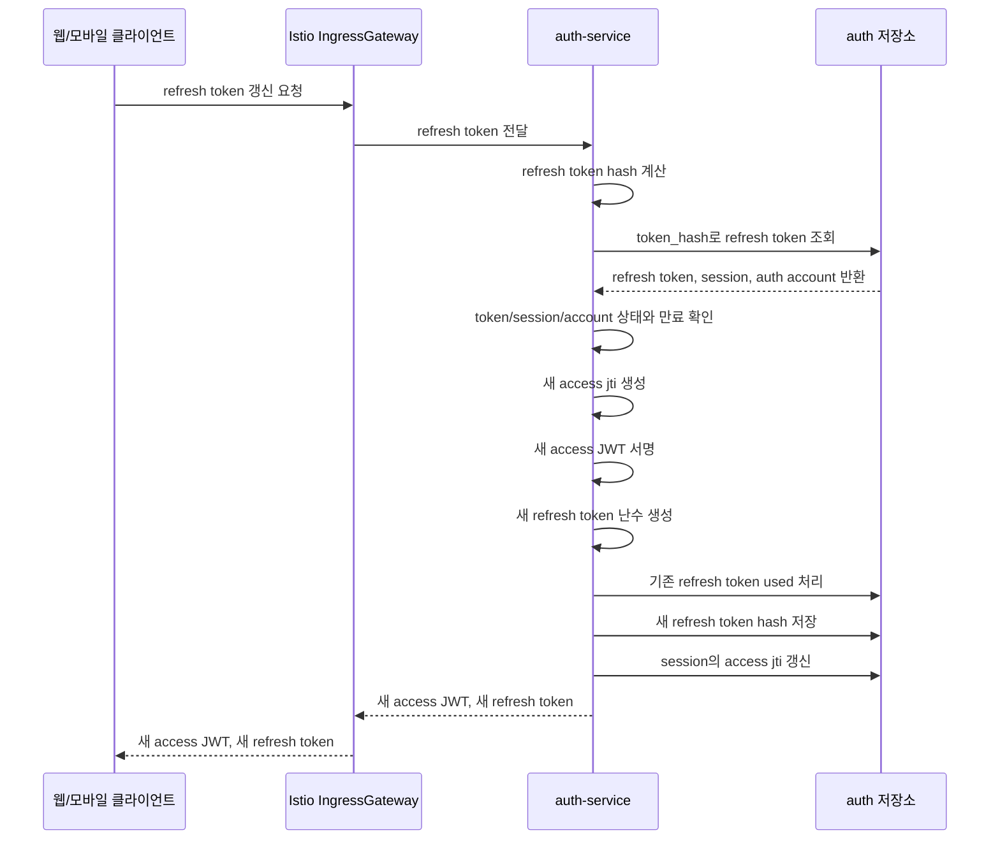
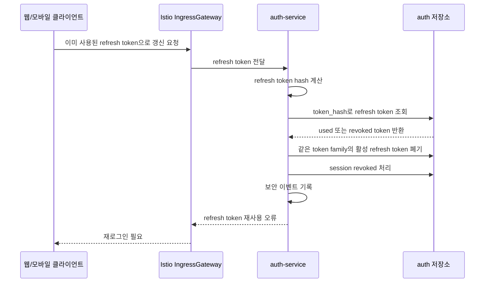
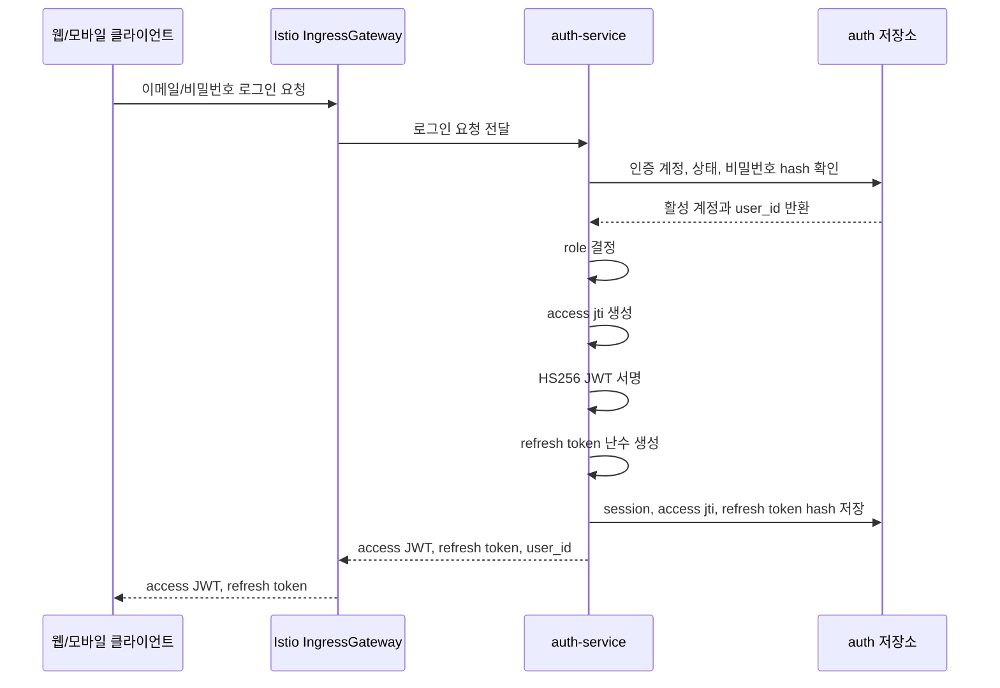
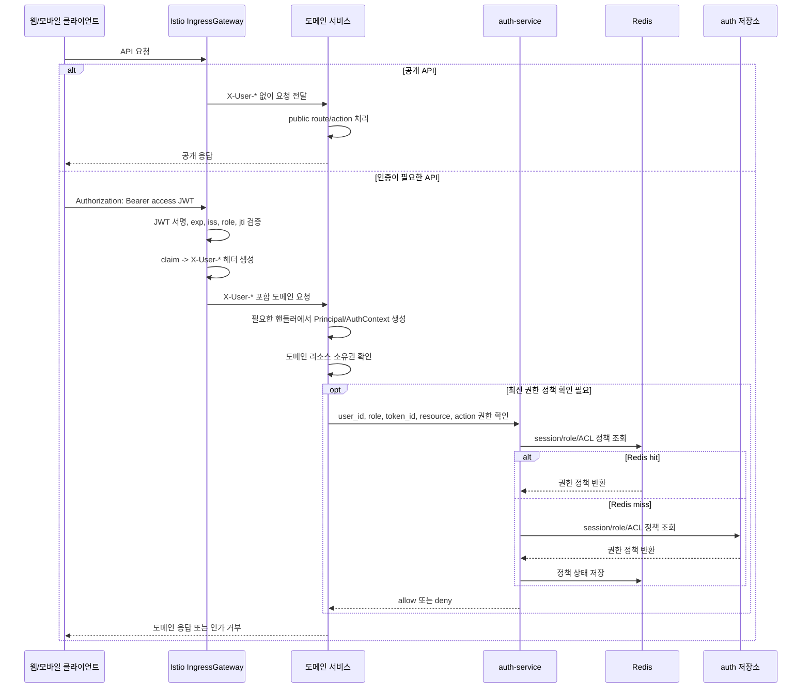
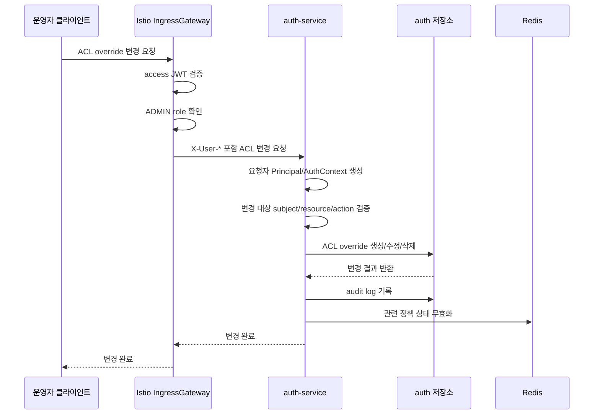

# 인증과 사용자 서비스 설계

## 1. 최종 서비스 구성



### 1.1 결론

- 웹과 모바일 클라이언트는 같은 access token과 refresh token 구조를 사용한다.
- access token은 JWT로 발급하되, 내부 서비스가 직접 디코딩하지 않는다.
- Istio IngressGateway가 JWT를 검증하고 내부 서비스용 `X-User-*` 헤더로 정규화한다.
- refresh token은 서버 상태를 가진 장기 자격 증명으로 보고, 사용할 때마다 회전한다.
- auth-service는 인증 수단별 인증 계정, 토큰, 세션, role, ACL 정책을 소유한다.
- role, ACL, 세션 상태가 필요한 권한 검증은 stateful하므로 필요할 때 auth-service가 정책 상태를 확인한다.
- 일반 사용자 API는 대부분 stateless 검증으로 처리하고, 운영/보안 API는 stateful 검증을 요구한다.
- user-service는 `user_id` 기반 사용자 생성과 사용자 상태를 소유한다.
- 도메인 서비스는 공개 API와 비공개 API를 제공한다. 비공개 API에서는 필요한 경우 `X-User-*`를 기준으로 권한 및 리소스 소유권을 확인한다.
- 도메인 서비스는 role/ACL/세션 최신 상태가 필요한 경우에만 auth-service에 권한 정책을 조회한다.
- auth-service와 user-service 사이의 공유 식별자는 `user_id` 하나로 제한한다.
- 인가 차단은 user-service의 사용자 상태가 아니라 auth-service의 role/ACL 정책으로 처리한다.

### 1.2 서비스 책임 기준

| 서비스 | 소유 책임 | 소유하지 않는 것 |
| --- | --- | --- |
| Istio IngressGateway | access token 검증, `X-User-*` 헤더 생성 | 인증 계정 저장, 사용자 프로필 저장 |
| auth-service | 인증 수단별 인증 계정, `user_id` 발급/연결, access token 발급, refresh token 회전, 세션 폐기, role/ACL 정책, 권한 정책 조회 | 사용자 프로필, 실명/닉네임/프로필 아이콘, 사용자 상태 |
| user-service | `user_id` 기반 사용자 생성, 사용자 프로필, 사용자 상태 | 비밀번호, OAuth/OIDC subject, refresh token, 세션, JWT 검증, 인가 차단 정책 |
| 도메인 서비스 | 공개/비공개 API 처리, 비공개 API의 권한 및 리소스 소유권 확인 | JWT 검증, 인증 계정 저장, role/ACL 정책 소유 |

user-service는 auth-service의 저장소를 직접 읽지 않는다. auth-service도 user-service 저장소를 직접 읽지 않는다.

## 2. 회원가입 처리 순서

웹과 모바일의 회원가입 화면은 이메일, 비밀번호, 프로필 정보를 한 번에 받을 수 있다. 다만 서비스 책임은 분리한다.

- auth-service는 이메일/비밀번호 인증 계정과 `user_id` 발급을 책임진다.
- user-service는 `user_id` 기반 사용자 프로필과 사용자 상태 생성을 책임진다.
- 가입 직후 자동 로그인은 auth-service가 세션과 토큰을 발급해서 처리한다.



프로필 초기화 실패는 사용자 도메인 실패로 처리한다. auth-service가 이미 `AuthAccount`와 `user_id`를 만든 뒤라면 user-service의 프로필 초기화는 같은 `user_id`로 재시도 가능해야 한다.

OAuth/OIDC 최초 로그인은 provider 검증 이후 `AuthAccount` 생성 또는 조회 단계부터 같은 구조를 사용한다. 인증 수단마다 별도 `AuthAccount`가 생기고, 같은 사용자의 인증 수단들은 같은 `user_id`에 연결된다.

## 3. 웹/모바일 공통 JWT 인증 처리 순서





## 4. 목적

요구사항, 컨텍스트 바운더리, 스키마, API 계약을 실제 서비스 책임과 런타임 처리 방식으로 연결한다.

이 문서는 웹과 모바일 클라이언트가 같은 JWT 인증 구조를 사용하는 것을 전제로 한다. 인증 유지 방식이 정해져야 access token, refresh token, session, device, 내부 사용자 식별 헤더 관련 스키마를 안정적으로 설계할 수 있다.

## 5. 검토 질문

1. 웹과 모바일 클라이언트는 JWT를 어떤 방식으로 사용하나요? → [웹/모바일 공통 JWT 인증 기본 방향](#61-웹모바일-공통-jwt-인증-기본-방향)
2. auth-service와 user-service는 어떤 책임으로 분리하나요? → [서비스 책임 기준](#12-서비스-책임-기준)
3. Istio IngressGateway는 JWT 검증을 어디까지 책임지나요? → [Istio IngressGateway 인증 검증](#71-istio-ingressgateway-인증-검증)
4. 내부 서비스는 JWT를 직접 디코딩하나요? → [내부 서비스 사용자 식별 헤더 신뢰 방식](#72-내부-서비스-사용자-식별-헤더-신뢰-방식)
5. refresh token은 어떻게 갱신하고 재사용 공격을 감지하나요? → [refresh token 회전](#81-refresh-token-회전)
6. 로그아웃은 어떤 토큰과 세션을 폐기하나요? → [로그아웃과 토큰 폐기](#11-로그아웃과-토큰-폐기)
7. user-service 장애 시 로그인은 어디까지 허용하나요? → [장애 시 동작 기준](#12-장애-시-동작-기준)
8. 웹과 모바일 클라이언트는 토큰을 어디에 보관하나요? → [클라이언트 토큰 보관 정책](#13-클라이언트-토큰-보관-정책)
9. 요청 종류별 토큰 검증과 권한 검증 강도는 어떻게 나누나요? → [토큰 검증 및 처리 정책](#9-토큰-검증-및-처리-정책)
10. ACL override가 변경되면 정책 상태는 어떻게 무효화하나요? → [ACL override 변경과 정책 무효화](#10-acl-override-변경과-정책-무효화)
11. 어떤 보안 이벤트와 감사 로그가 필요한가요? → [감사 로그와 관측성](#14-감사-로그와-관측성)

## 6. 설계 전제

- 웹과 모바일 클라이언트는 같은 인증 구조를 사용한다.
- 웹과 모바일 클라이언트는 public client로 본다. 클라이언트에 저장된 secret은 안전한 비밀로 보지 않는다.
- 클라이언트 인증은 access token과 refresh token을 사용한다.
- access token은 짧게 유지하고, refresh token은 서버 상태를 가진 장기 자격 증명으로 관리한다.
- refresh token은 매 갱신마다 회전한다.
- 내부 서비스는 외부 JWT claim 구조에 의존하지 않는다.
- Istio IngressGateway는 외부 인증 정보를 검증한 뒤 내부 서비스용 `X-User-*` 헤더로 정규화한다.
- auth-service와 user-service 사이의 공유 식별자는 `user_id` 하나로 제한한다.
- 인증 수단마다 별도 `AuthAccount`를 만들고, 여러 `AuthAccount`가 같은 `user_id`에 연결될 수 있다.
- 사용자 상태는 user-service만 소유한다.
- 인가 차단은 auth-service의 role/ACL 정책으로만 처리한다.
- role, ACL override, 세션 상태를 함께 보는 권한 검증은 auth-service의 정책 조회로 최신 상태를 확인한다. Redis는 정책 상태 조회와 무효화에 사용하는 필수 구성요소다.
- 일반 사용자 요청은 access token 기반 stateless 검증을 우선하고, 운영/보안 요청은 최신 상태를 확인하는 stateful 검증을 적용한다.

### 6.1 웹/모바일 공통 JWT 인증 기본 방향

웹과 모바일 클라이언트는 API 호출 시 access token을 전달한다.

```text
Authorization: Bearer <access_token>
```

access token은 JWT로 발급할 수 있다. 단, 내부 서비스가 이 JWT를 직접 신뢰하지 않는다. Istio IngressGateway가 서명, 만료, issuer, role enum, jti를 검증한 뒤 `X-User-*` 헤더를 생성한다.

refresh token은 JWT일 필요가 없다. 서버가 상태를 추적해야 하므로 불투명한 난수 문자열을 기본으로 둔다. auth-service는 refresh token 원문을 저장하지 않고 해시를 저장한다.

### 6.2 토큰 수명 기준

| 토큰 | 권장 방향 | 이유 |
| --- | --- | --- |
| access token | 짧은 만료 시간 | 탈취 시 피해 시간을 줄인다. |
| refresh token | 긴 만료 시간과 비활성 만료 | 재로그인 부담을 줄이되 장기 방치 토큰을 정리한다. |
| `X-User-*` 헤더 | 요청 단위 생성 | 내부 서비스가 외부 토큰 구조에 묶이지 않게 한다. |

구체적인 만료 시간은 스키마와 구현 계약 단계에서 확정한다. 이 문서에서는 저장 구조와 책임 분리를 먼저 정한다.

## 7. 요청 검증과 사용자 식별 헤더 전달

### 7.1 Istio IngressGateway 인증 검증

Istio IngressGateway는 외부 요청의 access token을 검증한다.

검증 항목:

- 서명
- 만료 시간
- issuer
- role enum
- `jti`

검증에 성공하면 Istio IngressGateway는 내부 서비스가 사용할 `X-User-*` 헤더를 만든다. 실패하면 내부 서비스로 요청을 넘기지 않는다.

### 7.2 내부 서비스 사용자 식별 헤더 신뢰 방식

내부 서비스는 원본 JWT를 직접 디코딩하지 않는다.

Istio IngressGateway는 검증된 JWT claim을 내부용 사용자 식별 헤더로 변환한다. 내부 서비스는 인증/인가가 필요한 API 핸들러에서만 이 헤더를 애플리케이션 레벨 Principal/AuthContext로 변환한다.

```text
client access token
-> Istio IngressGateway JWT validation
-> X-User-* header generation
-> internal service request
```

기본 헤더 계약은 다음과 같다.

```http
X-User-Id: <jwt.sub>
X-User-Role: CUSTOMER|PROVIDER|ADMIN
X-Token-Id: <jwt.jti>
```

필수 헤더:

| Header | 필수 | 설명 |
| --- | --- | --- |
| `X-User-Id` | Yes | JWT `sub`에서 온 내부 사용자 ID |
| `X-User-Role` | Yes | JWT `role`에서 온 role. `CUSTOMER`, `PROVIDER`, `ADMIN` |
| `X-Token-Id` | Yes | JWT `jti`에서 온 access token ID |

선택 헤더:

| Header | 설명 |
| --- | --- |
| `X-Auth-Issuer` | JWT `iss` 추적용 |
| `X-Auth-Method` | 기본값 `jwt` |

`X-User-Id`, `X-User-Role`, `X-Token-Id`는 인증이 필요한 비공개 API의 필수 헤더다. 이메일은 개인정보이므로 내부 서비스 전달 헤더에 포함하지 않는다. 내부 서비스는 해당 API가 사용자 식별이나 인가 판단을 필요로 할 때만 `X-User-*` 헤더를 애플리케이션 레벨 Principal/AuthContext로 변환한다.

### 7.3 Istio 기준 처리



Istio에서는 `RequestAuthentication`과 `AuthorizationPolicy`로 JWT 검증과 role 검사를 처리한다. claim을 헤더로 옮기는 단계는 Istio 버전과 운영 정책에 따라 `claimToHeaders`, `EnvoyFilter`, 또는 `ext_authz` 중 하나로 구현한다.

## 8. 토큰 발급과 갱신

### 8.1 refresh token 회전

refresh token은 사용할 때마다 새 값으로 교체한다.

이전 refresh token이 다시 사용되면 재사용 공격으로 본다. auth-service는 같은 token family의 활성 refresh token을 폐기하고 재로그인을 요구한다.

정상 갱신 처리는 다음 순서로 수행한다.



갱신 요청은 원자적으로 처리한다. 기존 refresh token을 `used`로 바꾸고 새 refresh token hash를 저장하는 작업, session의 access `jti`를 교체하는 작업이 함께 성공해야 한다. 중간에 실패하면 새 토큰을 반환하지 않는다.

재사용 감지는 다음 순서로 처리한다.



다음 조건에서는 refresh token 갱신을 거부한다.

- refresh token hash를 찾을 수 없다.
- refresh token이 만료됐다.
- refresh token 상태가 `active`가 아니다.
- 연결된 session 상태가 `active`가 아니다.
- 연결된 인증 계정 상태가 `active`가 아니다.
- 새 access token 또는 새 refresh token 저장에 실패했다.

저장소는 refresh token 원문을 저장하지 않는다. 저장 항목은 `token_hash`, `token_family_id`, `session_id`, `status`, `issued_at`, `used_at`, `expires_at`, `revoked_at`, `replaced_by_refresh_token_id`를 기본으로 둔다.

### 8.2 access token 발급

access token에는 Istio IngressGateway 검증에 필요한 최소 claim만 담는다.



필수 claim 초안:

- `iss`
- `sub`
- `role`
- `iat`
- `exp`
- `jti`

access token에는 이메일 같은 개인정보 claim을 넣지 않는다. 로그인 이메일과 provider email은 auth-service 내부 credential/provider link 저장소에서만 다룬다.

role은 `CUSTOMER`, `PROVIDER`, `ADMIN` 중 하나로 제한한다. ACL 상세를 access token에 과도하게 넣지 않는다. 권한 정책이 자주 바뀌면 access token이 낡은 권한을 오래 들고 있을 수 있다. Istio IngressGateway 또는 auth-service의 정책 조회를 통해 `X-User-*` 생성 또는 서비스 내부 AuthContext 생성 시 반영하는 방향을 기본으로 둔다.

## 9. 토큰 검증 및 처리 정책

모든 요청에 같은 수준의 권한 검증을 적용하지 않는다.

일반 사용자 요청은 대부분 access token 검증과 `X-User-*` 기반 판단으로 처리한다. 운영, 보안, 권한 변경, 세션 폐기처럼 위험도가 높은 요청은 최신 세션 상태와 정책 상태를 확인하는 stateful 검증을 적용한다.

| 요청 유형 | 검증 방식 | auth-service 실시간 의존 |
| --- | --- | --- |
| 공개 API | 인증 없음 | 없음 |
| 일반 사용자 API | access token 서명/만료 검증, `X-User-*` 생성 | 없음 |
| 내 리소스 API | access token 검증, `X-User-*` 생성, 도메인 소유권 확인 | 없음 |
| 판매자 일반 API | access token 검증, PROVIDER role 확인, 도메인 소유권 확인 | 보통 없음 |
| ACL override 필요 API | access token 검증, 도메인 서비스가 auth-service에 권한 정책 조회 | 있음 |
| 운영/보안 API | access token 검증, 세션 상태, 최신 role/ACL 확인, audit log | 있음 |
| 권한 변경 API | access token 검증, 최신 정책 확인, 변경 이력 기록 | 있음 |

일반 사용자 API에서 auth-service 장애가 발생해도 유효한 access token이 있으면 Istio IngressGateway가 JWT를 검증하고 요청을 계속 처리할 수 있어야 한다.

운영/보안 API는 최신 정책 확인에 실패하면 거부한다. 이 요청들은 장애 시 가용성보다 안전성을 우선한다.

공개 API, 일반 비공개 API, 권한 정책 확인이 필요한 비공개 API는 같은 진입점을 사용하되 필요한 검증 단계만 다르게 적용한다.



Redis는 권한 검증 과정에서 사용하는 정책 상태 저장소다. 설계의 기준은 “도메인 서비스가 필요한 경우 auth-service에 최신 권한 정책을 확인한다”이며, auth-service는 Redis와 auth 저장소를 함께 사용해 정책 상태를 조회한다.

권한 정책 조회 대상은 다음과 같다.

- `session_id` 또는 access `jti` 상태
- `user_id`별 role grant
- ACL override 규칙
- policy version 또는 session version

role 변경, ACL override 변경, 로그아웃, 세션 폐기 시 auth-service는 관련 정책 상태를 무효화한다. Redis 장애 시 일반 요청은 auth 저장소 조회로 보강할 수 있지만, 고위험 요청은 최신 정책 확인에 실패하면 거부한다.

## 10. ACL override 변경과 정책 무효화

ACL override 변경은 auth-service의 운영/보안 API로 처리한다. 이 API는 최신 권한 정책을 바꾸므로 요청자 인증, ADMIN role 확인, 변경 이력 기록, 정책 상태 무효화를 함께 수행해야 한다.

기본 API 형태:

```http
POST /v1/internal/authz/acl-overrides
PATCH /v1/internal/authz/acl-overrides/{acl_override_id}
DELETE /v1/internal/authz/acl-overrides/{acl_override_id}
```

요청에는 최소한 `subject`, `resource`, `action`, `effect`, `reason`이 포함되어야 한다. `effect`는 `allow` 또는 `deny` 중 하나다. `deny`는 같은 subject/resource/action에 대한 allow보다 우선한다.

ACL 변경 처리는 다음 순서로 수행한다.



정책 상태 무효화 대상은 변경된 ACL의 영향 범위로 제한한다.

- 특정 `user_id` 대상 ACL이면 해당 사용자의 role/ACL 정책 상태를 무효화한다.
- 특정 resource/action 대상 ACL이면 해당 resource/action 조합의 정책 상태를 무효화한다.
- 전역 deny 또는 운영 정책 변경이면 관련 정책 version을 증가시켜 기존 정책 상태를 낡은 값으로 만든다.

Redis 무효화가 실패하면 ACL 변경 API는 성공으로 응답하지 않는다. ACL 저장소와 Redis 상태가 엇갈리면 고위험 API에서 잘못된 인가 판단이 발생할 수 있기 때문이다. 운영자가 의도적으로 Redis 장애 중 변경을 강행해야 하는 경우에는 별도 운영 절차로 Redis 복구 또는 전체 정책 상태 재빌드를 먼저 수행한다.

## 11. 로그아웃과 토큰 폐기

MVP의 기본 로그아웃은 현재 세션만 종료한다.

로그아웃 처리:

- 현재 `session_id`를 revoked 상태로 변경한다.
- 현재 refresh token을 폐기한다.
- 아직 만료되지 않은 access token은 짧은 만료 시간에 의존한다.
- 고위험 기능은 `session_id` 상태를 확인해 폐기된 세션을 거부할 수 있다.

모든 기기 로그아웃은 MVP 필수 기능이 아니다. 이후 확장 시 같은 `user_id`의 활성 session을 모두 폐기하는 API로 추가한다.

## 12. 장애 시 동작 기준

| 장애 상황 | 동작 기준 |
| --- | --- |
| auth-service 장애 | 신규 로그인, refresh token 갱신, 로그아웃 처리는 실패한다. 이미 검증 가능한 access token 요청은 Istio IngressGateway에서 만료 전까지 처리할 수 있다. |
| user-service 장애 | 로그인과 토큰 발급은 성공할 수 있다. 단, 사용자 정보 생성/조회가 필요한 화면은 실패한다. |
| Istio IngressGateway 장애 | 외부 요청 진입점이므로 인증 요청과 도메인 요청 모두 실패한다. |
| auth 저장소 장애 | 신규 로그인, refresh token 갱신, 세션 폐기, 정책 조회가 실패한다. |
| Redis 장애 | 일반 요청은 auth 저장소 조회로 보강할 수 있다. 고위험 요청은 최신 정책 확인 실패 시 거부한다. |

사용자 정보 지연 생성은 동기 요청을 기본으로 둔다. 로그인 직후 user-service에 `user_id` 기반 사용자 생성을 요청하고, 이미 있으면 그대로 반환한다.

## 13. 클라이언트 토큰 보관 정책

웹과 모바일 클라이언트는 access token을 메모리에 우선 보관한다.

refresh token은 플랫폼별 보안 저장소에 저장한다.

| 플랫폼 | refresh token 저장 위치 |
| --- | --- |
| Web | HttpOnly, Secure, SameSite 쿠키 또는 동등한 보안 저장소 |
| iOS | Keychain |
| Android | Keystore 기반 암호화 저장소 |

refresh token은 장기 자격 증명이므로 로그아웃, 재사용 감지, 계정 위험 이벤트가 발생하면 서버에서 폐기할 수 있어야 한다.

## 14. 감사 로그와 관측성

감사 로그 대상:

- 로그인 성공
- 로그인 실패
- access token 발급
- refresh token 갱신
- refresh token 재사용 감지
- 로그아웃
- 인증 수단 연결
- role 변경
- ACL override 변경
- 권한 정책 상태 무효화
- 개발 빌드 전용 테스트 토큰 발급

관측성 지표:

- 로그인 성공률
- 로그인 실패 사유
- refresh token 갱신 성공률
- refresh token 재사용 감지 건수
- Istio IngressGateway JWT 검증 실패 건수
- Istio IngressGateway identity header 생성 실패 건수
- auth-service 토큰 발급 지연 시간
- Redis hit/miss 비율
- Redis 장애 건수
- ACL override 변경 실패 건수
- 권한 정책 상태 무효화 실패 건수
- user-service 사용자 생성 지연 시간

## 15. 참고 자료

- [OWASP JWT Cheat Sheet](https://cheatsheetseries.owasp.org/cheatsheets/JSON_Web_Token_for_Java_Cheat_Sheet.html)
- [OWASP Testing JSON Web Tokens](https://owasp.org/www-project-web-security-testing-guide/latest/4-Web_Application_Security_Testing/06-Session_Management_Testing/10-Testing_JSON_Web_Tokens)
- [OWASP Mobile App Authentication Architectures](https://mas.owasp.org/MASTG/0x04e-Testing-Authentication-and-Session-Management/)
- [RFC 8252 OAuth 2.0 for Native Apps](https://datatracker.ietf.org/doc/html/rfc8252)
- [RFC 9700 OAuth 2.0 Security Best Current Practice](https://www.rfc-editor.org/info/rfc9700/)
