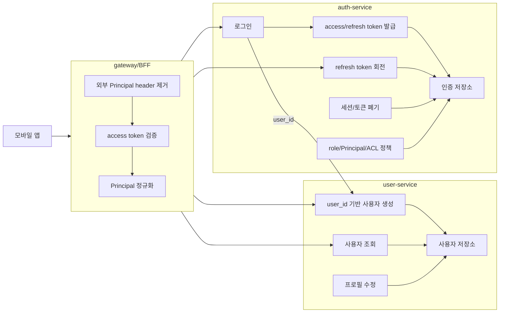
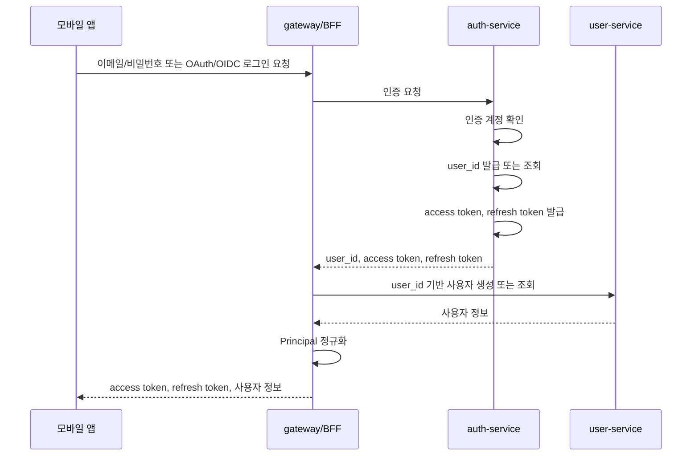
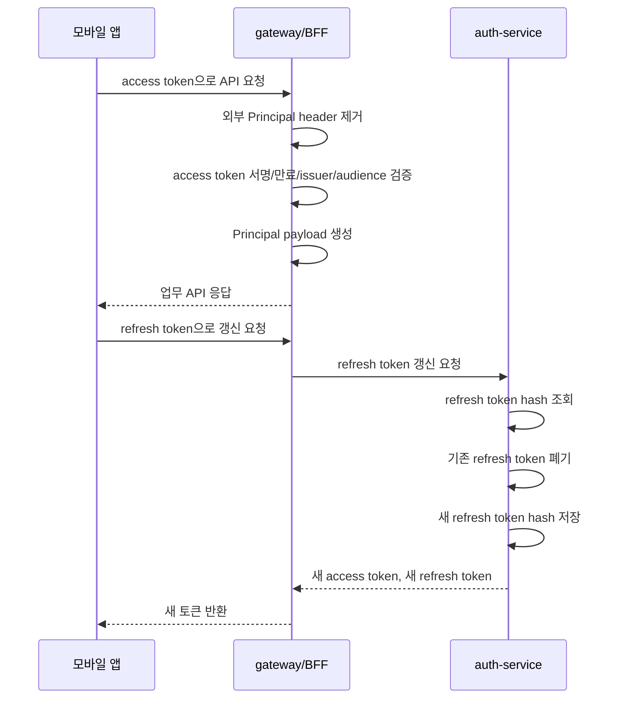

# 인증과 사용자 서비스 설계

## 1. 최종 서비스 구성



### 1.1 결론

- 모바일 앱은 access token과 refresh token을 사용한다.
- access token은 JWT로 발급하되, 내부 서비스가 직접 디코딩하지 않는다.
- gateway/BFF가 JWT를 검증하고 내부 서비스용 Principal payload로 정규화한다.
- refresh token은 서버 상태를 가진 장기 자격 증명으로 보고, 사용할 때마다 회전한다.
- auth-service는 인증 계정, 토큰, 세션, role, ACL 정책을 소유한다.
- user-service는 `user_id` 기반 사용자 생성, 조회, 프로필 관리를 소유한다.
- auth-service와 user-service 사이의 공유 식별자는 `user_id` 하나로 제한한다.

### 1.2 서비스 책임 기준

| 서비스 | 소유 책임 | 소유하지 않는 것 |
| --- | --- | --- |
| gateway/BFF | access token 검증, Principal 정규화, 외부 Principal header 제거 | 인증 계정 저장, 사용자 프로필 저장 |
| auth-service | 인증 수단, 인증 계정, `user_id` 발급/연결, access token 발급, refresh token 회전, 세션 폐기, role/ACL 정책 | 사용자 프로필, 실명/닉네임/프로필 아이콘 |
| user-service | `user_id` 기반 사용자 생성, 사용자 조회, 프로필 관리 | 비밀번호, OAuth/OIDC subject, refresh token, 세션 |

user-service는 auth-service의 저장소를 직접 읽지 않는다. auth-service도 user-service 저장소를 직접 읽지 않는다.

## 2. 모바일 JWT 인증 처리 순서





## 3. 목적

요구사항, 컨텍스트 바운더리, 스키마, API 계약을 실제 서비스 책임과 런타임 처리 방식으로 연결한다.

이 문서는 모바일 앱 기준의 JWT 인증을 먼저 다룬다. 인증 유지 방식이 정해져야 access token, refresh token, session, device, Principal 관련 스키마를 안정적으로 설계할 수 있다.

## 4. 검토 질문

1. 모바일 앱은 JWT를 어떤 방식으로 사용하나요? → [모바일 JWT 인증 기본 방향](#51-모바일-jwt-인증-기본-방향)
2. auth-service와 user-service는 어떤 책임으로 분리하나요? → [서비스 책임 기준](#12-서비스-책임-기준)
3. gateway/BFF는 JWT 검증을 어디까지 책임지나요? → [gateway/BFF 인증 검증](#61-gatewaybff-인증-검증)
4. 내부 서비스는 JWT를 직접 디코딩하나요? → [내부 서비스 Principal 신뢰 방식](#62-내부-서비스-principal-신뢰-방식)
5. refresh token은 어떻게 갱신하고 재사용 공격을 감지하나요? → [refresh token 회전](#71-refresh-token-회전)
6. 로그아웃은 어떤 토큰과 세션을 폐기하나요? → [로그아웃과 토큰 폐기](#8-로그아웃과-토큰-폐기)
7. user-service 장애 시 로그인은 어디까지 허용하나요? → [장애 시 동작 기준](#9-장애-시-동작-기준)
8. 이 설계에서 스키마 설계로 내려가야 하는 항목은 무엇인가요? → [스키마 설계 입력](#10-스키마-설계-입력)
9. 모바일 클라이언트는 토큰을 어디에 보관하나요? → [모바일 클라이언트 보관 정책](#11-모바일-클라이언트-보관-정책)
10. 어떤 보안 이벤트와 감사 로그가 필요한가요? → [감사 로그와 관측성](#12-감사-로그와-관측성)

## 5. 설계 전제

- 모바일 앱은 public client로 본다. 앱 안에 저장된 client secret은 안전한 비밀로 보지 않는다.
- 모바일 인증은 access token과 refresh token을 사용한다.
- access token은 짧게 유지하고, refresh token은 서버 상태를 가진 장기 자격 증명으로 관리한다.
- refresh token은 매 갱신마다 회전한다.
- 내부 서비스는 외부 JWT claim 구조에 의존하지 않는다.
- gateway/BFF는 외부 인증 정보를 검증한 뒤 내부 서비스용 Principal payload로 정규화한다.
- auth-service와 user-service 사이의 공유 식별자는 `user_id` 하나로 제한한다.

### 5.1 모바일 JWT 인증 기본 방향

모바일 앱은 API 호출 시 access token을 전달한다.

```text
Authorization: Bearer <access_token>
```

access token은 JWT로 발급할 수 있다. 단, 내부 서비스가 이 JWT를 직접 신뢰하지 않는다. gateway/BFF가 서명, 만료, issuer, audience, token version을 검증한 뒤 Principal payload를 생성한다.

refresh token은 JWT일 필요가 없다. 서버가 상태를 추적해야 하므로 불투명한 난수 문자열을 기본으로 둔다. auth-service는 refresh token 원문을 저장하지 않고 해시를 저장한다.

### 5.2 토큰 수명 기준

| 토큰 | 권장 방향 | 이유 |
| --- | --- | --- |
| access token | 짧은 만료 시간 | 탈취 시 피해 시간을 줄인다. |
| refresh token | 긴 만료 시간과 비활성 만료 | 모바일 재로그인 부담을 줄이되 장기 방치 토큰을 정리한다. |
| Principal payload | 요청 단위 생성 | 내부 서비스가 외부 토큰 구조에 묶이지 않게 한다. |

구체적인 만료 시간은 스키마/API 설계 단계에서 확정한다. 이 문서에서는 저장 구조와 책임 분리를 먼저 정한다.

## 6. 요청 검증과 Principal 전달

### 6.1 gateway/BFF 인증 검증

gateway/BFF는 외부 요청의 access token을 검증한다.

검증 항목:

- 서명
- 만료 시간
- issuer
- audience
- token version
- `jti`
- `session_id`

검증에 성공하면 gateway/BFF는 내부 서비스가 사용할 Principal payload를 만든다. 실패하면 내부 서비스로 요청을 넘기지 않는다.

### 6.2 내부 서비스 Principal 신뢰 방식

내부 서비스는 원본 JWT를 직접 디코딩하지 않는다.

gateway/BFF는 외부에서 들어온 Principal 관련 header를 제거한 뒤 내부용 Principal을 새로 만든다. 내부 서비스는 gateway/BFF가 생성한 Principal만 신뢰한다.

```text
mobile access token
-> gateway/BFF JWT validation
-> Principal normalization
-> internal service request
```

내부 Principal 전달 방식은 API 설계에서 확정한다. 선택지는 내부 request context, 서명된 내부 header, mTLS 기반 gateway 전달이다.

## 7. 토큰 발급과 갱신

### 7.1 refresh token 회전

refresh token은 사용할 때마다 새 값으로 교체한다.

이전 refresh token이 다시 사용되면 재사용 공격으로 본다. auth-service는 같은 token family의 활성 refresh token을 폐기하고 재로그인을 요구한다.

### 7.2 access token 발급

access token에는 gateway/BFF 검증에 필요한 최소 claim만 담는다.

필수 claim 초안:

- `iss`
- `aud`
- `sub`
- `exp`
- `iat`
- `jti`
- `session_id`
- `token_version`
- `auth_account_id`
- `user_id`

role이나 ACL 상세를 access token에 과도하게 넣지 않는다. 권한 정책이 자주 바뀌면 access token이 낡은 권한을 오래 들고 있을 수 있다. gateway/BFF 또는 auth-service의 정책 조회를 통해 Principal 생성 시 반영하는 방향을 기본으로 둔다.

## 8. 로그아웃과 토큰 폐기

MVP의 기본 로그아웃은 현재 세션만 종료한다.

로그아웃 처리:

- 현재 `session_id`를 revoked 상태로 변경한다.
- 현재 refresh token을 폐기한다.
- 아직 만료되지 않은 access token은 짧은 만료 시간에 의존한다.
- 고위험 기능은 `session_id` 상태를 확인해 폐기된 세션을 거부할 수 있다.

모든 기기 로그아웃은 MVP 필수 기능이 아니다. 이후 확장 시 같은 `user_id`의 활성 session을 모두 폐기하는 API로 추가한다.

## 9. 장애 시 동작 기준

| 장애 상황 | 동작 기준 |
| --- | --- |
| auth-service 장애 | 신규 로그인, refresh token 갱신, 로그아웃 처리는 실패한다. 이미 검증 가능한 access token 요청은 gateway/BFF에서 만료 전까지 처리할 수 있다. |
| user-service 장애 | 로그인과 토큰 발급은 성공할 수 있다. 단, 사용자 정보 생성/조회가 필요한 화면은 실패한다. |
| gateway/BFF 장애 | 외부 요청 진입점이므로 인증 요청과 업무 요청 모두 실패한다. |
| auth 저장소 장애 | 신규 로그인, refresh token 갱신, 세션 폐기, 정책 조회가 실패한다. |

사용자 정보 지연 생성은 동기 요청을 기본으로 둔다. 로그인 직후 user-service에 `user_id` 기반 사용자 생성을 요청하고, 이미 있으면 그대로 반환한다.

## 10. 스키마 설계 입력

이 서비스 설계에서 스키마 설계로 내려가야 하는 항목은 다음과 같다.

```text
auth_sessions
- session_id
- auth_account_id
- user_id
- client_type
- device_id
- status
- created_at
- last_seen_at
- expires_at
- revoked_at

refresh_tokens
- refresh_token_id
- session_id
- token_family_id
- token_hash
- status
- issued_at
- used_at
- expires_at
- revoked_at
- replaced_by_refresh_token_id

access_token_claims
- iss
- aud
- sub
- exp
- iat
- jti
- session_id
- token_version
- auth_account_id
- user_id

principal_payload
- principal_version
- principal_type
- user_id
- session_id
- client_type
- device_id
- roles
- auth_methods
- auth_level
```

## 11. 모바일 클라이언트 보관 정책

모바일 앱은 access token을 메모리에 우선 보관한다.

refresh token은 OS 보안 저장소에 저장한다.

| 플랫폼 | 저장 위치 |
| --- | --- |
| iOS | Keychain |
| Android | Keystore 기반 암호화 저장소 |

refresh token은 장기 자격 증명이므로 로그아웃, 재사용 감지, 계정 위험 이벤트가 발생하면 서버에서 폐기할 수 있어야 한다.

## 12. 감사 로그와 관측성

감사 로그 대상:

- 로그인 성공
- 로그인 실패
- access token 발급
- refresh token 갱신
- refresh token 재사용 감지
- 로그아웃
- 인증 수단 연결
- role 변경
- ACL override 변경
- 개발 빌드 전용 테스트 토큰 발급

관측성 지표:

- 로그인 성공률
- 로그인 실패 사유
- refresh token 갱신 성공률
- refresh token 재사용 감지 건수
- gateway/BFF JWT 검증 실패 건수
- auth-service 토큰 발급 지연 시간
- user-service 사용자 생성 지연 시간

## 13. 참고 자료

- [OWASP JWT Cheat Sheet](https://cheatsheetseries.owasp.org/cheatsheets/JSON_Web_Token_for_Java_Cheat_Sheet.html)
- [OWASP Testing JSON Web Tokens](https://owasp.org/www-project-web-security-testing-guide/latest/4-Web_Application_Security_Testing/06-Session_Management_Testing/10-Testing_JSON_Web_Tokens)
- [OWASP Mobile App Authentication Architectures](https://mas.owasp.org/MASTG/0x04e-Testing-Authentication-and-Session-Management/)
- [RFC 8252 OAuth 2.0 for Native Apps](https://datatracker.ietf.org/doc/html/rfc8252)
- [RFC 9700 OAuth 2.0 Security Best Current Practice](https://www.rfc-editor.org/info/rfc9700/)
