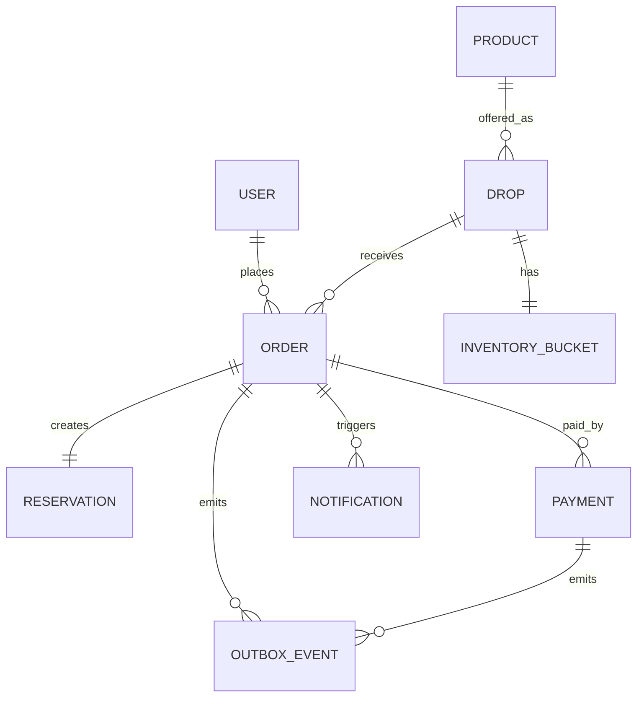
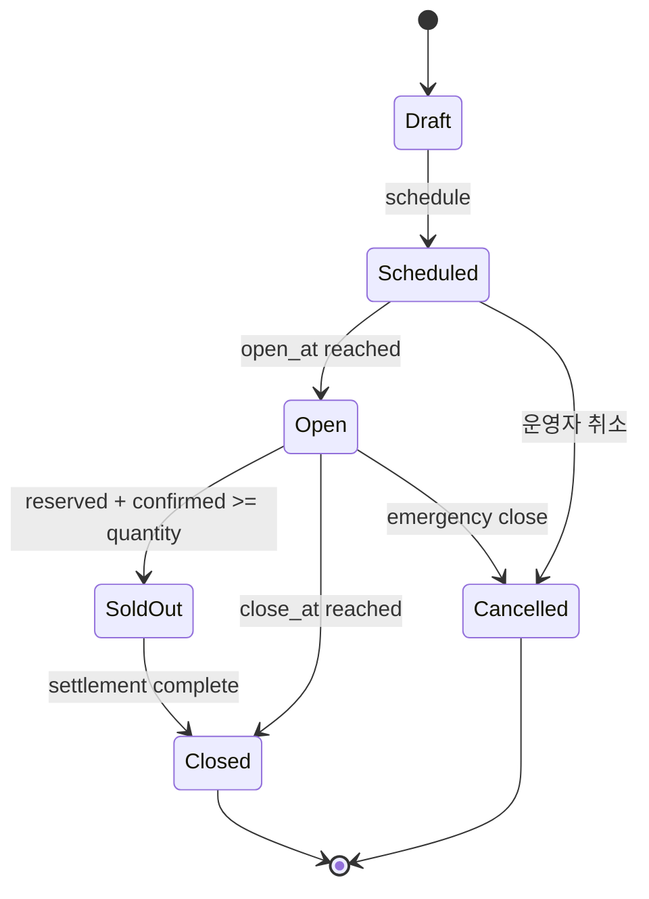
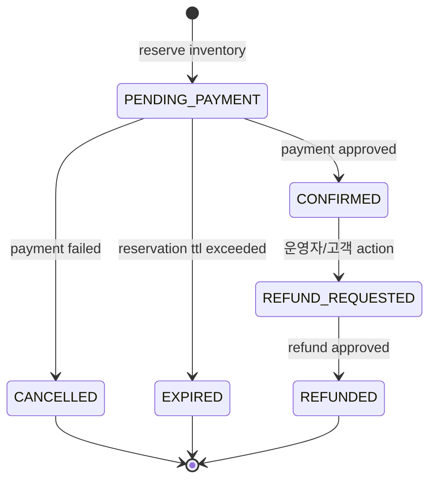

# DropMong 도메인 모델

작성일: 2026-07-02

이 문서는 DropMong 구현에 필요한 도메인 용어, 상태, 소유권, 불변 조건을 정의한다.

## 1. 도메인 지도

## 2. 핵심 용어

| 용어 | 정의 | 소유 서비스 |
| --- | --- | --- |
| 사용자 | 로그인하고 주문하는 고객 또는 운영자 | `auth-service` |
| 상품 | 판매 대상의 기본 정보 | `catalog-service` |
| 드롭 | 특정 오픈 시각, 판매 수량, 구매 제한을 가진 판매 이벤트 | `catalog-service` |
| 재고 버킷 | 한 drop의 판매 가능 수량과 예약/확정 수량 | `order-service` |
| 예약 | 주문 생성 시 잡아두는 임시 재고 | `order-service` |
| 주문 | 고객의 구매 의사와 결제 진행 상태 | `order-service` |
| 결제 | 결제 시도와 승인, 실패, 지연 결과 | `payment-service` |
| 알림 | 고객 또는 운영자에게 보낼 메시지 | `notification-service` |
| 아웃박스 이벤트 | DB transaction과 함께 기록되는 발행 예정 이벤트 | 생산자 서비스 |

## 3. 애그리게이트 소유권

| 애그리게이트 | 루트 | 쓰기 소유자 | 읽기 가능자 |
| --- | --- | --- | --- |
| 식별 | `User` | `auth-service` | JWT claim을 통한 모든 서비스 |
| 카탈로그 | `Drop` | `catalog-service` | 고객, 운영자, `order-service` |
| 주문 | `Order` | `order-service` | 고객, 운영자, API/event 기반 `payment-service` |
| 결제 | `Payment` | `payment-service` | 고객, event 기반 `order-service` |
| 알림 | `Notification` | `notification-service` | 고객, 운영자 |

규칙:

- 한 aggregate의 상태 변경은 한 서비스만 소유한다.
- 다른 서비스가 필요한 정보는 API 조회 또는 이벤트 projection으로 복제한다.
- 재고 수량의 authoritative value는 `catalog-service`가 아니라 `order-service`에 둔다.

## 4. 드롭 상태

| 상태 | 설명 | 허용 작업 |
| --- | --- | --- |
| `DRAFT` | 운영자가 구성 중인 드롭 | 수정, 삭제 |
| `SCHEDULED` | 오픈 시각이 확정된 드롭 | 조회, 오픈 대기 |
| `OPEN` | 주문 가능한 상태 | 주문 생성, 품절 판단 |
| `SOLD_OUT` | 예약과 확정 수량이 판매 수량에 도달 | 조회만 가능 |
| `CLOSED` | 판매 종료 | 조회, 운영 리포트 |
| `CANCELLED` | 운영자 또는 장애 대응으로 취소 | 조회, 알림 |

## 5. 주문 상태

| 상태 | 의미 | 재고 효과 |
| --- | --- | --- |
| `PENDING_PAYMENT` | 재고 예약 완료, 결제 대기 | reserved 증가 |
| `CONFIRMED` | 결제 승인, 주문 확정 | confirmed 증가, reserved 감소 |
| `CANCELLED` | 결제 실패 또는 사용자 취소 | reserved 감소 |
| `EXPIRED` | TTL 만료 | reserved 감소 |
| `REFUND_REQUESTED` | 환불 처리 대기 | confirmed 유지 |
| `REFUNDED` | 환불 완료 | 정책에 따라 restock 여부 결정 |

1차 구현에서는 refund flow를 문서화만 하고 MVP 범위에서는 제외한다.

## 6. 결제 상태

| 상태 | 의미 | order에 미치는 영향 |
| --- | --- | --- |
| `REQUESTED` | 결제 요청 수신 | 없음 |
| `APPROVED` | 결제 승인 | order confirm |
| `FAILED` | 결제 실패 | reservation release |
| `DELAYED` | mock delay 또는 ambiguous outcome | reconciliation 필요 |
| `CANCELLED` | 결제 취소 | reservation release |

## 7. 불변 조건

| ID | 조건 | 적용 위치 |
| --- | --- | --- |
| INV-01 | `reserved_count + confirmed_count <= total_quantity` | `order-service` transaction |
| INV-02 | 주문 하나는 reservation 하나만 가진다. | `order-service` unique index |
| INV-03 | 같은 customer가 같은 drop에 여러 번 살 수 있는지는 drop policy가 결정한다. | `order-service` policy check |
| INV-04 | payment approved는 이미 cancelled 또는 expired인 order를 confirm하지 않는다. | `order-service` event handler |
| INV-05 | consumer는 같은 event를 여러 번 처리해도 결과가 같아야 한다. | all event consumers |

## 8. 구매 제한 정책

1차 정책:

- 고객 1명은 drop 1개당 1개 주문만 가능하다.
- 주문 수량은 1로 시작한다.
- 재고 예약 TTL은 기본 5분이다.
- 결제 지연이 TTL을 넘으면 order는 expired가 우선한다.

나중에 확장할 정책:

- 고객당 수량 제한
- 옵션별 재고
- 선착순 외 추첨
- 멤버십 선오픈

## 9. 도메인 이벤트 후보

| 이벤트 | 발행자 | 의미 |
| --- | --- | --- |
| `catalog.drop.scheduled` | `catalog-service` | 드롭 오픈 일정 확정 |
| `catalog.drop.updated` | `catalog-service` | 공개 조회 projection 갱신 필요 |
| `order.created` | `order-service` | 재고 예약과 pending order 생성 |
| `order.reservation.expired` | `order-service` | 예약 TTL 만료 |
| `order.confirmed` | `order-service` | 주문 확정 |
| `order.cancelled` | `order-service` | 주문 취소 또는 결제 실패 반영 |
| `payment.approved` | `payment-service` | 결제 승인 |
| `payment.failed` | `payment-service` | 결제 실패 |
| `notification.requested` | producer service | 알림 생성 요청 |
