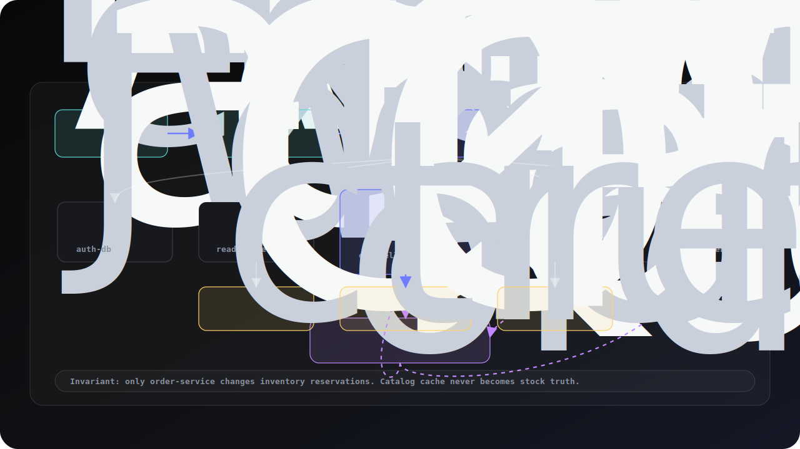
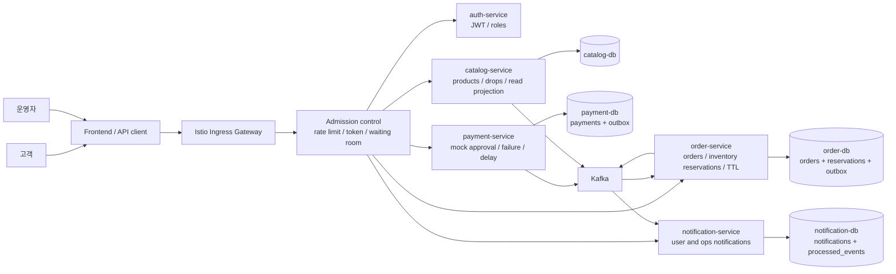
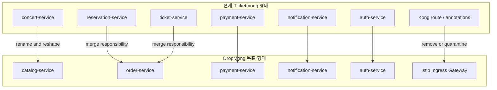
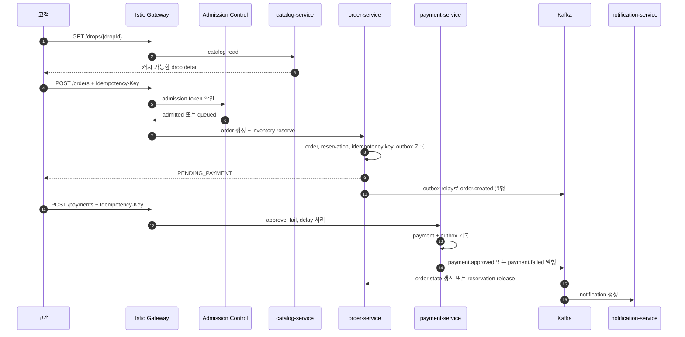
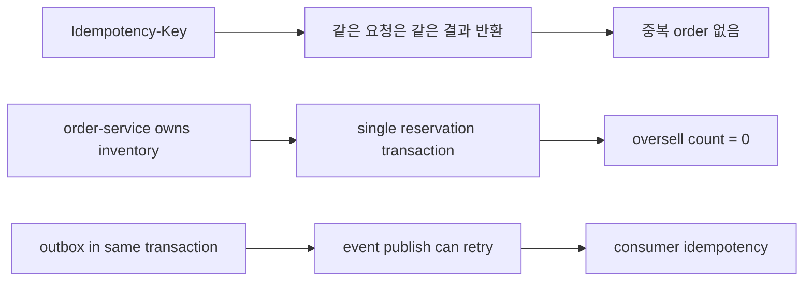
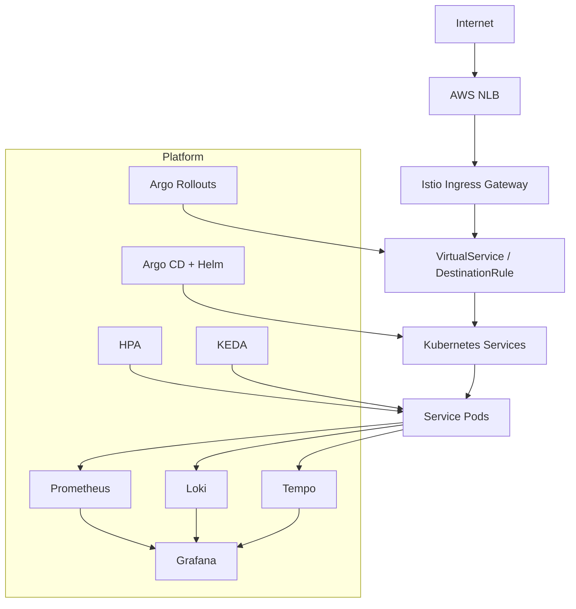
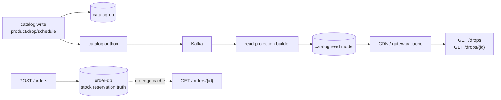
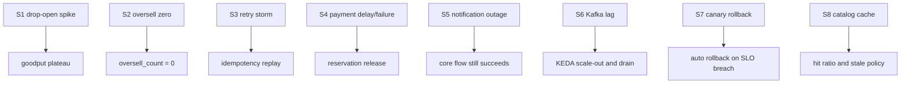

# DropMong 아키텍처 설계

> 목적: DropMong의 서비스 경계, 트래픽 흐름, 이벤트 흐름, 인프라 전환 범위를 설계 문서로 고정한다. 다이어그램은 설계를 이해하기 위한 보조 수단이다.

## 1. 한 장 요약



| 결정 | 선택 | 이유 |
| --- | --- | --- |
| 도메인 | 제한 수량 드롭 커머스 | 트래픽 피크와 재고 경쟁을 자연스럽게 검증할 수 있다. |
| 서비스 수 | 5개 | 발표와 구현 집중도를 유지하면서 cloud-native 운영 검증을 충분히 담는다. |
| 재고 소유자 | `order-service` | oversell 0을 위해 주문과 재고 예약을 같은 트랜잭션 경계에 둔다. |
| 외부 진입 | Istio Ingress Gateway | Kong을 제거하고 서비스 메시 트래픽 제어와 canary를 하나의 경로로 묶는다. |
| 이벤트 전략 | Transactional outbox -> Kafka | DB 변경과 이벤트 발행의 이중 쓰기 실패를 줄인다. |
| 캐시 전략 | catalog read projection만 캐시 | 상품 조회는 빠르게, 재고 진실은 캐시하지 않는다. |

## 2. 목표 서비스 경계



### 서비스별 책임

| 서비스 | 동기 책임 | 비동기 책임 | 저장소 | 절대 하지 않을 일 |
| --- | --- | --- | --- | --- |
| `auth-service` | 로그인, JWT, role claim | auth audit event 후보 | PostgreSQL | 주문이나 재고 판단 |
| `catalog-service` | 상품, 드롭, 공개 조회 | `catalog.drop.updated` 발행 | PostgreSQL, read projection | authoritative stock 변경 |
| `order-service` | 주문 생성, 재고 예약, TTL, 상태 조회 | order event 발행, payment 결과 반영 | PostgreSQL, outbox | 결제 승인 자체 처리 |
| `payment-service` | 결제 mock, 승인/실패/지연 | payment event 발행 | PostgreSQL, outbox | 재고 직접 변경 |
| `notification-service` | 알림 조회 | order/payment/catalog event 소비 | MongoDB 또는 PostgreSQL | 핵심 주문 흐름 차단 |

## 3. 현재 구조에서 목표 구조로



## 4. 드롭 오픈 요청 경로



## 5. 핵심 불변 조건



| 불변 조건 | 적용 위치 | 검증 방법 |
| --- | --- | --- |
| `oversell_count = 0` | `order-service` | 동시 주문 k6 테스트, DB unique/constraint 확인 |
| idempotent order create | `POST /orders` | 같은 key 재시도, 다른 payload 재시도 |
| event publish retry 가능 | `order-service`, `payment-service` | outbox relay 중단 후 재시작 |
| 알림 장애 격리 | `notification-service` | consumer 중단 상태에서 주문/결제 성공 확인 |
| accepted latency와 rejected latency 분리 | gateway, order metrics | Prometheus histogram label 분리 |

## 6. 인프라 레이어



## 7. 캐시와 재고 진실 분리



캐시 가능:

- `GET /drops`
- `GET /drops/{id}`
- `GET /products/{id}`
- 추천 목록과 공개 메타데이터

캐시 금지 또는 짧은 TTL:

- 재고 예약 가능 여부의 authoritative 판단
- 주문 상태
- 결제 상태
- 사용자별 알림

## 8. GitOps와 저장소 전환 맵

| 저장소 | 현재 흔적 | 목표 변경 | 우선순위 |
| --- | --- | --- | --- |
| `workspaces` | Ticketmong PRD와 6개 서비스 문서 | DropMong PRD, 5개 서비스, ADR 추가 | P0 |
| `services` | `concert`, `reservation`, `ticket` | `catalog`, `order`로 재구성 | P0 |
| `e-gitops` | Kong annotations, ticketing namespaces | Istio Gateway, Rollouts, KEDA, DropMong values | P1 |
| `infra` | `medikong`, Kong NodePort, old ECR list | DropMong project name, Istio NLB target, new ECR list | P1 |
| `archive` | 비어 있음 | 결정 로그나 이전 문서 보관 후보 | P2 |

## 9. 검증 시나리오 맵



| 시나리오 | 도구 | 성공 기준 |
| --- | --- | --- |
| Drop-open spike | k6 ramping-arrival-rate | accepted p95/p99 유지, rejected/queued 분리 |
| Oversell zero | k6 + DB check | `oversell_count = 0` |
| Retry storm | k6 + API replay | duplicate order 없음 |
| Payment delay/failure | API + Kafka | payment failed 시 reservation release |
| Notification outage | consumer stop | order/payment 성공, DLQ 증가 |
| Kafka lag scale | KEDA + Prometheus | lag drain time 목표 이내 |
| Canary rollback | Argo Rollouts | SLO breach 시 이전 버전 복귀 |
| Catalog cache | k6 + headers | hit ratio, stale-if-error, purge 동작 확인 |

## 10. 구현 문서 세트

이 요약 설계가 합의되면 기존 `project_docs`는 아래 문서 세트를 기준으로 바꾸는 것이 좋다.

```text
00-product-scope.md
01-domain-model.md
02-system-architecture.md
03-service-boundaries.md
04-data-design.md
05-api-contracts.md
06-event-contracts.md
07-critical-flows.md
08-infra-deployment.md
09-observability-slo.md
10-security.md
11-test-release-plan.md
adr/
runbooks/
diagrams/
```

ADR 후보:

- `ADR-001-five-service-boundary.md`
- `ADR-002-order-service-owns-inventory.md`
- `ADR-003-istio-ingress-not-kong.md`
- `ADR-004-transactional-outbox.md`
- `ADR-005-catalog-read-cache-policy.md`

## 11. 참고 출처

- AWS load shedding: https://aws.amazon.com/builders-library/using-load-shedding-to-avoid-overload/
- AWS idempotent APIs: https://aws.amazon.com/builders-library/making-retries-safe-with-idempotent-APIs/
- Stripe idempotency: https://docs.stripe.com/api/idempotent_requests
- DoorDash proxy cache: https://careersatdoordash.com/blog/high-performance-proxy-cache-for-doordash-services/
- Shopify CDC: https://shopify.engineering/capturing-every-change-shopify-sharded-monolith
- Etsy prefetch: https://www.etsy.com/codeascraft/search-prefetching-performance
- KEDA Kafka scaler: https://keda.sh/docs/2.17/scalers/apache-kafka/
- Argo Rollouts: https://argoproj.github.io/argo-rollouts/
