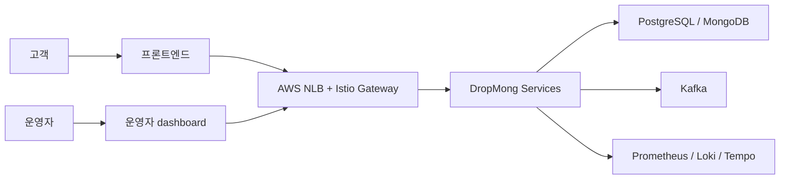
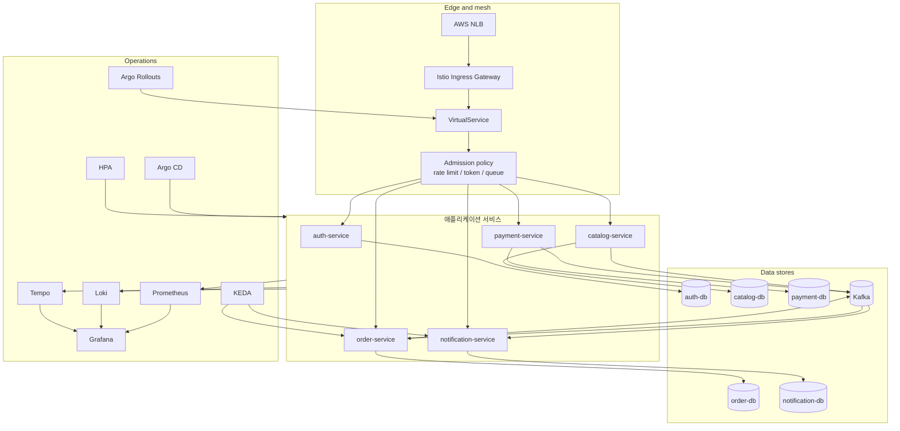
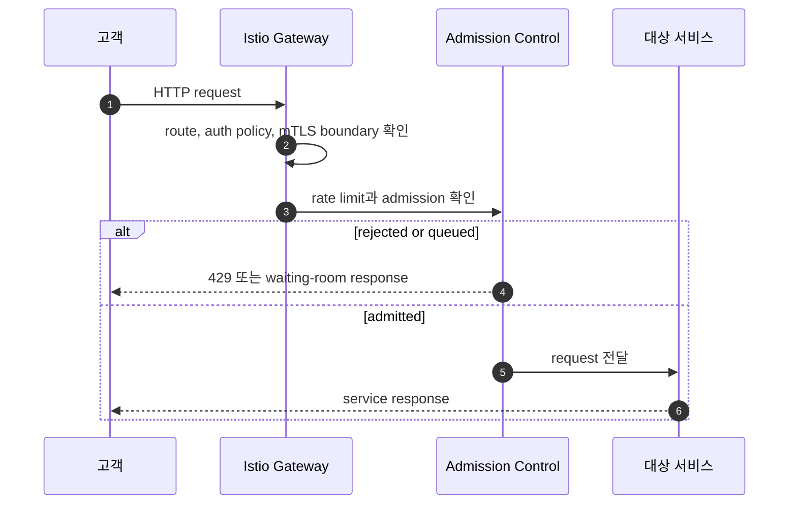
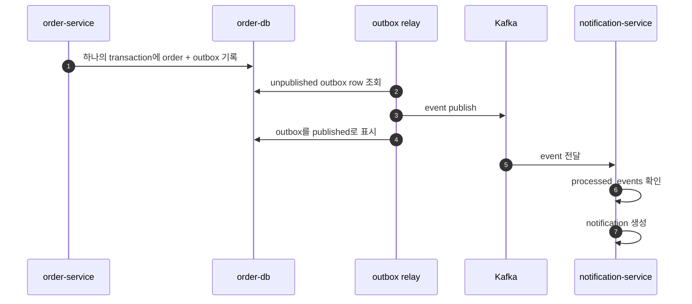

# DropMong 시스템 아키텍처

작성일: 2026-07-02

이 문서는 DropMong의 전체 시스템 구조를 구현 가능한 수준으로 고정한다.

## 1. 아키텍처 결정 요인

| 결정 요인 | 설계 반영 |
| --- | --- |
| 제한 수량 판매 | `order-service`가 재고 예약과 주문 상태를 함께 소유 |
| 오픈 순간 트래픽 폭증 | Istio 앞뒤의 admission control, bounded queue, fast reject |
| retry storm | idempotent API와 request hash |
| 이벤트 일관성 | transactional outbox와 idempotent consumer |
| 운영 시연 | Prometheus, Grafana, Loki, Tempo, Argo Rollouts |
| 구현 집중도 | 5개 서비스로 시작 |

## 2. 시스템 맥락

## 3. 컨테이너 아키텍처

## 4. 서비스 토폴로지

| 서비스 | 동기 API | 이벤트 생산 | 이벤트 소비 | 저장소 |
| --- | --- | --- | --- | --- |
| `auth-service` | login, token validation helper | 선택적 auth audit | 없음 | PostgreSQL |
| `catalog-service` | product, drop, admin drop management | `catalog.drop.updated` | 선택적 stock summary projection | PostgreSQL, Redis/cache 선택 |
| `order-service` | create order, get order, expire reservation | order events | payment events | PostgreSQL |
| `payment-service` | create mock payment, get payment | payment event | order event 선택 | PostgreSQL |
| `notification-service` | get notifications | notification status event 선택 | order/payment/catalog event | MongoDB 또는 PostgreSQL |

## 5. 외부 요청 경로

Admission은 별도 서비스가 아니라 1차 구현에서는 다음 조합으로 시작한다.

- Istio/Envoy local rate limit
- Redis-backed admission token or simple gateway filter
- order path에만 더 엄격한 정책 적용

## 6. 이벤트 경로

## 7. 저장소 매핑

| 저장소 | 아키텍처 역할 | 첫 구현 작업 |
| --- | --- | --- |
| `workspaces` | 설계와 ADR의 기준점 | 이 문서 세트 작성, 기존 project docs 치환 준비 |
| `services` | 애플리케이션 runtime | service rename, 계약, DB schema, outbox, test |
| `e-gitops` | 배포 desired state | values rename, Istio, Rollouts, KEDA, synthetic test |
| `infra` | cluster와 cloud resource | ECR list, project name, NLB target, IAM naming |
| `archive` | 이력 보관 | Ticketmong 문서와 폐기 manifest 보관 |

## 8. 금지할 구조

1차 구현에서 넣지 않는다:

- Kong과 Istio가 같은 외부 진입점을 동시에 설명하는 구조
- order write path에서 catalog cache를 재고 진실로 사용하는 구조
- DB 변경과 Kafka publish를 별도 성공 조건으로 두는 이중 쓰기
- notification 장애가 주문 확정 응답을 막는 동기 호출
- payment approved event가 expired order를 다시 confirm하는 처리

## 9. 아키텍처 완료 체크리스트

- [ ] `ADR-001`로 5-service boundary 확정
- [ ] `ADR-002`로 order-owned inventory 확정
- [ ] `ADR-003`으로 Istio ingress 확정
- [ ] `ADR-004`로 transactional outbox 확정
- [ ] `services/contracts`에 DropMong OpenAPI 초안 반영
- [ ] `e-gitops/values/services`에서 catalog/order target 반영
- [ ] `infra/terraform` ECR repository list 반영
