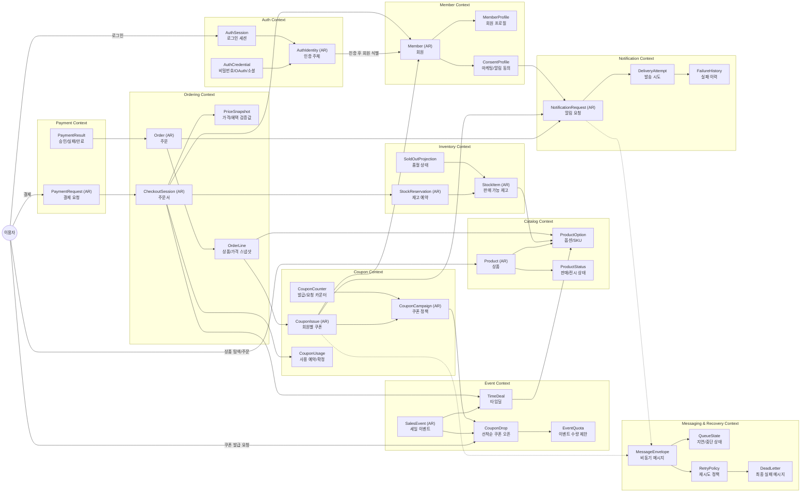

# DropMong 서비스 경계

작성일: 2026-07-02

이 문서는 서비스가 어디까지 책임지고 어디부터 다른 서비스에 넘기는지 정의한다.

## 전체 바운디드 컨텍스트

## 1. 경계 요약

| 서비스 | 책임 | 외부 의존 | 소유 데이터 | 주요 위험 |
| --- | --- | --- | --- | --- |
| `auth-service` | identity, JWT, role | PostgreSQL | users, credentials, roles | token claim drift |
| `catalog-service` | product, drop, 공개 read model | PostgreSQL, cache | products, drops, schedules | stale public data |
| `order-service` | order, reservation, 재고 진실 | PostgreSQL, Kafka | orders, reservations, inventory buckets, outbox | oversell |
| `payment-service` | mock payment 상태 | PostgreSQL, Kafka | payments, outbox | ambiguous outcome |
| `notification-service` | 비동기 notification | Kafka, DB | notifications, processed events | consumer lag |

## 2. auth-service

### 소유

- user account
- password credential or mock credential
- role claim: `customer`, `operator`, `admin`
- JWT issue and refresh policy

### API

- `POST /auth/login`
- `POST /auth/refresh`
- `GET /auth/me`
- `GET /healthz`
- `GET /readyz`

### 소유하지 않음

- order authorization beyond user identity
- drop 운영자 workflow
- payment permission decision

## 3. catalog-service

### 소유

- product
- drop
- drop schedule
- 공개 read DTO
- catalog update outbox

### API

- `GET /products`
- `GET /products/{productId}`
- `GET /drops`
- `GET /drops/{dropId}`
- `POST /admin/drops`
- `PATCH /admin/drops/{dropId}`
- `POST /admin/drops/{dropId}/schedule`

### 이벤트

생산:

- `catalog.drop.scheduled`
- `catalog.drop.updated`
- `catalog.product.updated`

소비:

- 선택적 `order.confirmed`: 최종적 일관성 기반 품절 badge에만 사용

### 경계 규칙

`catalog-service`는 stock summary를 보여줄 수 있지만, order가 stock을 reserve할 수 있는지 결정하면 안 된다.

## 4. order-service

### 소유

- inventory bucket per drop
- order
- reservation
- reservation expiration
- order idempotency
- order outbox

### API

- `POST /orders`
- `GET /orders/{orderId}`
- `GET /orders?customerId=me`
- `POST /orders/{orderId}/cancel`
- `POST /internal/reservations/expire`

### 이벤트

생산:

- `order.created`
- `order.confirmed`
- `order.cancelled`
- `order.reservation.expired`
- `notification.requested`

소비:

- `payment.approved`
- `payment.failed`
- 선택적 `catalog.drop.updated`

### 경계 규칙

All stock-changing writes happen inside `order-service`. Payment and catalog never update inventory tables.

## 5. payment-service

### 소유

- payment request
- mock payment mode: approve, fail, delay
- payment idempotency
- payment outbox

### API

- `POST /payments`
- `GET /payments/{paymentId}`
- `POST /admin/payments/{paymentId}/simulate`

### 이벤트

생산:

- `payment.approved`
- `payment.failed`
- `payment.delayed`

소비:

- 선택적 `order.created`: 비동기 payment 요청 실험용

### 경계 규칙

Payment result is a fact about payment, not direct authority to mutate inventory. `order-service` consumes the event and decides legal state transition.

## 6. notification-service

### 소유

- notification record
- delivery state
- processed event marker
- DLQ replay metadata

### API

- `GET /notifications`
- `PATCH /notifications/{notificationId}/read`
- `GET /admin/notifications/dead-letter`

### 이벤트

소비:

- `notification.requested`
- `order.confirmed`
- `order.cancelled`
- `payment.failed`

생산:

- 선택적 `notification.sent`
- 선택적 `notification.failed`

### 경계 규칙

Notification 작업은 async로 처리한다. synchronous checkout critical path 안에 들어가면 안 된다.

## 7. 서비스 간 정책

| 주제 | 규칙 |
| --- | --- |
| Authentication | External requests carry JWT. Internal service calls rely on mTLS plus propagated user context. |
| Correlation | Every request has `X-Request-Id`; every trace has W3C `traceparent`. |
| Idempotency | 고객의 변경 API는 명시적으로 안전한 작업이 아닌 한 `Idempotency-Key`를 요구한다. |
| Errors | Common error envelope from `05-api-contracts.md`. |
| Events | Common event envelope from `06-event-contracts.md`. |
| Schema 변경 | DB schema는 service repo가 소유하고, 배포 순서는 GitOps runbook이 소유한다. |

## 8. 나중에 분리할 조건

지금은 이 service를 분리하지 않는다. 대신 언제 다시 검토할지 조건을 기록한다.

| 후보 | 분리 조건 |
| --- | --- |
| `inventory-service` | multi-warehouse, external stock systems, or multiple sales channels require independent inventory lifecycle |
| `waiting-room-service` | token admission이 독립 상태, UI, 운영 제어가 필요할 만큼 복잡해질 때 |
| `search-service` | catalog query latency or relevance needs separate indexing engine |
| `admin-service` | 운영자 workflow가 커져 고객 API release cadence에 영향을 줄 때 |
