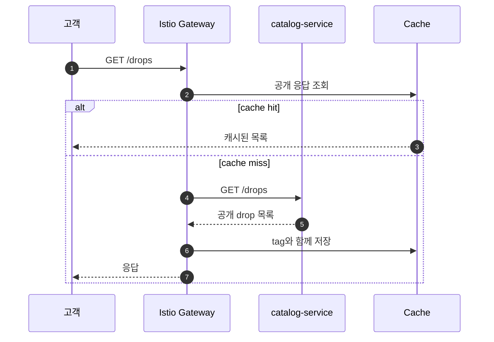
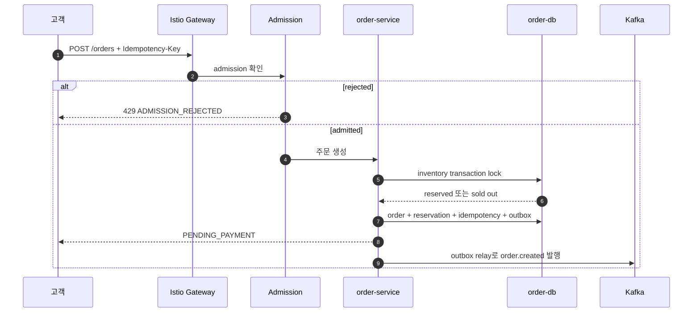
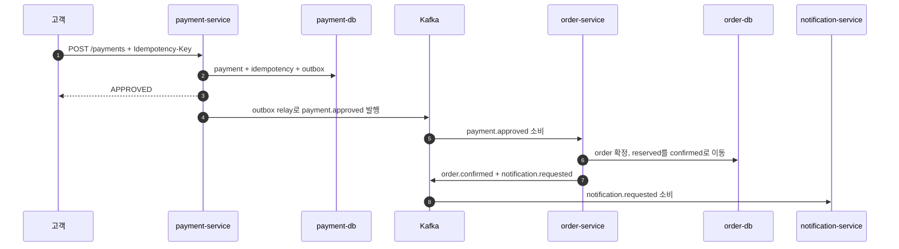
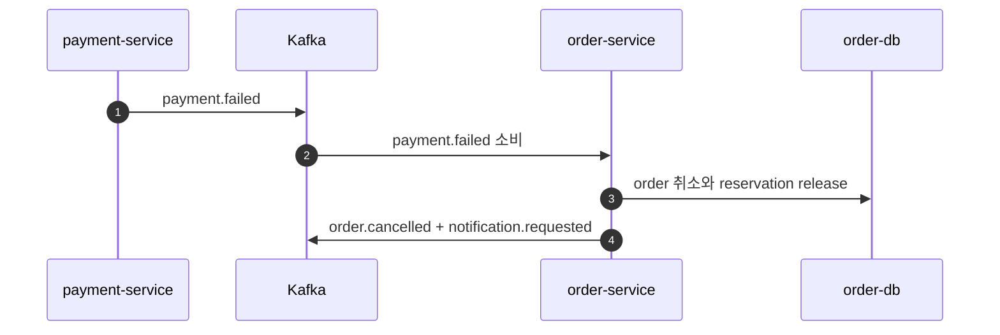
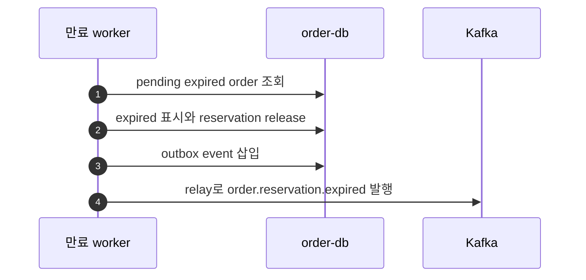
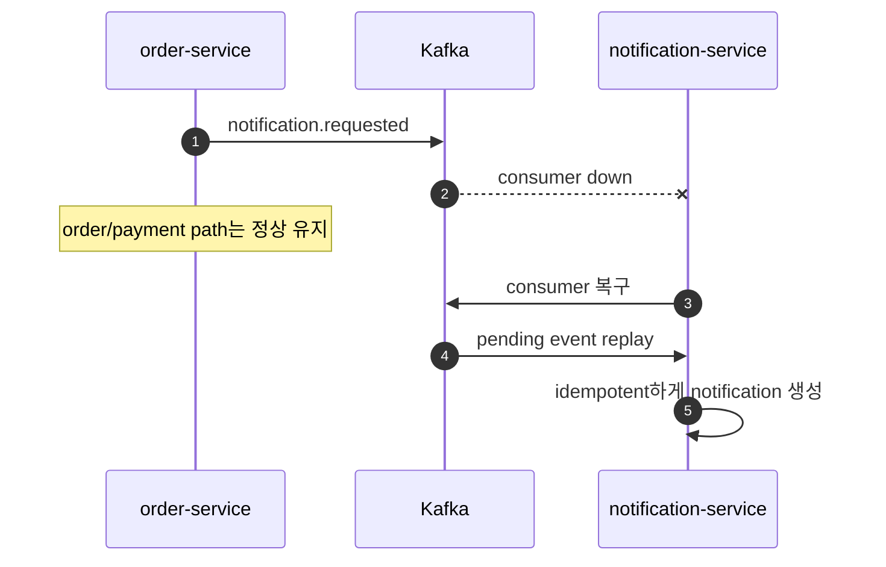
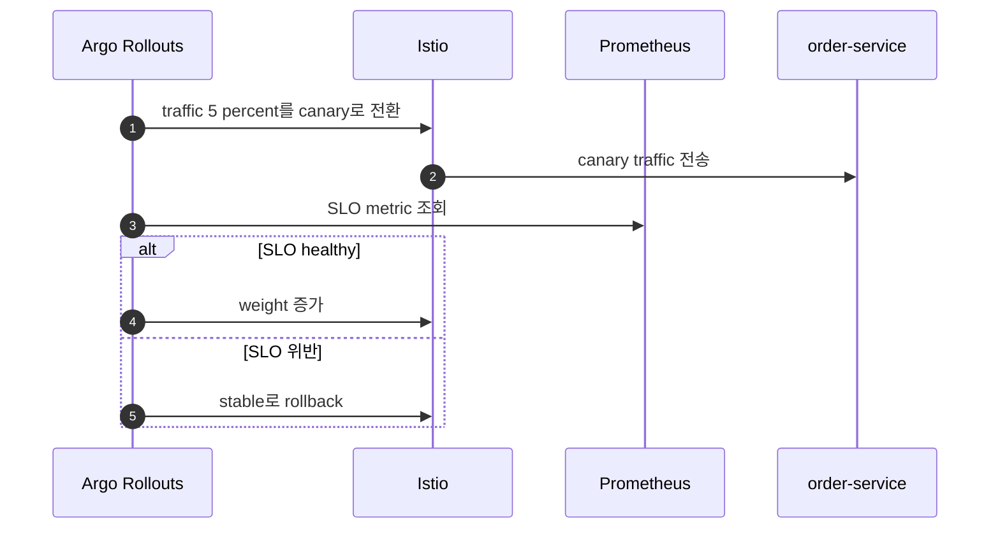

# DropMong 핵심 흐름

작성일: 2026-07-02

이 문서는 DropMong의 핵심 시나리오를 sequence 중심으로 정의한다. 각 흐름은 구현과 테스트 이름으로 연결되어야 한다.

## 1. 드롭 조회 흐름

성공 기준:

- 공개 catalog GET은 캐시할 수 있다.
- 고객별 데이터는 공개 응답으로 캐시하지 않는다.
- 재고 진실은 cache에서 제공하지 않는다.

## 2. 주문 생성 흐름

실패 사례:

| 사례 | 기대 결과 |
| --- | --- |
| 같은 idempotency key와 같은 payload 중복 요청 | 최초 응답 반환 |
| 같은 key와 다른 payload 중복 요청 | `409 IDEMPOTENCY_KEY_REUSED` |
| 남은 재고 없음 | `409 SOLD_OUT` |
| drop이 open 상태가 아님 | `422 DROP_NOT_OPEN` |
| admission rejected | `429 ADMISSION_REJECTED` |

## 3. 결제 승인 흐름

성공 기준:

- payment API는 notification 전송 전에 응답할 수 있다.
- order는 허용된 상태 전환일 때만 확정된다.
- duplicate payment event는 order를 중복 확정하지 않는다.

## 4. 결제 실패 흐름

성공 기준:

- reservation count가 감소한다.
- order는 `CANCELLED`가 된다.
- order expiry 이후의 payment failure는 stale event로 보고 idempotent하게 처리한다.

## 5. 예약 만료 흐름

성공 기준:

- worker는 작은 batch로 실행한다.
- 만료된 reservation은 stock을 release한다.
- expiry 이후의 payment approval은 order를 자동 confirm하지 않는다.

## 6. 알림 장애 흐름

성공 기준:

- `notification-service` 장애는 checkout error rate를 증가시키지 않는다.
- Kafka lag와 DLQ가 관측 가능하다.
- replay는 중복을 만들지 않는다.

## 7. Canary rollback 흐름

Rollback 신호:

- order error rate
- accepted checkout p95/p99
- oversell count
- payment event handler 실패율
- Kafka lag와 DLQ 증가

## 8. 테스트 매핑

| 흐름 | 테스트 이름 |
| --- | --- |
| Drop 조회 | `catalog_cache_warm_cold_purge` |
| Order 생성 | `drop_open_spike_oversell_zero` |
| Idempotency | `order_retry_storm_idempotency` |
| Payment 승인 | `payment_approved_confirms_order` |
| Payment 실패 | `payment_failed_releases_reservation` |
| 만료 | `reservation_ttl_releases_stock` |
| Notification 장애 | `notification_outage_isolated` |
| Canary rollback | `order_canary_slo_rollback` |
