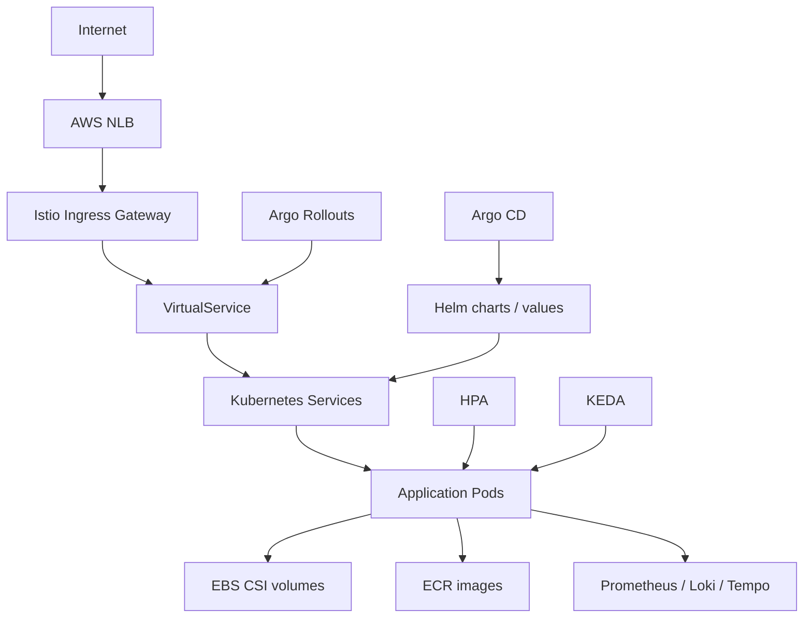

# DropMong 인프라와 배포 설계

작성일: 2026-07-02

이 문서는 DropMong의 Kubernetes, GitOps, AWS, scaling, release 구조를 정의한다.

## 1. 목표 토폴로지



## 2. AWS 리소스

| 리소스 | 소유 저장소 | 목표 변경 |
| --- | --- | --- |
| VPC/subnet/security group | `infra` | DropMong naming을 막지 않으면 기존 유지 |
| EC2 kubeadm node | `infra` | 유지 |
| ECR repository | `infra` | `catalog-service`, `order-service` 추가; migration 후 `concert`, `reservation`, `ticket` 제거 또는 archive |
| NLB | `infra` | Istio Ingress Gateway를 target으로 지정 |
| IAM/OIDC | `infra`, `e-gitops` | GitHub OIDC pattern 유지 |
| EBS CSI | `infra` | 유지 |

## 3. Kubernetes namespace

권장 namespace:

| Namespace | 내용 |
| --- | --- |
| `dropmong` | 애플리케이션 서비스 |
| `dropmong-data` | 로컬 호스팅 시 DB, Kafka |
| `istio-system` | Istio control plane과 ingress gateway |
| `argo` | Argo CD와 Rollouts |
| `observability` | Prometheus, Grafana, Loki, Tempo |
| `synthetic` | k6 synthetic과 load job |

현재 repo가 다른 namespace를 사용한다면 namespace rename PR이 만들어질 때까지 기존 pattern을 유지한다.

## 4. GitOps 배치

`e-gitops`의 목표 형태:

```text
values/services/
  auth.yaml
  catalog.yaml
  order.yaml
  payment.yaml
  notification.yaml

platform/
  istio/
  rollouts/
  keda/
  synthetic/
  observability/
```

기존 `concert.yaml`, `reservation.yaml`, `ticket.yaml`은 `catalog.yaml`과 `order.yaml`로 migration한다.

## 5. Ingress 설계

외부 진입:

```text
Internet -> AWS NLB -> Istio Ingress Gateway -> VirtualService -> Kubernetes Service
```

규칙:

- Kong은 목표 외부 경로에 포함하지 않는다.
- Gateway route는 Istio에서 한 번만 정의한다.
- `auth`, `catalog`, `order`, `payment`, `notification`은 명시적 route prefix를 가진다.
- order와 payment route에는 더 엄격한 rate limit과 canary analysis를 적용할 수 있다.

Route 개요:

| Prefix | Service |
| --- | --- |
| `/auth` | `auth-service` |
| `/products`, `/drops` | `catalog-service` |
| `/orders` | `order-service` |
| `/payments` | `payment-service` |
| `/notifications` | `notification-service` |

## 6. 확장 정책

| Workload | 확장 방식 | 신호 |
| --- | --- | --- |
| `auth-service` | HPA | CPU, request rate |
| `catalog-service` | HPA | CPU, request rate, cache miss rate |
| `order-service` HTTP | HPA | CPU, accepted RPS, latency |
| `order-service` expiry worker | KEDA 또는 fixed replicas | pending expiry count |
| `payment-service` | HPA | CPU, request rate |
| Kafka consumers | KEDA | consumer lag |
| `notification-service` | KEDA | consumer lag, DLQ depth |

확장 guardrail:

- 주문 생성의 첫 번째 과부하 방어 수단으로 scaling을 사용하지 않는다.
- `order-service`가 포화되기 전에 admission control이 요청량을 제한해야 한다.

## 7. 점진 배포

Order와 payment service는 Argo Rollouts를 사용한다.

Canary 단계:

```text
5 percent -> analysis -> 20 percent -> analysis -> 50 percent -> analysis -> 100 percent
```

분석 메트릭:

- service와 version별 `http_requests_total` error rate
- accepted checkout p95/p99
- `oversell_count`
- outbox pending count
- Kafka consumer lag
- DLQ depth

Rollback 조건:

- `oversell_count > 0`
- error rate가 threshold 초과
- accepted p95/p99가 threshold 초과
- payment event handler failure 발생
- canary 버전에서만 DLQ 증가

## 8. Secret과 config

| 설정 | 출처 |
| --- | --- |
| DB URL | Kubernetes Secret |
| Kafka broker | 인증 여부에 따라 ConfigMap 또는 Secret |
| JWT signing key | Secret |
| 기본 payment mock mode | ConfigMap |
| Grafana credential | Secret |
| synthetic credential | Secret |

secret은 GitOps에 plaintext로 commit하지 않는다.

## 9. 배포 순서

1. 새 ECR repository를 추가한다.
2. traffic이 없거나 internal-only인 상태로 새 service value와 image를 추가한다.
3. catalog/order/payment DB migration을 추가한다.
4. Istio Gateway와 VirtualService route를 추가한다.
5. `catalog-service`를 배포한다.
6. internal smoke와 함께 `order-service`를 배포한다.
7. `payment-service`를 배포한다.
8. `notification-service`를 배포한다.
9. synthetic smoke를 활성화한다.
10. order/payment canary를 활성화한다.
11. drop-open load test를 실행한다.
12. 기존 `concert`, `reservation`, `ticket` route를 제거한다.

## 10. Rollback 규칙

- Config-only 문제: GitOps values를 revert한다.
- Service image 문제: Argo Rollouts로 stable ReplicaSet에 rollback한다.
- DB migration 문제: 하위 호환 가능한 expand/contract만 사용한다.
- Ingress 문제: cutover가 검증될 때까지 이전 stable VirtualService revision을 유지한다.
- Event schema 문제: producer는 최소 한 개의 배포된 consumer version과 하위 호환되어야 한다.
