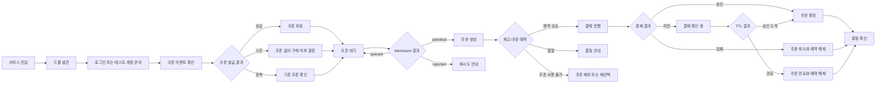

# DropMong 사용자 시나리오 분해안

작성일: 2026-07-03

이 문서는 `12-user-flows.md`의 사용자 흐름을 실제 작업 분배가 가능하도록 다시 나눈다. 정상 흐름과 실패 흐름을 따로 떼지 않고, 사용자가 자연스럽게 겪는 하나의 여정 안에 성공, 대기, 실패, 복구 갈림길을 함께 둔다.

## 1. 작성 기준

- 먼저 사용자 관점 시나리오를 만든다.
- 비슷한 시나리오를 두 묶음으로 나눠 두 명이 병렬로 작성한다.
- 각 시나리오는 화면 행동, API, 관련 서비스, 성공 흐름, 예외 흐름, 확인 지표를 함께 가진다.
- `07-critical-flows.md`의 내부 sequence는 각 시나리오의 시스템 근거로 연결한다.
- `03-service-boundaries.md`의 `coupon-service`는 사용자 흐름에 포함한다.
- `member-service`는 사용자 흐름에서는 인증/회원 시나리오에 포함해 설명한다.
- `message-recovery-service`는 사용자가 직접 쓰는 기능이 아니라 운영자 복구 시나리오로 둔다.

## 2. 두 명 작업 묶음

| 묶음 | 목적 | 포함 시나리오 | 작업 성격 |
| --- | --- | --- | --- |
| 묶음 A: 구매 진입과 혜택 획득 | 사용자가 드롭을 발견하고 구매 가능한 상태까지 도달한다. | A01, A02, A03, A04 | 로그인, 조회, 쿠폰, 오픈 진입 |
| 묶음 B: 주문 성립과 결과 처리 | 사용자가 주문을 시도한 뒤 성공, 실패, 지연, 복구 결과를 이해한다. | B01, B02, B03, B04, B05 | 주문, 결제, 알림, 운영 복구, 배포 검증 |

이 분배는 사람의 역할을 고정하지 않는다. 두 사람 모두 사용자 관점 시나리오를 작성하되, 첫 번째 사람은 구매 전반부, 두 번째 사람은 주문 이후 결과 처리와 운영 상황을 맡는다.

## 3. 전체 사용자 여정



## 4. 묶음 A: 구매 진입과 혜택 획득

### A01. 계정 준비와 로그인

| 항목 | 내용 |
| --- | --- |
| 사용자 질문 | 사용자는 구매 전에 본인임을 증명하고 구매 가능한 상태가 되는가? |
| 시작 조건 | 사용자가 서비스에 진입한다. |
| 관련 서비스 | `auth-service`, `member-service` 또는 auth 내부 member module |
| 주요 API | `POST /auth/login`, `GET /auth/me`, 선택 `GET /members/me` |
| 상태 | 인증 전, 인증 성공, 인증 실패, 구매 가능 |

흐름:

```text
서비스 진입
-> 계정 있음/없음 확인
-> 가입 또는 테스트 계정 준비
-> 로그인
-> 인증 성공 시 JWT 저장
-> 내 정보 확인
-> 드롭 탐색으로 이동
```

예외 흐름:

```text
로그인 실패
-> 오류 확인
-> 재시도
-> 계속 실패하면 구매 흐름 진입 불가
```

완료 기준:

- 로그인 성공 사용자는 이후 변경 API에 JWT를 보낸다.
- 로그인 실패 사용자는 주문, 쿠폰 발급 같은 변경 API를 실행할 수 없다.
- 회원 프로필과 알림 동의는 인증 토큰 자체에 과하게 넣지 않는다.

### A02. 드롭 발견과 상세 확인

| 항목 | 내용 |
| --- | --- |
| 사용자 질문 | 사용자는 어떤 상품이 언제 열리는지 확인할 수 있는가? |
| 시작 조건 | 사용자가 드롭 목록 화면에 들어온다. |
| 관련 서비스 | `catalog-service`, cache, Istio Gateway |
| 주요 API | `GET /drops`, `GET /drops/{dropId}` |
| 상태 | 오픈 예정, 오픈 중, 품절, 종료 |

흐름:

```text
드롭 목록 조회
-> 관심 드롭 선택
-> 상품, 가격, 오픈 시각 확인
-> 오픈 전이면 대기
-> 오픈 중이면 구매 준비
```

예외 흐름:

```text
드롭 상세 조회
-> drop not found
-> 목록으로 돌아가 다른 드롭 탐색
```

시스템 기준:

- 공개 catalog 응답은 cache 가능하다.
- 고객별 데이터는 공개 cache에 넣지 않는다.
- 재고 진실은 catalog cache가 아니라 `order-service`가 판단한다.

### A03. 선착순 쿠폰 발급

| 항목 | 내용 |
| --- | --- |
| 사용자 질문 | 사용자는 한정 쿠폰을 받고, 실패한 경우 이유를 이해할 수 있는가? |
| 시작 조건 | 쿠폰 캠페인이 오픈되어 있다. |
| 관련 서비스 | `auth-service`, `coupon-service`, cache 또는 Redis 후보, Kafka |
| 주요 API | `POST /coupons/issues`, `GET /coupons/issues` |
| 상태 | 발급 성공, 소진, 중복 발급, 발급 실패 |

흐름:

```text
쿠폰 이벤트 발견
-> 쿠폰 조건 확인
-> 로그인 상태 확인
-> 쿠폰 발급 시도
-> 발급 성공
-> 쿠폰함 확인
-> 구매 과정에서 쿠폰 적용 준비
```

예외 흐름:

```text
쿠폰 발급 시도
-> 수량 소진
-> 쿠폰 소진 안내
-> 쿠폰 없이 구매할지 결정
```

```text
쿠폰 발급 버튼 반복 클릭
-> 이미 발급됨 안내
-> 기존 쿠폰함으로 이동
```

시스템 기준:

- `coupon-service`가 쿠폰 발급 가능 여부와 발급 결과를 소유한다.
- 쿠폰 발급은 중복 요청을 허용하지 않는다.
- 쿠폰 수량 카운터는 주문 재고와 분리한다.

### A04. 드롭 오픈 진입과 주문 시도

| 항목 | 내용 |
| --- | --- |
| 사용자 질문 | 사용자는 오픈 순간 대기, 거절, 진입 중 어떤 결과를 받는지 이해할 수 있는가? |
| 시작 조건 | 사용자가 오픈 시각에 구매 버튼을 누른다. |
| 관련 서비스 | Istio Gateway, Admission, `order-service` |
| 주요 API | `POST /orders` |
| 상태 | admitted, queued, rejected, pending payment, sold out |

흐름:

```text
오픈 대기
-> 구매 버튼 클릭
-> admission 확인
-> admitted
-> 주문 생성 요청
-> 재고 예약 시도
-> PENDING_PAYMENT 반환
```

예외 흐름:

```text
구매 버튼 클릭
-> queued
-> 대기 안내
-> 순서가 오면 다시 주문 시도
```

```text
구매 버튼 클릭
-> rejected
-> 잠시 후 재시도 안내
-> DB transaction에는 진입하지 않음
```

```text
주문 생성 요청
-> SOLD_OUT
-> 품절 안내
-> 주문 생성 없음
```

시스템 기준:

- 고객 변경 API는 `Idempotency-Key`를 사용한다.
- rejected 요청은 `order-service` DB lock까지 들어가지 않는다.
- `oversell_count`는 항상 0이어야 한다.

## 5. 묶음 B: 주문 성립과 결과 처리

### B01. 쿠폰 사용 예약과 주문 생성

| 항목 | 내용 |
| --- | --- |
| 사용자 질문 | 사용자는 쿠폰을 적용한 주문이 안전하게 예약되는가? |
| 시작 조건 | 사용자가 발급받은 쿠폰을 주문에 적용한다. |
| 관련 서비스 | `coupon-service`, `order-service`, Kafka |
| 주요 API | `POST /internal/coupons/usages/reserve`, `POST /orders` |
| 이벤트 | `coupon.usage.reserved`, `order.created` |
| 상태 | 쿠폰 예약, 재고 예약, 주문 대기 |

흐름:

```text
주문 생성 요청
-> 쿠폰 사용 예약
-> 재고 예약
-> 주문과 가격 스냅샷 생성
-> PENDING_PAYMENT 반환
```

예외 흐름:

```text
쿠폰 사용 예약 실패
-> 쿠폰 조건 불일치 또는 이미 사용됨
-> 사용자에게 쿠폰 제외 또는 재선택 안내
-> 재고 예약은 확정하지 않음
```

```text
주문 버튼 반복 클릭
-> 같은 Idempotency-Key와 같은 payload
-> 최초 응답 반환
-> 중복 주문 없음
```

```text
같은 Idempotency-Key와 다른 payload
-> 409 IDEMPOTENCY_KEY_REUSED
-> 사용자에게 새 요청으로 다시 시도 안내
```

시스템 기준:

- `order-service`는 주문과 재고 예약을 소유한다.
- `coupon-service`는 쿠폰 사용 원장을 소유한다.
- 주문 가격과 혜택은 `PriceSnapshot`으로 남긴다.

### B02. 결제 승인과 주문 확정

| 항목 | 내용 |
| --- | --- |
| 사용자 질문 | 결제 성공 후 사용자는 주문 확정 결과를 확인할 수 있는가? |
| 시작 조건 | 주문이 `PENDING_PAYMENT` 상태다. |
| 관련 서비스 | `payment-service`, `order-service`, `coupon-service`, `notification-service`, Kafka |
| 주요 API | `POST /payments`, `GET /orders/{orderId}`, `GET /notifications` |
| 이벤트 | `payment.approved`, `order.confirmed`, `coupon.usage.confirm.requested`, `coupon.usage.confirmed`, `notification.requested` |
| 상태 | 결제 승인, 주문 확정, 쿠폰 사용 확정, 알림 요청 |

흐름:

```text
결제 진행
-> payment-service가 결제 승인
-> payment.approved 발행
-> order-service가 주문 확정
-> coupon-service에 쿠폰 사용 확정 요청
-> notification.requested 발행
-> 사용자는 주문 확정 상태 확인
-> 알림 확인
```

예외 흐름:

```text
payment.approved 중복 전달
-> order-service가 이미 확정된 주문인지 확인
-> 중복 확정하지 않음
-> 사용자에게 같은 주문 확정 상태 반환
```

시스템 기준:

- 결제 승인 이벤트가 재고를 직접 바꾸지 않는다.
- 주문 상태 전이는 `order-service`가 판단한다.
- 알림 전송이 늦어도 주문 확정은 유지된다.

### B03. 결제 실패와 예약 해제

| 항목 | 내용 |
| --- | --- |
| 사용자 질문 | 결제 실패 후 사용자는 주문 취소와 예약 해제 결과를 이해할 수 있는가? |
| 시작 조건 | 주문과 쿠폰/재고 예약이 잡혀 있다. |
| 관련 서비스 | `payment-service`, `order-service`, `coupon-service`, `notification-service`, Kafka |
| 이벤트 | `payment.failed`, `order.cancelled`, `coupon.usage.release.requested`, `coupon.usage.released`, `notification.requested` |
| 상태 | 결제 실패, 주문 취소, 재고 해제, 쿠폰 해제 |

흐름:

```text
결제 진행
-> 결제 실패
-> payment.failed 발행
-> order-service가 주문 취소
-> 재고 예약 해제
-> coupon-service에 쿠폰 사용 해제 요청
-> 사용자에게 결제 실패와 주문 취소 안내
```

예외 흐름:

```text
결제 실패 이벤트가 예약 만료 이후 도착
-> stale event로 처리
-> 주문 상태를 다시 바꾸지 않음
-> 중복 해제하지 않음
```

완료 기준:

- 주문 상태는 `CANCELLED`가 된다.
- 재고 예약은 `RELEASED`가 된다.
- 쿠폰 사용 예약도 해제된다.

### B04. 결제 지연과 주문 만료

| 항목 | 내용 |
| --- | --- |
| 사용자 질문 | 결제가 지연되면 사용자는 현재 상태와 최종 만료 결과를 이해할 수 있는가? |
| 시작 조건 | 결제 결과가 즉시 오지 않는다. |
| 관련 서비스 | `payment-service`, `order-service`, `coupon-service`, 만료 worker, Kafka |
| 주요 API | `GET /orders/{orderId}`, `POST /internal/reservations/expire` |
| 이벤트 | `payment.delayed`, `order.reservation.expired`, `coupon.usage.release.requested` |
| 상태 | 결제 확인 중, 만료, 늦은 승인 무시 |

흐름:

```text
결제 요청
-> 결제 결과 지연
-> 사용자는 결제 확인 중 상태 확인
-> TTL 안에 승인 도착 시 주문 확정
```

예외 흐름:

```text
결제 결과 지연
-> TTL 초과
-> 만료 worker가 주문 만료 처리
-> 재고 예약 해제
-> 쿠폰 사용 예약 해제
-> 사용자는 주문 만료 안내 확인
```

```text
만료 후 payment.approved 도착
-> order-service가 expired 상태 확인
-> 자동 confirm하지 않음
-> reconciliation metric 기록
```

완료 기준:

- 만료된 주문은 뒤늦은 결제 승인으로 확정되지 않는다.
- 사용자에게 `EXPIRED` 상태가 보인다.
- 재고와 쿠폰 예약이 모두 풀린다.

### B05. 알림 지연, 메시지 복구, 배포 롤백

| 항목 | 내용 |
| --- | --- |
| 사용자 질문 | 주문 결과는 유지되면서 알림, 메시지, 배포 장애는 운영자가 복구할 수 있는가? |
| 시작 조건 | 주문 결과 이벤트가 발행됐거나 배포가 진행 중이다. |
| 관련 서비스 | `notification-service`, `message-recovery-service`, Kafka, Argo Rollouts, Prometheus, Istio |
| 주요 API | `GET /notifications`, `GET /admin/messages/dead-letter`, `POST /admin/messages/dead-letter/{deadLetterId}/replay` |
| 이벤트 | `notification.requested`, `notification.failed`, `message.replay.requested`, `message.replay.completed` |
| 상태 | 알림 지연, DLQ, replay, canary, rollback |

알림 지연 흐름:

```text
주문 확정 또는 취소
-> notification.requested 발행
-> notification consumer 지연 또는 중단
-> 사용자는 주문 상태를 먼저 확인
-> 알림은 복구 후 도착
```

메시지 복구 흐름:

```text
consumer 실패
-> DLQ 증가
-> 운영자가 dead letter 확인
-> replay 요청
-> 원래 도메인 서비스가 합법적인 상태 전이인지 재판단
-> 중복 알림 또는 중복 주문 상태 변경 없음
```

배포 롤백 흐름:

```text
canary 배포 시작
-> 일부 traffic이 canary로 이동
-> Prometheus SLO 분석
-> error rate, p95, oversell_count, Kafka lag, DLQ 확인
-> 위반 시 rollback
-> 사용자는 stable 경로로 계속 주문/조회
-> 운영자는 metric/log/trace 증거 기록
```

완료 기준:

- 알림 장애는 checkout error rate를 증가시키지 않는다.
- replay는 중복 결과를 만들지 않는다.
- canary 실패 시 stable로 rollback된다.
- 복구와 롤백 증거는 과제 제출 자료로 남긴다.

## 6. 시나리오별 작업 표

| ID | 시나리오 | 사용자 관점 결과 | 주요 서비스 | 주요 실패/분기 | 테스트 이름 후보 |
| --- | --- | --- | --- | --- | --- |
| A01 | 계정 준비와 로그인 | 구매 가능한 사용자 상태가 된다. | `auth-service`, `member-service` | 로그인 실패 | `customer_login_ready` |
| A02 | 드롭 발견과 상세 확인 | 오픈 시간과 상품 조건을 확인한다. | `catalog-service` | drop not found, cache miss | `catalog_cache_warm_cold_purge` |
| A03 | 선착순 쿠폰 발급 | 쿠폰을 받거나 실패 이유를 안다. | `coupon-service` | 소진, 중복 발급 | `coupon_issue_first_come_first_served` |
| A04 | 드롭 오픈 진입과 주문 시도 | 대기, 거절, 품절, 주문 대기를 이해한다. | Gateway, Admission, `order-service` | queued, rejected, sold out | `drop_open_admission_and_soldout` |
| B01 | 쿠폰 사용 예약과 주문 생성 | 쿠폰/재고가 함께 예약된다. | `coupon-service`, `order-service` | 쿠폰 사용 불가, idempotency conflict | `order_coupon_reservation_idempotency` |
| B02 | 결제 승인과 주문 확정 | 주문과 쿠폰 사용이 확정된다. | `payment-service`, `order-service`, `coupon-service` | duplicate payment event | `payment_approved_confirms_order_and_coupon` |
| B03 | 결제 실패와 예약 해제 | 주문 취소와 예약 해제를 확인한다. | `payment-service`, `order-service`, `coupon-service` | stale failure event | `payment_failed_releases_reservation_and_coupon` |
| B04 | 결제 지연과 주문 만료 | 결제 확인 중 또는 만료 상태를 확인한다. | `payment-service`, `order-service`, 만료 worker | late approval | `reservation_ttl_releases_stock_and_coupon` |
| B05 | 알림/메시지/롤백 복구 | 주문 결과는 유지되고 운영자가 복구한다. | `notification-service`, `message-recovery-service`, Argo Rollouts | DLQ, replay, canary SLO breach | `notification_replay_and_canary_rollback` |

## 7. 병렬 작성 규칙

두 사람은 각 묶음 안에서 시나리오를 작성하되, 아래 항목은 같은 이름을 사용한다.

| 구분 | 고정할 이름 |
| --- | --- |
| 쿠폰 발급 API | `POST /coupons/issues` |
| 쿠폰 사용 예약 API | `POST /internal/coupons/usages/reserve` |
| 쿠폰 확정 API | `POST /internal/coupons/usages/{usageId}/confirm` |
| 쿠폰 해제 API | `POST /internal/coupons/usages/{usageId}/release` |
| 주문 API | `POST /orders`, `GET /orders/{orderId}` |
| 결제 API | `POST /payments` |
| 쿠폰 이벤트 | `coupon.issued`, `coupon.usage.reserved`, `coupon.usage.confirmed`, `coupon.usage.released` |
| 주문 이벤트 | `order.created`, `order.confirmed`, `order.cancelled`, `order.reservation.expired` |
| 결제 이벤트 | `payment.approved`, `payment.failed`, `payment.delayed` |
| 알림 이벤트 | `notification.requested`, `notification.failed` |
| 주요 상태 | `PENDING_PAYMENT`, `CONFIRMED`, `CANCELLED`, `EXPIRED` |
| 주요 오류 | `ADMISSION_REJECTED`, `SOLD_OUT`, `IDEMPOTENCY_KEY_REUSED` |

## 8. 합치는 순서

1. 묶음 A 작성자는 A01부터 A04까지 사용자 행동, 화면 메시지, API, 성공/실패 분기를 쓴다.
2. 묶음 B 작성자는 B01부터 B05까지 주문 이후 결과, 복구, 운영 관측 분기를 쓴다.
3. 두 사람은 A04와 B01 사이의 계약을 먼저 맞춘다.
4. `POST /orders` 요청 payload에 쿠폰 사용 정보가 들어가는지, 별도 reserve 호출이 먼저인지 결정한다.
5. 이벤트 이름과 상태값이 다르면 이 문서의 `병렬 작성 규칙`을 기준으로 통일한다.
6. 마지막에 A01부터 B05까지 연결해 하나의 End-to-End 데모 시나리오를 만든다.

## 9. 주의할 점

- 정상 흐름만 쓰면 클라우드 네이티브 과제의 핵심인 관측, 복구, 롤백이 약해진다.
- 실패 흐름만 따로 쓰면 사용자가 어떤 행동 중에 실패를 만나는지 흐려진다.
- 쿠폰 발급과 쿠폰 사용 예약은 다른 시나리오다. 발급은 혜택 획득이고, 사용 예약은 주문 정합성이다.
- `message-recovery-service`는 사용자가 직접 조작하는 기능이 아니라 운영자 복구 흐름으로 다룬다.
- `order-service`가 재고 진실을 가진다는 규칙은 모든 시나리오에서 유지한다.
