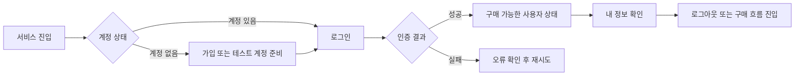
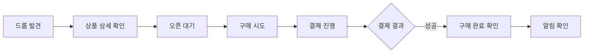
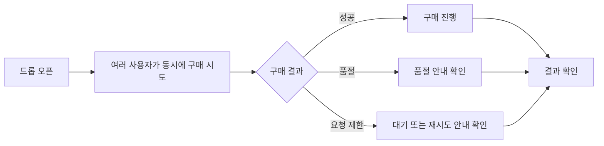
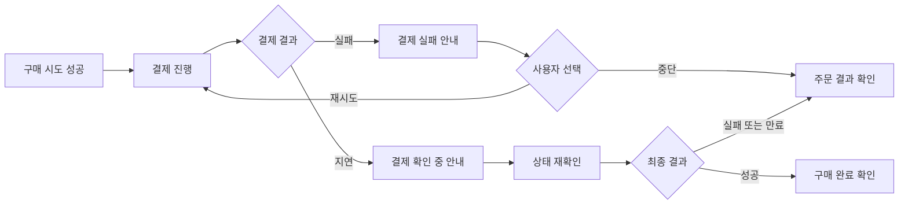
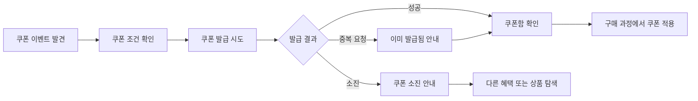
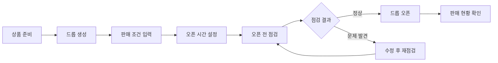
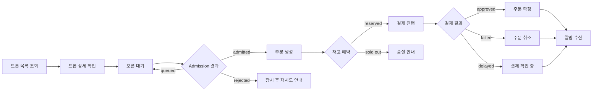
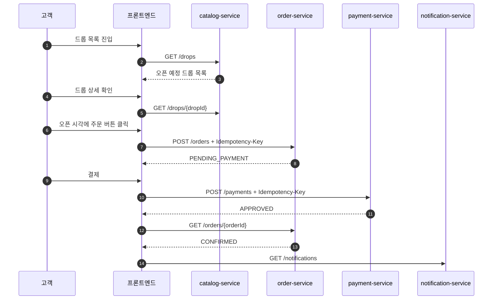
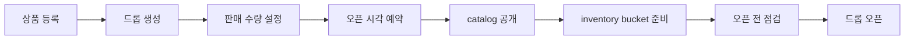
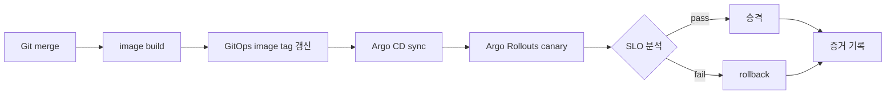

# DropMong 사용자 흐름

작성일: 2026-07-02

이 문서는 DropMong을 실제 사용자가 어떤 순서로 경험하는지 정의한다. `07-critical-flows.md`가 시스템 내부 sequence라면, 이 문서는 화면과 사용자 행동 중심의 흐름이다.

## 1. 사용자 흐름 요약

이 섹션은 설계 확정 전 작업 분배를 위해 사용자 관점에서 가능한 큰 흐름을 먼저 나열한다. 서비스 경계, API, 데이터 모델, 동시성 처리 방식은 각 시나리오 오너가 후속 설계에서 제안하고 리뷰한다. 인증 및 회원 관련 시나리오를 제외한 구매, 품절, 결제 실패, 쿠폰 시나리오는 사용자가 이미 로그인되어 있고 사용자 식별자가 전달된다는 전제로 본다.

| 시나리오 오너 | 사용자 관점 질문 | 포함할 흐름 |
| --- | --- | --- |
| 인증 및 회원 관련 시나리오 오너 | 사용자는 구매 전에 어떻게 본인임을 증명하고 구매 가능한 상태가 되는가? | 가입 또는 테스트 계정 준비, 로그인, 세션 유지, 내 정보 확인, 로그아웃 |
| 정상 구매 시나리오 오너 | 로그인된 사용자는 한정 상품을 발견하고 정상적으로 구매 완료까지 갈 수 있는가? | 드롭 발견, 상세 확인, 오픈 대기, 구매 시도, 결제, 구매 결과 확인, 알림 확인 |
| 품절/동시성 시나리오 오너 | 여러 사용자가 동시에 구매할 때 사용자는 어떤 성공/실패 결과를 받는가? | 오픈 직후 동시 구매, 일부 성공, 품절 안내, 재시도, 결과 확인 |
| 결제 실패 시나리오 오너 | 사용자는 결제 실패나 지연 상황에서 주문 상태를 이해할 수 있는가? | 구매 시도, 결제 실패 또는 지연, 상태 확인, 재시도 또는 만료, 알림 확인 |
| 선착순 쿠폰 시나리오 오너 | 로그인된 사용자는 한정 수량 쿠폰을 받고 구매에 사용할 수 있는가? | 쿠폰 발견, 발급 시도, 발급 성공 또는 소진 안내, 쿠폰함 확인, 구매 적용 |
| 운영자 준비 시나리오 오너 | 운영자는 사용자가 구매할 수 있는 드롭을 어떻게 준비하고 오픈하는가? | 상품 준비, 드롭 생성, 판매 조건 입력, 오픈 전 점검, 오픈, 판매 현황 확인 |

### 인증 및 회원 관련 시나리오 후보



### 정상 구매 시나리오 후보



### 품절/동시성 시나리오 후보



### 결제 실패 시나리오 후보



### 선착순 쿠폰 시나리오 후보



### 운영자 준비 시나리오 후보



```text
고객:
드롭 발견 -> 상세 확인 -> 오픈 대기 -> 주문 시도 -> 결제 -> 주문 상태 확인 -> 알림 수신

운영자:
상품 등록 -> 드롭 생성 -> 판매 수량 설정 -> 오픈 예약 -> 피크 모니터링 -> 장애 대응 -> 판매 결과 확인

플랫폼 운영자:
배포 준비 -> canary 시작 -> SLO 관찰 -> 승격 또는 rollback -> 증거 기록
```

## 2. 고객 구매 흐름



### 단계별 화면과 API

| 단계 | 사용자 행동 | API | 상태 변화 | 실패/예외 |
| --- | --- | --- | --- | --- |
| 1 | 드롭 목록을 본다. | `GET /drops` | 없음 | catalog cache miss |
| 2 | 드롭 상세를 확인한다. | `GET /drops/{dropId}` | 없음 | drop not found |
| 3 | 오픈 시각을 기다린다. | `GET /drops/{dropId}` polling 또는 새로고침 | 없음 | 아직 `SCHEDULED` |
| 4 | 주문 버튼을 누른다. | `POST /orders` | `PENDING_PAYMENT`, reservation active | 429, 409, 422 |
| 5 | 결제한다. | `POST /payments` | payment requested | payment fail/delay |
| 6 | 주문 상태를 본다. | `GET /orders/{orderId}` | `CONFIRMED`, `CANCELLED`, `EXPIRED` | stale payment result |
| 7 | 알림을 확인한다. | `GET /notifications` | notification read optional | notification lag |

## 3. 고객 정상 구매 경로



완료 기준:

- 고객은 같은 요청을 다시 보내도 중복 주문을 만들지 않는다.
- 결제 승인 후 주문 상태는 `CONFIRMED`가 된다.
- 알림은 늦게 와도 주문 확정 자체를 막지 않는다.

## 4. 고객 예외 흐름

### 4.1 대기 또는 거절

```text
주문 클릭 -> admission 확인 -> queued/rejected -> 사용자에게 대기 또는 재시도 안내
```

사용자 메시지:

- queued: "요청이 많아 순서대로 처리 중입니다."
- rejected: "현재 주문 요청이 많습니다. 잠시 후 다시 시도해 주세요."

시스템 기준:

- rejected 요청은 `order-service` DB transaction까지 들어가지 않는다.
- queued/rejected 지표는 accepted latency와 분리한다.

### 4.2 품절

```text
주문 클릭 -> `order-service` 재고 확인 -> SOLD_OUT -> 품절 안내
```

사용자 메시지:

- "준비된 수량이 모두 소진되었습니다."

시스템 기준:

- `409 SOLD_OUT`
- `oversell_count = 0`
- 품절 안내는 catalog projection보다 order-service 결과를 우선한다.

### 4.3 결제 실패

```text
주문 예약 성공 -> 결제 실패 -> payment.failed event -> reservation release -> 주문 취소 안내
```

사용자 메시지:

- "결제가 완료되지 않아 주문이 취소되었습니다."

시스템 기준:

- 주문 상태: `CANCELLED`
- reservation 상태: `RELEASED`
- 예약 재고 수량이 감소한다.

### 4.4 결제 지연

```text
주문 예약 성공 -> 결제 지연 -> 주문 상태는 확인 중 -> TTL 초과 시 EXPIRED
```

사용자 메시지:

- "결제 결과를 확인 중입니다."
- TTL 초과 후: "결제 확인 시간이 지나 주문이 만료되었습니다."

시스템 기준:

- 늦게 도착한 `payment.approved` event는 expired order를 자동 confirm하지 않는다.
- reconciliation metric을 남긴다.

## 5. 운영자 드롭 준비 흐름



| 단계 | 운영자 행동 | API/작업 | 소유 서비스 |
| --- | --- | --- | --- |
| 1 | 상품 등록 | `POST /admin/products` | `catalog-service` |
| 2 | 드롭 생성 | `POST /admin/drops` | `catalog-service` |
| 3 | 판매 수량 설정 | `POST /admin/drops/{dropId}/schedule` | `catalog-service`, `order-service` |
| 4 | 오픈 예약 | schedule update | `catalog-service` |
| 5 | 재고 bucket 준비 | admin workflow 또는 event | `order-service` |
| 6 | 오픈 전 점검 | dashboard, synthetic smoke | platform |
| 7 | 오픈 | 시간 기반 상태 전환 | `catalog-service`, gateway policy |

운영자 완료 기준:

- 공개 catalog에서 드롭이 보인다.
- `order-service`에 inventory bucket이 준비되어 있다.
- synthetic smoke가 통과한다.
- dashboard에서 드롭 상태와 주요 지표가 보인다.

## 6. 운영 중 모니터링 흐름

```text
드롭 오픈 -> admitted/queued/rejected RPS 확인 -> order latency 확인 -> oversell_count 확인 -> outbox/Kafka lag 확인 -> 필요 시 admission threshold 조정
```

운영자가 보는 핵심 패널:

- admitted, queued, rejected RPS
- accepted checkout p95/p99
- order success/error rate
- active reservation count
- confirmed order count
- oversell count
- outbox pending age
- Kafka consumer lag
- DLQ depth

## 7. 플랫폼 배포 흐름



배포 기준:

- `order-service`와 `payment-service`는 canary 우선이다.
- SLO 위반이 있으면 자동 rollback한다.
- rollback 후에는 증거와 후속 issue를 남긴다.

## 8. 프론트엔드 화면 후보

1차 구현 화면:

| 화면 | 사용자 | 목적 |
| --- | --- | --- |
| 드롭 목록 | 비회원/고객 | 오픈 예정, 진행 중, 품절 드롭 확인 |
| 드롭 상세 | 비회원/고객 | 상품, 가격, 오픈 시각, 주문 버튼 확인 |
| 로그인 | 고객 | JWT 발급 |
| Checkout 상태 | 고객 | 주문 예약, 결제, 확정 상태 확인 |
| 내 주문 | 고객 | 주문 이력 확인 |
| 알림 | 고객 | 주문/결제 알림 확인 |
| Admin 드롭 편집기 | 운영자 | 상품, 드롭, 판매 수량, 오픈 시각 설정 |
| 운영 dashboard | 운영자 | 피크 트래픽과 장애 상태 확인 |

## 9. 테스트 연결

| 사용자 흐름 | 테스트 |
| --- | --- |
| 고객 정상 구매 | `customer_drop_purchase_happy_path` |
| 주문 버튼 반복 클릭 | `customer_order_idempotency_replay` |
| 품절 | `customer_sold_out_path` |
| 결제 실패 | `customer_payment_failed_path` |
| 결제 지연 | `customer_payment_delayed_expiry_path` |
| 운영자 드롭 준비 | `operator_drop_setup_smoke` |
| 피크 모니터링 | `operator_drop_open_dashboard_signals` |
| canary rollback | `platform_canary_rollback_flow` |
