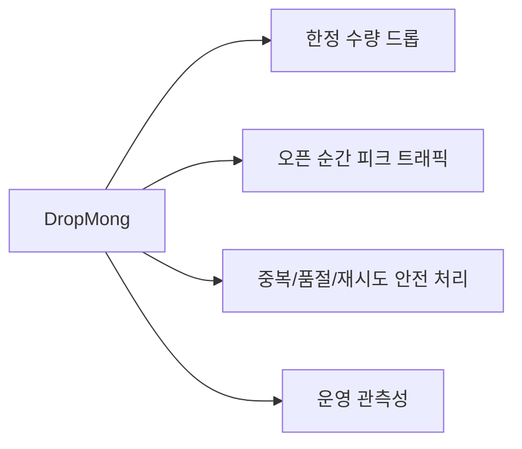
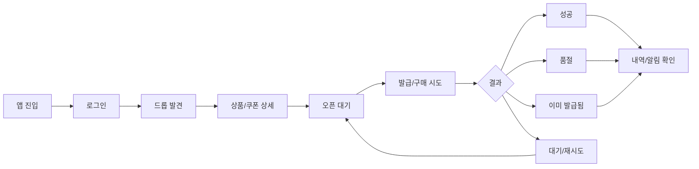
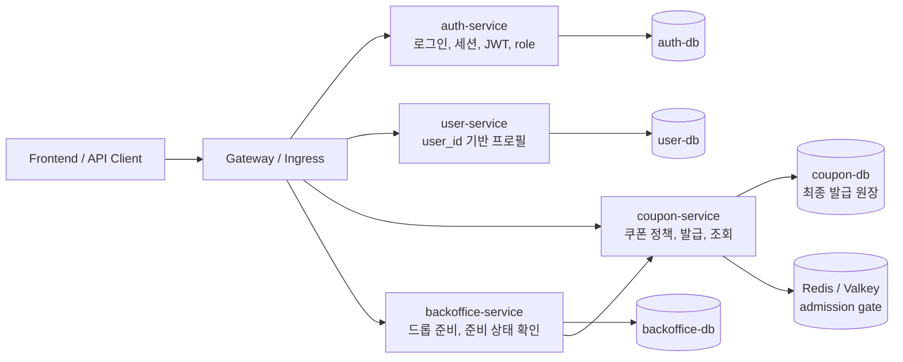
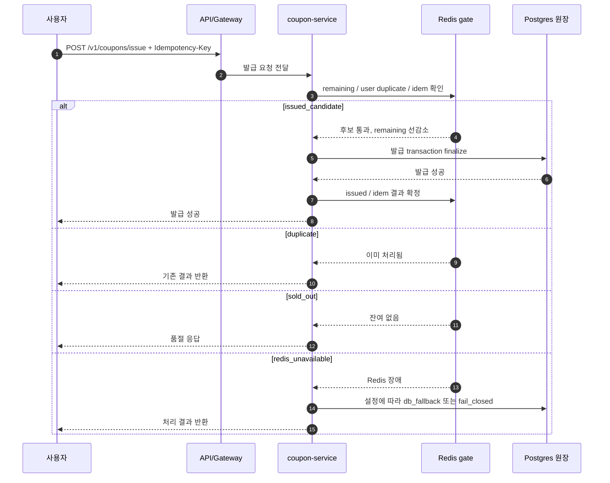
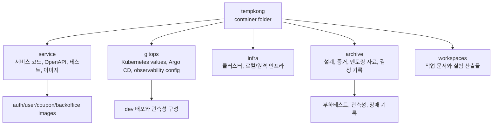
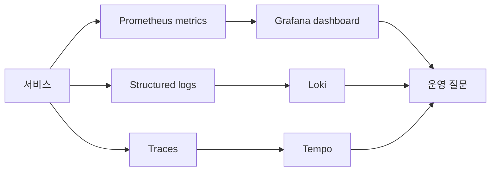

# DropMong 멘토링 시각 자료 구성안

작성일: 2026-07-06

대상 멘토링: 2026-07-07

## 목적

이 문서는 DropMong 멘토링에서 어떤 시각 자료를 보여주고, 어떤 순서로 설명하며, 멘토에게 어떤 질문을 던질지 정리한다.

이번 멘토링의 목표는 "마이크로서비스를 만들었다"가 아니라, 다음 내용을 한 번에 이해시키는 것이다.

```text
DropMong은 한정 수량 드롭 커머스이며,
오픈 순간의 동시 요청, 중복 요청, 품절 폭주, 운영 관측성을 검증하기 위해
현재 auth, user, coupon, backoffice 중심의 Go MSA 구조로 구현하고 있다.
```

## 현재 기준

현재 발표 기준은 실제 구현과 검증이 진행 중인 구조다.

| 영역 | 현재 기준 | 발표에서 말할 범위 |
| --- | --- | --- |
| 제품 | 한정 수량 드롭 커머스 | 드롭 발견, 오픈 대기, 구매/쿠폰 시도, 품절/중복/실패 안내 |
| 구현 서비스 | `auth-service`, `user-service`, `coupon-service`, `backoffice-service` | 현재 Go MSA로 구현 중인 핵심 서비스 |
| 보조/기존 서비스 | `reservation-service` 등 기존 흔적 | 현재 발표의 중심은 아님 |
| 배포/운영 | `service`, `gitops`, `infra`, `archive` repo 분리 | 코드, 배포 선언, 인프라, 설계/증거 보관 경계 |
| 관측성 | `/metrics`, 로그, 대시보드, GitOps 관측성 구성 | 장애가 났을 때 무엇을 볼지 중심 |
| 핵심 설계 포인트 | Redis gate + Postgres 원장 | DB 앞단 압력 완화와 최종 정합성 분리 |

주의할 점:

- 과거 설계 패킷에는 `catalog-service`, `order-service`, `payment-service`, `notification-service` 중심 목표안도 남아 있다.
- 이번 멘토링에서는 아직 구현되지 않은 목표 구조를 확정된 현재 구조처럼 말하지 않는다.
- 필요한 경우 "향후 확장 후보"로만 분리해서 설명한다.

## 발표 메시지

한 문장:

```text
DropMong은 한정 수량 상품이 열리는 순간에 몰리는 요청을 안전하게 처리하기 위한 이커머스 실험 서비스입니다.
```

조금 길게:

```text
사용자는 오픈 예정 드롭을 보고, 오픈 시각에 구매나 쿠폰 발급을 시도합니다.
시스템은 같은 사용자의 중복 요청, 품절 이후 폭주 요청, DB row lock 집중을 줄이면서도
최종 발급 결과는 Postgres 원장으로 보장하도록 설계하고 있습니다.
```

## 시각 자료 순서

| 순서 | 자료 | 목적 | 멘토가 보기 좋은 질문 |
| --- | --- | --- | --- |
| 1 | 서비스 소개 배너 | DropMong이 어떤 서비스인지 첫 화면에서 설명 | "서비스의 문제의식이 바로 보이는가?" |
| 2 | 사용자 여정 플로우 UI 이미지 | 사용자가 앱에서 어떤 순서로 경험하는지 설명 | "UX와 백엔드 상태가 자연스럽게 이어지는가?" |
| 3 | 현재 서비스 구성도 | 현재 구현된 서비스 책임을 설명 | "서비스가 과하게 쪼개졌거나 부족한가?" |
| 4 | 쿠폰/선착순 처리 시퀀스 | 병목과 정합성 설계를 설명 | "Redis gate와 DB 원장 분리가 적절한가?" |
| 5 | Kubernetes/GitOps 구조 | 배포와 운영 책임을 설명 | "repo와 배포 경계가 유지보수 가능한가?" |
| 6 | 관측성 구조 | 장애 때 무엇을 보는지 설명 | "지금 단계에서 꼭 볼 지표가 빠졌는가?" |
| 7 | 질문 목록 | 멘토링 대화를 설계 검토로 전환 | "다음 구현 우선순위가 무엇인가?" |

## 1. 서비스 소개 배너

이 장은 복잡한 아키텍처가 아니라 서비스의 첫인상을 보여준다. 한 장 요약 다이어그램이 아니라, 발표 첫 화면이나 섹션 전환에 쓸 수 있는 16:9 배너 이미지로 준비한다.



설명할 말:

- DropMong은 일반 쇼핑몰 전체가 아니라 "오픈 순간에 요청이 몰리는 한정 수량 판매"를 다룬다.
- 핵심은 예쁜 상품 목록보다 피크 순간의 정합성이다.
- 사용자는 성공, 품절, 중복, 대기 같은 결과를 빠르게 이해해야 한다.
- 발표 첫 화면에서는 내부 서비스명보다 "한정 수량", "오픈 순간", "안전한 처리"가 먼저 보여야 한다.

이미지 제작 프롬프트:

```text
16:9 presentation banner for a Korean limited-drop ecommerce service named "DropMong".
Create a polished app/service introduction banner, not a technical architecture diagram.
Show a modern mobile commerce scene: limited-edition product drop, countdown timer, users waiting for opening time, sold-out and success states hinted subtly.
Composition should feel premium, energetic, and reliable, with clear left-to-right visual attention.
Include Korean headline text: "DropMong" and smaller supporting text: "한정 수량 드롭 커머스".
Avoid showing operators or admin dashboards. Avoid generic shopping cart stock imagery.
Use clean UI mockups, product cards, countdown, and high-traffic atmosphere.
Aspect ratio 16:9, presentation-ready, enough empty space for title text.
```

## 2. 사용자 여정 플로우 UI 이미지

이 장에서는 운영자를 빼고 사용자 관점만 보여준다. 16:9 비율에서 좌에서 우로 흐르는 앱 서비스 여정 플로우 UI 이미지로 만든다.



설명할 말:

- UI 시안은 단순 화면이 아니라 성공/실패/대기/중복 상태를 표현해야 한다.
- 백엔드는 사용자가 같은 버튼을 여러 번 눌러도 같은 결과를 안정적으로 돌려줘야 한다.
- 멘토에게 UX 상태와 API 상태 코드가 잘 맞는지 물어볼 수 있다.

이미지 제작 프롬프트:

```text
16:9 left-to-right mobile app user journey flow for "DropMong", a Korean limited-drop ecommerce app.
Create a horizontal sequence of smartphone UI screens connected by subtle arrows.
Screens from left to right: app entry/login, drop discovery feed, product or coupon detail with countdown, waiting for opening, issue or purchase attempt, result states, history/notification.
Result states should show success, sold out, already issued/duplicate, and wait/retry as compact UI cards near the attempt step.
Use Korean UI labels: "로그인", "드롭 발견", "오픈 대기", "발급/구매 시도", "성공", "품절", "이미 발급됨", "재시도", "내역 확인".
Only user-facing app screens; do not include admin/operator dashboards, backend service boxes, Kubernetes, or database icons.
Style should be clean, realistic, product-design oriented, suitable for mentoring presentation.
Aspect ratio 16:9, left-to-right reading order, high readability on projector.
```

## 3. 현재 서비스 구성도

현재 구현 중심 서비스는 네 개다.



서비스별 설명:

| 서비스 | 현재 책임 | 멘토링에서 강조할 점 |
| --- | --- | --- |
| `auth-service` | 인증 계정, 세션, JWT, role | `user_id`와 인증/권한만 다루고 프로필은 모른다 |
| `user-service` | 사용자 레코드, 최소 프로필, 상태 | auth와 사용자 프로필 책임을 분리한다 |
| `coupon-service` | 쿠폰 정책, 발급, 사용자별 조회 | Redis는 gate, Postgres는 최종 원장이다 |
| `backoffice-service` | 운영자용 드롭 준비와 readiness | 운영자가 이벤트를 열기 전 준비 상태를 만든다 |

설명할 말:

- auth-service가 사용자의 실명, 닉네임, 프로필을 알지 않도록 경계를 잡았다.
- coupon-service는 피크 요청이 몰릴 가능성이 높아서 Redis gate를 먼저 실험한다.
- backoffice-service는 사용자가 보기 전 운영자가 드롭과 쿠폰 정책을 준비하는 진입점이다.

이미지 제작 프롬프트:

```text
16:9 clean technical service map for DropMong current implementation.
Show four main services as clear blocks: auth-service, user-service, coupon-service, backoffice-service.
Show API/Gateway on the left, services in the center, and data stores on the right.
Coupon-service should connect to PostgreSQL labeled "최종 발급 원장" and Redis/Valkey labeled "admission gate".
Backoffice-service should connect to coupon-service as an internal preparation flow.
Use Korean labels where helpful, but keep service names in English.
Do not include future services such as order-service, payment-service, notification-service as current services.
Aspect ratio 16:9, readable as a mentoring slide, modern but not decorative.
```

## 4. 쿠폰/선착순 처리 시퀀스

이 장이 멘토링의 핵심 질문을 가장 많이 만들 자료다.



핵심 설명:

- Redis는 최종 발급 원장이 아니다.
- Redis는 DB 앞에서 중복 요청과 품절 폭주를 빠르게 걸러 DB row lock 진입을 줄인다.
- Postgres는 쿠폰 정책, 발급 원장, unique constraint, idempotency의 최종 진실이다.
- Redis에서 먼저 감소시킨 뒤 DB finalize가 실패하면 보상 로직으로 되돌린다.

멘토에게 물어볼 질문:

- Redis 장애 시 기본값을 `db_fallback`으로 둘지, 피크 이벤트에서는 `fail_closed`로 둘지 기준을 어떻게 잡는 게 좋은가?
- sold-out storm에서 DB finalize 자체를 줄이는 접근이 적절한가?
- pending TTL과 DB transaction 지연이 겹칠 때 어떤 테스트를 우선해야 하는가?

이미지 제작 프롬프트:

```text
16:9 technical sequence illustration for DropMong coupon issue flow.
Show a left-to-right flow: User request -> API/Gateway -> coupon-service -> Redis admission gate -> Postgres ledger -> response.
Emphasize that Redis is not the final ledger. Label Redis as "DB 앞단 gate" and Postgres as "최종 발급 원장".
Show four outcome branches near Redis/coupon-service: issued_candidate, duplicate, sold_out, redis_unavailable.
Include a small compensation note for DB finalize failure: "보상: pending 해제 + remaining 복구".
Use concise Korean annotations, clean arrows, and presentation-ready contrast.
Aspect ratio 16:9, technical but easy to explain verbally.
```

## 5. 저장소와 배포 책임 구조

현재 `tempkong` 바깥 폴더는 컨테이너 역할이고, 실제 책임은 하위 repo로 나뉜다.



설명할 말:

- 서비스 코드는 `service`가 소유한다.
- 배포 선언과 관측성 운영 구성은 `gitops`가 소유한다.
- 설계 합의, 발표 자료, 검증 증거는 `archive`에 보관한다.
- 멘토링 자료도 구현 repo가 아니라 archive에 두는 이유는 의사결정 기록으로 남기기 위해서다.

이미지 제작 프롬프트:

```text
16:9 repository and deployment responsibility map for DropMong.
Show tempkong as a container workspace at the top, splitting into service, gitops, infra, archive, and workspaces.
Use simple lanes: service owns code/contracts/tests/images, gitops owns Kubernetes values/Argo CD/observability config, infra owns cluster infrastructure, archive owns design/evidence/mentoring records.
Keep it as a clean responsibility map, not a filesystem screenshot.
Use Korean labels and small icons only when they improve readability.
Aspect ratio 16:9, suitable for explaining repo boundaries in mentoring.
```

## 6. 관측성 자료

관측성 자료는 도구 목록이 아니라 "이 문제가 생기면 무엇을 볼 것인가"로 보여준다.



보여줄 지표 후보:

| 질문 | 볼 지표 |
| --- | --- |
| 요청이 몰렸는가? | RPS, p95/p99 latency |
| Redis gate가 DB 진입을 줄였는가? | `coupon_redis_gate_total{result}` |
| DB finalize까지 들어간 요청은 얼마나 되는가? | `coupon_db_finalize_total{result}` |
| 품절/중복이 빠르게 처리되는가? | result별 latency, sold_out/duplicate count |
| 서비스가 살아 있는가? | `/healthz`, `/readyz`, `/metrics` |
| 장애가 특정 요청에서 시작됐는가? | request id, trace id, structured log |

설명할 말:

- 단순히 Grafana가 있다는 말보다 어떤 운영 질문에 답할 수 있는지 보여준다.
- 쿠폰 발급 병목을 보려면 Redis gate 결과와 DB finalize 결과를 함께 봐야 한다.
- 이 단계에서는 모든 대시보드를 완성하는 것보다 최소 관측 질문을 선명하게 잡는 것이 중요하다.

이미지 제작 프롬프트:

```text
16:9 observability explanation slide for DropMong.
Show services emitting metrics, logs, and traces into Prometheus/Grafana, Loki, and Tempo.
Present the slide around operational questions, not around tool logos.
Include Korean question callouts: "요청이 몰렸는가?", "Redis gate가 DB 진입을 줄였는가?", "품절/중복이 빠르게 처리되는가?", "장애 요청을 추적할 수 있는가?"
Highlight coupon_redis_gate_total and coupon_db_finalize_total as key metrics.
Use a clear dashboard-like composition with minimal clutter.
Aspect ratio 16:9, mentoring presentation style.
```

## 7. 멘토에게 질문할 목록

서비스 경계:

- 현재 `auth-service`가 `user_id`와 인증/세션/권한만 다루고, 프로필은 `user-service`로 분리한 경계가 적절한가?
- 현재 단계에서 `coupon-service`와 향후 `order-service` 책임을 어디까지 분리하는 게 좋은가?
- `backoffice-service`가 드롭 준비와 readiness를 맡는 구조가 운영자 흐름에 맞는가?

성능/정합성:

- Redis gate + Postgres 원장 구조가 선착순 쿠폰/한정 수량 처리에 적절한가?
- Redis 장애 시 `db_fallback`과 `fail_closed` 선택 기준을 어떻게 잡아야 하는가?
- duplicate storm, sold-out storm, Redis unavailable 중 어떤 검증을 먼저 해야 하는가?

운영/관측성:

- 지금 단계에서 꼭 봐야 하는 최소 지표는 무엇인가?
- 멘토링/포트폴리오 관점에서 Kubernetes 구조보다 병목 해결 설계를 더 강조해도 되는가?
- GitOps, 관측성, 부하테스트 자료 중 어떤 증거를 먼저 완성하는 게 설득력 있는가?

UX/API:

- 사용자가 품절, 대기, 중복, 결제 실패를 이해할 수 있게 상태를 나누고 있는가?
- UX 시안에서 반드시 보여줘야 하는 실패 상태는 무엇인가?
- API 에러와 화면 메시지가 너무 기술 중심으로 보이지 않는가?

## 발표 중 답변 준비 메모

예상 질문: "왜 Redis를 쓰나요?"

```text
최종 정합성을 Redis에 맡기려는 것이 아니라,
품절 이후 폭주 요청과 중복 요청이 모두 DB row lock 경로까지 들어가는 문제를 줄이기 위해서입니다.
Postgres는 여전히 최종 원장이고, Redis는 DB 앞단 admission gate로만 둡니다.
```

예상 질문: "서비스가 너무 많은 것 아닌가요?"

```text
현재 구현 중심은 auth, user, coupon, backoffice 네 개입니다.
auth와 user는 책임 경계를 명확히 하기 위해 나누었고,
coupon은 피크 요청과 중복/품절 처리가 핵심이라 별도 서비스로 두었습니다.
나머지 주문, 결제, 알림 계열은 향후 확장 후보로 보고 있습니다.
```

예상 질문: "Kubernetes를 왜 보여주나요?"

```text
Kubernetes 자체를 자랑하려는 게 아니라,
서비스 코드, 배포 선언, 관측성, 검증 증거가 어떤 경계로 나뉘어 운영되는지 보여주려는 목적입니다.
특히 피크 트래픽 실험은 배포와 관측성이 같이 있어야 검증할 수 있습니다.
```

예상 질문: "지금 가장 불확실한 부분은 무엇인가요?"

```text
Redis gate가 sold-out storm과 duplicate storm에서 DB finalize 진입을 실제로 얼마나 줄이는지,
그리고 Redis 장애 시 fallback 정책을 어떤 운영 기준으로 선택해야 하는지가 가장 큰 확인 지점입니다.
```

## 당일 자료 체크리스트

- UX/UI 시안에서 성공, 품절, 중복, 대기 상태가 보이는가?
- 현재 서비스 구성도에서 구현된 서비스와 향후 후보 서비스가 섞여 보이지 않는가?
- Redis gate 자료에서 "Redis는 원장이 아니다"가 분명한가?
- 관측성 자료가 도구 나열이 아니라 운영 질문 중심인가?
- 멘토에게 던질 질문이 "괜찮나요?"가 아니라 선택 기준을 묻는 형태인가?

## 다음 자료 후보

멘토링 전에 시간이 있으면 다음 산출물을 별도 파일이나 이미지로 만들 수 있다.

| 후보 | 우선순위 | 이유 |
| --- | --- | --- |
| 서비스 소개 배너 | P0 | 발표 첫 화면과 서비스 설명에 바로 쓸 수 있다 |
| 사용자 여정 플로우 UI 이미지 | P0 | 사용자 관점으로 앱 경험을 설명하기 좋다 |
| 현재 서비스 구성도 PNG | P1 | 구현 구조 질문을 만들기 좋다 |
| Redis gate 시퀀스 PNG | P1 | 핵심 설계 질문을 만들기 좋다 |
| 관측성 대시보드 캡처 | P1 | 구현 신뢰도를 높인다 |
| GitOps/repo 경계 보드 | P2 | 시간이 남을 때 운영 구조 설명에 쓴다 |
