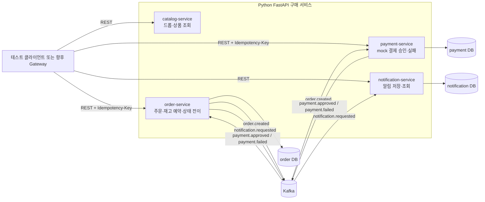
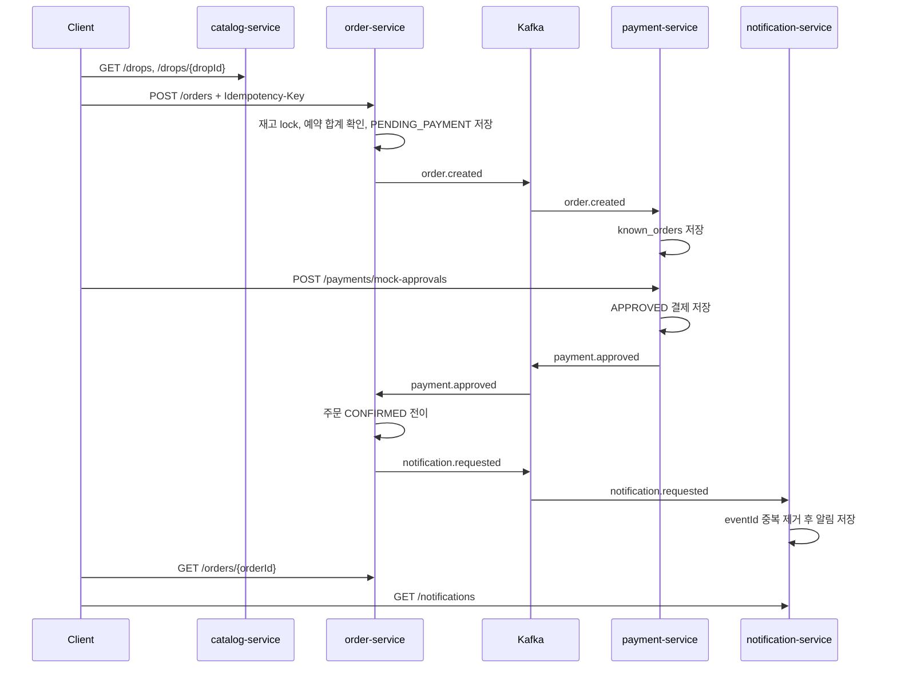
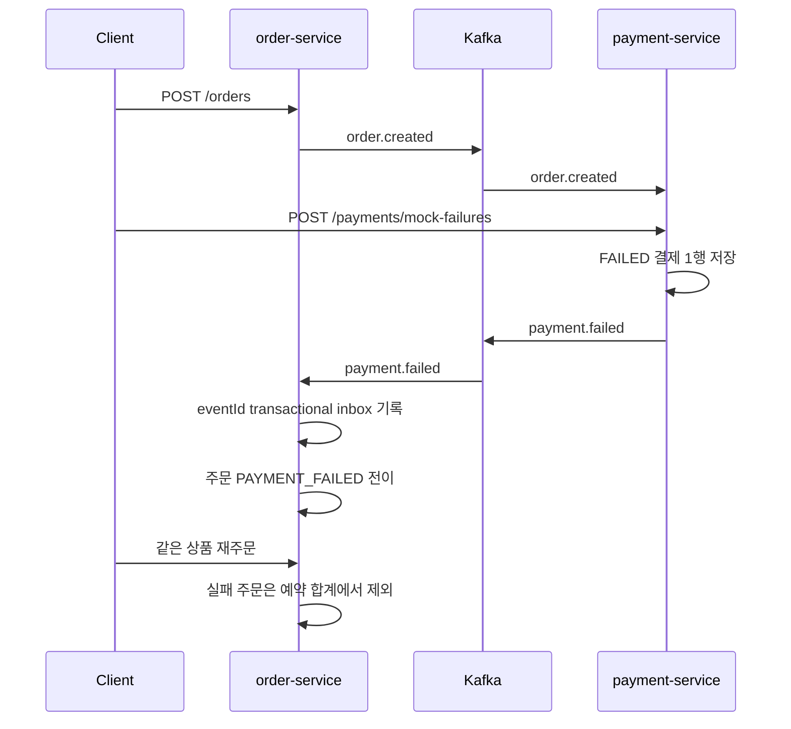
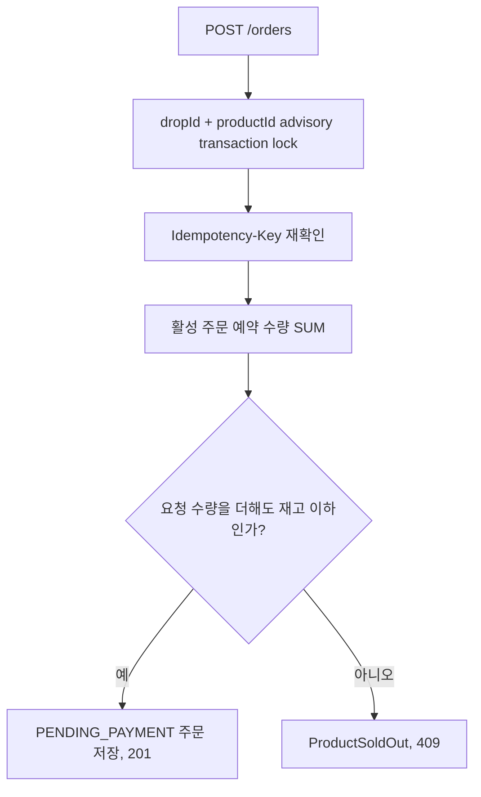
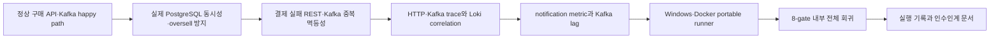
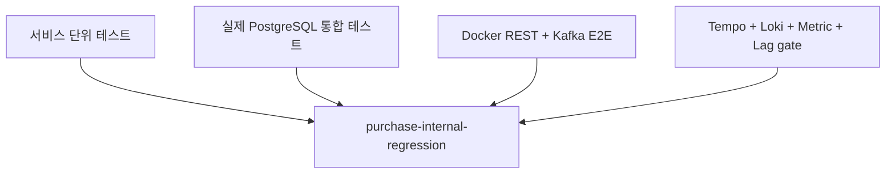

# 구매 시나리오 개발 인수인계 가이드

작성일: 2026-07-14
게시 후보: `Medikong/services` 브랜치 `agent/purchase-internal-regression`, 커밋 `b7878ae`
구매 런타임 검증 기준: `Medikong/services` 커밋 `34f909b`

이 문서는 정상 구매, 결제 실패, 품절/동시성 시나리오가 어떤 순서로 개발됐고 현재 코드가 어떤 구조로 연결되는지 설명한다. 설계 원문이나 테스트 결과를 반복하기보다, 새로 참여한 팀원이 코드를 읽고 다음 변경을 시작할 수 있도록 구현 구조와 판단 근거를 연결한다.

## 1. 먼저 읽을 문서

| 순서 | 문서 | 확인할 내용 |
| ---: | --- | --- |
| 1 | `scenarios/_shared/03-purchase-development-handoff.md` | 현재 구현 구조와 개발 과정 |
| 2 | `scenarios/_shared/04-blueprint-traceability.md` | blueprint 요구사항과 세 시나리오의 연결 |
| 3 | `scenarios/progress.md` | 완료한 Task와 남은 위험 |
| 4 | 각 시나리오의 `00-detailed-design.md`와 `01`~`05` 문서 | 목표, 사용자 흐름, 계약, 상태, 구현, 테스트 |
| 5 | 각 시나리오의 `test-execution-record.md` | 실제 실행 결과와 실패·재설계 기록 |
| 6 | `scenarios/_shared/02-docker-purchase-e2e-runbook.md` | 로컬 실행과 장애 확인 방법 |
| 7 | `scenarios/_shared/adr/` | 언어와 REST/gRPC/Kafka 등 공통 결정 제안 |
| 8 | `Medikong/services/tests/README.md` | 코드 저장소의 테스트 명령 |

설계 문서는 목표 상태를 설명하고, 이 문서는 현재 구현 상태를 설명한다. 둘이 다르면 이 문서의 "설계와 현재 구현 차이"를 먼저 확인한다.

## 2. 현재 완료 범위

현재 다음 백엔드 내부 흐름은 실제 PostgreSQL, Kafka, Tempo, Loki를 사용한 Docker E2E로 검증됐다.

- 정상 구매: 드롭 조회, 주문 생성, 결제 승인, 주문 확정, 알림 조회
- 결제 실패: 실패 결제 저장, `payment.failed` 처리, 주문 `PAYMENT_FAILED`, 예약 수량 회복
- 품절/동시성: 같은 상품에 병렬 주문이 들어와도 예약 합계가 재고를 넘지 않음
- 중복 처리: 같은 주문·결제 요청과 같은 실패 이벤트가 반복돼도 상태 변경이 중복되지 않음
- 관측성: HTTP와 Kafka trace, 구조화 로그 correlation, 업무 metric, Kafka consumer lag

다음 경계는 아직 완료 범위가 아니다.

- Istio Gateway JWT, auth-service 연동, 위조 `X-User-*` header 차단
- `CANCELED`, `EXPIRED`, 결제 지연과 늦은 승인 상태 전이
- 결제 실패 알림
- order-service와 payment-service의 DB commit과 Kafka publish 사이 transactional outbox
- Kafka consumer retry, DLQ, schema registry
- 실제 프론트엔드에서 Gateway를 통과하는 전체 사용자 E2E
- 장시간 spike 부하의 p95/p99와 운영 SLO

따라서 현재 상태는 **내부 구매 백엔드 시나리오가 반복 실행 가능한 상태**이며, **외부 트래픽을 받는 운영 준비 완료 상태는 아니다**.

## 3. 전체 구조



서비스 사이의 업무 상태 전파는 Kafka를 사용한다. 사용자 조회·명령 API는 REST를 사용한다. 각 서비스는 자기 DB만 읽고 쓰며 다른 서비스 DB를 직접 조회하지 않는다.

## 4. 서비스별 책임과 코드 위치

| 서비스 | 현재 책임 | 주요 저장 데이터 | 코드 시작점 |
| --- | --- | --- | --- |
| `catalog-service` | 드롭 목록과 상세 조회 | 현재는 코드 fixture `DROP_CATALOG` | `services/catalog-service/app/main.py` |
| `order-service` | 주문 생성, 재고 예약, 주문 상태 전이, 알림 요청 발행 | `orders`, `processed_payment_events` | `services/order-service/app/main.py`, `postgres.py`, `messaging.py` |
| `payment-service` | 주문 정보 수신, mock 승인·실패, 결제 이벤트 발행 | `known_orders`, `payments` | `services/payment-service/app/main.py`, `postgres.py`, `messaging.py` |
| `notification-service` | 알림 요청 중복 제거, 알림 저장과 조회 | `notifications` | `services/notification-service/app/main.py`, `postgres.py`, `messaging.py` |
| `auth-service` | 인증 도메인 | 별도 팀 소유 | 이번 구매 내부 회귀에서 제외 |
| `dropmong-web` | 사용자 화면 | 프론트엔드 상태 | 이번 8-gate 백엔드 회귀에서 제외 |

### 공통 Python 서비스 구조

```text
app/
  main.py        REST endpoint, header context, 응답 매핑
  models.py      API와 도메인 데이터 모델
  store.py       도메인 결과 타입과 in-memory 구현
  repository.py  저장소 Protocol
  postgres.py    PostgreSQL 구현과 DB 제약
  events.py      Kafka event 생성
  messaging.py   Kafka producer/consumer
  db.py          DB·Kafka lifecycle 조립
  metrics.py     업무 metric
```

모든 서비스가 모든 파일을 가지는 것은 아니다. 예를 들어 `catalog-service`는 현재 fixture 기반이므로 DB·Kafka 계층이 없다.

### 공통 패키지

| 경로 | 역할 |
| --- | --- |
| `packages/contracts` | Kafka event Pydantic 계약과 topic 상수 |
| `packages/kafka-utils` | trace context를 포함한 producer/consumer 보조 코드 |
| `packages/observability` | FastAPI trace, 구조화 로그, process 관측성 |
| `packages/middleware` | request context와 공통 middleware |
| `packages/metrics` | 공통 metric label과 준비 상태 보조 코드 |
| `packages/errors` | 공통 오류 표현 |

서비스를 수정할 때 공통 패키지를 먼저 늘리기보다 서비스 내부 구현으로 해결할 수 있는지 확인한다. 여러 서비스가 실제로 같은 동작을 필요로 할 때만 공통 패키지로 이동한다.

## 5. 정상 구매 흐름



`correlationId`는 구매 흐름에서 `orderId`로 통일한다. HTTP 요청은 `X-Request-Id`를 사용하고, Kafka producer가 trace context를 header에 전달해 consumer span과 연결한다.

## 6. 결제 실패 흐름



현재 재고 해제는 별도 inventory row를 수정하는 방식이 아니다. `order-service`가 예약 수량을 계산할 때 `PENDING_PAYMENT`, `CONFIRMED`만 활성 예약으로 포함하고 `PAYMENT_FAILED`는 제외한다.

## 7. 품절과 동시성 처리

`order-service`가 재고의 최종 판단 주체다. 주문 생성 트랜잭션은 다음 순서로 실행된다.



현재 검증 fixture는 재고 42, 요청당 수량 10, 동시 요청 5건이다. 실제 결과는 `201` 4건, `409` 1건, 활성 주문 4건, 예약 수량 40이다.

## 8. 중복 처리 전략

| 경계 | 키와 DB 제약 | 중복 시 동작 |
| --- | --- | --- |
| 주문 REST | `(user_id, idempotency_key)` unique | 같은 payload는 기존 주문 반환, 다른 payload는 409 |
| 결제 REST | `(user_id, idempotency_key)` unique | 같은 payload는 기존 결제 반환, 다른 payload는 409 |
| `payment.failed` consumer | `processed_payment_events.event_id` PK | 같은 이벤트는 주문 상태를 다시 바꾸지 않음 |
| `notification.requested` consumer | `notifications.event_id` unique | 같은 이벤트는 알림을 다시 만들지 않음 |

여기서 보장하는 것은 consumer와 REST 멱등성이다. order-service와 payment-service 모두 DB commit 직후 process가 죽어 Kafka publish가 누락될 수 있으며, outbox가 없으므로 아직 보장하지 않는다. 주문 생성 뒤 `order.created`, 결제 승인 뒤 `payment.approved`, 결제 실패 뒤 `payment.failed`, 주문 확정 뒤 `notification.requested` 발행 구간이 모두 대상이다.

## 9. 개발이 진행된 순서



| 단계 | 핵심 판단 |
| --- | --- |
| 정상 구매 | 네 서비스의 최소 happy path와 event payload를 먼저 고정했다. |
| 동시성 | 메모리 테스트가 아니라 실제 PostgreSQL 독립 세션과 병렬 HTTP로 advisory lock을 검증했다. |
| 결제 실패 | REST idempotency와 Kafka 재전달 idempotency를 분리해 검증했다. |
| 관측성 | trace만 추가하지 않고 로그 correlation, Kafka 로그 metadata allowlist와 raw payload·token·card 부재, metric, lag를 자동 gate로 만들었다. |
| runner 개선 | Windows bind mount, ACL, `grep`, `date`, 고정 port 문제를 제거하고 깨끗한 clone과 Python runner를 사용했다. |
| 통합 회귀 | `task purchase-internal-regression` 한 명령으로 8개 gate를 순서대로 실행하도록 묶었다. |

초기 G003과 G005에는 테스트 하네스 실패 기록이 남아 있다. 기능 실패를 숨긴 것이 아니라, 실패 원인을 보존한 뒤 runner를 재설계해 G009에서 최종 통과시켰다.

## 10. 테스트 구조



### 자주 사용하는 명령

`Medikong/services` 루트에서 실행한다.

```bash
task test-service SERVICE=order-service
task tests:purchase-e2e SCENARIO=04-customer-drop-purchase-happy-path
task tests:purchase-e2e SCENARIO=05-payment-failure-flow
task tests:purchase-e2e SCENARIO=06-sold-out-concurrency-flow
task purchase-e2e-concurrency
task payment-failure-idempotency
task purchase-e2e-with-log-correlation
task purchase-e2e-with-notification-metrics
task purchase-internal-regression
```

최종 내부 회귀는 다음 8개 gate를 실행한다.

1. catalog/order/payment/notification 서비스 테스트
2. 정상 구매와 업무 metric
3. 실제 병렬 주문과 DB oversell 판정
4. 결제 실패 중복 HTTP·Kafka 멱등성
5. HTTP trace
6. Kafka producer/consumer trace graph
7. Loki log correlation, Kafka metadata allowlist와 raw payload·token·card 부재
8. notification metric, 중복 분류, Kafka lag 0 회복

이 통합 실행은 Gateway JWT를 포함하지 않는다.

## 11. 팀원이 코드를 읽는 순서

아래 코드와 테스트 경로는 `Medikong/services` 저장소 루트를 기준으로 한다.

### 정상 구매를 이해할 때

1. `tests/e2e/scenarios/04-customer-drop-purchase-happy-path.postman_collection.json`
2. `services/order-service/app/main.py`의 `POST /orders`
3. `services/order-service/app/postgres.py`의 `create_order`
4. `services/order-service/app/messaging.py`의 `order.created` 발행
5. `services/payment-service/app/messaging.py`의 `order.created` 소비
6. `services/payment-service/app/main.py`의 mock 승인 API
7. `services/order-service/app/messaging.py`의 `payment.approved` 처리
8. `services/notification-service/app/messaging.py`의 알림 저장

### 결제 실패를 이해할 때

1. `tests/e2e/scenarios/05-payment-failure-flow.postman_collection.json`
2. `services/payment-service/app/postgres.py`의 `fail_mock_payment`
3. `services/order-service/app/postgres.py`의 `apply_payment_failed`
4. `tests/e2e/scripts/payment-failure-idempotency-smoke.py`

### 동시성을 이해할 때

1. `services/order-service/app/postgres.py`의 `create_order`
2. `_lock_product_inventory`, `_reserved_quantity`
3. `services/order-service/tests/integration/postgres_order_concurrency.py`
4. `tests/e2e/scripts/purchase-concurrency-smoke.py`

## 12. 변경 작업 규칙

한 서비스 또는 이벤트를 바꿀 때 다음 순서를 지킨다.

1. OpenAPI 또는 `contracts/events/dropmong-purchase-events.md`에서 외부 계약을 먼저 확인한다.
2. producer와 consumer를 함께 찾아 event payload와 상태 전이를 확인한다.
3. 서비스 단위 테스트에서 도메인 결과와 오류를 고정한다.
4. DB 제약이나 경쟁 조건이 있으면 실제 PostgreSQL 통합 테스트를 추가한다.
5. 사용자 흐름이 바뀌면 해당 Newman collection 또는 Python smoke를 수정한다.
6. 관측 필드, metric, trace graph의 기존 불변 조건이 유지되는지 확인한다.
7. 마지막에 `task purchase-internal-regression`을 실행한다.
8. 해당 시나리오의 `test-execution-record.md`와 `progress.md`를 갱신한다.

공통 event나 공통 package 변경은 한 서비스만 보고 merge하지 않는다. 모든 consumer를 찾고 각 서비스 owner가 payload와 재처리 정책을 확인해야 한다.

## 13. 설계와 현재 구현 차이

| 항목 | 설계 목표 | 현재 구현 |
| --- | --- | --- |
| 인증 | Istio가 JWT를 검증하고 내부 header 생성 | 현재 구매 서비스와 E2E는 `X-User-Id`, `X-User-Role`을 직접 사용 |
| 이메일 context | JWT convention과 order OpenAPI에는 선택적 `X-User-Email` 존재 | 현재 구매 서비스는 `X-User-Email`을 소비하지 않음 |
| 역할값 | JWT convention과 OpenAPI는 `CUSTOMER`, `OPERATOR`, `ADMIN` | 현재 구매 런타임은 `CUSTOMER`, `OWNER`, `ADMIN` |
| 결제 API | 실제 결제 요청 API | `/payments/mock-approvals`, `/payments/mock-failures` |
| catalog 저장소 | 영속 catalog와 재고 정보 | `catalog-service`와 `order-service`가 각각 fixture를 보유 |
| order 상태 | `PENDING_PAYMENT`, `CONFIRMED`, `CANCELED`, `EXPIRED` | 자동 검증은 `PENDING_PAYMENT`, `CONFIRMED`, `PAYMENT_FAILED` 중심 |
| payment 상태 | 요청, 승인, 실패, 지연 | 자동 검증은 승인과 실패 중심 |
| 실패 알림 | 결제 실패 사용자 알림 | 아직 `payment.failed`를 notification-service가 소비하지 않음 |
| 이벤트 원자성 | DB 상태와 event 발행 원자화 | order-service와 payment-service producer 모두 transactional outbox 미구현 |
| 이벤트 실패 복구 | retry, DLQ, schema registry | consumer는 잘못된 event나 없는 aggregate를 건너뛰며 자동 복구 경로 미구현 |
| 프론트 E2E | 사용자 화면에서 전체 구매 | 현재 8-gate는 백엔드 API 직접 호출 |

특히 `catalog-service` 조회 결과와 `services/order-service/app/catalog.py` 재고 fixture는 아직 하나의 저장소에서 동기화되지 않는다. 실제 상품 관리 기능을 붙이기 전에 재고 진실의 소유권과 조회 계약을 다시 확정해야 한다.

취소 상태의 기계 계약은 현재 코드와 OpenAPI가 사용하는 `CANCELED`로 정리했다. 실제 상태 전이 구현 전에는 현재 `PAYMENT_FAILED`와 목표 `CANCELED`의 관계를 확정해야 한다. 인증은 `X-User-Email` 사용 여부뿐 아니라 JWT/OpenAPI의 `OPERATOR`와 구매 런타임의 `OWNER`도 다르다. 이 두 항목은 auth-service owner와 Gateway 계약을 정할 때 함께 정리하며, 그전에는 구매 런타임이나 기존 JWT 문서 중 하나를 임의로 authoritative contract로 취급하지 않는다.

## 14. 다음 개발 우선순위

1. Istio JWT와 auth-service 소유자가 Gateway 경계를 확정한다.
2. order-service와 payment-service의 모든 commit→publish 경계에 transactional outbox와 장애 복구 테스트를 추가한다.
3. Kafka retry, DLQ, poison event 처리 정책을 추가한다.
4. 주문 만료·취소·늦은 승인 상태 전이를 구현한다.
5. 결제 실패 알림 event를 설계하고 notification-service에 연결한다.
6. catalog fixture를 실제 저장소와 단일 재고 계약으로 교체한다.
7. dropmong-web부터 Gateway까지 사용자 E2E를 추가한다.
8. spike 부하에서 p95/p99, oversell 0, consumer lag 회복 SLO를 검증한다.

새 기능을 시작할 때는 이 목록에서 한 항목을 선택하고, 기존 8-gate를 깨뜨리지 않는 별도 Task로 진행한다.
