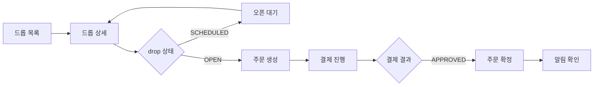
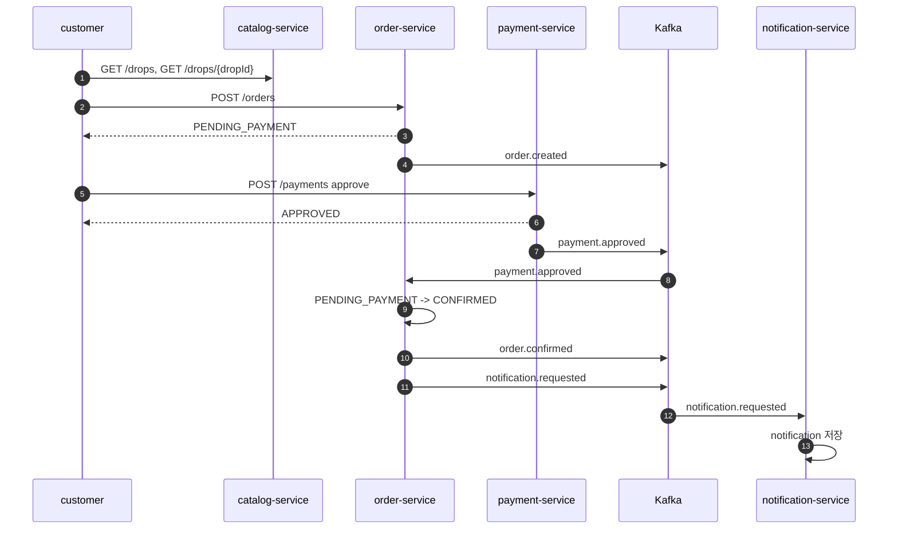

# 정상 구매 상세 설계

작성일: 2026-07-07

이 문서는 `../../medikong/12-user-flows.md`의 정상 구매 흐름과 `../../blueprint/`의 요구사항, 화면, 유스케이스를 개발 작업으로 연결한다. 기존 세부 문서 `01-user-journey.md`부터 `06-performance-and-language-decision.md`까지를 읽기 전에 보는 구현 기준 문서다.

## 1. 목표

로그인된 고객이 한정 드롭 상품을 발견하고, 오픈 상태에서 주문을 생성하고, mock 결제를 승인한 뒤, 주문 확정과 알림을 확인한다.

```text
드롭 목록
-> 드롭 상세
-> 오픈 상태 확인
-> 주문 생성
-> 재고 예약
-> 결제 승인
-> 주문 확정
-> 알림 확인
```

## 2. 출처 매핑

| 출처 | 반영 내용 |
| --- | --- |
| `12-user-flows.md` 정상 구매 후보 | 드롭 발견, 상세 확인, 오픈 대기, 구매 시도, 결제, 결과 확인, 알림 확인 |
| `REQ.A.01.FR-001` | 홈과 목록에서 드롭 상품을 탐색한다. |
| `REQ.A.01.FR-002` | 상세에서 오픈 시간, 판매 수량, 구매 제한을 확인한다. |
| `REQ.A.01.FR-008` | 구매 시점에 재고를 원자적으로 배정한다. |
| `REQ.A.01.FR-011` | 주문과 결제는 idempotency key 기준으로 처리한다. |
| `REQ.A.01.FR-012` | 성공 결과를 명확하게 확인한다. |
| `PAGE.A.02` | 오픈 전/오픈 중 상품 상세 화면과 구매 CTA 상태를 따른다. |
| `PAGE.A.11` | 결제 직전 서버 기준 재검증을 수행한다. |
| `UC.A.01` | 상품 발견부터 주문 완료, 주문 상태 확인까지 이어지는 구매자 유스케이스를 따른다. |

## 3. 범위

포함한다.

- 공개 드롭 목록 조회
- 공개 드롭 상세 조회
- 로그인 사용자 주문 생성
- 주문 생성 시 재고 예약
- 결제 승인 요청
- `payment.approved` 이벤트 반영
- 주문 확정 조회
- 주문 확정 알림 조회
- 주문, 결제, 이벤트 consumer idempotency

포함하지 않는다.

- 회원가입과 로그인 구현 자체
- 품절과 대량 동시성 처리의 부하 검증
- 결제 실패, 결제 지연, 예약 만료
- 쿠폰 발급과 쿠폰 사용
- 운영자 드롭 생성 workflow
- 실제 PG 연동

## 4. 사용자 흐름



## 5. API 계약

| 순서 | API | 보호 여부 | 성공 결과 |
| --- | --- | --- | --- |
| 1 | `GET /drops` | 공개 | 진행 중 또는 예정 drop 목록 |
| 2 | `GET /drops/{dropId}` | 공개 | 상품, 가격, 오픈 시각, 구매 제한 |
| 3 | `POST /orders` | 보호 | `PENDING_PAYMENT`, `reservationExpiresAt` |
| 4 | `POST /payments` | 보호 | `APPROVED`, `paymentId` |
| 5 | `GET /orders/{orderId}` | 보호 | `CONFIRMED` |
| 6 | `GET /notifications` | 보호 | `ORDER_CONFIRMED` 알림 |

공통 헤더:

```text
Authorization: Bearer <JWT>
X-Request-Id: <request-id>
traceparent: <w3c-trace-context>
Idempotency-Key: <client-generated-key>
```

`Idempotency-Key`는 `POST /orders`, `POST /payments`에 필수다.

## 6. 상태와 이벤트



| 상태 | 정상 구매에서의 의미 |
| --- | --- |
| `PENDING_PAYMENT` | 주문과 재고 예약이 완료되고 결제를 기다린다. |
| `APPROVED` | mock 결제가 승인되었다. |
| `CONFIRMED` | 결제 승인 이벤트를 반영해 주문이 확정되었다. |
| `SENT` 또는 `PENDING` | 알림은 비동기로 생성되며 주문 확정을 막지 않는다. |

## 7. 데이터 설계 연결

정상 구매에서도 품절/동시성 시나리오를 막지 않도록 처음부터 다음 테이블 구조를 기준으로 한다.

| 데이터 | 소유 서비스 | 정상 구매에서의 사용 |
| --- | --- | --- |
| `products`, `drops` | `catalog-service` | 공개 조회와 가격, 오픈 상태 표시 |
| `inventory_buckets` | `order-service` | drop별 총 수량, 예약 수량, 확정 수량 |
| `orders` | `order-service` | `PENDING_PAYMENT`, `CONFIRMED` 상태 |
| `stock_reservations` | `order-service` | 주문별 예약 수량과 TTL |
| `idempotency_keys` | `order-service`, `payment-service` | 동일 요청 재시도 응답 재사용 |
| `payments` | `payment-service` | mock approve 결제 기록 |
| `outbox_events` | 각 producer | DB 변경과 Kafka 발행 순서 보장 |
| `processed_events` | 각 consumer | 이벤트 중복 처리 방지 |
| `notifications` | `notification-service` | 주문 확정 알림 저장 |

## 8. 서비스별 구현 작업

| 서비스 | 작업 |
| --- | --- |
| `catalog-service` | `GET /drops`, `GET /drops/{dropId}` 응답을 `SCHEDULED`, `OPEN`, `SOLD_OUT`, `CLOSED` 기준으로 정렬한다. |
| `order-service` | `POST /orders`에서 drop open 여부, 구매 제한, 재고 예약, order 생성, idempotency 저장, `order.created` outbox를 하나의 transaction으로 처리한다. |
| `payment-service` | `POST /payments`에서 주문 소유자와 금액을 검증하고 mock approve 결과를 저장한 뒤 `payment.approved` outbox를 만든다. |
| `order-service consumer` | `payment.approved`를 idempotent하게 소비하고 합법적인 경우에만 `CONFIRMED`로 전이한다. |
| `notification-service` | `notification.requested`를 idempotent하게 소비하고 `GET /notifications`에서 고객별 알림을 반환한다. |

## 9. 테스트 설계

| 계층 | 테스트 이름 | 검증 |
| --- | --- | --- |
| unit | `catalog_drop_list_contract` | 목록 응답 필드와 상태값이 계약과 맞다. |
| unit | `catalog_drop_detail_contract` | 상세 응답에 가격, 오픈 시각, 구매 제한이 있다. |
| unit | `order_create_reserves_inventory` | 주문 생성 시 예약과 `PENDING_PAYMENT`가 만들어진다. |
| unit | `order_idempotency_replay_returns_original_response` | 같은 key와 payload는 같은 주문을 반환한다. |
| unit | `payment_approve_creates_outbox_event` | 승인 결제가 `payment.approved` 발행 대상으로 남는다. |
| integration | `payment_approved_confirms_order` | 결제 승인 이벤트 후 주문이 `CONFIRMED`가 된다. |
| integration | `notification_consumer_is_idempotent` | 같은 알림 이벤트가 중복 알림을 만들지 않는다. |
| e2e | `customer_drop_purchase_happy_path` | 조회, 주문, 결제, 주문 확정, 알림 확인이 통과한다. |

## 10. 인프라 확인점

| 영역 | 확인 |
| --- | --- |
| Gateway | 공개 API와 보호 API의 JWT 정책이 분리되어 있다. |
| Kafka | `order.created`, `payment.approved`, `order.confirmed`, `notification.requested` topic이 준비되어 있다. |
| DB | 서비스별 schema 또는 database가 분리되어 있다. |
| Observability | `orders_created_total`, `outbox_pending_count`, `kafka_consumer_lag`, `order_confirmed_total`을 볼 수 있다. |
| Rollout | `order-service`, `payment-service`는 canary 대상이다. |

## 11. 완료 기준

- `customer_drop_purchase_happy_path`가 통과한다.
- `POST /orders` 재시도가 중복 주문을 만들지 않는다.
- `POST /payments` 재시도가 중복 결제를 만들지 않는다.
- `payment.approved` 중복 이벤트가 중복 확정을 만들지 않는다.
- 알림 생성이 늦어도 `GET /orders/{orderId}`는 `CONFIRMED`를 반환한다.
