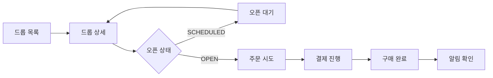

# 정상 구매 사용자 여정

작성일: 2026-07-03

이 문서는 로그인된 고객이 DropMong에서 한정 상품을 정상 구매하는 화면 흐름과 사용자 기대 결과를 정의한다. 시스템 내부 API, 이벤트, 인프라 계약은 후속 문서에서 분리하고, 이 문서는 사용자가 어떤 순서로 무엇을 보고 행동하는지에 집중한다.

## 1. 전제

| 항목 | 기준 |
| --- | --- |
| 사용자 상태 | 이미 로그인되어 있고 유효한 JWT를 가진다. |
| 구매 대상 | 오픈 예정 또는 오픈 중인 단일 drop이다. |
| 쿠폰 | 1차 정상 구매에서는 제외한다. |
| 결제 | `payment-service`의 mock approve 흐름을 사용한다. |
| 재고 | `order-service`가 예약과 확정의 진실을 소유한다. |
| 알림 | 주문 확정 후 비동기로 생성되며 구매 완료를 막지 않는다. |

## 2. 사용자 목표

사용자는 드롭을 발견하고, 상세 정보를 확인한 뒤, 오픈 시각에 주문하고 결제하여 최종적으로 구매 완료 상태와 알림을 확인한다.

```text
드롭 발견
-> 상세 확인
-> 오픈 대기
-> 주문 시도
-> 재고 예약
-> 결제 승인
-> 주문 확정
-> 알림 확인
```

## 3. 화면 흐름



## 4. 단계별 사용자 경험

| 단계 | 화면 | 사용자 행동 | 시스템 기대 결과 | 사용자 메시지 |
| --- | --- | --- | --- | --- |
| 1 | 드롭 목록 | 구매 가능한 drop을 찾는다. | 공개 drop 목록을 보여준다. | 오픈 예정, 오픈 중, 품절 상태를 구분해 보여준다. |
| 2 | 드롭 상세 | 상품, 가격, 오픈 시각을 확인한다. | drop 상세와 구매 가능 상태를 보여준다. | 오픈 전이면 남은 시간을 보여준다. |
| 3 | 오픈 대기 | 오픈 시각까지 기다린다. | 상세 상태를 갱신한다. | 오픈 전에는 구매 버튼을 비활성화한다. |
| 4 | 주문 시도 | 구매 버튼을 누른다. | 주문이 생성되고 재고가 예약된다. | 주문 접수 또는 결제 진행 상태를 보여준다. |
| 5 | 결제 진행 | mock 결제를 승인한다. | payment가 `APPROVED`가 된다. | 결제 승인 중 또는 승인 완료를 보여준다. |
| 6 | 구매 완료 | 주문 결과를 확인한다. | order가 `CONFIRMED`가 된다. | 구매 완료 화면을 보여준다. |
| 7 | 알림 확인 | 알림 목록을 확인한다. | 주문 확정 알림이 조회된다. | 알림이 늦어도 구매 완료 상태는 유지된다. |

## 5. 정상 구매 완료 기준

- 사용자는 drop 목록과 상세를 확인할 수 있다.
- 오픈 중인 drop에서 주문을 생성할 수 있다.
- 주문 생성 결과는 `PENDING_PAYMENT`이다.
- 결제 승인 후 주문 결과는 `CONFIRMED`이다.
- 주문 확정 알림은 비동기로 생성된다.
- 같은 주문 요청이 재시도되어도 중복 주문이 생성되지 않는다.

## 6. 이 문서에서 다루지 않는 흐름

| 제외 흐름 | 담당 후보 |
| --- | --- |
| 회원가입, 로그인, 토큰 재발급 | 인증 및 회원 시나리오 |
| 품절, 요청 제한, 동시 주문 폭주 | 품절/동시성 시나리오 |
| 결제 실패, 결제 지연, 예약 만료 | 결제 실패 시나리오 |
| 선착순 쿠폰 발급과 사용 | 쿠폰 시나리오 |
| 운영자 drop 생성과 오픈 준비 | 운영자 준비 시나리오 |
