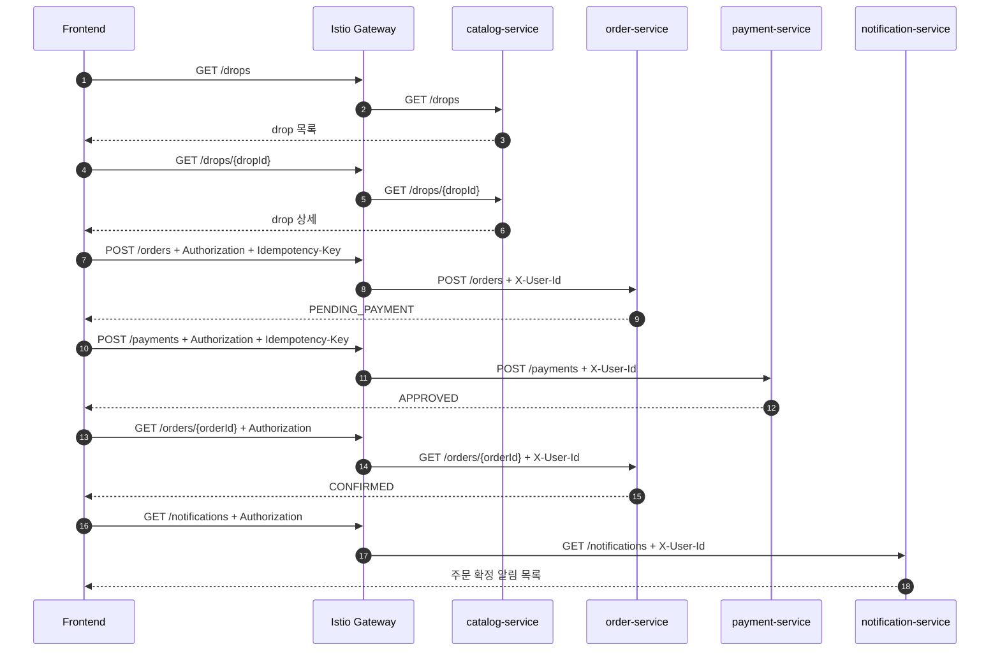

# 정상 구매 API 흐름

작성일: 2026-07-03

이 문서는 정상 구매 시나리오에서 호출되는 REST API 순서와 요청/응답 필드 초안을 정의한다. 공통 API 규칙은 `../_shared/00-shared-infra-test-contract.md`를 따른다.

## 1. API 원칙

| 원칙 | 기준 |
| --- | --- |
| 외부 호출 | REST + JSON + OpenAPI |
| 인증 | 클라이언트는 `Authorization: Bearer <JWT>`를 보내고, 목표 ingress에서는 Istio Gateway가 JWT를 검증한다. |
| 추적 | `X-Request-Id`, `traceparent`를 전파한다. |
| 중복 방지 | `POST /orders`, `POST /payments`는 `Idempotency-Key`를 요구한다. |
| 오류 응답 | 공통 ErrorResponse envelope를 사용한다. |
| 상태 변경 | 서비스 DB를 직접 공유하지 않고 API 또는 Kafka event로만 전달한다. |

### 1.1 Istio JWT 적용 기준

정상 구매에서 `GET /drops`, `GET /drops/{dropId}`는 공개 조회로 둘 수 있지만, 주문 생성부터는 보호 API로 본다.

| API | JWT 요구 | Gateway 처리 |
| --- | --- | --- |
| `GET /drops` | 선택 | 공개 조회 허용 |
| `GET /drops/{dropId}` | 선택 | 공개 조회 허용 |
| `POST /orders` | 필수 | `RequestAuthentication` 검증 후 `AuthorizationPolicy`로 인증 principal 요구 |
| `POST /payments` | 필수 | 주문 사용자와 결제 요청 사용자가 같은지 서비스에서 검증 |
| `GET /orders/{orderId}` | 필수 | 주문 소유자 또는 admin만 허용 |
| `GET /notifications` | 필수 | 본인 알림만 조회 |

서비스는 `Authorization` 원문을 직접 파싱할 수 있지만, 목표 구조에서는 Istio Gateway가 검증한 claim을 내부 헤더로 전달받는 방식을 우선한다. `X-User-Id`, `X-User-Email`, `X-User-Role`은 클라이언트 입력값이 아니라 Gateway에서 생성되거나 덮어쓴 값으로만 신뢰한다.

## 2. 호출 순서



## 3. API 목록

| 순서 | API | 소유 서비스 | 목적 |
| --- | --- | --- | --- |
| 1 | `GET /drops` | `catalog-service` | 오픈 예정/오픈 중 drop 목록 조회 |
| 2 | `GET /drops/{dropId}` | `catalog-service` | 상품, 가격, 오픈 상태 조회 |
| 3 | `POST /orders` | `order-service` | 재고 예약과 주문 생성 |
| 4 | `POST /payments` | `payment-service` | mock 결제 승인 |
| 5 | `GET /orders/{orderId}` | `order-service` | 주문 확정 상태 조회 |
| 6 | `GET /notifications` | `notification-service` | 주문 확정 알림 조회 |

## 4. 요청/응답 필드 초안

### GET /drops

응답:

```json
{
  "items": [
    {
      "dropId": "drop-001",
      "productId": "product-001",
      "title": "Limited Hoodie",
      "thumbnailUrl": "https://example.com/hoodie.png",
      "status": "SCHEDULED",
      "openAt": "2026-07-03T12:00:00+09:00",
      "price": 59000,
      "currency": "KRW"
    }
  ],
  "page": {
    "limit": 20,
    "nextCursor": null
  }
}
```

### GET /drops/{dropId}

응답:

```json
{
  "dropId": "drop-001",
  "productId": "product-001",
  "title": "Limited Hoodie",
  "description": "한정 수량 드롭 상품",
  "status": "OPEN",
  "openAt": "2026-07-03T12:00:00+09:00",
  "price": 59000,
  "currency": "KRW",
  "purchaseLimit": {
    "maxQuantityPerOrder": 1,
    "maxQuantityPerCustomer": 1
  }
}
```

### POST /orders

필수 헤더:

```text
Authorization: Bearer <JWT>
Idempotency-Key: <client-generated-key>
X-Request-Id: <request-id>
```

내부 서비스가 받는 사용자 context:

```text
X-User-Id: <jwt-sub>
X-User-Role: customer
```

`X-User-*` 헤더는 클라이언트가 직접 보내는 필수 헤더가 아니다. Istio Gateway가 검증된 JWT claim에서 생성하거나 기존 값을 덮어쓴다.

요청:

```json
{
  "dropId": "drop-001",
  "productId": "product-001",
  "quantity": 1
}
```

응답:

```json
{
  "orderId": "order-001",
  "dropId": "drop-001",
  "status": "PENDING_PAYMENT",
  "amount": 59000,
  "currency": "KRW",
  "reservationExpiresAt": "2026-07-03T12:10:00+09:00"
}
```

### POST /payments

요청:

```json
{
  "orderId": "order-001",
  "amount": 59000,
  "currency": "KRW",
  "method": "MOCK",
  "simulation": "approve"
}
```

응답:

```json
{
  "paymentId": "payment-001",
  "orderId": "order-001",
  "status": "APPROVED",
  "approvedAt": "2026-07-03T12:01:10+09:00"
}
```

### GET /orders/{orderId}

응답:

```json
{
  "orderId": "order-001",
  "dropId": "drop-001",
  "status": "CONFIRMED",
  "paymentId": "payment-001",
  "confirmedAt": "2026-07-03T12:01:12+09:00"
}
```

### GET /notifications

응답:

```json
{
  "items": [
    {
      "notificationId": "notification-001",
      "type": "ORDER_CONFIRMED",
      "title": "구매가 완료되었습니다.",
      "body": "Limited Hoodie 주문이 확정되었습니다.",
      "read": false,
      "createdAt": "2026-07-03T12:01:13+09:00"
    }
  ]
}
```

## 5. 정상 흐름 오류 경계

정상 구매 문서에서는 실패 흐름을 구현 대상으로 보지 않지만, API 계약은 다른 시나리오와 충돌하지 않도록 오류 코드를 예약한다.

| API | 오류 | 의미 |
| --- | --- | --- |
| `POST /orders` | `409 SOLD_OUT` | 재고 없음 |
| `POST /orders` | `409 IDEMPOTENCY_KEY_REUSED` | 같은 key에 다른 payload 사용 |
| `POST /orders` | `422 DROP_NOT_OPEN` | 아직 오픈 전 또는 종료 |
| `POST /orders` | `429 ADMISSION_REJECTED` | 요청 제한 |
| `POST /orders` | `401 UNAUTHENTICATED` | JWT 없음 또는 잘못된 JWT |
| `POST /payments` | `409 PAYMENT_ALREADY_PROCESSED` | 이미 처리된 결제 |
| `GET /orders/{orderId}` | `403 ORDER_FORBIDDEN` | 다른 사용자의 주문 조회 |

## 6. 계약 테스트 후보

| 테스트 | 확인 |
| --- | --- |
| `catalog_drop_list_contract` | `GET /drops` 응답 필드와 page 구조 |
| `catalog_drop_detail_contract` | `GET /drops/{dropId}` 상세 필드 |
| `order_create_contract` | `POST /orders` 요청/응답, `Idempotency-Key` 필수 |
| `payment_approve_contract` | `POST /payments` mock approve 응답 |
| `order_detail_contract` | `GET /orders/{orderId}` 확정 상태 |
| `notification_list_contract` | `GET /notifications` 알림 목록 |
