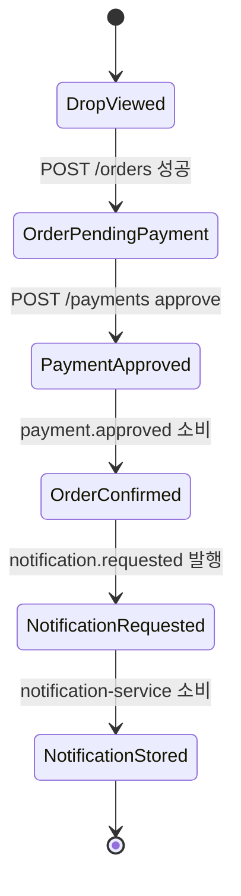
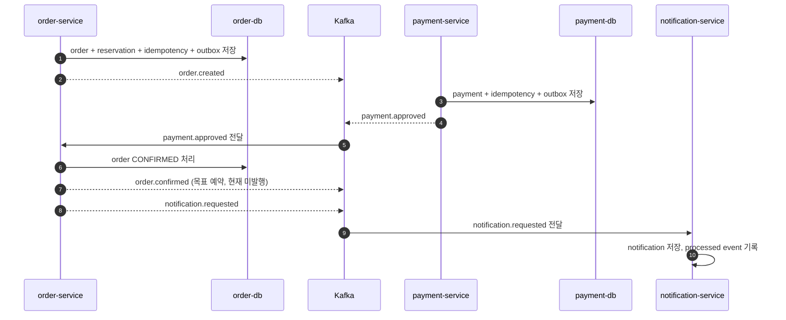

# 정상 구매 상태와 이벤트 흐름

작성일: 2026-07-03

이 문서는 정상 구매 시나리오의 상태 전이와 Kafka·outbox 목표를 정리한 설계 초안이다. 기계 계약은 `services/contracts/events/dropmong-purchase-events.md`, 현재 구현은 `test-execution-record.md`를 기준으로 한다.

## 1. 상태 전이 요약

## 2. Order 상태

| 상태 | 의미 | 정상 구매 사용 |
| --- | --- | --- |
| `PENDING_PAYMENT` | 주문 생성과 재고 예약이 완료되고 결제를 기다린다. | 예 |
| `CONFIRMED` | 결제 승인 이벤트를 반영해 주문이 확정되었다. | 예 |
| `CANCELED` | 사용자 취소 등으로 주문이 취소되었다. 현재 결제 실패 자동 검증은 별도 `PAYMENT_FAILED`를 사용한다. | 다른 시나리오 |
| `EXPIRED` | 결제 제한 시간이 지나 예약이 만료되었다. | 다른 시나리오 |

정상 구매에서 `order-service`는 `PENDING_PAYMENT -> CONFIRMED` 전이만 처리한다.

## 3. Payment 상태

| 상태 | 의미 | 정상 구매 사용 |
| --- | --- | --- |
| `REQUESTED` | 결제 요청이 접수되었다. | 내부 처리 |
| `APPROVED` | mock 결제가 승인되었다. | 예 |
| `FAILED` | 결제가 실패했다. | 다른 시나리오 |
| `DELAYED` | 결제 결과가 지연되고 있다. | 다른 시나리오 |

## 4. Notification 상태

| 상태 | 의미 |
| --- | --- |
| `PENDING` | 알림 요청이 저장되었거나 처리 대기 중이다. |
| `SENT` | 알림 저장 또는 발송 처리가 완료되었다. |
| `READ` | 사용자가 알림을 읽었다. |
| `FAILED` | 알림 생성 또는 발송이 실패했다. |

정상 구매 성공 여부는 notification 상태에 의존하지 않는다.

## 5. 목표 이벤트 타임라인

아래 outbox와 `order.confirmed`는 목표 설계다. 현재 order/payment producer는 DB commit 뒤 직접 publish하며 `order.confirmed`는 발행하지 않는다.

## 6. 이벤트 연결 초안

| Topic | Producer | Consumer | 현재 상태 |
| --- | --- | --- | --- |
| `order.created` | `order-service` | `payment-service` | 사용 중 |
| `payment.approved` | `payment-service` | `order-service` | 사용 중 |
| `order.confirmed` | 미구현 | 미구현 | 목표 예약 계약 |
| `notification.requested` | `order-service` | `notification-service` | 사용 중 |

payload 필드는 이 문서에서 재정의하지 않고 이벤트 계약을 참조한다. `traceparent`, `tracestate`, `correlation_id`는 Kafka header로 전파한다.

## 7. Idempotency 규칙

| 대상 | 기준 |
| --- | --- |
| `POST /orders` | `customerId + Idempotency-Key` 조합으로 최초 응답을 재사용한다. |
| `POST /payments` | `customerId + Idempotency-Key` 조합으로 최초 결제 결과를 재사용한다. |
| `payment.approved` consumer | 같은 `eventId` 또는 같은 `paymentId`를 중복 처리하지 않는다. |
| `notification.requested` consumer | 같은 `eventId`를 중복 처리하지 않는다. |

같은 `Idempotency-Key`로 다른 payload가 오면 `409 IDEMPOTENCY_KEY_REUSED`를 반환한다.

## 8. Outbox 규칙

- 상태 변경과 outbox 저장은 같은 DB transaction으로 묶는다.
- Kafka 발행은 outbox relay 또는 worker가 담당한다.
- 발행 실패 시 업무 상태를 되돌리지 않고 outbox를 pending 또는 failed 상태로 남긴다.
- 정상 구매 완료 판단은 `order.status = CONFIRMED` 기준이며, notification lag는 별도 관측 대상으로 둔다.

## 9. 다른 시나리오와 연결되는 이벤트

| 이벤트 | 정상 구매에서의 위치 | 다른 시나리오 |
| --- | --- | --- |
| `payment.failed` | 예약만 한다. | 결제 실패 |
| `payment.delayed` | 예약만 한다. | 결제 지연 |
| `order.cancelled` | 예약된 목표 이벤트 이름이며 현재 미구현이다. 주문 상태 표기는 `CANCELED`와 구분한다. | 결제 실패, 사용자 취소 |
| `order.reservation.expired` | 예약만 한다. | 예약 만료 |
| `coupon.usage.confirm.requested` | 쿠폰 제외로 미사용 | 쿠폰 구매 |
