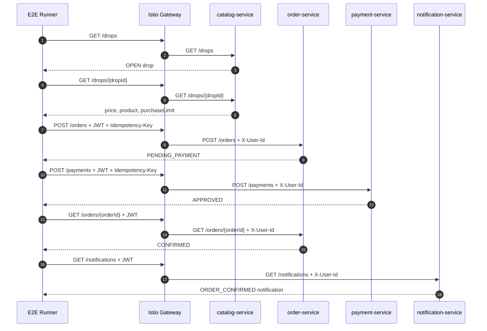

# 정상 구매 테스트 시나리오

> 문서 상태: 목표 수용 테스트 명세. 실제 실행 명령과 통과 결과는 `test-execution-record.md`에만 기록한다.

작성일: 2026-07-03

이 문서는 정상 구매 구현 중 함께 작성할 단위 테스트, 통합 테스트, E2E 테스트를 정의한다. 테스트 계층은 `archive/medikong/11-test-release-plan.md`와 `../_shared/00-shared-infra-test-contract.md`를 따른다.

## 1. 테스트 전략

정상 구매는 구현과 테스트를 분리하지 않는다. 각 기능은 다음 세 층을 함께 갖춘다.

```text
Unit test
-> Integration test
-> E2E scenario
```

단위 테스트는 빠른 피드백을, 통합 테스트는 DB/Kafka/consumer 안정성을, E2E는 사용자 흐름 완성을 검증한다.

## 2. 테스트 매트릭스

| 계층 | 테스트 이름 | 대상 | 성공 기준 |
| --- | --- | --- | --- |
| unit | `catalog_drop_list_contract` | catalog | drop 목록 응답 구조가 계약과 맞다. |
| unit | `catalog_drop_detail_contract` | catalog | drop 상세 응답 구조가 계약과 맞다. |
| unit | `order_create_reserves_inventory` | order | 주문 생성 시 재고 예약과 `PENDING_PAYMENT`가 만들어진다. |
| unit | `order_idempotency_replay_returns_original_response` | order | 같은 key와 payload 재요청은 최초 응답을 반환한다. |
| unit | `order_idempotency_conflict_returns_409` | order | 같은 key와 다른 payload는 409가 된다. |
| unit | `payment_approve_creates_outbox_event` | payment | 승인 결제가 `payment.approved` outbox를 만든다. |
| unit | `notification_requested_creates_notification_once` | notification | 같은 이벤트는 알림을 하나만 만든다. |
| integration | `order_create_transaction_prevents_oversell` | order + DB | 동시 주문에서도 확정 수량이 재고를 넘지 않는다. |
| integration | `outbox_relay_publishes_pending_events` | outbox + Kafka | pending outbox가 Kafka로 발행된다. |
| integration | `payment_approved_confirms_order` | payment event + order | `payment.approved` 소비 후 order가 `CONFIRMED`가 된다. |
| integration | `notification_consumer_is_idempotent` | Kafka + notification | 중복 이벤트가 중복 알림을 만들지 않는다. |
| e2e | `gateway_rejects_order_without_jwt` | Istio Gateway + order | JWT 없이 `POST /orders`를 호출하면 차단된다. |
| e2e | `gateway_overwrites_forged_user_headers` | Istio Gateway + order | 클라이언트가 보낸 위조 `X-User-*`가 신뢰되지 않는다. |
| e2e | `customer_drop_purchase_happy_path` | 전체 서비스 | 드롭 조회부터 알림 확인까지 성공한다. |

## 3. E2E 상세 흐름



## 4. E2E 검증 항목

| 단계 | 검증 |
| --- | --- |
| drop 목록 | 최소 하나의 `OPEN` 또는 테스트 fixture drop이 있다. |
| drop 상세 | `dropId`, `productId`, `price`, `openAt`, `status`가 존재한다. |
| Gateway 인증 | JWT 없는 보호 API 요청은 차단되고, 정상 JWT 요청만 서비스에 도달한다. |
| 사용자 context | 위조된 `X-User-*` 헤더는 Gateway에서 제거되거나 검증된 claim으로 덮어써진다. |
| 주문 생성 | status가 `PENDING_PAYMENT`이고 `orderId`가 존재한다. |
| 주문 재시도 | 같은 `Idempotency-Key`로 재요청하면 같은 `orderId`가 반환된다. |
| 결제 승인 | status가 `APPROVED`이고 `paymentId`가 존재한다. |
| 주문 조회 | status가 `CONFIRMED`이다. |
| 알림 조회 | 주문 확정 알림이 있거나, 비동기 지연이면 polling 내에 생성된다. |

## 5. 로컬 실행 기준

현재 `services` repo는 Docker 기반 테스트 runner와 Docker Compose E2E 구조를 가진다. DropMong 전환 후 명령은 다음 형태를 목표로 한다.

```bash
task test-service SERVICE=catalog-service
task test-service SERVICE=order-service
task test-service SERVICE=payment-service
task test-service SERVICE=notification-service
task test-e2e SCENARIO=customer-drop-purchase-happy-path
```

기존 티켓팅 서비스 이름을 사용하는 과도기에는 `concert-service`, `reservation-service` 테스트를 DropMong API 계약에 맞춰 migration한다.

## 6. 통합 테스트 fixture

정상 구매 E2E는 다음 fixture를 가진다.

| Fixture | 값 |
| --- | --- |
| customer | 로그인된 테스트 고객 |
| drop | `OPEN` 상태의 테스트 drop |
| stock | 최소 1개 이상 |
| payment simulation | `approve` |
| notification template | `ORDER_CONFIRMED` |

## 7. 실패 시 관측할 지표

| 실패 위치 | 확인 지표 |
| --- | --- |
| 주문 생성 실패 | `orders_created_total`, `idempotency_conflict_total`, `oversell_count` |
| 결제 이벤트 미처리 | `outbox_pending_count`, `outbox_oldest_pending_age_seconds`, `payment_event_handler_failures_total` |
| 알림 지연 | `kafka_consumer_lag`, `consumer_duplicate_total`, `consumer_dlq_total` |
| E2E timeout | service logs, `X-Request-Id`, trace id, Kafka topic lag |

## 8. 완료 기준

- 각 서비스의 unit test가 통과한다.
- DB transaction과 outbox를 포함한 integration test가 통과한다.
- `customer_drop_purchase_happy_path` E2E가 통과한다.
- 같은 주문 요청을 재시도해도 중복 주문이 없다.
- 같은 이벤트를 중복 전달해도 주문 확정과 알림 생성이 idempotent하다.
