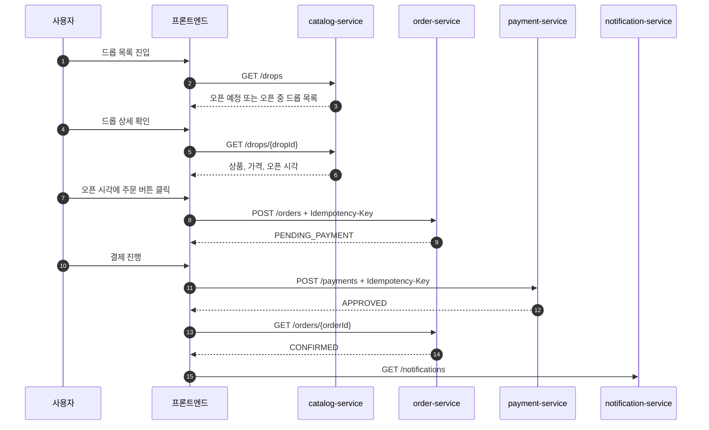

# 정상 구매 시나리오

작성일: 2026-07-03

이 폴더는 DropMong의 정상 구매 목표 설계, 현재 구현 흐름, 수용 테스트와 실행 기록을 연결한다. 기준 문서는 `archive/medikong/12-user-flows.md`의 "정상 구매 시나리오 오너"와 "고객 정상 구매 경로"이며, 내부 시스템 흐름은 `archive/medikong/07-critical-flows.md`의 드롭 조회, 주문 생성, 결제 승인 흐름을 따른다. 현재 동작은 `test-execution-record.md`와 `../_shared/03-purchase-development-handoff.md`를 기준으로 확인한다.

## 1. 시나리오 목표

로그인된 사용자가 한정 상품을 발견하고 정상적으로 구매 완료까지 도달하는 흐름을 구현 가능한 수준으로 정리한다.

```text
드롭 발견
-> 상세 확인
-> 오픈 대기
-> 주문 시도
-> 재고 예약
-> 결제 승인
-> 주문 확정
-> 알림 확인
```

## 2. 이번 오너의 범위

포함한다:

- 드롭 목록 조회
- 드롭 상세 조회
- 오픈 상태 확인
- 주문 생성 요청
- 재고 예약 성공
- 결제 요청
- 결제 승인
- 주문 확정 조회
- 알림 확인

포함하지 않는다:

- 회원가입과 로그인 자체 구현
- 품절, 결제 실패, 결제 지연, 예약 만료
- 선착순 쿠폰 발급과 쿠폰 사용 예약
- 운영자 드롭 생성
- Canary, rollback, DLQ replay

위 항목들은 다른 시나리오 문서에서 다룬다. 단, 정상 구매 흐름이 다른 시나리오와 이어질 수 있도록 API, 이벤트, 상태값 이름은 맞춘다.

## 3. 관련 서비스

| 서비스 | 정상 구매에서의 역할 |
| --- | --- |
| `catalog-service` | 드롭 목록과 상세 정보를 제공한다. |
| `order-service` | 주문 생성, 재고 예약, 주문 상태 조회를 담당한다. |
| `payment-service` | mock 결제를 승인하고 `payment.approved` 이벤트를 만든다. |
| `notification-service` | 주문 확정 알림을 비동기로 만든다. |

## 4. 기준 흐름



## 5. 설계 문서 작성 계획

0. `00-detailed-design.md`
   - `12-user-flows.md`와 `blueprint` 요구사항을 정상 구매 구현 기준으로 연결한다.
   - API, 이벤트, 데이터, 테스트, 인프라 확인점을 한 번에 볼 수 있게 정리한다.

1. `01-user-journey.md`
   - 사용자가 화면에서 어떤 순서로 행동하는지 정리한다.
   - 화면 메시지와 사용자 기대 결과를 포함한다.

2. `02-api-flow.md`
   - 정상 구매에서 호출되는 API 순서를 정리한다.
   - 요청/응답에 필요한 필드를 초안으로 작성한다.

3. `03-state-event-flow.md`
   - `PENDING_PAYMENT`, `CONFIRMED` 상태 전이를 정리한다.
   - 현재 `order.created`, `payment.approved`, `notification.requested`와 목표 예약 계약 `order.confirmed`를 구분한다.

4. `04-service-implementation-plan.md`
   - `catalog-service`, `order-service`, `payment-service`, `notification-service`에서 구현할 최소 기능을 나눈다.
   - 테스트 이름과 완료 기준을 함께 적는다.

5. `05-test-scenarios.md`
   - `customer_drop_purchase_happy_path`
   - `payment_approved_confirms_order`
   - `notification_after_order_confirmed`

6. `06-performance-and-language-decision.md`
   - FastAPI를 기본 언어로 두고 성능 병목 구간에서 Go 전환을 검토하는 기준을 정리한다.
   - REST, Kafka, gRPC 적용 기준을 함께 정리한다.

7. `test-execution-record.md`
   - 현재 구현 상태와 실제로 실행한 단위 테스트, E2E 테스트, 추가해야 할 통합 테스트를 기록한다.

공통 인프라와 테스트 계약은 `../_shared/00-shared-infra-test-contract.md`를 따른다. 이 시나리오에서 공통으로 승격해야 하는 API, topic, DB, 상태값 변경이 생기면 shared 문서를 먼저 수정한다.

## 6. 구현 전 결정할 것

| 결정 항목 | 기본 방향 |
| --- | --- |
| 인증 전제 | 정상 구매 시나리오는 로그인된 사용자로 시작한다. |
| 쿠폰 포함 여부 | 1차 정상 구매에서는 제외하고, 쿠폰 시나리오와 연결만 남긴다. |
| 결제 방식 | `payment-service`의 mock approve 모드를 사용한다. |
| 재고 진실 | `order-service`가 소유한다. |
| 알림 처리 | 주문 확정 뒤 비동기로 처리한다. |
| 서비스 언어 | 기본은 FastAPI, 주문/쿠폰처럼 성능 민감한 경계는 Go 후보로 둔다. |

## 7. 완료 기준

- 사용자는 드롭을 조회하고 주문 버튼을 누를 수 있다.
- 주문 생성 후 상태는 `PENDING_PAYMENT`가 된다.
- 결제 승인 후 주문 상태는 `CONFIRMED`가 된다.
- 주문 확정 알림은 늦게 처리되어도 정상 구매 완료를 막지 않는다.
- 같은 주문 요청 재시도는 중복 주문을 만들지 않는다.
