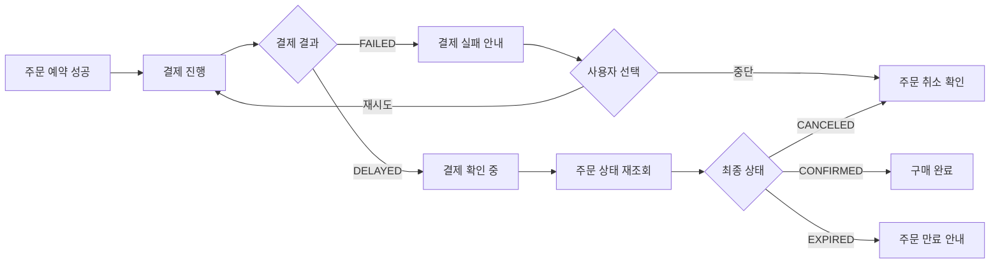
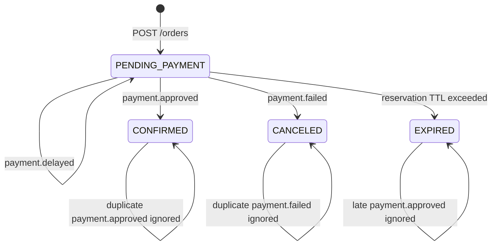

# 결제 실패 상세 설계

작성일: 2026-07-07

이 문서는 `../../medikong/12-user-flows.md`의 결제 실패/지연 흐름과 `../../blueprint/`의 주문/결제 화면, 요구사항, 유스케이스를 구현 가능한 서비스 설계로 연결한다.

> 문서 상태: 목표 설계 초안. API·이벤트·데이터 표는 후속 구현 제안이며 기계 계약이 아니다. 현재 계약은 `services/contracts`, 현재 완료 범위는 `test-execution-record.md`와 `../_shared/03-purchase-development-handoff.md`를 기준으로 한다.

## 1. 목표

주문 예약은 성공했지만 결제 실패, 결제 지연, 예약 만료가 발생하는 상황에서 고객이 현재 주문 상태와 다음 행동을 이해할 수 있어야 한다.

```text
PENDING_PAYMENT
-> payment.failed
-> CANCELED + reservation RELEASED

PENDING_PAYMENT
-> payment.delayed
-> 결제 확인 중
-> TTL 초과
-> EXPIRED + reservation EXPIRED
```

## 2. 출처 매핑

| 출처 | 반영 내용 |
| --- | --- |
| `12-user-flows.md` 결제 실패 후보 | 구매 시도, 결제 실패 또는 지연, 상태 확인, 재시도 또는 만료, 알림 확인 |
| `REQ.A.01.FR-009` | 재고 배정 후 제한 시간 안에 주문/결제를 완료하고, 만료 시 재고를 회수한다. |
| `REQ.A.01.FR-011` | 주문 생성, 결제 요청, 결제 결과 반영을 idempotency key 기준으로 처리한다. |
| `REQ.A.01.FR-012` | 결제 실패와 대기 만료 결과를 명확한 사유와 함께 보여준다. |
| `REQ.A.01.FR-013` | 결제 실패, 재고 회수, 알림을 이벤트로 기록한다. |
| `REQ.A.01.NFR-004` | 사용자에게 보인 성공과 최종 처리 성공을 별도 상태로 추적한다. |
| `REQ.A.01.NFR-007` | PG 장애가 전체 구매 흐름으로 무제한 전파되지 않게 한다. |
| `PAGE.A.11` | 결제 승인 실패, 결제 진행 중, 재시도 또는 결제 수단 변경 화면 상태를 따른다. |
| `UC.A.01` 예외 흐름 | 결제 승인 실패 또는 PG 지연 시 중복 결제를 만들지 않고 복구 경로를 제공한다. |

## 3. 범위

포함한다.

- mock 결제 실패
- mock 결제 지연
- payment idempotency
- `payment.failed` 이벤트 발행
- `payment.delayed` 이벤트 발행
- `order-service`의 결제 실패 consumer
- 예약 재고 release
- 예약 TTL 만료 worker
- 늦게 도착한 `payment.approved` 무시
- 결제 실패와 만료 알림 생성
- E2E `customer_payment_failed_path`
- E2E `customer_payment_delayed_expiry_path`

포함하지 않는다.

- 실제 PG provider 연동
- 결제 취소/환불 정산
- 부분 승인 실패
- 결제 수단 저장과 카드 토큰 관리
- CS 보상 처리 UI

## 4. 사용자 흐름



## 5. API 계약

### POST /payments

요청:

```json
{
  "orderId": "order-001",
  "amount": 59000,
  "currency": "KRW",
  "method": "MOCK",
  "simulation": "fail"
}
```

`simulation` 값:

| 값 | 결과 |
| --- | --- |
| `approve` | `APPROVED`, `payment.approved` 발행 |
| `fail` | `FAILED`, `payment.failed` 발행 |
| `delay` | `DELAYED`, `payment.delayed` 발행 |

응답 예시:

```json
{
  "paymentId": "payment-001",
  "orderId": "order-001",
  "status": "FAILED",
  "reason": "MOCK_FAILURE",
  "failedAt": "2026-07-07T12:02:00+09:00"
}
```

### GET /orders/{orderId}

결제 실패 후:

```json
{
  "orderId": "order-001",
  "status": "CANCELED",
  "cancelReason": "PAYMENT_FAILED",
  "reservationStatus": "RELEASED"
}
```

결제 지연 중:

```json
{
  "orderId": "order-001",
  "status": "PENDING_PAYMENT",
  "paymentStatus": "DELAYED",
  "reservationExpiresAt": "2026-07-07T12:10:00+09:00"
}
```

예약 만료 후:

```json
{
  "orderId": "order-001",
  "status": "EXPIRED",
  "reservationStatus": "EXPIRED"
}
```

## 6. 상태 전이



## 7. 이벤트 계약

| Topic | Producer | Consumer | 처리 |
| --- | --- | --- | --- |
| `payment.failed` | `payment-service` | `order-service` | 주문 취소, 예약 release, `order.cancelled` 발행 |
| `payment.delayed` | `payment-service` | `order-service`, recovery | 지연 상태 관측, TTL worker 대상 유지 |
| `order.cancelled` | `order-service` | `notification-service` | 결제 실패 알림 |
| `order.reservation.expired` | `order-service` | `notification-service`, recovery | 예약 만료 알림과 운영 추적 |
| `notification.requested` | `order-service` | `notification-service` | 실패/만료 안내 저장 |

`payment.failed` payload:

```json
{
  "eventId": "evt-payment-failed-001",
  "eventType": "payment.failed",
  "paymentId": "payment-001",
  "orderId": "order-001",
  "customerId": "customer-001",
  "reason": "MOCK_FAILURE",
  "failedAt": "2026-07-07T12:02:00+09:00"
}
```

`payment.delayed` payload:

```json
{
  "eventId": "evt-payment-delayed-001",
  "eventType": "payment.delayed",
  "paymentId": "payment-001",
  "orderId": "order-001",
  "customerId": "customer-001",
  "reason": "MOCK_DELAY",
  "delayedAt": "2026-07-07T12:02:00+09:00"
}
```

## 8. 데이터 전이

### 결제 실패

```text
orders.status: PENDING_PAYMENT -> CANCELED
stock_reservations.status: ACTIVE -> RELEASED
inventory_buckets.reserved_quantity: -quantity
outbox_events: order.cancelled, notification.requested
processed_events: payment.failed event id
```

### 결제 지연

```text
payments.status: DELAYED
orders.status: PENDING_PAYMENT 유지
stock_reservations.status: ACTIVE 유지
reservationExpiresAt까지 사용자에게 확인 중 표시
```

### 예약 만료

```text
orders.status: PENDING_PAYMENT -> EXPIRED
stock_reservations.status: ACTIVE -> EXPIRED
inventory_buckets.reserved_quantity: -quantity
outbox_events: order.reservation.expired, notification.requested
```

### 늦은 승인

```text
payment.approved 도착
order.status == EXPIRED 또는 CANCELED
-> confirm하지 않음
-> processed_events 기록
-> stale_payment_approved_total 증가
```

## 9. 서비스별 구현 작업

| 서비스 | 작업 |
| --- | --- |
| `payment-service` | `POST /payments`에서 `approve`, `fail`, `delay` simulation을 지원한다. |
| `payment-service` | payment idempotency를 status별로 저장하고 같은 key 재시도는 최초 결과를 반환한다. |
| `payment-service` | `payment.approved`, `payment.failed`, `payment.delayed` outbox를 만든다. |
| `order-service` | `payment.failed` consumer에서 주문 취소와 예약 release를 하나의 transaction으로 처리한다. |
| `order-service` | reservation expiry worker를 작은 batch로 실행한다. |
| `order-service` | expired/cancelled 주문에 도착한 late approval을 무시하고 reconciliation metric을 남긴다. |
| `notification-service` | `order.cancelled`, `order.reservation.expired` 기반 알림을 저장한다. |
| `message-recovery-service` | `payment.delayed` 장기 미해결과 DLQ를 운영자가 확인할 수 있게 한다. |

## 10. 재시도 정책

| 상황 | 처리 |
| --- | --- |
| 같은 `POST /payments` key와 같은 payload | 최초 payment 결과 반환 |
| 같은 key와 다른 payload | `409 IDEMPOTENCY_KEY_REUSED` |
| `payment.failed` 이벤트 중복 | 한 번만 cancel/release |
| `payment.delayed` 후 사용자가 재시도 | 새 idempotency key로 새 payment attempt 생성 가능 |
| `payment.failed` 후 사용자가 재시도 | 같은 order를 재사용할지 새 order를 만들지는 정책 결정 필요 |
| TTL 만료 후 재시도 | 새 주문을 생성해야 한다. |

MVP 권장: `payment.failed` 후 짧은 시간 내 재시도는 같은 order의 새 payment attempt를 허용한다. 단, order가 `EXPIRED`가 되면 새 order를 만들도록 한다.

## 11. 테스트 설계

| 계층 | 테스트 이름 | 검증 |
| --- | --- | --- |
| unit | `payment_fail_creates_failed_event` | 실패 결제가 `payment.failed` outbox를 만든다. |
| unit | `payment_delay_creates_delayed_event` | 지연 결제가 `payment.delayed` outbox를 만든다. |
| unit | `payment_idempotency_replay_returns_original_response` | 결제 재시도가 중복 결제를 만들지 않는다. |
| unit | `payment_failed_releases_reservation` | 목표 설계에서는 실패 이벤트로 예약이 release되고 주문이 `CANCELED`가 된다. 현재 구현은 `PAYMENT_FAILED`를 사용한다. |
| unit | `reservation_ttl_releases_stock` | TTL 초과 시 예약이 만료되고 재고가 release된다. |
| integration | `late_payment_approved_does_not_confirm_expired_order` | 만료 후 도착한 승인 이벤트는 주문 확정을 만들지 않는다. |
| integration | `payment_failed_consumer_is_idempotent` | 중복 실패 이벤트가 중복 release를 만들지 않는다. |
| e2e | `customer_payment_failed_path` | 결제 실패 후 주문 취소와 알림을 확인한다. |
| e2e | `customer_payment_delayed_expiry_path` | 결제 지연 후 TTL 만료와 late approval 무시를 확인한다. |

## 12. 사용자 메시지

| 상태 | 메시지 |
| --- | --- |
| `FAILED` | 결제가 완료되지 않아 주문이 취소되었습니다. |
| `DELAYED` | 결제 결과를 확인 중입니다. 잠시 후 주문 상태를 다시 확인해 주세요. |
| `EXPIRED` | 결제 확인 시간이 지나 주문이 만료되었습니다. |
| late approval ignored | 결제 확인 시간이 지난 주문입니다. 고객센터에 문의해 주세요. |

메시지에는 `X-Request-Id` 또는 사용자에게 표시 가능한 `supportTraceId`를 함께 제공한다.

## 13. 관측성과 운영

| 지표 | 기준 |
| --- | --- |
| `payments_failed_total` | 결제 실패 수 |
| `payments_delayed_total` | 결제 지연 수 |
| `orders_cancelled_total` | 결제 실패로 취소된 주문 수 |
| `reservations_released_total` | release된 예약 수 |
| `reservations_expired_total` | TTL 만료 수 |
| `late_payment_approved_total` | 만료/취소 후 도착한 승인 이벤트 수 |
| `payment_event_handler_failures_total` | 결제 이벤트 처리 실패 수 |
| `reservation_expiry_lag_seconds` | 만료 worker 지연 |

운영자는 결제 실패율, 지연율, 예약 만료율, late approval 수를 drop별 시간대 기준으로 확인해야 한다. metric label에는 동적 ID를 넣지 않고, 상세 추적은 log와 trace에서 확인한다.

## 14. 인프라 확인점

| 영역 | 확인 |
| --- | --- |
| Kafka | `payment.failed`, `payment.delayed`, `order.cancelled`, `order.reservation.expired` topic과 consumer group이 준비되어 있다. |
| DB | 결제 실패와 예약 release가 하나의 order transaction으로 처리된다. |
| Worker | reservation expiry worker는 작은 batch와 backoff를 지원한다. |
| DLQ | schema validation 실패와 반복 처리 실패가 DLQ로 격리된다. |
| Istio | `POST /payments` timeout과 retry가 중복 결제를 만들지 않는다. |
| Rollout | `payment-service`, `order-service` canary 분석에 payment handler failure와 reservation expiry lag를 포함한다. |

## 15. 완료 기준

- `customer_payment_failed_path`가 통과한다.
- `customer_payment_delayed_expiry_path`가 통과한다.
- 목표 설계에서는 결제 실패 후 order는 `CANCELED`, reservation은 `RELEASED`가 된다. 현재 자동 검증은 `PAYMENT_FAILED`와 활성 예약 집계 제외 방식을 사용한다.
- 결제 지연 후 TTL이 지나면 order는 `EXPIRED`, reservation은 `EXPIRED`가 된다.
- expired/cancelled order에 늦게 도착한 `payment.approved`는 주문을 확정하지 않는다.
- 결제 실패와 예약 만료 알림은 중복 없이 생성된다.
