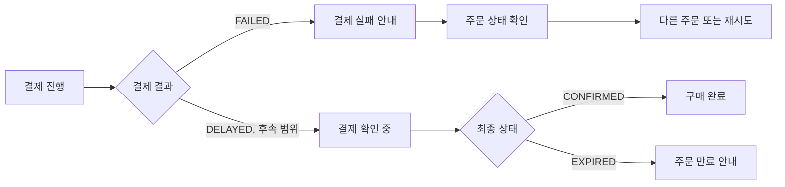

# 결제 실패 사용자 여정

작성일: 2026-07-14

이 문서는 `PAGE.A.11`과 `UC.A.01`의 결제 예외 흐름을 사용자가 보는 상태와 다음 행동으로 연결한다. API와 Kafka 세부 계약은 `02-api-flow.md`, 실제 완료 범위는 `test-execution-record.md`에서 확인한다.

## 1. 전제

| 항목 | 기준 |
| --- | --- |
| 사용자 | 로그인했고 `PENDING_PAYMENT` 주문을 소유한다. |
| 현재 자동 검증 | mock 결제 실패와 주문 `PAYMENT_FAILED` 전이 |
| 목표 후속 범위 | 결제 지연, 예약 만료, 늦은 승인, 실패 알림 |
| 재고 | 실패 주문은 활성 예약 합계에서 제외한다. |

## 2. 사용자 흐름

## 3. 단계별 기대 결과

| 단계 | 사용자 행동 | 현재 기대 결과 | 사용자 안내 |
| --- | --- | --- | --- |
| 결제 요청 | 결제를 시도한다. | 실패 결제 한 건이 저장된다. | 결제가 완료되지 않았음을 표시한다. |
| 실패 반영 | 주문 결과를 조회한다. | 주문이 `PAYMENT_FAILED`가 된다. | 주문이 확정되지 않았다고 안내한다. |
| 재고 회복 | 같은 상품을 다시 주문한다. | 실패 주문 수량은 활성 예약에서 제외된다. | 재고가 남으면 새 주문을 진행할 수 있다. |
| 중복 요청 | 같은 결제 요청을 다시 보낸다. | 기존 결제를 반환한다. | 중복 결제를 만들지 않는다. |

## 4. 아직 사용자에게 제공하지 않는 흐름

- 결제 확인 중 상태와 polling 정책
- 예약 TTL 만료와 `EXPIRED`
- 만료 또는 취소 뒤 도착한 늦은 승인 처리
- 결제 실패 알림
- 실제 PG 재시도와 결제수단 변경

이 항목은 목표 설계에는 있지만 현재 완료로 표현하지 않는다.

## 5. 완료 기준

- 결제 실패가 주문 성공처럼 보이지 않는다.
- 사용자는 주문 상태를 다시 조회해 실패를 확인할 수 있다.
- 중복 요청이 중복 결제를 만들지 않는다.
- 실패 주문이 이후 재고를 계속 점유하지 않는다.
