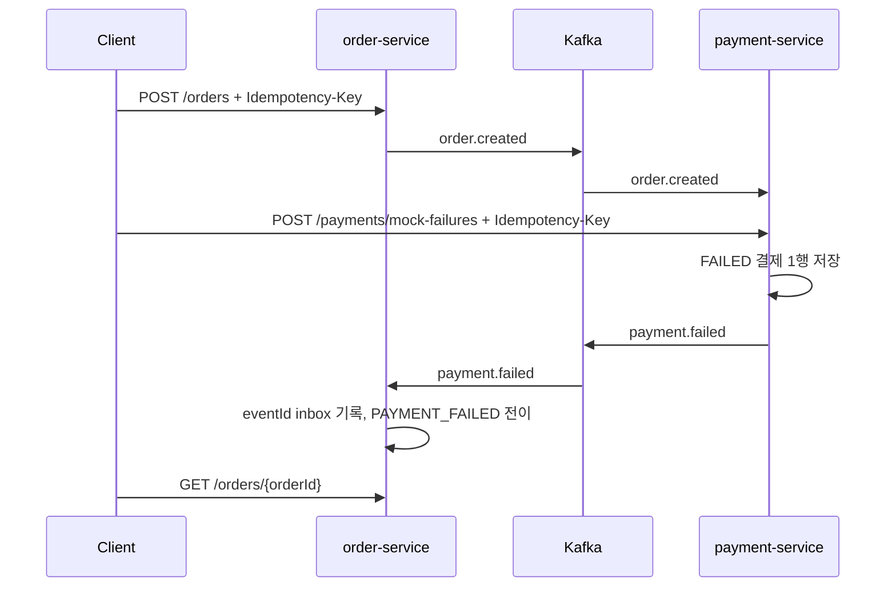

# 결제 실패 API와 이벤트 흐름

작성일: 2026-07-14

이 문서는 결제 실패에서 사용하는 REST와 Kafka 경계를 설명한다. 외부 계약의 원장은 `services/contracts/services/*/openapi.yaml`, 이벤트 원장은 `services/contracts/events/dropmong-purchase-events.md`다.

## 1. 현재 구현 흐름

## 2. 경계별 계약

| 경계 | 현재 계약 | 멱등성 |
| --- | --- | --- |
| 주문 생성 | `POST /orders` | `(user_id, idempotency_key)` unique |
| 실패 결제 | `POST /payments/mock-failures` | `(user_id, idempotency_key)` unique |
| 실패 이벤트 | `payment.failed` | `processed_payment_events.event_id` PK |
| 주문 조회 | `GET /orders/{orderId}` | 소유 사용자 기준 조회 |

같은 REST 키와 같은 payload는 기존 resource를 반환하고, 같은 키와 다른 payload는 409를 반환한다. 같은 `payment.failed` 이벤트는 주문 상태를 다시 변경하지 않는다.

## 3. 목표 계약과 차이

| 항목 | 목표 설계 | 현재 구현 |
| --- | --- | --- |
| 결제 API | `POST /payments` | mock 실패 전용 endpoint |
| 실패 후 주문 | `CANCELED` 후보 | `PAYMENT_FAILED` |
| 지연 이벤트 | `payment.delayed` | 미구현 |
| 만료 이벤트 | `order.reservation.expired` | 미구현 |
| 실패 알림 | notification consumer | 미구현 |
| 발행 원자성 | transactional outbox | DB commit 뒤 직접 publish |

## 4. 변경 규칙

1. API를 변경하면 payment OpenAPI와 E2E collection을 함께 변경한다.
2. 이벤트를 변경하면 producer와 모든 consumer를 함께 확인한다.
3. `PAYMENT_FAILED`를 `CANCELED`로 바꾸는 작업은 상태 전이와 기존 데이터 정책을 먼저 정한다.
4. 외부 API에 gRPC를 도입하지 않는다. 내부 동기 호출이 새로 생길 때만 공통 ADR 기준으로 검토한다.
