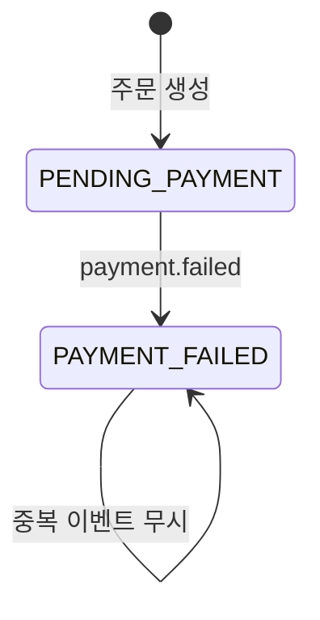
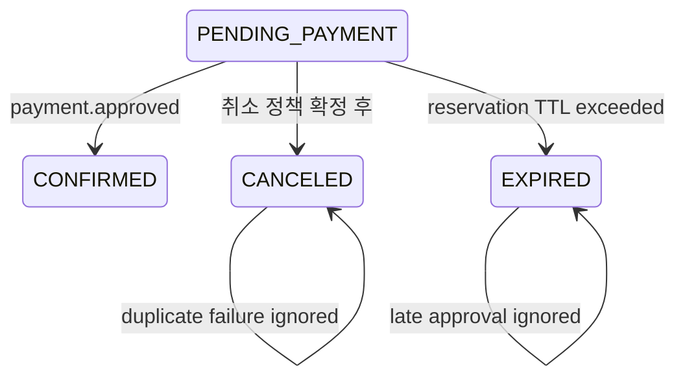

# 결제 실패 상태·데이터·트랜잭션

작성일: 2026-07-14

이 문서는 목표 상태와 현재 실행 가능한 상태를 분리해 기록한다.

## 1. 현재 상태 전이

현재 재고 회복은 별도 inventory row를 증가시키지 않는다. 예약 수량을 계산할 때 `PENDING_PAYMENT`, `CONFIRMED`만 활성 주문으로 포함하고 `PAYMENT_FAILED`를 제외한다.

## 2. 현재 트랜잭션 경계

| 서비스 | 트랜잭션 | 보장 |
| --- | --- | --- |
| payment-service | 실패 결제 저장 | 동일 idempotency key의 결제 중복 방지 |
| order-service | event inbox와 주문 상태 변경 | 같은 `eventId`의 중복 상태 변경 방지 |
| Kafka publish | DB commit 이후 | outbox가 없어 원자성 미보장 |

## 3. 목표 후속 상태

취소 상태의 기계 표기는 `CANCELED`다. 결제 실패를 곧바로 `CANCELED`로 매핑할지 `PAYMENT_FAILED`를 유지할지는 별도 상태 전이 결정이 필요하다.

## 4. 불변조건

- 같은 결제 idempotency key는 결제 행을 한 건만 만든다.
- 같은 `payment.failed` event ID는 한 번만 처리한다.
- `PAYMENT_FAILED` 주문은 활성 예약 합계에 포함되지 않는다.
- `CONFIRMED` 주문은 실패 이벤트로 되돌리지 않는다.
- DB 상태와 Kafka 발행 사이 원자성은 outbox 도입 전까지 보장하지 않는다.

## 5. 후속 설계가 필요한 항목

- 실패 후 같은 주문 재결제 허용 여부
- `PAYMENT_FAILED`와 `CANCELED`의 관계
- TTL 기준과 expiry worker 소유권
- 늦은 승인 reconciliation
- 실패·만료 알림 이벤트
