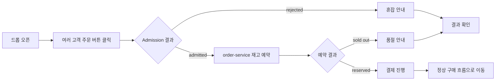
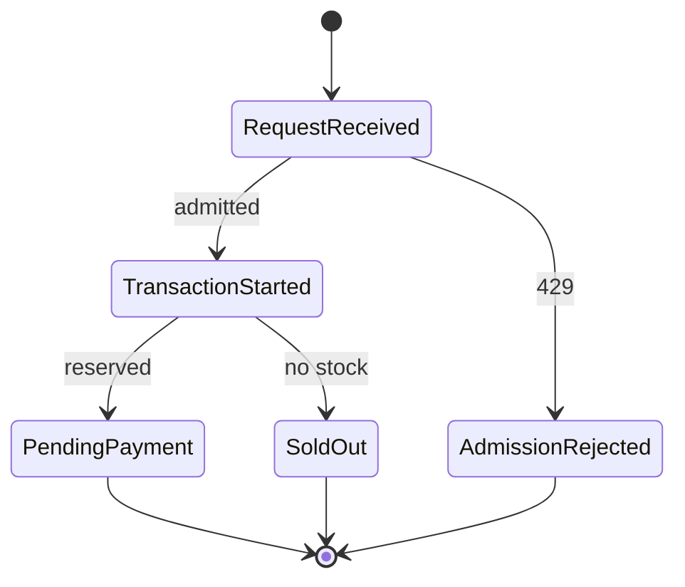

# 품절/동시성 상세 설계

작성일: 2026-07-07

이 문서는 `../../medikong/12-user-flows.md`의 품절/동시성 흐름과 `../../blueprint/`의 한정 드롭 요구사항을 구현 가능한 `order-service` 중심 설계로 풀어낸다.

> 문서 상태: 목표 설계 초안. `inventory_buckets`, admission, outbox는 후속 설계이며 현재 구현이 아니다. 현재 계약은 `services/contracts`, 현재 동작은 `test-execution-record.md`와 `../_shared/03-purchase-development-handoff.md`를 기준으로 한다.

## 1. 목표

오픈 직후 다수 고객이 같은 drop에 동시에 주문하더라도 재고 초과 판매가 발생하지 않아야 한다.

```text
N개 재고
M명 동시 주문, M > N
-> 성공 예약 수 <= N
-> 실패 주문은 SOLD_OUT 또는 ADMISSION_REJECTED
-> oversell_count = 0
```

## 2. 출처 매핑

| 출처 | 반영 내용 |
| --- | --- |
| `12-user-flows.md` 품절/동시성 후보 | 오픈 직후 동시 구매, 일부 성공, 품절 안내, 재시도, 결과 확인 |
| `REQ.A.01.FR-006` | 오픈 시각 이후에만 구매 시도를 허용한다. |
| `REQ.A.01.FR-007` | 동일 사용자, 동일 상품, 동일 드롭 중복 구매 시도를 제한한다. |
| `REQ.A.01.FR-008` | 구매 시점에 재고를 원자적으로 배정하거나 실패 사유를 반환한다. |
| `REQ.A.01.NFR-002` | 동시 요청에서도 판매 가능 수량보다 많은 성공 배정이 발생하지 않는다. |
| `REQ.A.01.NFR-005` | 피크 조회 트래픽과 주문 쓰기 경로를 분리한다. |
| `REQ.A.01.NFR-006` | 드롭 오픈 순간 API latency, error rate, queue lag를 관측한다. |
| `PAGE.A.02` | 품절 또는 재고 동시성 충돌 시 CTA와 메시지를 제어한다. |
| `UC.A.01` 예외 흐름 | 품절, 수량 초과, 판매 종료 상태는 실패 사유를 표시한다. |

## 3. 범위

포함한다.

- 오픈 중인 drop에 대한 동시 주문
- 원자적 재고 예약
- 품절 응답 `409 SOLD_OUT`
- admission 거절 응답 `429 ADMISSION_REJECTED`
- 같은 사용자 중복 주문 방지
- idempotency replay와 conflict 구분
- 동시성 integration test와 E2E
- drop-open load test 기준

포함하지 않는다.

- 결제 실패 후 예약 해제
- 결제 지연과 예약 만료
- 쿠폰 선착순 발급
- 실제 대기열 서비스 구현
- 봇 탐지 모델

## 4. 사용자 흐름



## 5. API 계약

핵심 API는 `POST /orders` 하나다.

요청:

```json
{
  "dropId": "drop-001",
  "productId": "product-001",
  "quantity": 1
}
```

성공 응답:

```json
{
  "orderId": "order-001",
  "dropId": "drop-001",
  "status": "PENDING_PAYMENT",
  "amount": 59000,
  "currency": "KRW",
  "reservationExpiresAt": "2026-07-07T12:10:00+09:00"
}
```

실패 응답:

| HTTP | code | 사용자 의미 | 시스템 의미 |
| --- | --- | --- | --- |
| 409 | `SOLD_OUT` | 준비된 수량이 모두 소진되었다. | 예약 가능한 수량이 없다. |
| 409 | `IDEMPOTENCY_KEY_REUSED` | 같은 요청 키로 다른 주문을 보냈다. | key와 payload hash가 다르다. |
| 409 | `ORDER_STATE_CONFLICT` | 이미 구매했거나 진행 중인 주문이 있다. | 사용자/drop 중복 제한에 걸렸다. |
| 422 | `DROP_NOT_OPEN` | 아직 구매할 수 없는 drop이다. | 서버 시간 기준 open window가 아니다. |
| 429 | `ADMISSION_REJECTED` | 현재 요청이 많아 잠시 후 재시도해야 한다. | DB transaction 진입 전 차단됐다. |

## 6. 데이터 모델

`order-service`는 재고 진실을 소유한다.

| 테이블 | 역할 |
| --- | --- |
| `inventory_buckets` | drop별 총 수량, 예약 수량, 확정 수량, version을 저장한다. |
| `stock_reservations` | 주문별 예약 상태 `ACTIVE`, `CONFIRMED`, `RELEASED`, `EXPIRED`를 저장한다. |
| `orders` | 목표 주문 상태 `PENDING_PAYMENT`, `CONFIRMED`, `CANCELED`, `EXPIRED`를 저장한다. 현재 자동 검증은 `PAYMENT_FAILED`를 추가로 사용한다. |
| `idempotency_keys` | `scope`, `key`, `request_hash`, 최초 응답, resource id를 저장한다. |
| `outbox_events` | `order.created` 등 발행할 이벤트를 저장한다. |
| `processed_events` | consumer 중복 처리 방지를 저장한다. |

`inventory_buckets` 불변조건:

```sql
CHECK (reserved_quantity >= 0)
CHECK (confirmed_quantity >= 0)
CHECK (reserved_quantity + confirmed_quantity <= total_quantity)
```

## 7. 재고 예약 transaction

`POST /orders`는 하나의 DB transaction에서 처리한다.

```text
1. idempotency key 조회 또는 생성
2. 같은 key와 같은 payload면 최초 응답 반환
3. 같은 key와 다른 payload면 IDEMPOTENCY_KEY_REUSED
4. drop open window와 구매 제한 확인
5. inventory_buckets row에 조건부 update 수행
6. update row count가 0이면 SOLD_OUT
7. orders insert
8. stock_reservations insert
9. outbox_events에 order.created insert
10. idempotency 최초 응답 저장
11. commit
```

권장 SQL 형태:

```sql
UPDATE inventory_buckets
SET reserved_quantity = reserved_quantity + :quantity,
    updated_at = now()
WHERE drop_id = :drop_id
  AND reserved_quantity + confirmed_quantity + :quantity <= total_quantity;
```

이 update가 정확히 1개 row를 변경해야 예약 성공이다. 0개면 품절로 본다.

## 8. 중복 구매 정책

| 상황 | 처리 |
| --- | --- |
| 같은 사용자, 같은 idempotency key, 같은 payload | 최초 `PENDING_PAYMENT` 응답 재사용 |
| 같은 사용자, 같은 idempotency key, 다른 payload | `409 IDEMPOTENCY_KEY_REUSED` |
| 같은 사용자, 같은 drop에 `PENDING_PAYMENT` 주문 존재 | 기존 주문 반환 또는 `409 ORDER_STATE_CONFLICT` 중 하나로 고정 |
| 같은 사용자, 같은 drop에 `CONFIRMED` 주문 존재 | `409 ORDER_STATE_CONFLICT` |
| 다른 사용자 동시 주문 | 재고 조건부 update 경쟁으로 결정 |

MVP에서는 같은 사용자, 같은 drop에 진행 중인 주문이 있으면 기존 주문을 반환하는 쪽이 사용자 경험상 단순하다. 단, 이 결정은 contract test에 고정해야 한다.

## 9. 서비스별 구현 작업

| 서비스 | 작업 |
| --- | --- |
| `order-service` | `inventory_buckets`, `stock_reservations`, idempotency table, 조건부 update transaction을 구현한다. |
| `catalog-service` | 품절 projection은 표시용으로만 사용하고, 최종 품절 판단은 `order-service` 응답을 따른다. |
| `gateway/admission` | overload 시 `POST /orders`를 DB transaction 전에 `429 ADMISSION_REJECTED`로 제한한다. |
| `observability` | 성공 예약, 품절, admission reject, idempotency replay, conflict metric을 분리한다. |
| `e-gitops/loadtest` | drop-open spike와 retry storm profile을 둔다. |

## 10. 상태와 이벤트



| 이벤트 | 발행 조건 | 소비 |
| --- | --- | --- |
| `order.created` | 재고 예약과 주문 생성 transaction commit 후 | observability, optional payment experiment |
| `order.confirmed` | 정상 구매 결제 승인 이후 | notification, catalog sold-out hint optional |

품절 실패 자체는 주문 이벤트로 발행하지 않는다. 운영 분석이 필요하면 metric과 structured log로 남기고, 별도 analytics 이벤트는 후순위로 둔다.

## 11. 테스트 설계

| 계층 | 테스트 이름 | 검증 |
| --- | --- | --- |
| unit | `order_create_reserves_inventory` | 예약 성공 시 `reserved_quantity`가 증가한다. |
| unit | `order_create_returns_sold_out_when_no_stock` | 재고가 없으면 `409 SOLD_OUT`이 된다. |
| unit | `order_idempotency_replay_returns_original_response` | 같은 요청 재시도는 최초 응답을 반환한다. |
| unit | `order_idempotency_conflict_returns_409` | 같은 key와 다른 payload는 conflict다. |
| integration | `order_create_transaction_prevents_oversell` | 동시 요청에서도 예약 수량이 총 수량을 넘지 않는다. |
| integration | `drop_open_spike_oversell_zero` | spike 후 confirmed와 active reservation 합이 총 수량 이하이다. |
| e2e | `customer_sold_out_concurrency_path` | N명 중 일부 성공, 나머지는 품절 또는 요청 제한을 받는다. |
| load | `drop_open_spike` | accepted p95, sold out rate, oversell count를 확인한다. |

## 12. 관측성과 알림

| 지표 | 기준 |
| --- | --- |
| `orders_created_total` | 예약 성공 주문 수 |
| `orders_sold_out_total` | 품절 응답 수 |
| `admission_rejected_total` | DB 진입 전 거절 수 |
| `idempotency_replay_total` | 정상 재시도 수 |
| `idempotency_conflict_total` | key 재사용 오류 수 |
| `oversell_count` | 항상 0 |
| `order_create_duration_seconds` | admitted 요청 latency p95/p99 |
| `inventory_transaction_conflict_total` | lock timeout 또는 retry 대상 |

동적 ID인 `order_id`, `drop_id`, `customer_id`는 metric label로 넣지 않는다. `order_id`와 `drop_id`는 접근이 통제되고 보존 기간이 제한된 log와 trace에서만 사용한다. 원본 `customer_id`는 남기지 않고 필요한 경우 pseudonymous subject key를 사용한다.

## 13. 인프라 확인점

| 영역 | 확인 |
| --- | --- |
| PostgreSQL | `inventory_buckets` update가 row lock과 조건부 update로 동작한다. |
| connection pool | drop-open spike에서 DB pool 고갈이 order timeout으로 번지지 않는다. |
| HPA/KEDA | order-service scale-out 기준이 CPU만이 아니라 latency와 queue lag를 함께 본다. |
| Istio | `POST /orders` 보호 API와 retry 정책이 중복 주문을 만들지 않도록 한다. |
| Prometheus | oversell, latency, sold out, admission reject를 dashboard에서 본다. |
| Argo Rollouts | `oversell_count > 0`이면 canary rollback 신호다. |

## 14. 완료 기준

- 판매 수량 N개에서 동시 주문 후 성공 예약 수가 N을 넘지 않는다.
- 품절 사용자는 `409 SOLD_OUT`과 명확한 메시지를 받는다.
- admission rejected는 order DB transaction에 들어가지 않는다.
- 같은 요청 재시도는 중복 주문을 만들지 않는다.
- `oversell_count`는 항상 0이다.
- `customer_sold_out_concurrency_path`가 통과한다.
