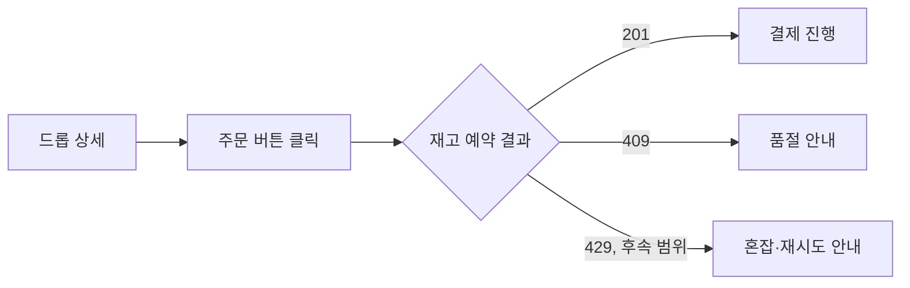

# 품절·동시성 사용자 여정

작성일: 2026-07-14

이 문서는 `PAGE.A.02`와 `UC.A.01`의 품절 예외 흐름을 사용자 관점으로 설명한다.

## 1. 사용자 목표

사용자는 드롭 오픈 시점에 주문을 시도하고, 재고 예약 성공 또는 품절 결과를 한 번의 명확한 응답으로 확인한다.

## 2. 단계별 기대 결과

| 단계 | 사용자 행동 | 시스템 결과 | 사용자 안내 |
| --- | --- | --- | --- |
| 오픈 확인 | 상품 상세를 갱신한다. | 서버 기준 구매 가능 상태를 반환한다. | 오픈 전에는 구매를 허용하지 않는다. |
| 주문 | 구매 버튼을 누른다. | 재고가 있으면 주문과 예약을 만든다. | 결제 진행 상태를 보여준다. |
| 동시 경쟁 | 다른 고객과 동시에 주문한다. | 성공 예약 합계가 재고를 넘지 않는다. | 실패 고객에게 품절을 표시한다. |
| 재시도 | 같은 요청을 다시 보낸다. | 동일 key와 payload면 기존 주문을 반환한다. | 중복 주문을 만들지 않는다. |

## 3. 현재와 후속 범위

- 현재: 201 성공과 409 품절, PostgreSQL 동시성, 주문 멱등성
- 후속: 실제 admission control의 429, 대기열, 장시간 spike, 봇 방어

## 4. 완료 기준

- 성공한 사용자는 `PENDING_PAYMENT` 주문을 받는다.
- 품절 사용자는 성공처럼 보이는 응답을 받지 않는다.
- 동시에 주문해도 활성 예약 합계가 재고를 넘지 않는다.
- 같은 요청 재시도는 중복 주문을 만들지 않는다.
