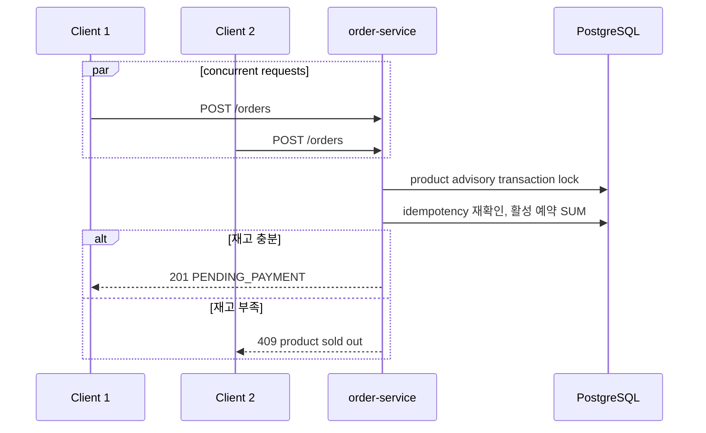

# 품절·동시성 API 흐름

작성일: 2026-07-14

이 시나리오의 핵심 외부 경계는 `POST /orders`다. 실제 계약 원장은 `services/contracts/services/order-service/openapi.yaml`이다.

## 1. 현재 병렬 요청 흐름

## 2. 응답 판정

| HTTP | 의미 | 현재 자동 검증 |
| ---: | --- | --- |
| 201 | 주문과 활성 예약 생성 | 예 |
| 409 | 상품 재고 부족 또는 idempotency conflict | 예 |
| 422 | 드롭 오픈 조건 불충족 | 서비스 계약에 따름 |
| 429 | admission control 거절 | 미구현 |

## 3. 현재 동시성 fixture

fixture와 기대 응답·DB 상태의 수용 기준은 `05-test-scenarios.md`의 SC-04를 원장으로 사용한다. 실제 실행값과 기준 커밋은 `test-execution-record.md`에 기록한다.

## 4. 변경 규칙

1. 409 오류 코드를 바꾸면 order OpenAPI와 E2E assertion을 함께 바꾼다.
2. lock 또는 예약 계산을 바꾸면 실제 PostgreSQL 독립 세션 테스트를 먼저 통과한다.
3. catalog의 표시 재고는 order-service의 최종 예약 판정을 대신하지 않는다.
4. gRPC는 초과 판매 문제의 해결책이 아니다. 동시성 보장은 order DB transaction에서 유지한다.
