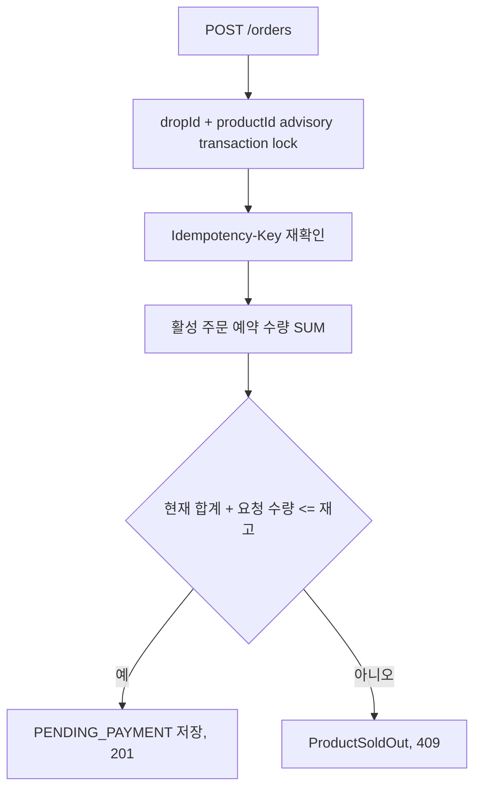

# 품절·동시성 상태·데이터·트랜잭션

작성일: 2026-07-14

이 문서는 현재 동시성 제어의 실행 가능한 불변조건을 정의한다.

## 1. 현재 주문 판정



## 2. 활성 예약 정의

| 주문 상태 | 예약 합계 포함 |
| --- | --- |
| `PENDING_PAYMENT` | 포함 |
| `CONFIRMED` | 포함 |
| `PAYMENT_FAILED` | 제외 |

현재 구현은 목표 설계의 `inventory_buckets` row를 갱신하지 않고 주문 상태의 합계를 계산한다.

## 3. 불변조건

```text
SUM(quantity WHERE status IN (PENDING_PAYMENT, CONFIRMED)) <= product stock
```

- 같은 상품의 경쟁 transaction은 같은 advisory lock을 사용한다.
- idempotency key는 lock 획득 뒤 다시 확인한다.
- 같은 사용자와 key의 같은 payload는 기존 주문을 반환한다.
- 다른 payload는 409 conflict다.
- 실패 주문은 활성 예약을 계속 점유하지 않는다.

## 4. 목표 설계와 차이

| 항목 | 목표 설계 | 현재 구현 |
| --- | --- | --- |
| 재고 원장 | `inventory_buckets`, `stock_reservations` | 주문 fixture와 활성 상태 합계 |
| 경쟁 제어 | 조건부 update 또는 row lock | PostgreSQL advisory transaction lock |
| admission | DB 이전 429 | 미구현 |
| outbox | 주문 저장과 event 원자화 | 미구현 |

실제 상품 저장소로 전환하기 전에 재고 진실의 소유권과 단일 원장을 다시 확정한다.
